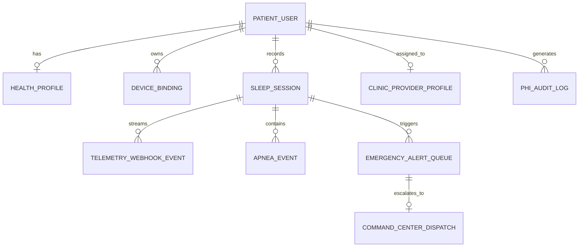
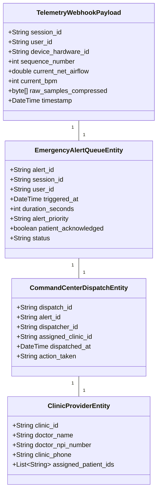
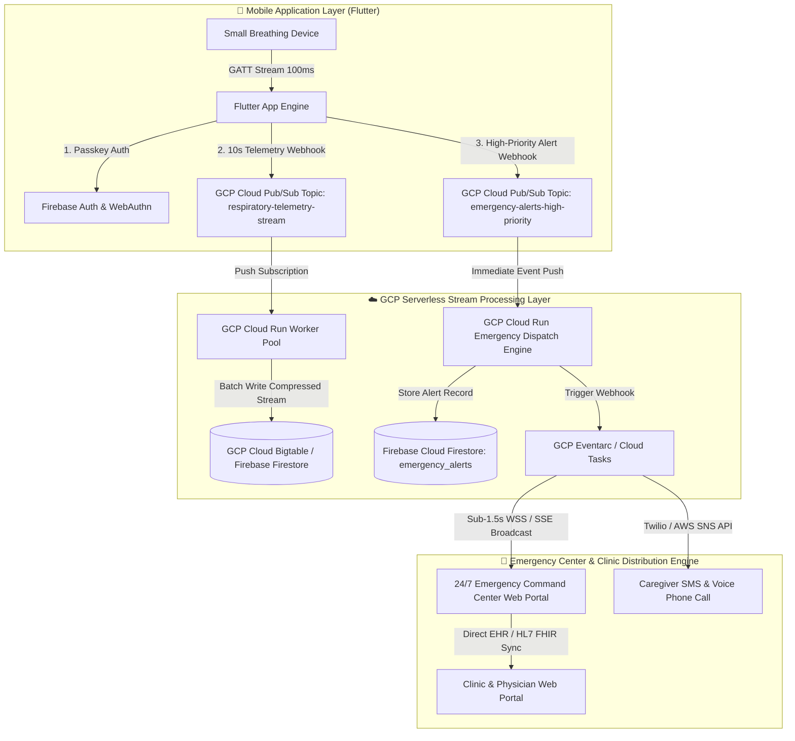

# 🏛️ Enterprise Business, Data & Cloud Architecture Specification
## Sleep Apnea Detection App & Emergency Command Platform

> **Target Scope:** Global Enterprise Platform Scaling to Millions of Breathing Devices  
> **Cloud Provider & Infrastructure:** Google Cloud Platform (GCP) & Firebase Suite  
> **Integrations:** Real-Time Telemetry Webhooks, Emergency Response Command Centers, and Clinical Portals  

---

## 1. Business Architecture & BPMN Process Models

### 1.1 End-to-End BPMN 2.0 Business Process Workflow

The business process connects four primary participant pools: **Patient at Home**, **Mobile App Engine**, **GCP/Firebase Ingestion Engine**, and **Emergency Command Center & Clinic Specialists**.

---

### 1.2 Business Capabilities Map (BC-1 to BC-7)

| Capability ID | Business Capability Name | Description | Key Business Service |
| :--- | :--- | :--- | :--- |
| **BC-1** | **Patient Identity Governance** | Manages passwordless Passkey (FIDO2) authentication and biometric access. | `AuthenticatePatientService` |
| **BC-2** | **Pre-Sleep Calibration** | Executes 2-stage noise floor ($N_{\text{idle}}$) & active breath peak ($V_{pp}$) calibration. | `CalibrateBaselineService` |
| **BC-3** | **Real-Time Telemetry Streaming** | Logs 100ms respiratory stream data and syncs webhooks to GCP Pub/Sub. | `StreamTelemetryService` |
| **BC-4** | **Two-Tier Emergency Response** | Controls Tier-1 mobile alarms (<200ms) and 30s "I'm Safe" cancellation tokens. | `ManageEmergencyAlertService` |
| **BC-5** | **Emergency Center Command Gateway** | Broadcasts high-priority alerts to 24/7 Monitoring Centers and Caregiver SMS. | `DispatchEmergencyCenterService` |
| **BC-6** | **Clinic & Doctor Integration** | Distributes sleep summaries, AHI trends, and health records to attending physicians. | `SyncDoctorClinicService` |
| **BC-7** | **Hardware Fleet Management** | Binds device hardware IDs to patient accounts and monitors air freight compliance. | `BindDeviceHardwareService` |

---

## 2. Process-Aligned Data Architecture

### 2.1 Conceptual Data Model (BPMN Aligned)

---

### 2.2 Process Data Classification & HIPAA Governance Matrix

| Entity & Attribute | Classification Level | HIPAA Category | Storage & Transport Encryption | Access Control Policy |
| :--- | :--- | :--- | :--- | :--- |
| `user_profile.full_name` | **Level 1 — Direct PHI** | Identity | AES-256 (Rest) / TLS 1.3 (Transit) | Firestore Security Rules (`auth.uid == userId`) |
| `user_profile.phone` | **Level 1 — Direct PHI** | Endpoint | AES-256 (Rest) / TLS 1.3 (Transit) | Firestore Security Rules |
| `health_profile.*` | **Level 1 — Direct PHI** | Health Baseline | AES-256 Column Encryption | Firestore Rules + Doctor Share Token |
| `telemetry_webhook_event.payload` | **Level 1 — Direct PHI** | Bio-Signals | Compressed AES-256 Encrypted Blob | GCP Pub/Sub IAM + KMS Key |
| `emergency_alert_queue.location` | **Level 1 — Direct PHI** | GPS / Address | AES-256 Encryption | Emergency Center Role-Based Access (RBAC) |
| `clinic_provider.doctor_npi` | **Level 2 — PII** | Provider ID | Standard Database Column | Clinic Dashboard IAM |
| `command_center_dispatch.*` | **Level 2 — Operational** | Dispatch Audit | Immutable Write-Once Log | Compliance Administrator Only |

---

### 2.3 Application Data Model (Scale & Webhook Entities)

---

## 3. Application & GCP/Firebase Cloud Architecture (Scale to Millions)

To support **hundreds of thousands or millions of concurrent devices** streaming telemetry continuously overnight, the cloud architecture utilizes a highly scalable, serverless Google Cloud Platform (GCP) and Firebase infrastructure:

---

### 3.1 Webhook & Telemetry Streaming Invariants

1. **High-Throughput Webhook Ingestion (GCP Cloud Pub/Sub):**
   - Telemetry batches are sent every 10 seconds per active app session via HTTPS POST webhooks (`POST /api/v1/telemetry/stream`) into GCP Cloud Pub/Sub topic `respiratory-telemetry-stream`.
   - Pub/Sub handles auto-scaling up to **10 million requests per second** with sub-100ms ingestion latency.
2. **Real-Time Database Tier (GCP Cloud Bigtable & Firebase Firestore):**
   - High-frequency bio-signal time series are stored in **GCP Cloud Bigtable** (optimized for massive time-series analytics).
   - Sleep session metrics, patient profiles, and emergency alert queues are stored in **Firebase Cloud Firestore** with real-time WebSocket listeners.
3. **Emergency Command Center Dashboard Integration:**
   - 24/7 Emergency Centers connect to the platform via WebSockets (`wss://emergency.sleepapnea.health/stream`).
   - Unacknowledged 30-second apnea alarms automatically pop up on command center maps with patient GPS coordinates, health profile, and emergency contacts.
4. **Clinic & Doctor Notification Pipeline:**
   - When an emergency dispatch occurs or a morning sleep report is generated, GCP Eventarc triggers a webhook notification to assigned clinic portals and physician email/SMS endpoints.

---

## 4. Summary of Architecture Invariants

* **Business Architecture:** Complete BPMN 2.0 5-phase workflow linking Patient $\rightarrow$ App $\rightarrow$ GCP $\rightarrow$ Emergency Command Center $\rightarrow$ Doctor.
* **Data Architecture:** Process-aligned data entities with explicit HIPAA Level 1 (PHI) vs. Level 2 (PII) data classification.
* **Cloud Architecture:** Fully decoupled, serverless **GCP & Firebase engine** built to scale to millions of devices using Cloud Pub/Sub, Cloud Run, Firestore, Bigtable, and real-time command center webhooks.
