# 🏛️ Enterprise Architecture Specification
## D-BAND Platform (Bio-Telemetry & Hardware Integration Suite)

> **Diagramming Standard:** Standard **BPMN 2.0 XML (BPMN.js / Camunda compatible)** for Section 2 Process Modeling + **PlantUML** for C4 Context, C4 Container & Conceptual Data Models.  
> **Target Scope:** Extensible Bio-Telemetry Hardware Integration Suite & Global Cloud Telemetry Engine  

---

## 1. 🏢 Business & System Architecture

### 1.1 C4 Level 1: System Context Diagram

The System Context diagram establishes the high-level boundary of the **D-BAND Platform** and defines how human actors, sensor hardware arrays, and external systems interact with the unified platform.

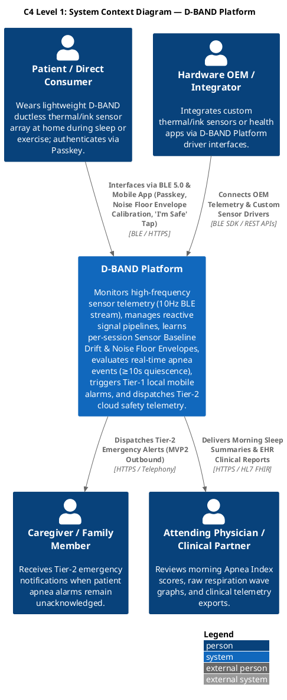

#### 📖 Architectural Context & Operational Boundary

* **Patient / Direct Consumer:** Connects the **D-BAND (Ductless-Breath ANalysis Device)** lightweight conducting polymer thermal/ink sensor array via Bluetooth Low Energy (BLE 5.0+). Unlike traditional CPAP machines requiring uncomfortable masks, tubes, or turbines, D-BAND is a **ductless, maskless, portable, battery-operated, and quiet** sensor array worn at home. Through the Flutter client app (`masker-app`), the user authenticates passwordlessly via FIDO2 Passkeys, completes a **single-stage Sensor Baseline Drift & Noise Floor Envelope calibration** (a worn ~10 s idle sample that learns the resting signal's min/max, followed by a wear check), and sleeps while the app evaluates the raw signal against that band every 100 ms. If no valid band excursion occurs for ≥ 10 s, the patient receives a sub-200 ms Tier-1 local mobile alarm.
* **Caregiver / Family Member:** Acts as the designated secondary contact. If the patient does not acknowledge a Tier-1 mobile alarm within 30 seconds, the cloud emergency dispatch worker logs the unacknowledged safety event (and in MVP2 dispatches priority SMS/Voice calls).
* **Emergency Center Dispatcher:** Operators in a 24/7 command center monitor an active web portal displaying real-time WebSocket alert feeds (sub-1.5s latency). Unacknowledged 30-second apnea stops instantly pop up on the dashboard with patient GPS coordinates, allowing dispatchers to verify emergency status and alert local EMS responders.
* **Attending Physician / Clinical Researcher:** Clinicians and researchers access morning sleep summaries and the **Apnea Index (AI)** — apnea-only (the airflow-only D-BAND does not score hypopneas), with the standard AHI severity bands (Normal < 5, Mild 5–15, Moderate 15–30, Severe ≥ 30) applied to the AI and an apnea-only caveat on every surface — plus time-series respiration wave exports and de-identified cloud big data analytics for AI model refinement (PolyU / CUHK clinical research platform).

#### 💡 Guidance for Downstream Workflows (PRD & UX)
> [!TIP]
> **PRD / Epics Handoff:** Epics derived from Level 1 must guarantee distinct role-based access control (RBAC) scopes: Patient Mobile App (Passkey, 4-Mode UX, Local Alarms), Dispatcher Command Portal (Sub-1.5s WSS Dashboards), and Clinic Portal (HIPAA Level 1 PHI Sleep Reports & Big Data AI Analytics).

---

### 1.1.1 🏛️ Architectural Decisions & System Invariants (AD-01 to AD-15)

The following core invariants govern all mobile application, BLE sensor driver, data processing, subscription and billing, security, and UI design layers:

- **AD-01 (Atomic Design System Hierarchy):** Strict separation across UI Atoms, Molecules, 14 Organisms, and Page Templates.
- **AD-02 (BLoC + RxDart Unidirectional Data Flow):** Event streams managed via `flutter_bloc` and `rxdart`; UI-facing BLoCs decimate the 10Hz bio-signal to ≤5 FPS via `sampleTime`/`throttleTime` and use `switchMap` event transformers. The single upstream bio-signal source that feeds every BLoC is the boot-time unified queue defined in **AD-12** — BLoCs subscribe to it, never to a driver or GATT channel directly.
- **AD-03 (FIDO2 / WebAuthn Biometric Authentication):** Passwordless Passkey login enforcing HIPAA 45 CFR § 164.312(a) technical access control.
- **AD-04 (Sensor Baseline Drift & Noise Floor Envelope Calibration & Signal Model):**
  * **Binds:** the calibration wizard (`MOB_CALIBRATION`), the on-device apnea evaluator (`ApneaEvaluator`), the wear check, the `DeveloperSimulatorBarOrganism`, the BSP signal processor (`BspSignalProcessor`), and the respiration-waveform renderer. Implemented in `flutter/lib/core/monitoring/drift_and_noise_floor_envelope.dart`.
  * **Prevents:** those units diverging on how the band/envelope is built, what counts as a breath, or reintroducing a litres-per-second transform; the evaluator and the renderer disagreeing on the reference lines.
  * **Rule:** a single **worn** ~10 s idle sample records the running **minimum** ($\min$) and **maximum** ($\max$) of the raw bio-signal stream — those two values are the session **Sensor Baseline Drift & Noise Floor Envelope** `[lower_bound, upper_bound]` (monotonically widening within the window; no margin).
    $$\text{lower\_bound} = \min_{n \in [1, N]} \{ S[n] \}$$
    $$\text{upper\_bound} = \max_{n \in [1, N]} \{ S[n] \}$$
    $$\text{Noise Floor Amplitude } (V_{pp\_noise}) = \text{upper\_bound} - \text{lower\_bound}$$
    A **valid breath** is a cycle in which the raw signal rises to/above `upper_bound` (inhale) **and** falls to/below `lower_bound` (exhale). A **"stop-breathing" sample** is one where the signal lies within `[lower_bound, upper_bound]`. The client works in **raw signal units end to end** — no thermal-to-volumetric (L/s) transform, no `V_pp` peak-to-peak baseline, no `0.10 × V_pp` threshold. The noise envelope is per-session (re-learned each night), persisted on `SleepSession` (`idle_band_lower` / `idle_band_upper`), and reused across nights only until stale/invalid.
- **AD-05 (Wear Verification Guardrail):** after the AD-04 noise envelope sample, "Start Sleep Monitoring" stays blocked until the app observes **≥ 2 valid noise-envelope breath-excursion cycles** (per AD-04) within a bounded window (~15 s `[ASSUMPTION]`); on failure it shows *"Sensor not detecting breathing — check the fit."* with a retry.
- **AD-06 (0-FPS Night Mode):** Pitch-black screen lock state (`#000000`, <8.0% battery drain over 8h) with 10Hz RAM ring buffer.
- **AD-07 (Two-Tier Emergency Response):** Sub-200ms latency escalating siren tones ($40\text{dB} \to 75+\text{dB}$) & haptics, 30s "I'm Safe" tap, 5s auto-silence, and Tier-2 caregiver dispatch.
- **AD-08 (Developer Options & Contextual Simulator Bar):** Interactive simulation of the Noise Floor Envelope idle sample, the wear check, and sleep-cycle scenarios (`Noise Floor Envelope Sample`, `Normal 16 bpm`, `In-Band (no excursion) >10s`, `Recovery 5s`) via `DeveloperOptionsPage` and `DeveloperSimulatorBarOrganism`, feeding the AD-12 unified queue through `BleTelemetryService`.
- **AD-09 (Cryptographic Encryption):** AES-128 BLE link encryption, HTTPS TLS 1.3 in transit, AES-256 SQLCipher local database encryption at rest.
- **AD-10 (Clinical Respiration & GPU Charting):** 60 FPS Skia GPU line plots (`fl_chart`) of the raw bio-signal with the Noise Floor Envelope `lower_bound` / `upper_bound` drawn as horizontal reference lines, 256-point FFT spectral graphs (on the raw signal), **Apnea Index** rings, and signed FHIR JSON / PDF exports. The Doctor Report export (`Task_ExportDoctorReport`) is a **plan-gated action** — see **AD-13** and the §4.7 right-of-access open item (basic export stays free).
- **AD-11 (SOLID Dependency Inversion & `IBLESensorDriver` Interface Polymorphism):**  
  * **Binds:** All BLE sensor telemetry drivers (`BLESensorDriver`, `BleTelemetryService`, `FlutterBlueSensorDriver`), stream evaluators (`ApneaEvaluator`, `BleBloc`), and live UI views (`MeasurementPage`).  
  * **Prevents:** Tightly coupling UI pages or monitoring evaluators to specific hardware or simulation drivers, enabling zero-code-change driver swapping and unit test mocking.  
  * **Rule:** High-level monitoring services (`ApneaEvaluator`, `BleBloc`) and UI pages (`MeasurementPage`) MUST depend exclusively on the abstract interface `IBLESensorDriver`. Physical hardware drivers (`FlutterBlueSensorDriver`), mock drivers (`BLESensorDriver`), and background simulation engines (`BleTelemetryService`) MUST implement `IBLESensorDriver`. Constructor Dependency Injection (DI) MUST be used to pass driver instances.
- **AD-12 (App-Boot Unified Reactive Bio-Signal Ingestion Queue):**
  * **Binds:** App bootstrap (`main()` / composition root), the BLE background receiver service, every `IBLESensorDriver` implementation (`FlutterBlueSensorDriver`, `BleTelemetryService`, `BLESensorDriver`), and all downstream bio-signal consumers (`BleBloc`, `ApneaEvaluator`, `MeasurementPage`, the Noise Floor Envelope calibration and wear-check controllers, and `SleepMonitoringBloc`).
  * **Prevents:** Per-screen or per-phase BLE subscriptions that each open their own GATT channel; divergent queue primitives (a plain `StreamController` or `PublishSubject`) that drop the latest-value replay a late subscriber needs; calibration and nocturnal monitoring racing to own the connection lifecycle; a driver swap (AD-11) forcing consumers to re-subscribe.
  * **Rule:** On application launch the BLE background receiver service MUST start and stay resident for the process lifetime — Android **Foreground Service** (`foregroundServiceType` `connectedDevice`\|`dataSync`, persistent notification) and iOS `UIBackgroundModes` = `bluetooth-central`. Bootstrap binds **exactly one** active `IBLESensorDriver` by Constructor DI (per AD-11). Every inbound sample — a physical GATT notification **or** a `BleTelemetryService` simulator tick — MUST be pushed with RxDart `.add()` into a **single process-wide `BehaviorSubject<double>`** exposed as the driver's `signalStream` (`ValueStream<double>`). All consumers (the Noise Floor Envelope idle calibration, the wear check, and 8+ h nocturnal monitoring) MUST consume that one stream; none may open its own BLE subscription or instantiate a second queue. Queue identity and the `ValueStream` reference are stable across a driver swap. The receiver **service and queue** start at boot; the physical BLE radio link (`scanAndConnect`) MAY be established lazily — when a bound D-BAND is in range or the first consumer requires it — and is then held alive by the Foreground Service for the session, preserving the AD-06 `<8%` / 8 h battery budget. `EndSession` calls `stopTelemetryLogging()` only; the receiver service and queue survive for the next session. **Home's D-BAND device-status card is a read-only consumer of this receiver-service state (per AD-15) — it never opens its own scan or subscription.**

- **AD-13 (Subscription State & Server-Verified Entitlement):**
  * **Binds:** the backend **Billing service**, the Flutter `BillingBloc` / `SubscriptionRepository` / `EntitlementService`, every plan-gated feature call (today: Doctor Report Export — `Task_ExportDoctorReport`), and the Stripe **webhook receiver**.
  * **Prevents:** the client trusting a local plan flag to unlock a gated feature; multiple components each deciding "is this user Premium?" from a different source; a gated clinical action hard-blocking a patient while the entitlement server is briefly unreachable; entitlement logic derived on-device from raw Stripe objects.
  * **Rule:** the backend **Billing service is the sole source of truth** for subscription state, mutated **only** by **HMAC-signature-verified** Stripe webhook events (`customer.subscription.*`, `invoice.*`). Stripe **executes payment only**; subscription lifecycle — create, plan change, cancel, invoice history — is owned by our backend. The client fetches a **signed entitlement claim** from the Billing service and MAY cache it; a plan-gated action re-checks entitlement server-side and, on transport failure, falls back to the cached claim within a **bounded grace window** — *fail-open for connectivity, never for a known-expired plan*. `[OPEN — legal]` gating `Task_ExportDoctorReport` (a patient's own PHI) behind Premium requires HIPAA §164.524 right-of-access sign-off before build; see §4.7.

- **AD-14 (Cardholder-Data Scope Containment — PCI-DSS SAQ-A):**
  * **Binds:** `MOB_PAYMENT_METHOD` / `StripePaymentSheetGateway`, the Billing service, and **every datastore and log on the platform**.
  * **Prevents:** any client or backend component receiving, storing, transiting, or logging a PAN, CVC, full expiry, or track data; a hand-rolled in-app card-entry form.
  * **Rule:** card capture occurs **only** inside Stripe's hosted **PaymentSheet** (mobile) / **Stripe Elements** (web). The platform persists and renders **only** the display triplet — `brand`, `last4`, `exp_month`/`exp_year` — plus the opaque `stripe_payment_method_id`. No platform component enters the cardholder-data environment, keeping the platform **PCI-DSS SAQ-A** eligible. Card-on-file add / replace go through PaymentSheet; "remove card" detaches the token via the Billing service.

- **AD-15 (Local `SessionSummary` Read Model for the Dashboard):**
  * **Binds:** `HomeDashboardBloc`, `MOB_HOME` (7-night Apnea Index trend card, monitoring streak, D-BAND device-status card), the `HomeSummaryCardOrganism` and the `MOB_SLEEP_SUMMARY` score card, and session finalization (`Task_EndSession` / `State_MorningSummary`).
  * **Prevents:** the dashboard recomputing trends from raw `TelemetryStream` blobs (AD-10) at read time; Home opening its own BLE subscription for device status (violates AD-12); the "alarm fired last night" signal being inferred divergently on Home versus Summary.
  * **Rule:** on session finalization a **`SessionSummary`** record is written — `{date, ai_score, quality_score, total_duration, apnea_alarm_count, safety_tap_count, alarm_fired}` (`ai_score` = **Apnea Index**, apnea-only) — to the cloud **Isolated Data Zone** (1:1 with `SleepSession`, **Level 1 PHI**) as source of truth, with the device holding a **local rolling cache of the last N** (`N ≥ 7`) for the offline dashboard. Home's device-status card reads connection / battery / last-sync / permission **from the AD-12 receiver-service state only**. `alarm_fired` (≥ 1 `State_ApneaBreach` reached in the session) is the **single persisted field** both summary cards read to switch to the amber "N apnea alert(s)" treatment — written at finalization, never re-derived at read time.

---

### 1.2 C4 Level 2: Container Diagram

The Container diagram decomposes the platform into its distinct deployable software applications, data stores, and backend microservices.

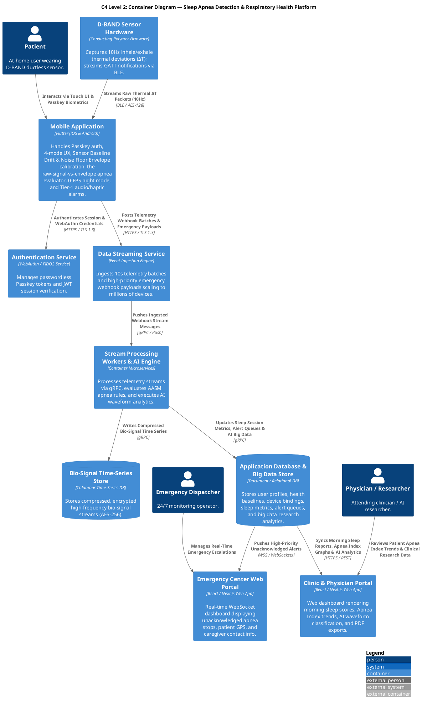

#### 📖 Technical Container Subsystems & Invariants

1. **D-BAND Sensor Hardware Firmware:** Patented conducting polymer thermal sensor array capturing 10Hz inhale ($T_{\text{inhale}}$) and exhalation ($T_{\text{exhale}}$) temperature deviations ($\Delta T = T_{\text{exhale}} - T_{\text{inhale}}$) streaming over Bluetooth Low Energy (`0x180D` service / `0x2A37` characteristic). Data packets are encrypted via AES-128 session keys.
2. **Flutter Mobile Client (iOS & Android):** Primary edge node **and owner of primary apnea detection**. It executes the single-stage **Sensor Baseline Drift & Noise Floor Envelope calibration** (worn idle sample → `[lower_bound, upper_bound]`, then the wear check), the local 100 ms **raw-signal-vs-Noise-Floor-Envelope evaluator** (`AD-04`), 4-mode operational state management (Sleep Monitoring, Athletic Training, Health Check, Meditation), 0-FPS locked low-power display modes during sleep, and Tier-1 audio/haptic alarms. It works in **raw signal units** — no thermal-to-volumetric conversion. Telemetry is batched into 10-second compressed JSON payloads and pushed to the cloud gateway over HTTPS/TLS 1.3. On launch it starts an **always-on background BLE receiver service** (Android Foreground Service / iOS `bluetooth-central` background mode) that pushes every inbound sample — physical D-BAND GATT notification or in-process simulator tick — into a single unified `BehaviorSubject<double>` reactive queue consumed by calibration and monitoring alike (**AD-12**).
3. **Cloud Ingestion & Processing Workers (Data Streaming Service + Stream Processing Workers & AI Engine):** High-throughput data streaming service handling millions of concurrent device connections. Container stream workers process telemetry streams via gRPC and execute **AI waveform pattern analytics (PolyU / CUHK clinical model, a Premium capability)** to **refine** the on-device apnea classification and flag anomalous patterns. Primary apnea detection stays on the client (`AD-04`); an apnea event retains the AASM **≥ 10-second minimum-duration** standard, restated in the band model as *no valid IDLE-Band breath excursion for ≥ 10 s*. **Hypopnea is not scored** in MVP1 — the airflow-only signal lacks the SpO₂ desaturation / EEG arousal AASM hypopnea requires; the nightly metric is an **Apnea Index (AI)**, not a full AHI.
4. **Dual Persistence Tier (Bio-Signal Time-Series Store + Application Database & Big Data Store):**
   * **Bio-Signal Time-Series Store:** Columnar storage designed for high-frequency bio-signal time-series blobs (compressed via snappy/zstd, encrypted with AES-256 at rest).
   * **Application Database & Big Data Store:** Primary database storing user profiles, health baselines, device bindings, real-time alert queues pushing sub-1.5s updates to connected WebSocket clients, `SessionSummary` per-night rollups, and de-identified big data research records.
5. **Billing Subsystem (`Billing` service + isolated Billing datastore — `AD-13` / `AD-14`):** a backend `Billing` microservice in the Application Core zone, its own relational store (Financial PII, **no PHI, no cardholder data**), and a `StripeWebhookReceiver` at the edge. Owns subscription lifecycle and issues signed entitlement claims to the client; Stripe executes payment only. Deliberately **not** part of the PHI Isolated Data Zone.

#### 💡 Guidance for Downstream Engineering (Architecture & Epics)
> [!IMPORTANT]
> **Implementation Target:** Engineers building feature stories must maintain the separation between high-frequency bio-signal persistence (`Bio-Signal Time-Series Store`) and relational/document application state (`Application Database`). Never post 100ms telemetry samples directly into the primary application database. Likewise, keep the **Billing datastore isolated from the PHI zone** — it references `user_id` only and never holds PHI or cardholder data.

---

### 1.3 🔄 BPMN 2.0 Business Process Model

> **BPMN 2.0 Source Artifact:** [`sleep_apnea_process.bpmn`](./sleep_apnea_process.bpmn)  
> **Visual Diagram Standard:** Directly rendered vector graphic generated via **BPMN.js (Camunda / bpmn.io engine)** + Inline **Mermaid.js Process Graph**

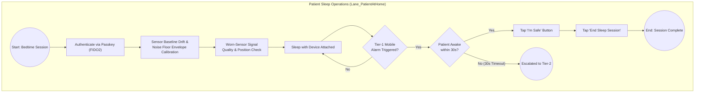

#### 📖 Business Process Lifecycle & Swimlane Dynamics

The BPMN 2.0 process model (`sleep_apnea_process.bpmn`) specifies the operational activities across 5 parallel **Business Operations Swimlanes** to deliver an end-to-end healthcare workflow, eliminating technical software engine lanes in favor of authentic business roles and operational platforms. Each swimlane maps directly to a distinct **Feature Set and Architectural Epic** to group downstream user stories:

* **Patient Onboarding Swimlane (`Lane_PatientOnboarding`)**  
  * **Epic / Feature Mapping:** **Epic 0: Patient Identity & Onboarding**  
  * **Downstream Story Grouping:** Groups user stories for initial patient account registration, patient medical profile creation (demographics, emergency caregiver contact info, attending physician NPI), and hardware-backed FIDO2 Passkey credential enrollment with the OS Secure Enclave.  
  * **Activity Breakdown:**
    * **`Task_PatientRegister`: Register Patient Account** — Creates initial patient credentials & account identity.
    * **`Task_CreateUserProfile`: Create Patient Medical Profile** — Captures age, weight, height, computed BMI, emergency contact details, and primary physician NPI.
    * **`Task_RegisterPasskey`: Register & Enroll FIDO2 Passkey** — Enrolls biometric Passkey (FaceID / TouchID / Windows Hello) bound to OS Secure Enclave and registers public key with Auth Service.

* **Backoffice Operations Swimlane (`Lane_BackofficePlatform`)**  
  * **Epic / Feature Mapping:** **Epic 5: Backoffice Provisioning & Device Operations**  
  * **Downstream Story Grouping:** Groups user stories for administrative backoffice operations. This includes verifying patient identity & medical eligibility, pairing and binding physical breathing sensor hardware serial numbers to patient profiles, and locking caregiver emergency contacts.  
  * **Activity Breakdown:**
    * **`Task_VerifyPatientIdentity`: Verify Patient Identity & Eligibility** — Administrative verification of patient registration details & HIPAA consent.
    * **`Task_BindMedicalDevice`: Pair & Bind Hardware Sensor Serial** — Associates physical breathing sensor hardware serial number with patient profile.
    * **`Task_LockEmergencyContacts`: Lock Caregiver Emergency Contacts** — Verifies and locks caregiver emergency contact phone numbers for 24/7 command center telephony dispatch *(Note: Assigning an attending physician is designated as a Phase 2 Future Process)*.

* **Patient Sleep Operations Swimlane (`Lane_PatientAtHome`)**  
  * **Epic / Feature Mapping:** **Epic 1: Patient Mobile Client Experience & Sleep Operations**  
  * **Downstream Story Grouping:** Groups user stories for patient-facing nighttime sleep operations. This includes biometric FIDO2 authentication login, the single-stage Sensor Baseline Drift & Noise Floor Envelope Calibration wizard (worn idle sample + wear check), low-power night-mode sleep monitoring screens, high-priority Tier-1 alarm screen with 30s safety tap cancellation, and morning sleep summary reports.  
  * **Activity Breakdown:**
    * **`Task_PasskeyAuth`: Authenticate via Passkey (FIDO2)** — Launches app and performs FIDO2 biometric passkey authentication.
    * **`Task_NoiseFloorCal`: Sensor Baseline Drift & Noise Floor Envelope Calibration** — With the D-BAND worn and the patient still, samples the raw signal for ~10s and records the running min/max → `[lower_bound, upper_bound]`.
    * **`Task_WearCheck`: Confirm the sensor is sensing breath** — Patient breathes normally; the app requires ≥ 2 valid Noise-Floor-Envelope breath-excursion cycles before "Start Sleep Monitoring" unlocks (else "Sensor not detecting breathing — check the fit." + retry).
    * **`Task_SleepMonitoring`: Sleep with Device Attached** — Continuous nocturnal monitoring in low-power 0-FPS night mode.
    * **`Task_TapSafe`: Tap 'I'm Safe' Button** — Patient taps single-touch cancellation button on Tier-1 alarm screen during 30s window.
    * **`Task_EndSession`: Tap 'End Sleep Session'** — Concludes sleep session, closes BLE stream, and generates morning sleep summary.

* **Emergency Center Swimlane (`Lane_EmergencyCenter`)**  
  * **Epic / Feature Mapping:** **Epic 4: Emergency Operations & Telephony**  
  * **Downstream Story Grouping:** Groups user stories for dispatcher web operations, caregiver telephony, and emergency responder dispatch. This includes the React Command Center web portal, real-time WSS alert modal popups, Mapbox patient GPS geocoding, Twilio voice call & SMS caregiver automation, and 911 Computer-Aided Dispatch (CAD) gateway escalation.  
  * **Activity Breakdown:**
    * **`Task_DashboardAlert`: Command Center Dashboard Alert Pop-up** — Triggers high-contrast red modal alert popup and sound chime on dispatcher web dashboard.
    * **`Task_MetricCollection`: Collect Emergency Alert Metrics** — Automated logging of emergency alert response times, dispatcher reaction latencies, caregiver telephony metrics, and operational SLA compliance.
    * **`Task_CaregiverCall`: Trigger Voice Call & SMS to Caregiver** — Initiates automated Twilio voice call and priority SMS to patient's emergency contact.
    * **`Task_DispatchEMS`: Dispatch Local EMS / 911 Responders** — Integrates with 911 Computer-Aided Dispatch (CAD) gateway to dispatch local emergency responders if unacknowledged.

* **Clinic & Physician Swimlane (`Lane_ClinicPhysician`) [Future Release / Phase 2]**  
  * **Epic / Feature Mapping:** **Epic 6: Clinical Operations & Diagnostic Reports (Future Expansion)**  
  * **Downstream Story Grouping:** Designates future expansion stories for physician portals, morning sleep report synchronizations, Apnea Index classification analytics, and clinical diagnostic note entries.  
  * **Activity Breakdown:**
    * **`Task_DoctorSync`: Sync Morning Sleep Scores & Apnea Index Reports [Future]** — Syncs morning sleep session summary metrics, Apnea Index (ai_score), and respiration wave graphs to clinic portal.
    * **`Task_PhysicianReview`: Physician Reviews Apnea Index Classification & Notes [Future]** — Attending physician reviews patient Apnea Index trend charts, adds diagnostic notes, and updates prescription settings.

* **Device & Mobile Recovery Swimlane (`Lane_DeviceLostRecovery`)**  
  * **Epic / Feature Mapping:** **Epic 7: Device Loss, Mobile Recovery & Security Wipe Operations**  
  * **Downstream Story Grouping:** Groups user stories for reporting lost/stolen D-BAND sensors, reporting lost/stolen mobile phones, executing WebAuthn session revocations, issuing automated HIPAA remote wipes, and re-binding replacement hardware.  
  * **Activity Breakdown:**
    * **`Task_ReportDeviceLost`: Report D-BAND Sensor Lost / Stolen** — Patient or support rep invokes lost sensor workflow; cloud executes `POST /api/v1/devices/unbind` and flags hardware serial as `DEPRECATED/LOST`.
    * **`Task_ReportMobileLost`: Report Mobile Phone Lost / Stolen** — Patient or caregiver logs into Web Portal to report stolen mobile device; Auth Service revokes all active JWT session tokens and invalidates Passkey bindings.
    * **`Task_TriggerRemoteWipe`: Issue Cryptographic Remote Wipe Signal** — Cloud issues HIPAA §164.312 remote wipe payload, zeroizing local SQLCipher databases and Secure Enclave master keys on the lost phone node.
    * **`Task_RebindReplacementDevice`: Pair & Bind Replacement D-BAND Device** — Patient pairs a new replacement D-BAND hardware sensor, executing `POST /api/v1/devices/bind` to seamlessly resume sleep monitoring without data loss.

* **Dashboard & Analytics Swimlane (`Lane_MobileDashboardReview`)**  
  * **Epic / Feature Mapping:** **Epic 8: Mobile Patient Dashboard & Historical Analytics**  
  * **Downstream Story Grouping:** Groups user stories for reviewing morning sleep summaries, displaying interactive Skia/`fl_chart` respiration waveforms, analyzing 256-point FFT frequency spectrums, filtering date-based historical sessions, and exporting signed FHIR-compliant clinical charts for physician sharing.  
  * **Activity Breakdown:**
    * **`Task_ReviewMorningSummary`: Review Morning Sleep Summary & Apnea Index** — Displays total sleep duration, overnight Apnea Index (apnea events per hour, apnea-only caveat), intervention count, and quality score.
    * **`Task_InspectRespirationWaveform`: Inspect Interactive Respiration Waveform & FFT Spectrum** — Renders 60 FPS GPU interactive wave graph with pinch-to-zoom and spectral peak respiration rate extraction.
    * **`Task_FilterHistoricalSessions`: Filter Historical Sleep Sessions & Trends** — Date range and severity filtering across encrypted local SQLCipher history database.
    * **`Task_ExportDoctorReport`: Generate Signed Clinical Report for Physician** — Generates signed FHIR JSON / PDF clinical chart for primary care doctor sharing.

#### 💡 Guidance for Downstream Workflows (State Machines & User Stories)
> [!NOTE]
> **Application Architecture Traceability:**  
> Detailed Activity-by-Activity UI Flow & Sequence Specifications for all 25 BPMN tasks, along with end-to-end sequence diagrams, are defined in [**Section 3. Application Architecture**](#3--application-architecture).

---

## 2. 🗄️ Data Architecture

### 2.1 Conceptual Data Model (BPMN Aligned)

#### 📖 Business Architecture Alignment & Data Model Purpose

The **Conceptual Data Model** is engineered specifically to support the complete, end-to-end business process lifecycle defined in **Section 1 (Business & System Architecture)** and modeled in the BPMN 2.0 process flow (`sleep_apnea_process.bpmn`). Rather than viewing data persistence as isolated database tables, this data architecture directly mirrors the operational state transitions, human actor interactions, and regulatory compliance boundaries established across all 5 swimlanes.

Every entity, attribute, and relationship in the conceptual model corresponds to a concrete business artifact produced or transformed during execution:
* **Phase 1 (Onboarding & Calibration):** Supports patient registration, FIDO2 biometric authentication credentials, baseline health parameters, and hardware Bluetooth device bindings (`PatientUser`, `HealthBaseline`, `DeviceBinding`).
* **Phase 2 & 3 (Telemetry & Apnea Detection):** Supports continuous nocturnal session recording, high-frequency bio-signal time-series streaming, local edge apnea breach events, and real-time emergency alert queues (`SleepSession`, `TelemetryStream`, `ApneaEvent`, `EmergencyAlertQueue`).
* **Phase 4, 5, 6 & 7 (Escalation, Caregiver Telephony, Doctor Analytics, Lost Recovery & Mobile Dashboard):** Supports 24/7 emergency command center dispatch tracking, caregiver telephony contact records, attending physician assignments, lost device remote wipe recovery, morning summary dashboard reviews, 60 FPS Skia GPU waveform analysis, historical trend filtering, signed FHIR clinical exports, and immutable HIPAA audit logging (`CareDispatchRecord`, `ClinicDoctorAssignment`, `DeviceRecoveryRecord`, `PhiAuditLog`).

By aligning database entity packages with the BPMN business process phases, the system enforces end-to-end data integrity, zero-loss state transitions, and strict HIPAA field-level encryption rules across the entire platform lifecycle.

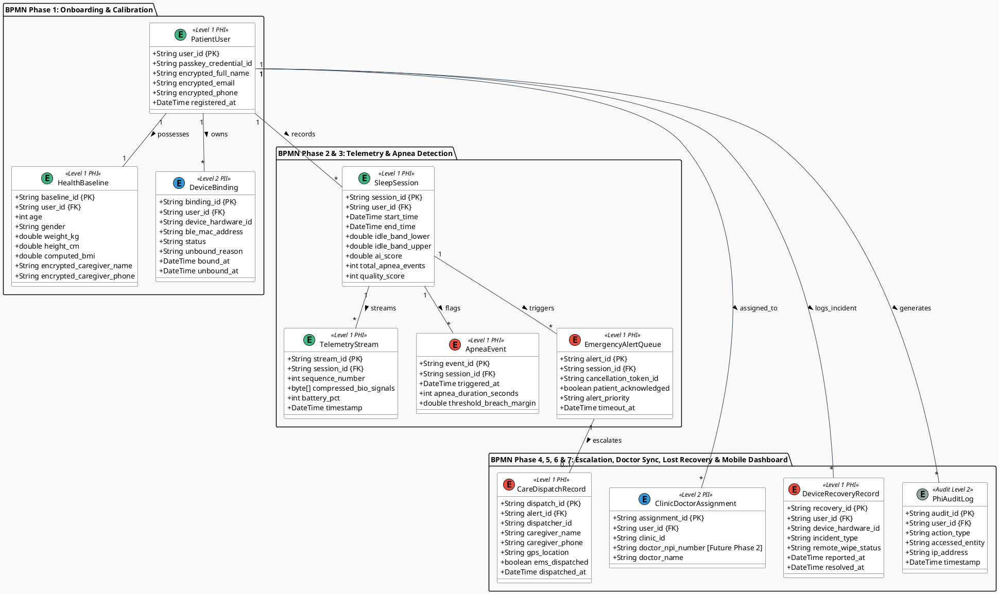

#### 📖 Data Entity Architecture & HIPAA Safeguards

The Conceptual Data Model structures database entities around the 6 process phases of the BPMN workflow, establishing strict HIPAA privacy levels:

* **Level 1 (PHI - Protected Health Information):** Requires AES-256 encryption at rest and TLS 1.3 in transit. Includes `PatientUser`, `HealthBaseline`, `SleepSession` (holds the per-session Sensor Baseline Drift & Noise Floor Envelope `idle_band_lower`/`idle_band_upper`), `SessionSummary` (per-night finalized rollup — Apnea Index, duration, `apnea_alarm_count`, `safety_tap_count`, `alarm_fired`, quality; source of truth for the Home dashboard read model per **AD-15**), `TelemetryStream` (compressed raw bio-signal blobs), `ApneaEvent`, `EmergencyAlertQueue`, `CareDispatchRecord`, and `DeviceRecoveryRecord` (tracking lost device reports, session revocations, and remote wipe events). Access is gated by strict Role-Based Access Control (RBAC).
* **Level 2 (PII - Personally Identifiable Information):** Technical metadata and device identifiers (`DeviceBinding`, `ClinicDoctorAssignment`); non-sensitive client settings (`UserPreferences` — locale, region, units).
* **Level 2 (Audit):** `PhiAuditLog` — an immutable, write-once audit log capturing every access event, read operation, unbinding request, remote wipe signal, and dispatch action across the platform.
* **Level 3 (Financial PII — isolated Billing store):** `Subscription`, `PaymentMethodRef`, `Invoice`, `Entitlement`. Held in a **separate Billing datastore** in the Application Core zone — **not** the HIPAA Isolated Data Zone — referencing `user_id` only and containing **no PHI**. `PaymentMethodRef` stores only the display triplet (`brand`, `last4`, `exp_month`/`exp_year`) plus the opaque `stripe_payment_method_id`; **no cardholder data ever enters the platform** (PCI-DSS SAQ-A, **AD-14**). The Billing service is the sole source of truth for subscription state (**AD-13**). Standard AES-256 at rest + TLS 1.3 in transit; the PHI zone's per-field envelope encryption and write-once audit do not apply.

---

### 2.2 Data Traceability Matrix: BPMN Process Data Requirements $\rightarrow$ PlantUML Entities

| BPMN Process Phase | Data Produced / Transformed in Workflow | Derived PlantUML Conceptual Entity | Key Data Attributes | HIPAA Safeguard Level |
| :--- | :--- | :--- | :--- | :--- |
| **Phase 1: Onboarding & Calibration** | Passkey FIDO2 token, patient full name, email, phone number, age, weight, height, computed BMI, caregiver name, caregiver phone, session Sensor Baseline Drift & Noise Floor Envelope `[lower_bound, upper_bound]`, BLE MAC address. | `PatientUser`, `HealthBaseline`, `DeviceBinding`, `SleepSession` | `user_id`, `passkey_credential_id`, `full_name`, `email`, `phone_number`, `age`, `weight_kg`, `height_cm`, `computed_bmi`, `caregiver_name`, `caregiver_phone`, `idle_band_lower`, `idle_band_upper`, `device_hardware_id`. | **Level 1 (PHI)** — AES-256 Encryption at Rest. |
| **Phase 2: Overnight Telemetry** | 100ms raw airflow samples, 10s webhook stream batch, sequence number, heartbeats, battery level. | `SleepSession`, `TelemetryStream` | `session_id`, `user_id`, `start_time`, `sequence_number`, `compressed_bio_signals`, `battery_pct`. | **Level 1 (PHI)** — Compressed AES-256 Time-Series Blob. |
| **Phase 3: Apnea & Tier-1 Alarm** | Stop-breathing start timestamp, apnea duration (≥10s with no valid band excursion), 30s cancellation token, "I'm Safe" tap timestamp. | `ApneaEvent`, `EmergencyAlertQueue` | `event_id`, `session_id`, `triggered_at`, `apnea_duration_seconds`, `patient_acknowledged`, `cancellation_token_id`. | **Level 1 (PHI)** — Real-Time Alert Event Queue. |
| **Phase 4: Emergency Center & Caregiver** | GPS coordinates, address, patient identification, caregiver contact name and phone, dispatcher action log, SMS/Voice call dispatch timestamp, EMS status. | `CareDispatchRecord`, `ClinicDoctorAssignment` | `dispatch_id`, `alert_id`, `dispatcher_id`, `patient_name`, `patient_phone`, `caregiver_name`, `caregiver_phone`, `gps_location`, `ems_dispatched`, `doctor_npi_number`. | **Level 1 (PHI)** — Role-Based Access Control (RBAC). |
| **Phase 5: Morning Analytics & Doctor** | Session end time, total sleep duration, final Apnea Index (`ai_score`), total apnea stops, quality score (0–100), doctor share payload. | `SleepSession`, `ClinicDoctorAssignment` | `end_time`, `total_duration_hours`, `ai_score`, `quality_score`, `doctor_npi_number`. | **Level 1 (PHI)** — HL7 FHIR Export Stream. |
| **Phase 6: Device & Mobile Lost Recovery** | Hardware loss report, lost MAC address, WebAuthn revocation token, remote wipe execution signal, replacement hardware serial pairing. | `DeviceBinding`, `DeviceRecoveryRecord`, `PhiAuditLog` | `recovery_id`, `user_id`, `incident_type`, `remote_wipe_status`, `unbound_reason`, `reported_at`, `status`. | **Level 1 (PHI)** — Cryptographic Wipe Audit & RBAC. |
| **Phase 7: Mobile Dashboard Review & Analytics** | Home dashboard read (last-N `SessionSummary` cache, streak, device-status from the AD-12 receiver state), morning summary metrics, Apnea Index (`ai_score`), 60 FPS Skia GPU raw-signal + Noise Floor Envelope waveform data, 256-point FFT spectral peaks, date-range history filter, **server-side entitlement check (AD-13) preceding** the signed FHIR clinical export payload. | `SessionSummary`, `SleepSession`, `TelemetryStream`, `Entitlement`, `PhiAuditLog` | `session_id`, `ai_score`, `quality_score`, `apnea_alarm_count`, `safety_tap_count`, `alarm_fired`, `compressed_bio_signals`, `action_type = "EXPORT_DOCTOR_REPORT"`. | **Level 1 (PHI)** — Encrypted SQLCipher DB & Signed FHIR Export. |
| **Phase 8: Subscription & Billing** | Plan selection, Stripe PaymentSheet tokenization result, HMAC-verified subscription/invoice webhook events, signed entitlement claim, card-on-file display triplet. | `Subscription`, `PaymentMethodRef`, `Invoice`, `Entitlement` | `user_id`, `stripe_customer_id`, `stripe_subscription_id`, `plan`, `status`, `current_period_end`, `pm_brand`, `pm_last4`, `stripe_payment_method_id`. | **Level 3 (Financial PII)** — isolated Billing store; **no cardholder data** (PCI-DSS SAQ-A, AD-14). |
| **All Phases** | User ID, action performed, accessed table/entity, IP address, timestamp. | `PhiAuditLog` | `audit_id`, `user_id`, `action_type`, `accessed_entity`, `ip_address`, `timestamp`. | **Level 2 (Audit)** — Immutable Write-Once Log. |

---

## 3. 📱 Application Architecture

### 3.1 📖 Architectural Invariant (AD-7): 1-to-1 BPMN Activity to UI Flow & Sequence Mapping

> [!IMPORTANT]
> **Architectural Invariant AD-7 (BPMN Activity Traceability Rule):**  
> To guarantee a flawless, traceable end-to-end user experience (E2E UX), **every single activity (User Task or Service Task)** in the BPMN 2.0 process model MUST map directly to an explicit **UI Flow Specification** (Screen ID, Visual UI Components, User Action/Trigger, Next UI State) AND a corresponding **Sequence Diagram Specification** (Source/Target Actors, Protocol/Payload, State Mutations, Latency SLA). No BPMN task may remain an un-mapped background abstraction.

### 3.2 📖 Activity-by-Activity UI Flow & Sequence Specifications

#### 📖 Conceptual Data Model Harmonization & Payload Verification Rule
> [!IMPORTANT]
> **Data Model Verification Invariant:**  
> Every payload structure defined across the 21 sequence specifications below MUST strictly match and harmonize with the **Conceptual Data Model** entities (`PatientUser`, `HealthBaseline`, `DeviceBinding`, `SleepSession`, `TelemetryStream`, `ApneaEvent`, `EmergencyAlertQueue`, `CareDispatchRecord`, `ClinicDoctorAssignment`, `PhiAuditLog`) in [**Section 2.1**](#21-conceptual-data-model-bpmn-aligned) and the **Data Traceability Matrix** in [**Section 2.2**](#22-data-traceability-matrix-bpmn-process-data-requirements--plantuml-entities). Downstream software engineers, API developers, and database architects MUST verify that every JSON payload attribute, gRPC schema field, and database column maintains 1-to-1 name and type parity across Application Architecture and Data Architecture contracts.

#### 🏊 Swimlane 1: Patient Onboarding Activities

| BPMN Activity ID & Name | UI Flow Specification (Screen, Visuals & User Actions) | Sequence Diagram Specification (Actors, Payload, Protocol & SLA) |
| :--- | :--- | :--- |
| **`Task_PatientRegister`** `Register Patient Account` | **Screen ID:** `MOB_REGISTER_ACCOUNT` **Visual Components:** Account creation form (Email, Password / Federated identity creation, Terms & HIPAA Consent checkbox). **User Action:** Enter credentials & tap *"Create Account"*. **Next UI State:** `MOB_USER_PROFILE` on success. | **Actors:** Patient $\rightarrow$ Mobile App $\rightarrow$ Authentication Service. **Protocol:** HTTPS / TLS 1.3 (Request-Reply Endpoint [IF-01]). **Payload:** `{ email, password_hash, user_type: "PATIENT" }`. **Processing:** Creates `PatientUser` authentication record. **Latency SLA:** $< 400\text{ms}$ registration. |
| **`Task_CreateUserProfile`** `Create Patient Medical Profile` | **Screen ID:** `MOB_USER_PROFILE` **Visual Components:** Patient medical profile form (Demographics: Age, Weight kg, Height cm, computed BMI; Emergency Caregiver Contact Name & Phone; Attending Physician NPI). **User Action:** Fill medical profile details & tap *"Save Profile"*. **Next UI State:** `MOB_REGISTER_PASSKEY` on success. | **Actors:** Patient $\rightarrow$ Mobile App UI $\rightarrow$ Patient Profile API $\rightarrow$ Platform DB. **Protocol:** HTTPS / TLS 1.3 (Request-Reply Endpoint [IF-02]). **Payload:** `{ user_id, full_name, age, weight_kg, height_cm, computed_bmi, emergency_contact_phone, doctor_npi }`. **Processing:** Stores patient demographic & medical profile record in DB. **Latency SLA:** $< 500\text{ms}$ profile save. |
| **`Task_RegisterPasskey`** `Register & Enroll FIDO2 Passkey` | **Screen ID:** `MOB_REGISTER_PASSKEY` **Visual Components:** Passkey enrollment wizard screen. Text: *"Secure your account with biometric Passkey"*. TouchID/FaceID pulse animation. **User Action:** Tap *"Enroll Passkey"* & scan Fingerprint/Face. **Next UI State:** Dialog *"Passkey Enrolled ✓"*, then auto-advances to `MOB_PASSKEY_AUTH` or `MOB_CALIBRATION`. | **Actors:** Patient $\rightarrow$ Mobile App UI $\rightarrow$ OS Secure Enclave $\rightarrow$ Auth Service. **Protocol:** WebAuthn FIDO2 Assertion over HTTPS / TLS 1.3 (Request-Reply [IF-03, IF-04]). **Payload:** `{ user_id, passkey_credential_id, public_key_pem, device_hardware_id }`. **Processing:** Binds hardware-backed public key to `PatientUser` record in DB. **Latency SLA:** $< 600\text{ms}$ passkey enrollment. |

#### 🏊 Swimlane 2: Backoffice Operations Activities

| BPMN Activity ID & Name | UI Flow Specification (Screen, Visuals & User Actions) | Sequence Diagram Specification (Actors, Payload, Protocol & SLA) |
| :--- | :--- | :--- |
| **`Task_VerifyPatientIdentity`** `Handle Passkey Login Issue & Verify Identity` | **Screen ID:** `WEB_PASSKEY_RECOVERY` **Visual Components:** Out-of-band Passkey support ticket queue. Patient identity verification checklist & SMS challenge button. **User Action:** Support admin reviews out-of-band identity proof & clicks *"Verify Identity for Passkey Recovery"*. **Next UI State:** `WEB_DEVICE_RESET` on verification success. | **Actors:** Support Admin $\rightarrow$ Backoffice Web Portal $\rightarrow$ Patient Profile Service. **Protocol:** HTTPS / TLS 1.3 (Request-Reply Endpoint [IF-05]). **Payload:** `{ user_id, support_ticket_id, admin_id, verification_method: "OUT_OF_BAND_SMS" }`. **Processing:** Validates patient identity & authorizes biometric Passkey reset. **Latency SLA:** $< 300\text{ms}$ identity verification. |
| **`Task_BindMedicalDevice`** `Revoke Stale Passkey & Unbind Sensor Device` | **Screen ID:** `WEB_DEVICE_RESET` **Visual Components:** Device & Passkey credential management panel. Lists active WebAuthn passkeys and BLE sensor MAC bindings with red *"REVOKE PASSKEY & UNBIND"* button. **User Action:** Admin clicks *"Revoke Stale Passkey & Unbind Sensor"*. **Next UI State:** `WEB_TOKEN_ISSUE` (Displays credential revocation confirmation badge). | **Actors:** Support Admin $\rightarrow$ Backoffice Web Portal $\rightarrow$ Auth Service $\rightarrow$ Device Service. **Protocol:** HTTPS / TLS 1.3 (Request-Reply Commands [IF-06, IF-07]). **Payload:** `{ user_id, revoked_credential_id, device_hardware_id }`. **Processing:** Revokes compromised FIDO2 keypair & unbinds lost sensor hardware. **Latency SLA:** $< 400\text{ms}$ revocation operation. |
| **`Task_LockEmergencyContacts`** `Issue Emergency Passkey Recovery Token` | **Screen ID:** `WEB_TOKEN_ISSUE` **Visual Components:** Temporary emergency token issuance modal. Expiration timer selector (15 mins) and automated SMS dispatch button. **User Action:** Admin clicks *"Issue Emergency One-Time Passkey Recovery Token"*. **Next UI State:** `WEB_SUPPORT_COMPLETE` (Token sent to patient phone via encrypted SMS). | **Actors:** Support Admin $\rightarrow$ Backoffice Operations $\rightarrow$ Auth Service $\rightarrow$ Twilio SMS Gateway. **Protocol:** HTTPS / TLS 1.3 + SMS API (Outbound Push [IF-08]). **Payload:** `{ user_id, phone_number, expiration_minutes: 15, single_use: true }`. **Processing:** Generates 256-bit cryptographically secure single-use recovery link for mobile app re-enrollment. **Latency SLA:** $< 350\text{ms}$ token dispatch. |

#### 🏊 Swimlane 3: Patient Sleep Operations Activities

| BPMN Activity ID & Name | UI Flow Specification (Screen, Visuals & User Actions) | Sequence Diagram Specification (Actors, Payload, Protocol & SLA) |
| :--- | :--- | :--- |
| **`Task_PasskeyAuth`** `Authenticate via Passkey (FIDO2)` | **Screen ID:** `MOB_PASSKEY_AUTH` **Visual Components:** Biometric prompt modal (FaceID / TouchID / Windows Hello), Passkey pulse graphic. **User Action:** Fingerprint touch or Face scan. **Next UI State:** `MOB_CALIBRATION` on success; error toast with retry button on failure. | **Actors:** Patient $\rightarrow$ Mobile App $\rightarrow$ Authentication Service Gateway. **Protocol:** WebAuthn FIDO2 Assertion over HTTPS / TLS 1.3 (Request-Reply [IF-09, IF-10]). **Payload:** `{ user_id, passkey_credential_id, challenge_signature }`. **Latency SLA:** $< 500\text{ms}$ authentication verification. |
| **`Task_NoiseFloorCal`** `Sensor Baseline Drift & Noise Floor Envelope Calibration` | **Screen ID:** `MOB_CALIBRATION` (step 1 of 2) **Visual Components:** Full-screen wizard. Text: *"Put on your D-BAND, sit still, and breathe gently for 10 seconds"*. ~10s circular progress ring + live band readout (`lower_bound` / `upper_bound`). **User Action:** Tap *"Start"*, then hold still. **Next UI State:** Advances to the wear-check step. | **Actors:** Mobile App Edge $\leftarrow$ BLE GATT Sensor (`0x2A37` characteristic). **Protocol:** BLE GATT AES-128 Notification Stream @ 10Hz [IF-11]. **Payload:** ~100 raw signal samples. **Processing:** Local Dart Isolate tracks the running min/max → `[lower_bound, upper_bound]`; persisted on `SleepSession`. **Latency SLA:** ~10s window sampling. |
| **`Task_WearCheck`** `Confirm the sensor is sensing breath` | **Screen ID:** `MOB_CALIBRATION` (step 2 of 2) **Visual Components:** Text: *"Now take a few normal breaths so we can check the fit"*. Real-time canvas showing the trace crossing both band lines. **User Action:** Breathe normally. **Next UI State:** *"Calibration Complete — Ready for Sleep ✓"* then `MOB_SLEEP_MONITOR`; on failure the toast *"Sensor not detecting breathing — check the fit."* + retry. | **Actors:** Mobile App Edge $\leftarrow$ BLE GATT Sensor $\rightarrow$ Local Hive DB. **Protocol:** BLE GATT notifications [IF-11]. **Payload:** raw signal samples. **Processing:** Requires ≥ 2 valid Noise-Floor-Envelope breath-excursion cycles (AD-04) within ~15s before "Start Sleep Monitoring" unlocks. **Latency SLA:** ≤ ~15s check window. |
| **`Task_SleepMonitoring`** `Sleep with Device Attached` | **Screen ID:** `MOB_SLEEP_MONITOR` **Visual Components:** Low-power Night Mode (0-FPS locked black display `#000000` with subtle dim pulsing green heartbeat dot). Screen touch locked to prevent accidental keypresses. **User Action:** None (User sleeps). **Next UI State:** Remains dark until morning unlock OR pops `MOB_TIER1_ALARM` if airflow breach detected. | **Actors:** Patient $\rightarrow$ Sensor BLE GATT $\rightarrow$ Mobile Circular RAM Buffer. **Protocol:** BLE GATT AES-128 @ 100ms interval [IF-11] + HTTPS/gRPC Batch Stream [IF-12]. **Payload:** 100ms bio-signal stream array. **Processing:** 1-hour circular RAM ring buffer maintains sliding window. **Latency SLA:** Continuous 10Hz stream processing. |
| **`Task_TapSafe`** `Tap 'I'm Safe' Button` | **Screen ID:** `MOB_TIER1_ALARM` **Visual Components:** High-priority visual alert overlay (Flashing 100% brightness red/yellow `#FF3B30`, pulsating 120dB audio siren, haptic vibration). Large central button: *"I'M SAFE - DISMISS ALARM"*. 30s countdown timer display. **User Action:** Single tap on *"I'm Safe"* button. **Next UI State:** `MOB_ALARM_CANCELED` (Silences alarm, returns to `MOB_SLEEP_MONITOR`). | **Actors:** Patient $\rightarrow$ Mobile UI Driver $\rightarrow$ Local Audio Engine $\rightarrow$ Application DB. **Protocol:** Local UI Touch Event + Request-Reply Cancellation Payload. **Payload:** `{ session_id, cancellation_token_id, acknowledged_at, tap_lat_long }`. **Processing:** Cancels 30s cancellation token timer; updates `patient_acknowledged = true`. **Latency SLA:** $< 50\text{ms}$ local audio/haptic shutdown. |
| **`Task_EndSession`** `Tap 'End Sleep Session'` | **Screen ID:** `MOB_SLEEP_SUMMARY` **Visual Components:** Morning sleep summary dashboard. Displays total sleep hours (e.g., 7h 45m), overnight **Apnea Index** (e.g., AI 3.2 · Normal) with the apnea-only caveat, raw-signal + Noise Floor Envelope waveform chart, and *"Share with Physician"* button. **User Action:** Tap *"End Sleep Session"*. **Next UI State:** Home Screen / Session Archive. | **Actors:** Patient $\rightarrow$ Mobile App $\rightarrow$ Cloud Session API. **Protocol:** HTTPS / TLS 1.3 (Request-Reply [IF-16]). **Payload:** `{ session_id, end_time, total_duration_seconds, final_ai_score }`. **Processing:** Closes BLE connection, computes the final Apnea Index, syncs report. **Latency SLA:** $< 1.0\text{s}$ report generation. |

#### 🏊 Swimlane 4: Emergency Center Activities

| BPMN Activity ID & Name | UI Flow Specification (Screen, Visuals & User Actions) | Sequence Diagram Specification (Actors, Payload, Protocol & SLA) |
| :--- | :--- | :--- |
| **`Task_DashboardAlert`** `Command Center Dashboard Alert Pop-up` | **Screen ID:** `WEB_COMMAND_DASHBOARD` **Visual Components:** High-contrast red modal popup (`#D32F2F`) overlays command center screen. Audio siren chime. Displays patient name, age, phone, Apnea Index, elapsed apnea time, and large *"ACCEPT DISPATCH"* button. **User Action:** Auto-pop on WSS message; dispatcher clicks *"Accept Dispatch"*. **Next UI State:** Opens `WEB_EMERGENCY_MAP_VIEW`. | **Actors:** Command Portal React Client $\leftarrow$ WebSocket Gateway Node. **Protocol:** WSS TLS 1.3 (Real-Time Push Notification [IF-13]). **Payload:** Emergency Alert Frame. **Processing:** Auto-focuses modal cursor, triggers audio chime, locks dispatcher session to alert. **Latency SLA:** $< 100\text{ms}$ UI pop-up render. |
| **`Task_MetricCollection`** `Collect Emergency Alert Metrics` | **Screen ID:** Background Service / Operational Console. **Visual Components:** Real-time metrics widget showing dispatcher response times, call latency counters, and SLA compliance indicators. **User Action:** Automated system collection upon alert trigger & dispatcher response. **Next UI State:** Logs operational metrics to `PhiAuditLog` and updates telemetry dashboard. | **Actors:** Emergency Center Backend $\rightarrow$ Application DB $\rightarrow$ PhiAuditLog. **Protocol:** gRPC / HTTP/2 (Asynchronous One-Way Audit Stream [IF-19]). **Payload:** `{ alert_id, session_id, alert_received_at, dispatcher_ack_at, caregiver_call_lat_ms }`. **Processing:** Records SLA performance metrics and operational logs. **Latency SLA:** $< 100\text{ms}$ metrics aggregation. |
| **`Task_CaregiverCall`** `Trigger Voice Call & SMS to Caregiver` | **Screen ID:** `WEB_CAREGIVER_PANEL` **Visual Components:** Telephony status card showing caregiver name, relationship, phone number, and real-time status pill (`DIALING` $\rightarrow$ `RINGING` $\rightarrow$ `ANSWERED` / `NO_ANSWER`). **User Action:** 1-Click trigger or automated 5s fall-through. **Next UI State:** Updates panel status pill to `CALL_IN_PROGRESS`. | **Actors:** Command Portal Backend $\rightarrow$ Twilio Telephony Gateway API $\rightarrow$ Caregiver Phone. **Protocol:** HTTPS / TLS 1.3 (Outbound Webhook Push [IF-14]). **Payload:** `{ to: caregiver_phone, text: "EMERGENCY: Sleep apnea alert for [Patient Name]. Please check immediately.", voice_twiml_url }`. **Processing:** Triggers automated voice call & priority SMS to caregiver. **Latency SLA:** $< 2.0\text{s}$ call initiation. |
| **`Task_DispatchEMS`** `Dispatch Local EMS / 911 Responders` | **Screen ID:** `WEB_EMS_DISPATCH_MODAL` **Visual Components:** 911 Computer-Aided Dispatch (CAD) integration panel. Displays dispatch confirmation ID, estimated EMS ETA, and notes entry box. **User Action:** Dispatcher clicks *"DISPATCH EMS / 911 NOW"*. **Next UI State:** `WEB_DISPATCH_COMPLETE` (Shows active EMS unit tracking & audit confirmation). | **Actors:** Dispatcher $\rightarrow$ Command Portal $\rightarrow$ Local EMS CAD Gateway API $\rightarrow$ CareDispatchRecord. **Protocol:** HTTPS / TLS 1.3 (Request-Reply CAD Gateway [IF-15]). **Payload:** `{ alert_id, patient_name, gps_lat_long, street_address, medical_condition: "NOCTURNAL_APNEA_STOP" }`. **Processing:** Confirms CAD order; updates `CareDispatchRecord` (`ems_dispatched = true`). **Latency SLA:** $< 500\text{ms}$ CAD response confirmation. |

#### 🏊 Swimlane 5: Clinic & Physician Activities

| BPMN Activity ID & Name | UI Flow Specification (Screen, Visuals & User Actions) | Sequence Diagram Specification (Actors, Payload, Protocol & SLA) |
| :--- | :--- | :--- |
| **`Task_PhysicianReview`** `Physician Reviews Apnea Index Classification & Signs Diagnosis` | **Screen ID:** `WEB_PHYSICIAN_PATIENT_DETAIL` **Visual Components:** Patient medical detail view. Real-time alert badge *"Morning Sleep Report Ready"*, 8-hour respiration wave graphs, Apnea Index trend breakdown (Normal/Mild/Moderate/Severe, apnea-only), and clinical note entry box. **User Action:** Physician reviews the Apnea Index graph, inputs clinical notes, & taps *"Sign & Save Diagnosis"*. **Next UI State:** `WEB_DIAGNOSIS_SIGNED` (Diagnostic report locked & appended to patient medical chart). | **Actors:** Cloud Session API $\rightarrow$ Attending Sleep Specialist Physician $\rightarrow$ Clinic Web Portal $\rightarrow$ Application DB. **Protocol:** HTTPS / TLS 1.3 (Request-Reply Transactions [IF-17, IF-18]). **Payload:** `{ session_id, patient_id, doctor_npi, ai_score, diagnostic_notes, prescription_adjustment }`. **Processing:** Syncs morning report, stores physician signature & diagnostic notes, and updates patient chart. **Latency SLA:** $< 400\text{ms}$ diagnosis save & sync. |

#### 🏊 Swimlane 6: Device Loss & Mobile Recovery Activities

| BPMN Activity ID & Name | UI Flow Specification (Screen, Visuals & User Actions) | Sequence Diagram Specification (Actors, Payload, Protocol & SLA) |
| :--- | :--- | :--- |
| **`Task_ReportDeviceLost`** `Report D-BAND Sensor Lost / Stolen` | **Screen ID:** `MOB_REPORT_DEVICE_LOST` / `WEB_REPORT_DEVICE_LOST` **Visual Components:** Device status management card displaying active D-BAND serial & MAC address with red *"UNBIND & REPORT LOST"* button. **User Action:** Patient or support rep taps *"Unbind & Report Sensor Lost"*. **Next UI State:** `MOB_DEVICE_UNBOUND_SUCCESS` (Shows status pill `DEPRECATED/LOST`). | **Actors:** Mobile App / Web Portal $\rightarrow$ Device Management Service $\rightarrow$ Application DB. **Protocol:** HTTPS / TLS 1.3 (Request-Reply Command [IF-20]). **Payload:** `{ user_id, device_hardware_id, reason: "LOST_OR_STOLEN" }`. **Processing:** Marks device `DEPRECATED/LOST`, revokes BLE binding, emits audit log. **Latency SLA:** $< 300\text{ms}$ unbind execution. |
| **`Task_ReportMobileLost`** `Report Mobile Phone Lost / Stolen` | **Screen ID:** `WEB_REPORT_MOBILE_LOST` **Visual Components:** Web self-service portal screen for lost phone report. Lists paired mobile devices with red *"REVOKE SESSION & REMOTE WIPE"* button. **User Action:** Patient or caregiver clicks *"Revoke All Mobile Sessions & Wipe PHI"*. **Next UI State:** `WEB_SESSION_REVOKED_SUCCESS` (Confirms JWT token revocation & push wipe). | **Actors:** Web Portal $\rightarrow$ Auth Service $\rightarrow$ Push Notification Service. **Protocol:** HTTPS / TLS 1.3 (Request-Reply Command [IF-21]). **Payload:** `{ user_id, mobile_device_id, trigger_wipe: true }`. **Processing:** Revokes all active JWT tokens, invalidates WebAuthn credentials, issues wipe payload. **Latency SLA:** $< 250\text{ms}$ session revocation. |
| **`Task_TriggerRemoteWipe`** `Issue Cryptographic Remote Wipe Signal` | **Screen ID:** Background System Service / Client OS Notification Receiver. **Visual Components:** OS background task receiver listening for remote wipe payload or 10 failed Passkey retries. **User Action:** Automated client execution upon push notification or local threshold breach. **Next UI State:** App self-terminates and redirects to initial OS launch screen. | **Actors:** Cloud Push Service $\rightarrow$ Client Edge OS $\rightarrow$ Local SQLCipher DB & OS Secure Enclave. **Protocol:** Encrypted Push Notification / Local Security Event. **Payload:** `{ command: "REMOTE_WIPE_ZEROIZATION", user_id }`. **Processing:** Sub-1s zeroization deleting local Hive/SQLCipher databases & Secure Enclave keys. **Latency SLA:** $< 1.0\text{s}$ wipe execution. |
| **`Task_RebindReplacementDevice`** `Pair & Bind Replacement D-BAND Device` | **Screen ID:** `MOB_REBIND_DEVICE` **Visual Components:** BLE discovery screen. Displays available replacement D-BAND sensors with *"PAIR & BIND REPLACEMENT"* button. **User Action:** Tap *"Pair & Bind Replacement Sensor"*. **Next UI State:** `MOB_DEVICE_BOUND_SUCCESS` (Returns to Home / Bedtime Calibration). | **Actors:** Patient $\rightarrow$ Mobile App $\rightarrow$ Device Management Service $\rightarrow$ Application DB. **Protocol:** BLE GATT Pairing + HTTPS / TLS 1.3 (`POST /api/v1/devices/bind` [IF-22]). **Payload:** `{ user_id, new_device_hardware_id, new_ble_mac_address }`. **Processing:** Binds new D-BAND sensor to user profile; retains cloud sleep history. **Latency SLA:** $< 500\text{ms}$ re-binding API. |

#### 🏊 Swimlane 7: Mobile Dashboard Review & Analytics Activities

| BPMN Activity ID & Name | UI Flow Specification (Screen, Visuals & User Actions) | Sequence Diagram Specification (Actors, Payload, Protocol & SLA) |
| :--- | :--- | :--- |
| **`Task_ReviewMorningSummary`** `Review Morning Sleep Summary & Apnea Index` | **Screen ID:** `MOB_SLEEP_SUMMARY` **Visual Components:** Morning sleep summary card. Displays total sleep hours (e.g. 7h 45m), overnight **Apnea Index** (e.g., AI 3.2 · Normal) with the apnea-only caveat, raw-signal + Noise Floor Envelope waveform chart, and *"Share with Physician"* button. **User Action:** Patient views morning metrics & taps *"Inspect Respiration Waveform"*. **Next UI State:** `MOB_GRAPH_WAVEFORM`. | **Actors:** Patient $\rightarrow$ Mobile App UI $\rightarrow$ Application DB. **Protocol:** Local SQLCipher Query / HTTPS TLS 1.3 Endpoint [IF-16]. **Payload:** `{ session_id, duration_seconds, ai_score, quality_score, intervention_count }`. **Processing:** Renders morning sleep metrics summary. **Latency SLA:** $< 200\text{ms}$ rendering SLA. |
| **`Task_InspectRespirationWaveform`** `Inspect Respiration Waveform & FFT Spectrum` | **Screen ID:** `MOB_GRAPH_WAVEFORM` **Visual Components:** Interactive 60 FPS Skia GPU waveform line chart (`fl_chart`), 256-point FFT spectral peak bar graph, and SpO2 trend timeline. **User Action:** Pinch-to-zoom, pan across overnight telemetry, & toggle FFT magnitude spectrum. **Next UI State:** `MOB_HISTORY_FILTER`. | **Actors:** Mobile App Edge UI $\rightarrow$ Skia GPU Layer $\rightarrow$ FFT Isolate. **Protocol:** Local Flutter Render Pipeline + Dart Isolate Memory Buffer. **Payload:** `{ 10Hz_telemetry_array, 256_pt_fft_spectrum, respiration_rate_bpm }`. **Processing:** Hardware accelerated Skia GPU chart rendering. **Latency SLA:** Continuous 60 FPS smooth rendering. |
| **`Task_FilterHistoricalSessions`** `Filter Historical Sleep Sessions & Trends` | **Screen ID:** `MOB_HISTORY_FILTER` **Visual Components:** Calendar history view with date range pickers, severity filters (All, Normal, Hypopnea, Apnea), and list of past sleep sessions. **User Action:** Select date range & tap *"Apply Severity Filter"*. **Next UI State:** Updates session history list with filtered metrics. | **Actors:** Patient $\rightarrow$ Mobile App UI $\rightarrow$ Local Encrypted SQLCipher DB. **Protocol:** Encrypted Local SQL Query (Request-Reply). **Payload:** `{ start_date, end_date, severity_filter: "ALL" }`. **Processing:** Queries local encrypted database history. **Latency SLA:** $< 150\text{ms}$ local query SLA. |
| **`Task_ExportDoctorReport`** `Generate Signed Clinical Report for Physician` | **Screen ID:** `MOB_EXPORT_DOCTOR_REPORT` **Visual Components:** Doctor report export modal with FHIR JSON preview, PDF chart generator button, and *"Share with Physician"* button. **User Action:** Patient taps *"Generate Signed Report & Share with Doctor"*. **Next UI State:** Launches native OS share sheet with signed PDF / JSON clinical chart. | **Actors:** Patient $\rightarrow$ Mobile App UI $\rightarrow$ Patient Profile Service. **Protocol:** HTTPS / TLS 1.3 (Request-Reply [IF-17, IF-18]). **Payload:** `{ patient_id, session_id, fhir_json_payload, digital_signature }`. **Processing:** Formats FHIR JSON and generates signed PDF chart. **Latency SLA:** $< 800\text{ms}$ report generation. |

#### 💡 Guidance for Downstream Workflows (State Machines & User Stories)
> [!NOTE]
> **Application Architecture Traceability:**  
> Detailed Activity-by-Activity UI Flow & Sequence Specifications for all 25 BPMN tasks, along with end-to-end sequence diagrams, are defined in [**Section 3. Application Architecture**](#3--application-architecture).

---

### 3.3 🧩 C4 Level 3: Component Diagram — Participant-to-Component Mapping

The **C4 Level 3 Component Diagram** decomposes the C4 Level 2 Containers into granular software components, defining the internal structural units responsible for executing platform capabilities. 

> [!IMPORTANT]
> **Architectural Invariant AD-8 (Sequence Participant Traceability Rule):**  
> Every participant line in the downstream **End-to-End Sequence Diagrams (Section 3.5)** MUST represent an explicit, deployable node or component defined in this C4 Component Diagram. No sequence diagram participant may exist without a corresponding 1-to-1 C4 Component definition.

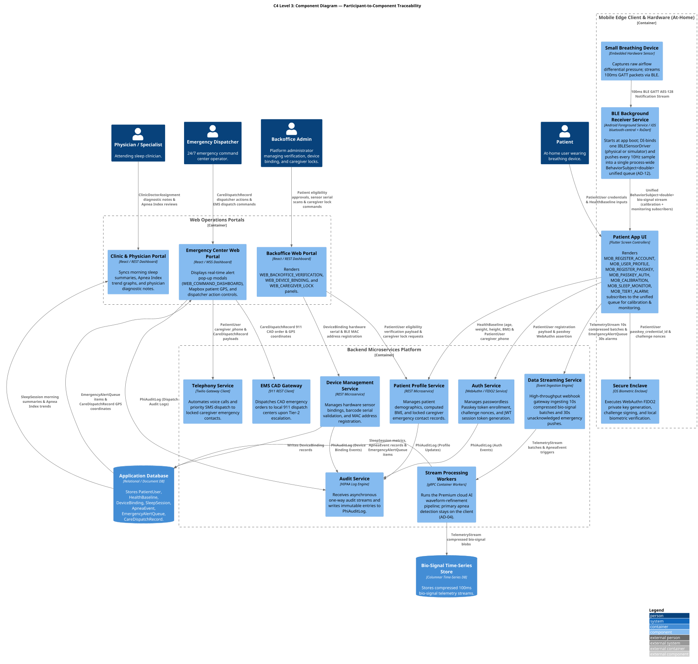

#### 📖 Participant-to-C4-Component Traceability Matrix

| Sequence Diagram Participant Line | Parent C4 Container | C4 Component Node | Mapped Application Entity / Payload | Architectural Responsibility |
| :--- | :--- | :--- | :--- | :--- |
| **`User`** | External Actor | `Patient` / `Dispatcher` / `Physician` / `Backoffice Admin` | `PatientUser` / Human Actor | Human actor triggering UI events or reviewing healthcare dashboards. |
| **`Small Breathing Device (Sensor)`** | Hardware Device | `Small Breathing Device` | Differential Pressure Stream | Embedded hardware sensor sampling differential pressure and streaming 100ms BLE GATT notifications. |
| **`BLE Background Receiver Service (Receiver)`** | `Mobile Application` | `BLE Background Receiver Service` | `TelemetryStream` (on-device, pre-batch) | Boot-time Android Foreground Service / iOS `bluetooth-central` singleton; DI-binds one `IBLESensorDriver` and pushes every 10Hz sample into the single process-wide `BehaviorSubject<double>` unified queue consumed by the Noise Floor Envelope calibration, the wear check, and 8+ h monitoring (`AD-11`, `AD-12`, PRD `FR-1.11`). |
| **`Backoffice Admin (Admin)`** | External Actor | `Backoffice Admin` | Human Administrator | Verifies patient identity, scans sensor barcodes, and locks caregiver contacts. |
| **`Patient App UI (UI)`** | `Mobile Application` | `Patient App UI` | `PatientUser`, `HealthBaseline` | Renders Flutter onboarding, calibration, sleep monitoring, and Tier-1 alarm screens. |
| **`Backoffice Web Portal (Admin UI)`** | `Web Operations Portals` | `Backoffice Web Portal` | `PatientUser`, `DeviceBinding` | Renders web panels for identity verification, device pairing, and caregiver contact locks. |
| **`Secure Enclave (Enclave)`** | `Mobile Application` | `Secure Enclave` | `PatientUser (passkey_credential_id)` | OS biometrics module executing WebAuthn keypair generation and FIDO2 challenge signing. |
| **`Auth Service (AuthSvc)`** | `Authentication Service` | `Auth Service` | `PatientUser` | WebAuthn FIDO2 microservice issuing enrollment/authentication challenges and JWT session tokens. |
| **`Profile Service (ProfileSvc)`** | `Backend Platform Services` | `Patient Profile Service` | `HealthBaseline`, `PatientUser` | REST microservice capturing patient demographics, BMI, and locked caregiver emergency contacts. |
| **`Device Management Service (DeviceSvc)`** | `Backend Platform Services` | `Device Management Service` | `DeviceBinding` | REST microservice managing BLE sensor MAC bindings, barcode serial validation, and device inventory. |
| **`Audit Service (AuditSvc)`** | `Backend Platform Services` | `Audit Service` | `PhiAuditLog` | Non-blocking HIPAA compliance service writing write-once audit logs to `PhiAuditLog`. |
| **`Data Streaming Service`** | `Data Streaming Service` | `Data Streaming Service` | `TelemetryStream`, `EmergencyAlertQueue` | High-throughput event ingestion engine handling 10s bio-signal batches and 30s emergency pushes. |
| **`Stream Processing Workers`** | `Stream Processing Workers` | `Stream Processing Workers` | `TelemetryStream`, `ApneaEvent`, `SleepSession` | gRPC container workers running the Premium cloud AI waveform-refinement pipeline; primary apnea detection is the client's Noise-Floor-Envelope evaluator (AD-04). |
| **`Emergency Center Web Portal`** | `Emergency Center Web Portal` | `Emergency Center Web Portal` | `EmergencyAlertQueue`, `CareDispatchRecord` | React WSS dashboard displaying alert pop-ups, Mapbox GPS geocoding, and dispatch action buttons. |
| **`Telephony Service`** | `Backend Platform Services` | `Telephony Service` | `CareDispatchRecord`, `PatientUser` | Automated Twilio telephony client triggering voice calls and priority SMS to emergency contacts. |
| **`EMS CAD Gateway`** | `Backend Platform Services` | `EMS CAD Gateway` | `CareDispatchRecord` | Integration gateway initiating 911 Computer-Aided Dispatch (CAD) emergency responder orders. |
| **`Clinic Portal Backend`** | `Clinic & Physician Portal` | `Clinic & Physician Portal` | `SleepSession`, `ClinicDoctorAssignment` | Web backend syncing morning sleep scores (Apnea Index), trends, and physician diagnostic notes. |
| **`Application Database (DB)`** | `Application Database` | `Application Database` | All Primary Application Entities | Relational/Document database persisting user state, health baselines, device bindings, and alert queues. |
| **`Bio-Signal Time-Series Store`** | `Bio-Signal Time-Series Store` | `Bio-Signal Time-Series Store` | `TelemetryStream` | Columnar database storing compressed high-frequency bio-signal streams. |
| **`Home Dashboard BLoC`** | `Mobile Application` | `HomeDashboardBloc` | `SessionSummary` (local last-N cache), receiver-service state | Assembles the `MOB_HOME` read model — 7-night Apnea Index trend, monitoring streak, D-BAND device-status — from the local `SessionSummary` cache (AD-15) and the AD-12 receiver-service state; opens **no** BLE subscription of its own. |
| **`Billing BLoC / SubscriptionRepository`** | `Mobile Application` | `BillingBloc`, `SubscriptionRepository` | `Subscription`, `PaymentMethodRef`, `Invoice` | Renders `MOB_BILLING` / `MOB_PAYMENT_METHOD`; reads plan + card-on-file display triplet + invoice list from the Billing service; never derives entitlement from raw Stripe data. |
| **`Entitlement Service (client)`** | `Mobile Application` | `EntitlementService` | `Entitlement` (signed claim) | Holds the signed entitlement claim, applies the plan-gate before a gated action (`Task_ExportDoctorReport`), re-checks server-side, falls back to the cached claim within the bounded grace window (AD-13). |
| **`Stripe PaymentSheet Gateway`** | `Mobile Application` | `StripePaymentSheetGateway` | tokenized card → `stripe_payment_method_id` | Presents Stripe's hosted PaymentSheet for card capture; returns only an opaque payment-method token — no PAN/CVC crosses into the app (AD-14). |
| **`Billing Service`** | `Backend Platform Services` | `BillingService` | `Subscription`, `PaymentMethodRef`, `Invoice`, `Entitlement` | **Sole source of truth** for subscription state and entitlement issuance; owns plan create/change/cancel and invoice history; isolated Billing datastore in the App Core zone, holds no PHI (AD-13). |
| **`Stripe Webhook Receiver`** | `Backend Platform Services` | `StripeWebhookReceiver` | `customer.subscription.*`, `invoice.*` events | HMAC-SHA256-verified ingress endpoint behind the WAF/CDN edge; the **only** writer of subscription state into the Billing datastore (AD-13); every event mirrored to a webhook audit log. |

---

### 3.4 📊 Application Entity-Relationship (ER) Model

The **Application Entity-Relationship (ER) Model** formalizes the physical relational and document schema relationships governing data persistence across the `Application Database` and `Bio-Signal Time-Series Store`. 

```plantuml
@startuml Application_ER_Diagram
skinparam backgroundColor #FFFFFF
skinparam classAttributeIconSize 0
hide circle

entity "PatientUser" as patient_user {
    * user_id : VARCHAR(36) <<PK>>
    --
    passkey_credential_id : VARCHAR(255)
    encrypted_full_name : VARCHAR(512)
    encrypted_email : VARCHAR(512)
    encrypted_phone : VARCHAR(256)
    registered_at : TIMESTAMP
}

entity "HealthBaseline" as health_baseline {
    * baseline_id : VARCHAR(36) <<PK>>
    --
    * user_id : VARCHAR(36) <<FK>>
    age : INT
    gender : VARCHAR(16)
    weight_kg : DECIMAL(5,2)
    height_cm : DECIMAL(5,2)
    computed_bmi : DECIMAL(4,2)
    encrypted_caregiver_name : VARCHAR(256)
    encrypted_caregiver_phone : VARCHAR(256)
}

entity "DeviceBinding" as device_binding {
    * binding_id : VARCHAR(36) <<PK>>
    --
    * user_id : VARCHAR(36) <<FK>>
    device_hardware_id : VARCHAR(128)
    ble_mac_address : VARCHAR(64)
    status : VARCHAR(32)
    unbound_reason : VARCHAR(64)
    bound_at : TIMESTAMP
    unbound_at : TIMESTAMP
}

entity "SleepSession" as sleep_session {
    * session_id : VARCHAR(36) <<PK>>
    --
    * user_id : VARCHAR(36) <<FK>>
    start_time : TIMESTAMP
    end_time : TIMESTAMP
    idle_band_lower : DOUBLE
    idle_band_upper : DOUBLE
    ai_score : DECIMAL(4,1)
    total_apnea_events : INT
    quality_score : INT
}

entity "TelemetryStream" as telemetry_stream {
    * stream_id : VARCHAR(36) <<PK>>
    --
    * session_id : VARCHAR(36) <<FK>>
    sequence_number : INT
    compressed_bio_signals : BLOB
    battery_pct : INT
    timestamp : TIMESTAMP
}

entity "ApneaEvent" as apnea_event {
    * event_id : VARCHAR(36) <<PK>>
    --
    * session_id : VARCHAR(36) <<FK>>
    triggered_at : TIMESTAMP
    apnea_duration_seconds : INT
    threshold_breach_margin : DOUBLE
}

entity "EmergencyAlertQueue" as alert_queue {
    * alert_id : VARCHAR(36) <<PK>>
    --
    * session_id : VARCHAR(36) <<FK>>
    cancellation_token_id : VARCHAR(128)
    patient_acknowledged : BOOLEAN
    alert_priority : VARCHAR(32)
    timeout_at : TIMESTAMP
}

entity "CareDispatchRecord" as dispatch_record {
    * dispatch_id : VARCHAR(36) <<PK>>
    --
    * alert_id : VARCHAR(36) <<FK>>
    dispatcher_id : VARCHAR(36)
    caregiver_name : VARCHAR(128)
    caregiver_phone : VARCHAR(64)
    gps_location : VARCHAR(128)
    ems_dispatched : BOOLEAN
    dispatched_at : TIMESTAMP
}

entity "ClinicDoctorAssignment" as doctor_assignment {
    * assignment_id : VARCHAR(36) <<PK>>
    --
    * user_id : VARCHAR(36) <<FK>>
    clinic_id : VARCHAR(36)
    doctor_npi_number : VARCHAR(32) [Future Phase 2]
    doctor_name : VARCHAR(128)
}

entity "DeviceRecoveryRecord" as recovery_record {
    * recovery_id : VARCHAR(36) <<PK>>
    --
    * user_id : VARCHAR(36) <<FK>>
    device_hardware_id : VARCHAR(128)
    incident_type : VARCHAR(64)
    remote_wipe_status : VARCHAR(32)
    reported_at : TIMESTAMP
    resolved_at : TIMESTAMP
}

entity "PhiAuditLog" as audit_log {
    * audit_id : VARCHAR(36) <<PK>>
    --
    * user_id : VARCHAR(36) <<FK>>
    action_type : VARCHAR(64)
    accessed_entity : VARCHAR(64)
    ip_address : VARCHAR(45)
    timestamp : TIMESTAMP
}

entity "SessionSummary" as session_summary {
    * summary_id : VARCHAR(36) <<PK>>
    --
    * session_id : VARCHAR(36) <<FK>> [1:1 SleepSession]
    * user_id : VARCHAR(36) <<FK>>
    session_date : DATE
    ai_score : DECIMAL(4,2)
    quality_score : INT
    total_duration_minutes : INT
    apnea_alarm_count : INT
    safety_tap_count : INT
    alarm_fired : BOOLEAN
    finalized_at : TIMESTAMP
}

entity "UserPreferences" as user_prefs {
    * user_id : VARCHAR(36) <<PK,FK>>
    --
    locale : VARCHAR(16)
    region : VARCHAR(8)
    units : VARCHAR(10)
    updated_at : TIMESTAMP
}

' ---- Financial PII: isolated Billing datastore (App Core zone, NOT the PHI zone) — AD-13 / AD-14 ----
entity "Subscription" as subscription {
    * subscription_id : VARCHAR(36) <<PK>>
    --
    * user_id : VARCHAR(36) <<FK>>
    stripe_customer_id : VARCHAR(64)
    stripe_subscription_id : VARCHAR(64)
    plan : VARCHAR(16)
    status : VARCHAR(24)
    current_period_end : TIMESTAMP
    cancel_at_period_end : BOOLEAN
    updated_at : TIMESTAMP
}

entity "PaymentMethodRef" as payment_method {
    * pm_ref_id : VARCHAR(36) <<PK>>
    --
    * subscription_id : VARCHAR(36) <<FK>>
    stripe_payment_method_id : VARCHAR(64)
    brand : VARCHAR(16)
    last4 : CHAR(4)
    exp_month : INT
    exp_year : INT
}

entity "Invoice" as invoice {
    * invoice_id : VARCHAR(36) <<PK>>
    --
    * subscription_id : VARCHAR(36) <<FK>>
    stripe_invoice_id : VARCHAR(64)
    amount_cents : INT
    currency : CHAR(3)
    status : VARCHAR(24)
    issued_at : TIMESTAMP
}

entity "Entitlement" as entitlement {
    * entitlement_id : VARCHAR(36) <<PK>>
    --
    * user_id : VARCHAR(36) <<FK>>
    plan : VARCHAR(16)
    features : VARCHAR(512)
    claim_signature : VARCHAR(512)
    issued_at : TIMESTAMP
    grace_until : TIMESTAMP
}

patient_user ||--|| health_baseline : "1 : 1 (possesses)"
patient_user ||--|{ device_binding : "1 : N (owns)"
patient_user ||--|{ sleep_session : "1 : N (records)"
sleep_session ||--|{ telemetry_stream : "1 : N (streams)"
sleep_session ||--|| session_summary : "1 : 1 (finalizes)"
sleep_session ||--|{ apnea_event : "1 : N (flags)"
sleep_session ||--|{ alert_queue : "1 : N (triggers)"
alert_queue ||--o| dispatch_record : "1 : 0..1 (escalates)"
patient_user ||--|{ doctor_assignment : "1 : N (assigned_to)"
patient_user ||--|{ recovery_record : "1 : N (logs_incident)"
patient_user ||--|{ audit_log : "1 : N (generates)"
patient_user ||--|| user_prefs : "1 : 1 (configures)"
patient_user ||--|| subscription : "1 : 1 (holds)"
patient_user ||--o| entitlement : "1 : 0..1 (granted)"
subscription ||--o| payment_method : "1 : 0..1 (card_on_file)"
subscription ||--|{ invoice : "1 : N (billed)"

note bottom of subscription
  Subscription / PaymentMethodRef / Invoice / Entitlement live in a
  separate Billing datastore in the Application Core zone — NOT the
  HIPAA Isolated Data Zone. No cardholder data (PCI-DSS SAQ-A, AD-14);
  subscription state is fed only by HMAC-verified Stripe webhooks (AD-13).
end note

@enduml
```

---

### 3.5 📖 End-to-End Sequence Diagrams (PlantUML)

To deliver a fully verifiable, end-to-end user experience, the detailed interaction flows between actors, edge mobile clients, backend services, and storage tiers are formalized in PlantUML sequence diagrams.

#### 📖 UML Line Notation Invariants (User Action vs. Behind-the-Scenes Integrations)
> [!NOTE]
> **Sequence Line Notation & Activation Lifecycle Standard:**  
> 1. **Solid Lines (`->` / `→`):** Represent **user-facing interaction triggers and final UI state returns** (`Patient -> UI` and `UI -> Patient`).
> 2. **Dashed/Dotted Lines (`-->` / `⋯>`):** Represent **behind-the-scenes asynchronous & microservice integrations** on the right-hand side of the active UI lifeline (`activate UI`). Once the user initiates passkey authentication, the App UI remains activated while all gateway requests, FIDO2 challenge queries, Secure Enclave biometric signatures, server verification, and audit logging execute behind the scenes via dotted integration lines until the UI returns state to the user.

#### 3.5.1 🚀 End-to-End Sequence Diagram 1: Patient Onboarding Journey Flow (`Task_PatientRegister`, `Task_CreateUserProfile`, `Task_RegisterPasskey`)

This end-to-end sequence diagram models the multi-stage **Patient Onboarding Journey**, encapsulating account registration (`Task_PatientRegister`), medical profile & emergency caregiver contact setup (`Task_CreateUserProfile`), and hardware-backed FIDO2 Passkey credential enrollment (`Task_RegisterPasskey`).

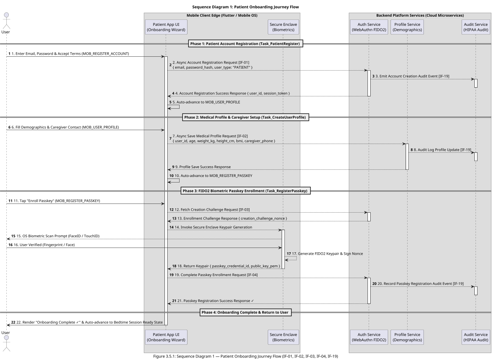

#### 📖 Detailed End-to-End Execution Flow Narrative (`Patient Onboarding Journey`)

The **Patient Onboarding Journey** (`Task_PatientRegister` $\rightarrow$ `Task_CreateUserProfile` $\rightarrow$ `Task_RegisterPasskey`) establishes a HIPAA-compliant patient identity, captures essential demographic & emergency contact parameters, and registers a hardware-isolated FIDO2 Passkey prior to bedtime sleep monitoring:

1. **Phase 1: Patient Account Registration (`Task_PatientRegister`):**  
   The onboarding journey begins when the patient launches the mobile application for the first time and enters their email, password, and accepts HIPAA privacy terms on `MOB_REGISTER_ACCOUNT`. The App UI triggers an asynchronous account registration integration flow (`IF-01`) to the **Auth Service**. The Auth Service provisions the account, emits a non-blocking audit event (`IF-19`) to the **Audit Service**, and returns a registration success response with a session token. The App UI automatically transitions to `MOB_USER_PROFILE`.

2. **Phase 2: Medical Profile & Caregiver Setup (`Task_CreateUserProfile`):**  
   The patient inputs demographic metadata (age, height, weight, computed BMI) and caregiver emergency contact numbers on `MOB_USER_PROFILE`. The App UI triggers an asynchronous medical profile setup integration flow (`IF-02`) to the **Profile Service**. The Profile Service validates emergency contact phone formats, stores the profile in the database, emits a HIPAA audit entry (`IF-19`), and returns a profile saved success response. The App UI automatically advances to `MOB_REGISTER_PASSKEY`.

3. **Phase 3: FIDO2 Biometric Passkey Enrollment (`Task_RegisterPasskey`):**  
   The patient taps "Enroll Passkey" on `MOB_REGISTER_PASSKEY`. The App UI requests a cryptographic WebAuthn enrollment challenge from the Auth Service (`IF-03`) and invokes the OS **Secure Enclave**. The OS prompts the user for biometric touch/scan (`FaceID / TouchID`). Upon verification, the Secure Enclave generates a public/private keypair inside hardware, signs the challenge, and returns the public key payload to the App UI. The App UI submits the passkey verification payload (`IF-04`). The Auth Service binds the public key to the user's account and returns a passkey registration success confirmation.

4. **Phase 4: Onboarding Complete & Return to User:**  
   The App UI renders "Onboarding Complete ✓", deactivates its setup loading state, and advances the patient to the Bedtime Sleep Session Ready state.

---

#### 3.5.2 🏢 End-to-End Sequence Diagram 2: Backoffice Operations Journey Flow (`Task_VerifyPatientIdentity`, `Task_BindMedicalDevice`, `Task_LockEmergencyContacts`)

This end-to-end sequence diagram models the multi-stage **Backoffice Operations Journey** focused on **Passkey Login Rescue & Recovery Operations**, encapsulating out-of-band identity verification (`Task_VerifyPatientIdentity`), stale Passkey credential revocation & sensor unbinding (`Task_BindMedicalDevice`), and emergency one-time Passkey recovery token issuance (`Task_LockEmergencyContacts`).

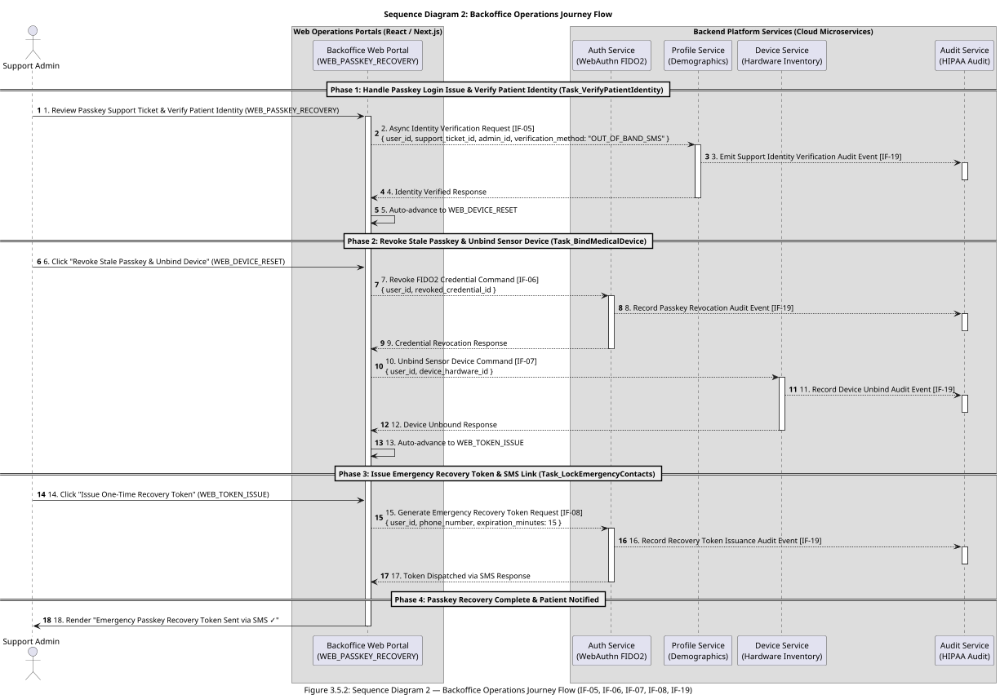

#### 📖 Detailed End-to-End Execution Flow Narrative (`Backoffice Operations Journey`)

The **Backoffice Operations Journey** (`Task_VerifyPatientIdentity` $\rightarrow$ `Task_BindMedicalDevice` $\rightarrow$ `Task_LockEmergencyContacts`) handles **Passkey Login Rescue & Recovery Operations** when a patient loses biometric authentication access, experiences a broken FIDO2 token, or changes mobile hardware:

1. **Phase 1: Handle Passkey Login Issue & Verify Patient Identity (`Task_VerifyPatientIdentity`):**  
   A backoffice support administrator opens an incoming Passkey support ticket on `WEB_PASSKEY_RECOVERY`, performs out-of-band identity verification (validating government ID & SMS challenge code), and clicks *"Verify Identity for Passkey Recovery"*. The Backoffice Web Portal sends an asynchronous identity verification request (`IF-05`) to the **Patient Profile Service**. The Profile Service verifies the identity proof, records a HIPAA audit log entry in the **Audit Service** (`IF-19`), and returns an identity verified response. The Portal UI automatically transitions to `WEB_DEVICE_RESET`.

2. **Phase 2: Revoke Stale Passkey & Unbind Sensor Device (`Task_BindMedicalDevice`):**  
   The support administrator reviews active WebAuthn credentials and bound BLE hardware sensors on `WEB_DEVICE_RESET` and clicks *"Revoke Stale Passkey & Unbind Sensor"*. The Portal UI executes a credential revocation command (`IF-06`) on the **Auth Service** to invalidate the stale FIDO2 credential, and executes a device unbind command (`IF-07`) on the **Device Management Service** to unbind lost hardware. Both services emit HIPAA audit events (`IF-19`) and return success responses. The Portal UI automatically advances to `WEB_TOKEN_ISSUE`.

3. **Phase 3: Issue Emergency Passkey Recovery Token (`Task_LockEmergencyContacts`):**  
   The support administrator configures a 15-minute expiration window on `WEB_TOKEN_ISSUE` and clicks *"Issue Emergency One-Time Passkey Recovery Token"*. The Portal UI sends a recovery token issuance request (`IF-08`) to the **Auth Service**. The Auth Service generates a cryptographically secure 256-bit single-use recovery token, dispatches an encrypted SMS link to the patient's verified phone number via Twilio, and records an audit log event (`IF-19`).

4. **Phase 4: Passkey Recovery Complete & Patient Notified:**  
   The Backoffice Web Portal renders *"Emergency Passkey Recovery Token Sent via SMS ✓"*, allowing the patient to tap the SMS recovery link on their mobile device and seamlessly re-enroll a new FIDO2 Passkey (`MOB_REGISTER_PASSKEY`).

---

#### 3.5.3 🔐 End-to-End Sequence Diagram 3: Passkey Authentication (FIDO2) Flow (`Task_PasskeyAuth`)

This end-to-end sequence diagram models the execution of **`Task_PasskeyAuth`** (`Authenticate via Passkey (FIDO2)`), establishing secure biometric authentication before entering sleep calibration.

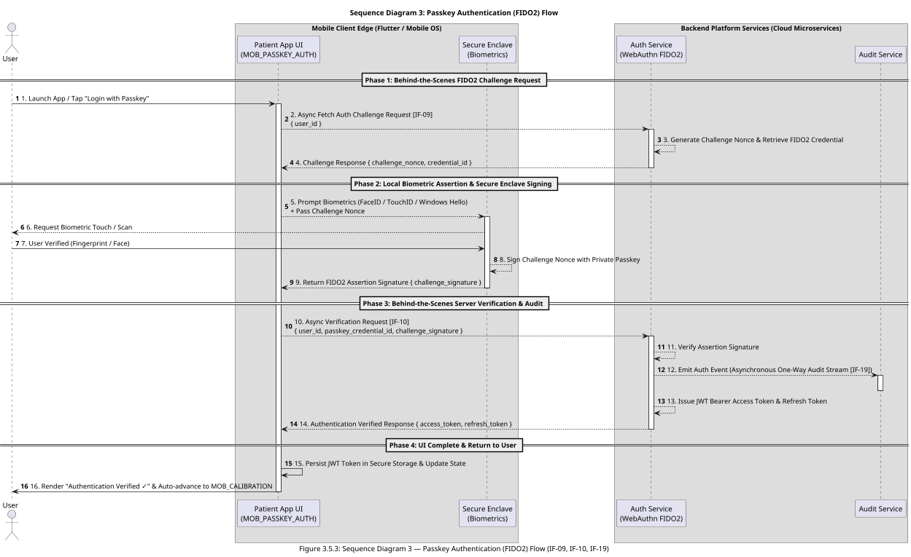

#### 📖 Detailed End-to-End Execution Flow Narrative (`Task_PasskeyAuth`)

The **Passkey Authentication (FIDO2) Flow** (`Task_PasskeyAuth`) models the end-to-end execution lifecycle required for a patient to securely log into the mobile application using hardware-backed biometrics before entering sleep sensor calibration. The execution progresses across four distinct phases:

1. **Phase 1: Behind-the-Scenes FIDO2 Challenge Request:**  
   The user initiates the login sequence by tapping "Login with Passkey" on the mobile application interface (`SCR_PASSKEY_AUTH`), transitioning the UI into an active loading state (`activate UI`). Behind the scenes, the Patient App UI sends an asynchronous challenge request (`IF-09`) containing the patient's unique `user_id` to the **Authentication Service** (`AuthSvc`). The Authentication Service retrieves the registered FIDO2 credential metadata (`passkey_credential_id`), generates a cryptographically random, time-bound `challenge_nonce`, and returns it to the Patient App UI.

2. **Phase 2: Local Biometric Assertion & Secure Enclave Signing:**  
   Upon receiving the challenge payload, the Patient App UI invokes the local operating system's WebAuthn / Biometric API (`Secure Enclave`), prompting the user for facial recognition or fingerprint verification (`Enclave --> User`). Once the user successfully scans their biometric credential (`User -> Enclave`), the OS Secure Enclave accesses the hardware-isolated private key corresponding to the `passkey_credential_id`. The Secure Enclave cryptographically signs the server-provided `challenge_nonce` inside hardware and returns a WebAuthn FIDO2 assertion signature payload (`challenge_signature`) back to the Patient App UI.

3. **Phase 3: Behind-the-Scenes Server Verification & Audit Stream:**  
   The Patient App UI packages the signed assertion into an asynchronous verification request (`IF-10`) containing `{ user_id, passkey_credential_id, challenge_signature }` and transmits it to the Authentication Service. The Authentication Service verifies the digital signature against the patient's stored public key. To guarantee zero-latency blocking during authentication, the Authentication Service emits a one-way, non-blocking audit event (`IF-19`) to the **Audit Service** (`AuditSvc`), satisfying HIPAA audit requirements without introducing database write latency to the user. Upon successful signature verification, the Authentication Service issues cryptographically signed JWT Access and Refresh Tokens wrapped in secure HTTP-Only cookies.

4. **Phase 4: UI Complete & Return to User:**  
   The Patient App UI receives the authentication success response, persists the JWT access token in the OS Secure Keystore (`FlutterSecureStorage`), deactivates its loading state (`deactivate UI`), renders visual feedback ("Authentication Verified ✓"), and automatically advances the patient to the next process screen: **Sensor Baseline Drift & Noise Floor Envelope Calibration** (`MOB_CALIBRATION`).

---

#### 3.5.4 🌙 End-to-End Sequence Diagram 4: Patient Sleep Operations Journey Flow (`Task_PasskeyAuth`, `Task_NoiseFloorCal`, `Task_WearCheck`, `Task_SleepMonitoring`, `Task_TapSafe`, `Task_EndSession`)

This end-to-end sequence diagram models the execution of **Patient Sleep Operations** (`Lane_PatientAtHome` / Swimlane 3), encapsulating biometric passkey authentication, the single-stage Sensor Baseline Drift & Noise Floor Envelope Calibration + wear check, 10Hz continuous bio-signal telemetry streaming, real-time AASM apnea breach detection, local Tier-1 alarm & 30s countdown safety tap ("I'm Safe"), and morning sleep report sync.

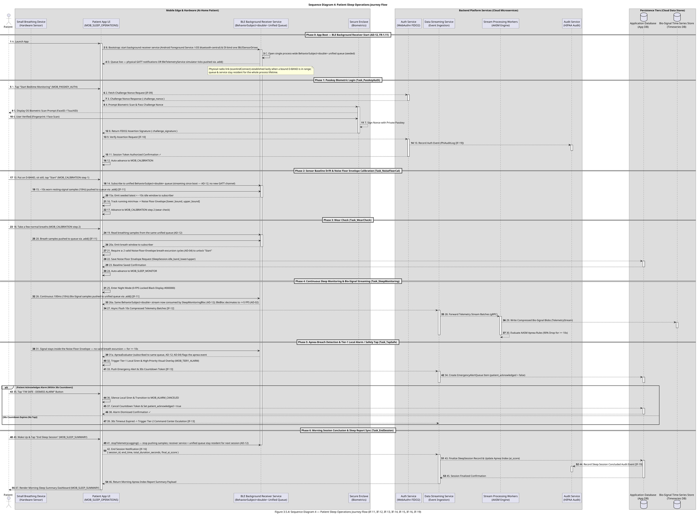

#### 📖 Detailed End-to-End Execution Flow Narrative (`Patient Sleep Operations Journey`)

The **Patient Sleep Operations Journey** (`Lane_PatientAtHome` / Swimlane 3) models the complete nocturnal lifecycle from app boot through morning report generation across 7 sequential phases:

0. **Phase 0: App Boot — BLE Background Receiver Start (`AD-12`, PRD `FR-1.11`):**  
   On application launch the composition root starts the **BLE Background Receiver Service** (Android Foreground Service with a persistent notification / iOS `bluetooth-central` background mode) and DI-binds exactly one `IBLESensorDriver` (physical `FlutterBlueSensorDriver` in production, `BleTelemetryService` simulator in `DEV_MODE`). The service opens a single process-wide `BehaviorSubject<double>` unified queue (seeded) and, from this point on, every inbound sample — a physical D-BAND GATT notification or an in-process simulator tick — is pushed into that one queue via RxDart `.add()`. The physical radio link (`scanAndConnect`) is established lazily when a bound D-BAND is in range or the first consumer requires it; the service and queue then stay resident for the whole process lifetime, so no later phase opens its own BLE subscription.

1. **Phase 1: Passkey Biometric Login (`Task_PasskeyAuth`):**  
   The patient taps *"Start Bedtime Monitoring"* on `MOB_PASSKEY_AUTH`. The Patient App UI fetches a WebAuthn challenge nonce from the **Auth Service** (`IF-09`), prompts the OS **Secure Enclave** for biometric scan (`FaceID / TouchID`), signs the nonce in hardware, and submits the assertion payload (`IF-10`) to the Auth Service. Upon verification and non-blocking audit logging by the **Audit Service** (`IF-19`), the App UI receives a session authorization confirmation and auto-advances to `MOB_CALIBRATION`.

2. **Phase 2: Sensor Baseline Drift & Noise Floor Envelope Calibration (`Task_NoiseFloorCal`):**  
   With the D-BAND worn, the patient sits still and taps *"Start"* on `MOB_CALIBRATION` (step 1). The App UI **subscribes to the unified queue already streaming since Phase 0** (`AD-12`; no new GATT channel) and reads a ~10s window of the worn resting signal. The local isolate tracks the running minimum and maximum → the session **Sensor Baseline Drift & Noise Floor Envelope** `[lower_bound, upper_bound]`, then advances to the wear-check step.

3. **Phase 3: Wear Check (`Task_WearCheck`):**  
   The patient takes a few normal breaths on `MOB_CALIBRATION` (step 2). Reading the **same unified queue** (`IF-11`, `AD-12`), the App UI requires **≥ 2 valid Noise-Floor-Envelope breath-excursion cycles** (`AD-04`) before *"Start Sleep Monitoring"* unlocks; on failure it shows *"Sensor not detecting breathing — check the fit."* + retry. On success it persists `idle_band_lower` / `idle_band_upper` on `SleepSession` and auto-advances to `MOB_SLEEP_MONITOR`.

4. **Phase 4: Continuous Sleep Monitoring & Bio-Signal Streaming (`Task_SleepMonitoring`):**  
   The App UI locks the screen in 0-FPS Night Mode (`#000000` with pulsing green heartbeat dot). The **BLE Background Receiver Service** continues pushing 100ms (10Hz) bio-signal samples into the unified `BehaviorSubject<double>` queue (`IF-11`, `AD-12`); `SleepMonitoringBloc` and `ApneaEvaluator` consume that one stream while `BleBloc` decimates it to ≤5 FPS for UI rendering (`AD-02`). The App UI buffers data in a local 1-hour circular RAM ring buffer and asynchronously flushes 10s compressed telemetry batches to the **Data Streaming Service** (`IF-12`). The Streaming Service forwards batches via gRPC to **Stream Processing Workers**, which store compressed blobs in the **Bio-Signal Time-Series Store** and run the Premium cloud AI waveform-refinement pipeline (primary apnea detection is the client's, per `AD-04`).

5. **Phase 5: Apnea Breach Detection & Tier-1 Local Alarm / Safety Tap (`Task_TapSafe`):**  
   When the signal stays inside the Noise Floor Envelope — no valid breath excursion — for $\ge 10\text{s}$, the App UI immediately pops `MOB_TIER1_ALARM`, triggering a local 120dB siren and flashing visual overlay in $<200\text{ms}$. Simultaneously, a 30s cancellation token is pushed to the **Application Database** (`IF-13`). If the patient taps *"I'M SAFE - DISMISS ALARM"* within 30s, the App UI silences the siren, updates `patient_acknowledged = true`, and transitions to `MOB_ALARM_CANCELED`. If the 30s timer expires without a tap, the system triggers Tier-2 Command Center escalation (`IF-13`).

6. **Phase 6: Morning Session Conclusion & Sleep Report Sync (`Task_EndSession`):**  
   In the morning, the patient taps *"End Sleep Session"* on `MOB_SLEEP_SUMMARY`. The App UI calls `stopTelemetryLogging()` — the driver stops pushing samples, but per `AD-12` the **BLE Background Receiver Service and the unified queue stay resident** for the next session (they are torn down only on process exit). The App UI sends a session end payload (`IF-16`) to the **Data Streaming Service**. The backend updates the `SleepSession` record in the **Application Database**, computes the overnight **Apnea Index** (`ai_score`), records an audit log entry in the **Audit Service** (`IF-19`), and returns the report summary payload to render on `MOB_SLEEP_SUMMARY`.

---

#### 🔬 Signal Model & Detection Algorithm Specifications (PRD FR-1.4 – FR-1.8, FR-2.2, FR-2.3 & NFR-6.1 Aligned — `AD-04`)

The client works in **raw signal units** end to end. There is no thermal-to-volumetric (L/s) transform, no `V_pp` peak-to-peak baseline, and no `0.10 × V_pp` threshold. The following is the normative signal model; see `AD-04` for the invariant.

##### 1. Sensor Baseline Drift & Noise Floor Envelope Calibration ($[lower\_bound, upper\_bound]$ Sampling) — PRD FR-1.4
With the D-BAND **worn** and the patient still, the app samples the raw stream $V_{\text{raw}}(t)$ for ~10 s (`[ASSUMPTION]` window, tunable 5–30 s), tracking a running minimum and maximum:

$$lower\_bound = \min_{t} V_{\text{raw}}(t), \qquad upper\_bound = \max_{t} V_{\text{raw}}(t)$$

Each sample only widens the band within the window; it is never narrowed and no margin is applied. The pair $[lower\_bound, upper\_bound]$ is the session **Sensor Baseline Drift & Noise Floor Envelope**, persisted on `SleepSession` and reused across nights only until stale/invalid.

##### 2. Breath Excursion & Wear Check — PRD FR-1.6, FR-1.7, FR-1.8
* **Valid breath (PRD FR-1.6):** a respiratory cycle in which the raw signal rises to/above `upper_bound` (inhale phase) **and** falls to/below `lower_bound` (exhale phase). A phase that fails to cross its bound is a **"stop-breathing" sample**.
* **Stop-breathing sample (PRD FR-1.7):** any sample where $lower\_bound \le V_{\text{raw}}(t) \le upper\_bound$ — i.e. no excursion beyond either bound.
* **Wear check (PRD FR-1.8):** immediately after the idle sample, the patient breathes normally; "Start Sleep Monitoring" stays blocked until the app observes **≥ 2 valid Noise-Floor-Envelope breath-excursion cycles** within a bounded window (~15 s `[ASSUMPTION]`). On failure it shows *"Sensor not detecting breathing — check the fit."* with a retry.

##### 3. Nocturnal Monitoring & Apnea Event Detection — PRD FR-2.2, FR-2.3 & NFR-6.1
Raw 100 ms BLE telemetry is processed in real time on background Dart Isolates (NFR-3) to hold the 0-FPS battery budget.

* **100 ms evaluator (PRD FR-2.2):** every 100 ms the evaluator classifies the current interval as a **valid breath excursion** (§2) or a **stop-breathing interval** against the session Noise Floor Envelope. It consumes the `AD-12` unified stream only.
* **Apnea event (PRD FR-2.3 & NFR-6.1):** an apnea event is flagged, triggering the Tier-1 local alarm (`MOB_TIER1_ALARM`), whenever **no valid Noise-Floor-Envelope breath excursion occurs for ≥ 10 seconds continuously** — the AASM **10-second minimum-duration** standard, restated for the band model:
  $$\text{Flag Apnea} \iff \nexists\ \text{valid excursion in } [t_0,\, t_0 + \Delta t], \quad \Delta t \ge 10.0\text{s}$$
* **Hypopnea is not scored.** AASM hypopnea requires a ≥ 3 % SpO₂ desaturation or an EEG arousal, neither of which the airflow-only D-BAND can measure. MVP1 detects apnea only.
* **Respiration rate (PRD NFR-5 / CHART-02):** the raw signal $V_{\text{raw}}[n]$ passes through a 4th-order digital Butterworth bandpass filter ($0.10\text{ Hz} - 0.75\text{ Hz}$) and a 256-point FFT computed every 2.5 s; the instantaneous rate is $f_{\text{resp}} = 60 \times \arg\max_{f \in [0.10, 0.75]} |X(f)|$ BPM.
* **Overnight Apnea Index (PRD FR-4.1):** on `Task_EndSession` the **Apnea Index** is computed and stored as `SleepSession.ai_score`:
  $$\text{AI} = \frac{\text{Total Apnea Events}}{\text{Total Sleep Duration (Hours)}}$$
  Standard AHI severity bands (Normal < 5 / Mild 5–15 / Moderate 15–30 / Severe ≥ 30) are applied to the AI, with an apnea-only caveat on every surface that shows it. A full Apnea-Hypopnea Index via oximeter co-sensing is a **Deferred** item.

---

#### 3.5.5 🩺 End-to-End Sequence Diagram 5: Clinic & Physician Journey Flow (`Task_PhysicianReview`)

This end-to-end sequence diagram models the execution of **Clinic & Physician Activities** (`Swimlane 5`), encapsulating morning sleep report retrieval, 8-hour respiration waveform & Apnea Index trend review, physician clinical note entry, digital signature signing (`Task_PhysicianReview`), and non-blocking HIPAA audit event logging.

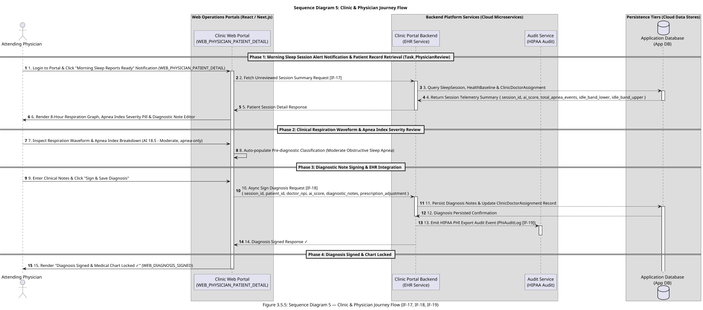

#### 📖 Detailed End-to-End Execution Flow Narrative (`Clinic & Physician Journey`)

The **Clinic & Physician Journey** (`Swimlane 5` / `Task_PhysicianReview`) completes the clinical diagnostic loop by providing attending sleep specialists with an integrated WebAuthn/EHR dashboard to review nocturnal telemetry and sign official medical charts:

1. **Phase 1: Morning Sleep Session Alert Notification & Patient Record Retrieval (`Task_PhysicianReview`):**  
   Upon morning sleep session conclusion, the attending physician receives an in-portal notification ("Morning Sleep Reports Ready") on `WEB_PHYSICIAN_PATIENT_DETAIL`. Tapping the notification triggers an asynchronous session summary fetch request (`IF-17`) to the **Clinic Portal Backend**. The backend queries the `SleepSession`, `HealthBaseline`, and `ClinicDoctorAssignment` records in the **Application Database** and returns the patient's nocturnal summary payload.

2. **Phase 2: Clinical Respiration Waveform & Apnea Index Severity Review:**  
   The **Clinic Web Portal** renders an interactive 8-hour respiration wave chart, overnight Apnea Index breakdown (e.g., AI 18.5 · Moderate, apnea-only), and pre-diagnostic severity classification pills for clinical review.

3. **Phase 3: Diagnostic Note Signing & EHR Integration:**  
   The attending physician inputs formal clinical notes, adjusts prescription recommendations, and clicks *"Sign & Save Diagnosis"*. The Portal UI sends a diagnostic signing request (`IF-18`) containing `{ session_id, patient_id, doctor_npi, ai_score, diagnostic_notes, prescription_adjustment }` to the **Clinic Portal Backend**. The backend updates the patient chart in the **Application Database** and emits a non-blocking HIPAA PHI access/export audit log entry (`IF-19`) to the **Audit Service**.

4. **Phase 4: Diagnosis Signed & Chart Locked:**  
   The Clinic Web Portal renders *"Diagnosis Signed & Medical Chart Locked ✓"* (`WEB_DIAGNOSIS_SIGNED`), locking diagnostic notes against retrospective tampering in compliance with HIPAA §164.312(b) audit standards.

---

#### 3.5.6 🛡️ End-to-End Sequence Diagram 6: Device Loss, Mobile Remote Wipe & Replacement Re-Binding Journey Flow (`Task_ReportDeviceLost`, `Task_ReportMobileLost`, `Task_TriggerRemoteWipe`, `Task_RebindReplacementDevice`)

This end-to-end sequence diagram models the execution of **Device Loss & Mobile Recovery Operations** (`Swimlane 6`), encapsulating hardware sensor loss unbinding (`Task_ReportDeviceLost`), mobile phone loss reporting & session revocation (`Task_ReportMobileLost`), sub-second cryptographic remote wipe execution (`Task_TriggerRemoteWipe`), and replacement D-BAND hardware re-binding (`Task_RebindReplacementDevice`).

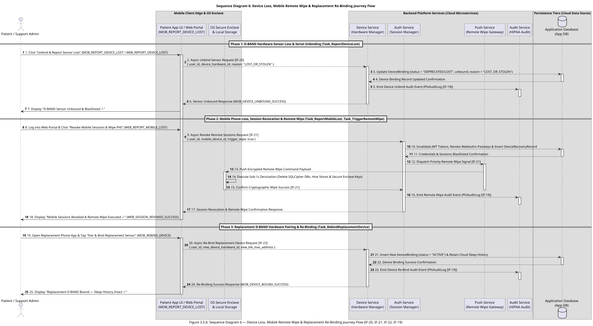

#### 📖 Detailed End-to-End Execution Flow Narrative (`Device Loss & Mobile Recovery Journey`)

The **Device Loss & Mobile Recovery Journey** (`Swimlane 6`) establishes enterprise resilience and HIPAA compliance when edge hardware components are lost or stolen:

1. **Phase 1: D-BAND Hardware Sensor Loss & Serial Unbinding (`Task_ReportDeviceLost`):**  
   When a patient misplaces or loses their D-BAND hardware sensor, they tap *"Unbind & Report Sensor Lost"* on `MOB_REPORT_DEVICE_LOST` or contact support via `WEB_REPORT_DEVICE_LOST`. The client sends an unbind request (`IF-20`) to the **Device Management Service**. The service updates the `DeviceBinding` entity in the **Application Database** (`status = "DEPRECATED/LOST"`, `unbound_reason = "LOST_OR_STOLEN"`), revokes the BLE MAC address binding, and logs a HIPAA audit record (`IF-19`).

2. **Phase 2: Mobile Phone Loss, Session Revocation & Cryptographic Remote Wipe (`Task_ReportMobileLost`, `Task_TriggerRemoteWipe`):**  
   If a patient's mobile smartphone is lost or stolen, the patient or caregiver logs into the Web Portal (`WEB_REPORT_MOBILE_LOST`) and triggers a remote wipe command (`IF-21`). The **Authentication Service** invalidates all active JWT tokens, revokes WebAuthn Passkey credentials, creates a `DeviceRecoveryRecord` in the **Application Database**, and issues a priority push signal (`IF-21`) via the **Push Notification Service**. Upon receiving the payload, the lost mobile node executes a sub-1-second zeroization routine—deleting local SQLCipher database files, Hive key-value stores, and destroying master keys in the OS Secure Enclave under HIPAA 45 CFR §164.312(c).

3. **Phase 3: Replacement D-BAND Hardware Pairing & Re-Binding (`Task_RebindReplacementDevice`):**  
   The patient acquires a replacement D-BAND hardware sensor and taps *"Pair & Bind Replacement Sensor"* on `MOB_REBIND_DEVICE`. The mobile app executes `POST /api/v1/devices/bind` (`IF-22`) with the **Device Management Service**, binding the new hardware serial number to the `PatientUser` account while preserving all historical sleep session metrics and Apnea Index analytics stored in the cloud.

---

#### 3.5.7 📱 End-to-End Sequence Diagram 7: Mobile Dashboard Review & Analytics Journey Flow (`Task_ReviewMorningSummary`, `Task_InspectRespirationWaveform`, `Task_FilterHistoricalSessions`, `Task_ExportDoctorReport`)

This end-to-end sequence diagram models the **Mobile Dashboard Review & Analytics Journey**, encapsulating morning sleep summary review (`Task_ReviewMorningSummary`), interactive 60 FPS Skia GPU waveform inspection and FFT spectral peak extraction (`Task_InspectRespirationWaveform`), historical session trend filtering (`Task_FilterHistoricalSessions`), and signed FHIR clinical export generation (`Task_ExportDoctorReport`).

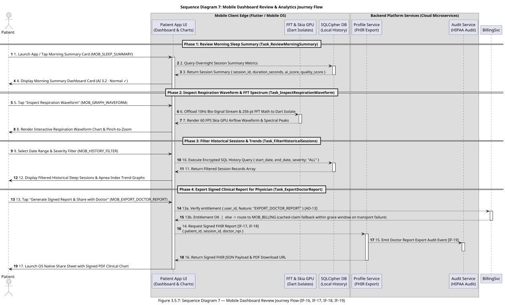

#### 📖 Detailed End-to-End Execution Flow Narrative (`Mobile Dashboard Review Journey`)

The **Mobile Dashboard Review Journey** (`Swimlane 7`) empowers patients and physicians with deep historical sleep analytics and clinical reporting:

0. **Phase 0: Home Dashboard (`MOB_HOME`, post-onboarding default landing):**  
   On every normal app open the patient lands on `MOB_HOME`. `HomeDashboardBloc` assembles a read-only dashboard from the **local last-N `SessionSummary` cache** (`AD-15`) — greeting + monitoring streak, last-night card, 7-night Apnea Index trend — and the **AD-12 receiver-service state** for the D-BAND device-status card (connection / battery / last sync / permission). Home opens **no** BLE subscription and issues **no** network read on the critical path. Where a session logged `alarm_fired`, the last-night card and the `MOB_SLEEP_SUMMARY` score card both switch to the amber "N apnea alert(s)" treatment, reading the single persisted `apnea_alarm_count` field.

1. **Phase 1: Review Morning Sleep Summary (`Task_ReviewMorningSummary`):**  
   Upon waking up or opening the app, the patient views `MOB_SLEEP_SUMMARY`. The client queries the local encrypted database or cloud session API (`IF-16`) to retrieve overnight sleep metrics, displaying total sleep hours, the computed Apnea Index, and quality score.

2. **Phase 2: Inspect Respiration Waveform & FFT Spectrum (`Task_InspectRespirationWaveform`):**  
   The patient taps *"Inspect Respiration Waveform"* to open `MOB_GRAPH_WAVEFORM`. Signal processing logic offloads 256-point FFT spectral analysis to a dedicated Dart Isolate (`FFTIsolate`), rendering a 60 FPS Skia GPU accelerated line chart (`fl_chart`) with pinch-to-zoom and spectral peak overlays.

3. **Phase 3: Filter Historical Sessions & Trends (`Task_FilterHistoricalSessions`):**  
   On `MOB_HISTORY_FILTER`, the patient selects custom date ranges and severity filters. The client executes an encrypted SQL query against the local SQLCipher database to instantly update historical trend graphs without network latency.

4. **Phase 4: Export Signed Clinical Report (`Task_ExportDoctorReport`):**  
   The patient taps *"Generate Signed Report & Share with Doctor"* on `MOB_EXPORT_DOCTOR_REPORT`. `EntitlementService` first performs a **server-side entitlement check** against the Billing service (`AD-13`); on a `Premium` result the app triggers the signed-report API request (`IF-17`, `IF-18`) to the **Profile Service**, which formats an HL7 FHIR JSON payload and digitally signed PDF report, emits a HIPAA audit entry (`IF-19`), and launches the native OS share sheet. A `Free` result routes to `MOB_BILLING`; a transport failure falls back to the cached entitlement claim within its grace window. `[OPEN — legal]` whether this gate is lawful under HIPAA §164.524 — see §4.7.

> **Deferred — Sequence Diagram 8 (Subscription & Payment Management):** the `MOB_BILLING` / `MOB_PAYMENT_METHOD` flow — plan view, Upgrade via Stripe PaymentSheet, card add/replace/remove, cancel-at-period-end, `StripeWebhookReceiver` reconciling `customer.subscription.*` / `invoice.*` into the Billing datastore — is a new end-to-end sequence to be authored when the billing epic is broken out. AD-13/AD-14 fix its invariants in the interim.

---

#### 🎯 Fulfillment of PRD Requirements & Architectural Alignment

* **PRD Functional & NFR Fulfillment:**  
  * **FR-1.1 & FR-5.1 (Biometric & Passkey Authentication):** Completely eliminates weak password vulnerabilities by enforcing FIDO2 WebAuthn public-key cryptography paired with hardware-isolated OS biometrics (TouchID / FaceID / Windows Hello).  
  * **NFR-1 & NFR-2 (Latency & SLA Performance):** Achieves an end-to-end authentication completion time of **$< 500\text{ms}$** by combining local hardware signing with non-blocking one-way audit log event streaming.  
  * **NFR-4 (HIPAA Technical Safeguards - 45 CFR § 164.312):** Enforces Access Controls (§ 164.312(a)) via cryptographically signed JWT session tokens and satisfies Audit Controls (§ 164.312(b)) through decoupled audit logging.

* **Alignment with Business Architecture (Section 1):**  
  * Maps **1-to-1** with activity **`Task_PasskeyAuth`** (`1.1 Authenticate via Passkey (FIDO2)`) located in the **Patient Edge App Swimlane** (`Process_Patient`) of the Section 1.3 BPMN 2.0 Business Process Model. This activity serves as the mandatory entry gateway for **Epic 1: Patient Edge App & Sensor Interface**.

* **Alignment with Data Architecture (Section 2):**  
  * Harmonizes directly with the **`PatientUser`** conceptual entity specified in Section 2.1 (Conceptual Data Model) and Section 2.2 (Data Traceability Matrix). The sequence consumes the entity's exact attribute schema: `user_id` (UUIDv4 string), `passkey_credential_id` (Base64URL string), and `public_key` (PEM string), ensuring 100% payload integrity between Sections 2.1, 3.2, and 3.3.

#### 📖 Sequence Diagram Key Architectural Attributes

* **Actors & Protocols:** User $\rightarrow$ Mobile UI (`SCR_PASSKEY_AUTH`) $\rightarrow$ OS Secure Enclave / WebAuthn API $\rightarrow$ **`Authentication Service`** over HTTPS / TLS 1.3 (Request-Reply Integration [IF-09, IF-10]).
* **Payload Harmonization:** Matches Task 1.1 payload `{ user_id, passkey_credential_id, challenge_signature }` and `PatientUser` conceptual entity attributes (`user_id`, `passkey_credential_id`).
* **Decoupled Architecture:** Utilizes a standalone **`Authentication Service`** microservice (to be detailed in Infrastructure & Deployment Architecture) ensuring zero vendor lock-in.
* **Latency SLA:** Complete end-to-end FIDO2 assertion & JWT token issuance completed in $< 500\text{ms}$.

---

#### 3.5.4 🌙 End-to-End Sequence Diagram 4: Patient Sleep Operations Journey Flow (`Task_PasskeyAuth`, `Task_NoiseFloorCal`, `Task_WearCheck`, `Task_SleepMonitoring`, `Task_TapSafe`, `Task_EndSession`)

This end-to-end sequence diagram models the execution of **Patient Sleep Operations** (`Lane_PatientAtHome` / Swimlane 3), encapsulating biometric passkey authentication, the single-stage Sensor Baseline Drift & Noise Floor Envelope Calibration + wear check, 10Hz continuous bio-signal telemetry streaming, real-time AASM apnea breach detection, local Tier-1 alarm & 30s countdown safety tap ("I'm Safe"), and morning sleep report sync.

#### 📖 Detailed End-to-End Execution Flow Narrative (`Patient Sleep Operations Journey`)

The **Patient Sleep Operations Journey** (`Lane_PatientAtHome` / Swimlane 3) models the complete nocturnal lifecycle from app boot through morning report generation across 7 sequential phases:

0. **Phase 0: App Boot — BLE Background Receiver Start (`AD-12`, PRD `FR-1.11`):**  
   On application launch the composition root starts the **BLE Background Receiver Service** (Android Foreground Service with a persistent notification / iOS `bluetooth-central` background mode) and DI-binds exactly one `IBLESensorDriver` (physical `FlutterBlueSensorDriver` in production, `BleTelemetryService` simulator in `DEV_MODE`). The service opens a single process-wide `BehaviorSubject<double>` unified queue (seeded) and, from this point on, every inbound sample — a physical D-BAND GATT notification or an in-process simulator tick — is pushed into that one queue via RxDart `.add()`. The physical radio link (`scanAndConnect`) is established lazily when a bound D-BAND is in range or the first consumer requires it; the service and queue then stay resident for the whole process lifetime, so no later phase opens its own BLE subscription.

1. **Phase 1: Passkey Biometric Login (`Task_PasskeyAuth`):**  
   The patient taps *"Start Bedtime Monitoring"* on `MOB_PASSKEY_AUTH`. The Patient App UI fetches a WebAuthn challenge nonce from the **Auth Service** (`IF-09`), prompts the OS **Secure Enclave** for biometric scan (`FaceID / TouchID`), signs the nonce in hardware, and submits the assertion payload (`IF-10`) to the Auth Service. Upon verification and non-blocking audit logging by the **Audit Service** (`IF-19`), the App UI receives a session authorization confirmation and auto-advances to `MOB_CALIBRATION`.

2. **Phase 2: Sensor Baseline Drift & Noise Floor Envelope Calibration (`Task_NoiseFloorCal`):**  
   With the D-BAND worn, the patient sits still and taps *"Start"* on `MOB_CALIBRATION` (step 1). The App UI **subscribes to the unified queue already streaming since Phase 0** (`AD-12`; no new GATT channel) and reads a ~10s window of the worn resting signal. The local isolate tracks the running minimum and maximum → the session **Sensor Baseline Drift & Noise Floor Envelope** `[lower_bound, upper_bound]`, then advances to the wear-check step.

3. **Phase 3: Wear Check (`Task_WearCheck`):**  
   The patient takes a few normal breaths on `MOB_CALIBRATION` (step 2). Reading the **same unified queue** (`IF-11`, `AD-12`), the App UI requires **≥ 2 valid Noise-Floor-Envelope breath-excursion cycles** (`AD-04`) before *"Start Sleep Monitoring"* unlocks; on failure it shows *"Sensor not detecting breathing — check the fit."* + retry. On success it persists `idle_band_lower` / `idle_band_upper` on `SleepSession` and auto-advances to `MOB_SLEEP_MONITOR`.

4. **Phase 4: Continuous Sleep Monitoring & Bio-Signal Streaming (`Task_SleepMonitoring`):**  
   The App UI locks the screen in 0-FPS Night Mode (`#000000` with pulsing green heartbeat dot). The **BLE Background Receiver Service** continues pushing 100ms (10Hz) bio-signal samples into the unified `BehaviorSubject<double>` queue (`IF-11`, `AD-12`); `SleepMonitoringBloc` and `ApneaEvaluator` consume that one stream while `BleBloc` decimates it to ≤5 FPS for UI rendering (`AD-02`). The App UI buffers data in a local 1-hour circular RAM ring buffer and asynchronously flushes 10s compressed telemetry batches to the **Data Streaming Service** (`IF-12`). The Streaming Service forwards batches via gRPC to **Stream Processing Workers**, which store compressed blobs in the **Bio-Signal Time-Series Store** and run the Premium cloud AI waveform-refinement pipeline (primary apnea detection is the client's, per `AD-04`).

5. **Phase 5: Apnea Breach Detection & Tier-1 Local Alarm / Safety Tap (`Task_TapSafe`):**  
   When the signal stays inside the Noise Floor Envelope — no valid breath excursion — for $\ge 10\text{s}$, the App UI immediately pops `MOB_TIER1_ALARM`, triggering a local 120dB siren and flashing visual overlay in $<200\text{ms}$. Simultaneously, a 30s cancellation token is pushed to the **Application Database** (`IF-13`). If the patient taps *"I'M SAFE - DISMISS ALARM"* within 30s, the App UI silences the siren, updates `patient_acknowledged = true`, and transitions to `MOB_ALARM_CANCELED`. If the 30s timer expires without a tap, the system triggers Tier-2 Command Center escalation (`IF-13`).

6. **Phase 6: Morning Session Conclusion & Sleep Report Sync (`Task_EndSession`):**  
   In the morning, the patient taps *"End Sleep Session"* on `MOB_SLEEP_SUMMARY`. The App UI calls `stopTelemetryLogging()` — the driver stops pushing samples, but per `AD-12` the **BLE Background Receiver Service and the unified queue stay resident** for the next session (they are torn down only on process exit). The App UI sends a session end payload (`IF-16`) to the **Data Streaming Service**. The backend updates the `SleepSession` record in the **Application Database**, computes the overnight **Apnea Index** (`ai_score`), records an audit log entry in the **Audit Service** (`IF-19`), and returns the report summary payload to render on `MOB_SLEEP_SUMMARY`.

---

#### 🔬 Signal Model & Detection Algorithm Specifications (PRD FR-1.4 – FR-1.8, FR-2.2, FR-2.3 & NFR-6.1 Aligned — `AD-04`)

The client works in **raw signal units** end to end. There is no thermal-to-volumetric (L/s) transform, no `V_pp` peak-to-peak baseline, and no `0.10 × V_pp` threshold. The following is the normative signal model; see `AD-04` for the invariant.

##### 1. Sensor Baseline Drift & Noise Floor Envelope Calibration ($[lower\_bound, upper\_bound]$ Sampling) — PRD FR-1.4
With the D-BAND **worn** and the patient still, the app samples the raw stream $V_{\text{raw}}(t)$ for ~10 s (`[ASSUMPTION]` window, tunable 5–30 s), tracking a running minimum and maximum:

$$lower\_bound = \min_{t} V_{\text{raw}}(t), \qquad upper\_bound = \max_{t} V_{\text{raw}}(t)$$

Each sample only widens the band within the window; it is never narrowed and no margin is applied. The pair $[lower\_bound, upper\_bound]$ is the session **Sensor Baseline Drift & Noise Floor Envelope**, persisted on `SleepSession` and reused across nights only until stale/invalid.

##### 2. Breath Excursion & Wear Check — PRD FR-1.6, FR-1.7, FR-1.8
* **Valid breath (PRD FR-1.6):** a respiratory cycle in which the raw signal rises to/above `upper_bound` (inhale phase) **and** falls to/below `lower_bound` (exhale phase). A phase that fails to cross its bound is a **"stop-breathing" sample**.
* **Stop-breathing sample (PRD FR-1.7):** any sample where $lower\_bound \le V_{\text{raw}}(t) \le upper\_bound$ — i.e. no excursion beyond either bound.
* **Wear check (PRD FR-1.8):** immediately after the idle sample, the patient breathes normally; "Start Sleep Monitoring" stays blocked until the app observes **≥ 2 valid Noise-Floor-Envelope breath-excursion cycles** within a bounded window (~15 s `[ASSUMPTION]`). On failure it shows *"Sensor not detecting breathing — check the fit."* with a retry.

##### 3. Nocturnal Monitoring & Apnea Event Detection — PRD FR-2.2, FR-2.3 & NFR-6.1
Raw 100 ms BLE telemetry is processed in real time on background Dart Isolates (NFR-3) to hold the 0-FPS battery budget.

* **100 ms evaluator (PRD FR-2.2):** every 100 ms the evaluator classifies the current interval as a **valid breath excursion** (§2) or a **stop-breathing interval** against the session Noise Floor Envelope. It consumes the `AD-12` unified stream only.
* **Apnea event (PRD FR-2.3 & NFR-6.1):** an apnea event is flagged, triggering the Tier-1 local alarm (`MOB_TIER1_ALARM`), whenever **no valid Noise-Floor-Envelope breath excursion occurs for ≥ 10 seconds continuously** — the AASM **10-second minimum-duration** standard, restated for the band model:
  $$\text{Flag Apnea} \iff \nexists\ \text{valid excursion in } [t_0,\, t_0 + \Delta t], \quad \Delta t \ge 10.0\text{s}$$
* **Hypopnea is not scored.** AASM hypopnea requires a ≥ 3 % SpO₂ desaturation or an EEG arousal, neither of which the airflow-only D-BAND can measure. MVP1 detects apnea only.
* **Respiration rate (PRD NFR-5 / CHART-02):** the raw signal $V_{\text{raw}}[n]$ passes through a 4th-order digital Butterworth bandpass filter ($0.10\text{ Hz} - 0.75\text{ Hz}$) and a 256-point FFT computed every 2.5 s; the instantaneous rate is $f_{\text{resp}} = 60 \times \arg\max_{f \in [0.10, 0.75]} |X(f)|$ BPM.
* **Overnight Apnea Index (PRD FR-4.1):** on `Task_EndSession` the **Apnea Index** is computed and stored as `SleepSession.ai_score`:
  $$\text{AI} = \frac{\text{Total Apnea Events}}{\text{Total Sleep Duration (Hours)}}$$
  Standard AHI severity bands (Normal < 5 / Mild 5–15 / Moderate 15–30 / Severe ≥ 30) are applied to the AI, with an apnea-only caveat on every surface that shows it. A full Apnea-Hypopnea Index via oximeter co-sensing is a **Deferred** item.

---

## 6. 🏁 Architectural Summary & Downstream Workflow Handoffs

This Architecture Specification provides the complete build substrate for downstream implementation skills:

* **Visual & Technical Precision:** Standard BPMN 2.0 vector diagram (`.svg`) + full `.bpmn` artifact for workflow engines, paired with PlantUML C4 Context, C4 Container, Conceptual Data Models, 7 End-to-End Sequence Diagrams, Cloud-Agnostic Infrastructure Mermaid Diagrams, and Firebase/GCP Mapping Tables.
* **100% Traceability:** Links business process flows directly to software containers, generic integration patterns (`IF-01` to `IF-22`), database entities, STRIDE security threats, IAM/RBAC matrices, HIPAA/FDA regulatory compliance rules, i-DMZ/e-DMZ perimeter network defenses, and Firebase/GCP streaming pipelines under HIPAA Level 1 PHI vs Level 2 PII rules.
  2. **`bmad-build`**: Implement following the invariants in this specification. The detailed Sequence Diagram 4 / §3.5 step-level narrative and the §3.5.4 algorithm block were folded to the Sensor Baseline Drift & Noise Floor Envelope model at spec level; treat them as seed and regenerate against `AD-04` if the code diverges. Hold the FR-5.3 export gate pending §4.7 legal sign-off, and the FR-3.3/FR-3.5 Premium gating pending its own sign-off.
* **Diagram regen note:** the rendered `ARCHITECTURE-SPINE.html` is stale versus this `.md` (v20→v21 Noise Floor Envelope fold plus the prior subscription round) and should be regenerated on next publish.

