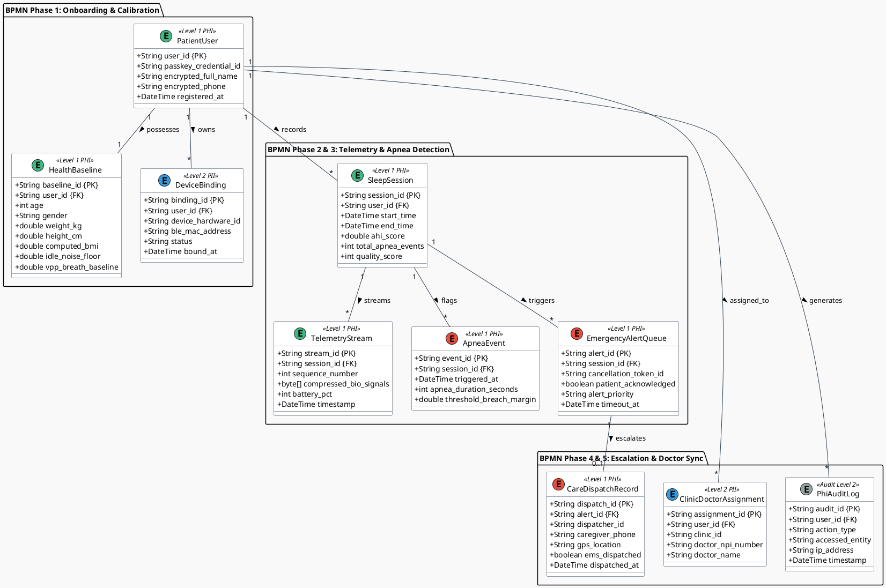
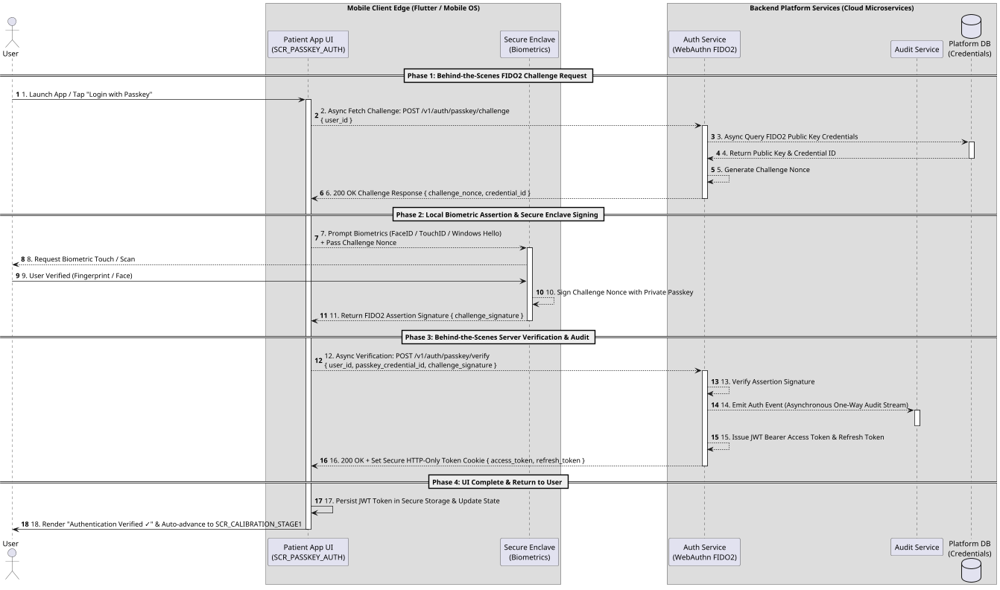

# 🏛️ Enterprise Architecture Specification
## Sleep Apnea Detection App & Emergency Command Platform

> **Diagramming Standard:** Standard **BPMN 2.0 XML (BPMN.js / Camunda compatible)** for Section 2 Process Modeling + **PlantUML** for C4 Context, C4 Container & Conceptual Data Models.  
> **Target Scope:** Global Platform Scaling to Millions of Concurrent Devices  

---

## 1. 🏢 Business & System Architecture

### 1.1 C4 Level 1: System Context Diagram

The System Context diagram establishes the high-level boundary of the **Sleep Apnea Detection System** and defines how external human actors interact with the unified platform.

```plantuml
@startuml C4_Level1_System_Context
!include https://raw.githubusercontent.com/plantuml-stdlib/C4-PlantUML/master/C4_Context.puml

LAYOUT_WITH_LEGEND()

title C4 Level 1: System Context Diagram — Sleep Apnea Detection Platform

Person(patient, "Patient / At-Home User", "Wears small breathing device at home during sleep; authenticates via Passkey.")
Person(caregiver, "Caregiver / Family Member", "Receives Tier-2 emergency SMS/Voice calls when patient apnea alarm is unacknowledged.")
Person(dispatcher, "Emergency Center Dispatcher", "Monitors 24/7 real-time emergency dashboard for unacknowledged 30s apnea alerts.")
Person(doctor, "Attending Physician / Clinic", "Reviews morning AHI scores, respiration wave graphs, and clinical sleep health summaries.")

System(system, "Sleep Apnea Detection System", "Monitors nocturnal breathing airflow, executes 2-stage calibration, triggers Tier-1 local alarms, and dispatches Tier-2 cloud emergency alerts.")

Rel(patient, system, "Interfaces via BLE & Mobile App (Passkey, Calibration, 'I'm Safe' Tap)", "BLE / HTTPS")
Rel(system, caregiver, "Sends Tier-2 Emergency SMS & Voice Alerts", "HTTPS / Telephony")
Rel(system, dispatcher, "Broadcasts Sub-1.5s High-Priority Apnea Alarms", "WSS / WebSockets")
Rel(system, doctor, "Delivers Morning Sleep Summaries & Clinical Reports", "HTTPS / HL7 FHIR")

@enduml
```

#### 📖 Architectural Context & Operational Boundary

* **Patient / At-Home User:** Connects a lightweight hardware differential pressure sensor via Bluetooth Low Energy (BLE). Through the Flutter mobile application, the user authenticates passwordlessly via FIDO2 Passkeys, completes a 2-stage bedtime calibration (idle noise floor + active breathing baseline), and sleeps while the app evaluates 100ms telemetry. If an airflow cessation breach is detected, the patient is presented with an instant Tier-1 local mobile alarm (<200ms) and can dismiss it with a single tap of the "I'm Safe" button.
* **Caregiver / Family Member:** Acts as the designated secondary contact. If the patient does not acknowledge a Tier-1 mobile alarm within 30 seconds, the cloud emergency dispatch worker automatically triggers Tier-2 high-priority SMS and automated voice telephony calls to the caregiver.
* **Emergency Center Dispatcher:** Operators in a 24/7 command center monitor an active web portal displaying real-time WebSocket alert feeds (sub-1.5s latency). Unacknowledged 30-second apnea stops instantly pop up on the dashboard with patient GPS coordinates, allowing dispatchers to verify emergency status and alert local EMS responders.
* **Attending Physician / Clinic Endpoint:** Clinicians access morning sleep summaries, Apnea-Hypopnea Index (AHI) classifications (Normal <5, Mild 5–15, Moderate 15–30, Severe >30), and raw time-series respiration wave exports via a secure physician web portal.

#### 💡 Guidance for Downstream Workflows (PRD & UX)
> [!TIP]
> **PRD / Epics Handoff:** Epics derived from Level 1 must guarantee distinct role-based access control (RBAC) scopes: Patient Mobile App (Passkey & Local Alarms), Dispatcher Command Portal (Sub-1.5s WSS Dashboards), and Clinic Portal (HIPAA Level 1 PHI Sleep Reports).

---

### 2.2 C4 Level 2: Container Diagram

The Container diagram decomposes the platform into its distinct deployable software applications, data stores, and backend microservices.

```plantuml
@startuml C4_Level2_Container_Diagram
!include https://raw.githubusercontent.com/plantuml-stdlib/C4-PlantUML/master/C4_Container.puml

LAYOUT_WITH_LEGEND()

title C4 Level 2: Container Diagram — Sleep Apnea Detection System

Person(patient, "Patient", "At-home user wearing breathing device.")
Person(dispatcher, "Emergency Dispatcher", "24/7 monitoring operator.")
Person(doctor, "Physician / Specialist", "Attending sleep clinician.")

Container(hardware, "Small Breathing Device", "Embedded Firmware", "Captures raw airflow differential pressure; streams 100ms GATT packets via BLE.")

Container(mobile_app, "Mobile Application", "Flutter (iOS & Android)", "Handles Passkey auth, 2-stage calibration, 100ms signal evaluation, 0-FPS locked display, and Tier-1 audio/haptic alarms.")

Container(firebase_auth, "Firebase Auth", "FIDO2 / WebAuthn Service", "Manages passwordless Passkey tokens and JWT session verification.")

Container(pubsub, "Cloud Pub/Sub Webhook Gateway", "GCP Cloud Pub/Sub", "Ingests 10s telemetry batches and high-priority emergency webhook payloads scaling to millions of devices.")

Container(stream_workers, "Stream Processing Workers", "GCP Cloud Run (Go / Dart)", "Processes incoming telemetry streams, computes moving averages, and evaluates AASM apnea/hypopnea rules.")

ContainerDb(bigtable, "Bio-Signal Time-Series Store", "GCP Cloud Bigtable", "Stores compressed, encrypted high-frequency bio-signal streams (AES-256).")

ContainerDb(firestore, "Application Database", "Firebase Cloud Firestore", "Stores user profiles, health baselines, device bindings, sleep metrics, and alert queues (AES-256).")

Container(command_portal, "Emergency Center Web Portal", "React / Next.js Web App", "Real-time WebSocket dashboard displaying unacknowledged apnea stops, patient GPS, and caregiver contact info.")

Container(clinic_portal, "Clinic & Physician Portal", "React / Next.js Web App", "Web dashboard rendering morning sleep scores, AHI trends, and PDF graph exports.")

Rel(hardware, mobile_app, "Streams Raw Telemetry Packets (100ms)", "BLE / AES-128")
Rel(patient, mobile_app, "Interacts via Touch UI & Passkey Biometrics")
Rel(mobile_app, firebase_auth, "Authenticates Session & WebAuthn Credentials", "HTTPS / TLS 1.3")
Rel(mobile_app, pubsub, "Posts Telemetry Webhook Batches & Emergency Payloads", "HTTPS / TLS 1.3")
Rel(pubsub, stream_workers, "Pushes Ingested Webhook Stream Messages", "gRPC / Push")
Rel(stream_workers, bigtable, "Writes Compressed Bio-Signal Time Series", "gRPC")
Rel(stream_workers, firestore, "Updates Sleep Session Metrics & Alert Queues", "gRPC")
Rel(firestore, command_portal, "Pushes High-Priority Unacknowledged Alerts", "WSS / WebSockets")
Rel(firestore, clinic_portal, "Syncs Morning Sleep Reports & AHI Graphs", "HTTPS / REST")
Rel(dispatcher, command_portal, "Manages Real-Time Emergency Escalations")
Rel(doctor, clinic_portal, "Reviews Patient AHI Trends & Sleep Summaries")

@enduml
```

#### 📖 Technical Container Subsystems & Invariants

1. **Embedded Hardware Firmware:** Differential pressure sensor streaming 100ms telemetry packets over Bluetooth Low Energy (BLE GATT). Data packets are encrypted via AES-128 session keys negotiated during BLE pairing.
2. **Flutter Mobile Client (iOS & Android):** Serves as the primary edge node. It executes 2-stage calibration logic, local 100ms signal analysis, 0-FPS locked low-power display modes during sleep, and Tier-1 audio/haptic alarms. Telemetry is batched into 10-second compressed JSON payloads and pushed to the cloud gateway over HTTPS/TLS 1.3.
3. **Cloud Ingestion & Processing Workers (GCP Pub/Sub + Cloud Run):** High-throughput webhook ingestion gateway handling millions of concurrent device connections. Cloud Run workers process telemetry streams via gRPC, compute moving average baselines ($V_{pp}$ peak-to-trough breathing amplitude), and evaluate American Academy of Sleep Medicine (AASM) diagnostic rules:
   $$\text{Apnea Breach} \iff \text{Airflow Drop} \ge 90\% \text{ for } \ge 10\text{ seconds}$$
   $$\text{Hypopnea Breach} \iff \text{Airflow Drop} \ge 30\% \text{ for } \ge 10\text{ seconds}$$
4. **Dual Persistence Tier (GCP Bigtable + Firebase Firestore):**
   * **Cloud Bigtable:** Columnar storage designed for high-frequency bio-signal time-series blobs (compressed via snappy/zstd, encrypted with AES-256 at rest).
   * **Cloud Firestore:** Document database storing user baselines, session metadata, device bindings, and real-time alert queues pushing sub-1.5s updates to connected WebSocket clients.

#### 💡 Guidance for Downstream Engineering (Architecture & Epics)
> [!IMPORTANT]
> **Implementation Target:** Engineers building feature stories must maintain the separation between high-frequency bio-signal persistence (`Bigtable`) and relational/document application state (`Firestore`). Never post 100ms telemetry samples directly into Firestore.

---

### 1.3 🔄 BPMN 2.0 Business Process Model

> **BPMN 2.0 Source Artifact:** [`sleep_apnea_process.bpmn`](./sleep_apnea_process.bpmn)  
> **Visual Diagram Standard:** Directly rendered vector graphic generated via **BPMN.js (Camunda / bpmn.io engine)**


#### 📖 Business Process Lifecycle & Swimlane Dynamics

The BPMN 2.0 process model (`sleep_apnea_process.bpmn`) specifies the 21 operational activities across 4 parallel swimlanes to deliver an end-to-end user experience, synchronized 1-to-1 with the specifications in [**Section 3.2**](#32--activity-by-activity-ui-flow--sequence-specifications). Each swimlane maps directly to a distinct **Feature Set and Architectural Epic** to group downstream user stories:

1. **Patient at Home Swimlane (`Lane_PatientAtHome`)**  
   * **Epic / Feature Mapping:** **Epic 1: Patient Mobile Client Experience & Sleep Onboarding (Feature Set: Patient Edge App)**  
   * **Downstream Story Grouping:** Groups user stories for patient-facing mobile application workflows. This includes biometric FIDO2 authentication, interactive 2-stage calibration wizards (idle noise floor + active breath baseline), low-power night-mode sleep monitoring screens, high-priority Tier-1 alarm screen with 30s safety tap cancellation, and morning sleep summary reports.  
   * **Activity Breakdown:**
     * **1.1 (`Task_PasskeyAuth`): Authenticate via Passkey (FIDO2)** — Launches app and performs FIDO2 biometric passkey authentication.
     * **1.2 (`Task_Stage1Cal`): Execute Stage 1 Idle Noise Calibration** — Samples ambient noise floor ($N_{\text{idle}}$) for 10s with sensor on bedside table.
     * **1.3 (`Task_Stage2Cal`): Execute Stage 2 Active Breath Calibration** — Calculates peak-to-trough breathing baseline ($V_{pp}$) over 30s active respiration.
     * **1.4 (`Task_SleepMonitoring`): Sleep with Device Attached** — Continuous nocturnal monitoring in low-power 0-FPS night mode.
     * **1.5 (`Task_TapSafe`): Tap 'I'm Safe' Button** — Patient taps single-touch cancellation button on Tier-1 alarm screen during 30s window.
     * **1.6 (`Task_EndSession`): Tap 'End Sleep Session'** — Concludes sleep session, closes BLE stream, and generates morning sleep summary.

2. **Mobile Application Engine Swimlane (`Lane_MobileAppEngine`)**  
   * **Epic / Feature Mapping:** **Epic 2: Mobile Edge Signal Processing & Local Alarm Engine (Feature Set: Edge Engine & Resiliency)**  
   * **Downstream Story Grouping:** Groups user stories for background mobile engine services and local edge processing. This includes BLE GATT notification streaming, circular RAM ring buffer persistence, session baseline registration, 10-second snappy compressed webhook batching, sub-200ms local FFT signal evaluation, 30s cancellation token timers, and high-priority emergency payload dispatch.  
   * **Activity Breakdown:**
     * **2.1 (`Task_RegisterSession`): Register Session & Baseline Payload** — Transmits session baseline calibration payload to GCP Cloud Gateway.
     * **2.2 (`Task_StreamWebhooks`): Stream 10s Respiratory Webhook Batches** — Pushes 10-second compressed bio-signal telemetry batches.
     * **2.3 (`Task_TriggerAlarm`): Trigger Tier-1 Audio & Haptics (<200ms)** — Evaluates local FFT signal for apnea breach (>10s stop) and fires local audio/haptics in $< 200\text{ms}$.
     * **2.4 (`Task_SpawnTimer`): Spawn 30s Cancellation Token Timer** — Spawns local 30-second cancellation token countdown timer.
     * **2.5 (`Task_SendEmergencyWebhook`): Transmit High-Priority Emergency Payload** — Transmits high-priority emergency payload with GPS coordinates upon 30s timer expiration.

3. **Cloud Services & Event Processing Engine Swimlane (`Lane_CloudEngine`)**  
   * **Epic / Feature Mapping:** **Epic 3: Cloud Ingestion Pipeline, Bio-Signal Analytics & Real-Time WSS (Feature Set: Cloud Backend & Ingestion Engine)**  
   * **Downstream Story Grouping:** Groups user stories for backend cloud infrastructure and ingestion services. This includes GCP Pub/Sub cloud event ingestion, Cloud Run streaming AASM rules evaluation workers, Bigtable bio-signal time-series persistence, Firestore document mutations, emergency alert queueing, and sub-1.5s WebSocket broadcast push workers.  
   * **Activity Breakdown:**
     * **3.1 (`Task_PubSubIngest`): Cloud Event & Telemetry Ingestion** — Validates JWT signatures and ingests telemetry/emergency payloads into Cloud Pub/Sub topics.
     * **3.2 (`Task_CloudRunWorker`): Respiratory Stream Evaluation Engine** — Evaluates bio-signal streams against AASM diagnostic rules in Cloud Run workers.
     * **3.3 (`Task_WriteBigtable`): Store Bio-Signal Streams & Application State** — Writes compressed bio-signal time-series to Bigtable and updates session metadata in Firestore.
     * **3.4 (`Task_QueueEmergency`): Queue High-Priority Emergency Alert** — Creates unacknowledged emergency alert document in Firestore emergency collection.
     * **3.5 (`Task_BroadcastCommand`): Broadcast Sub-1.5s WSS to Command Center** — Pushes real-time WebSocket alert frame to connected dispatcher clients in $< 1.5\text{s}$.

4. **24/7 Emergency Command Center Swimlane (`Lane_EmergencyCenter`)**  
   * **Epic / Feature Mapping:** **Epic 4: Emergency Command Center Portal, Telephony & 911 CAD Dispatch (Feature Set: Emergency Operations & Telephony)**  
   * **Downstream Story Grouping:** Groups user stories for dispatcher web operations, caregiver telephony, physician sync, and emergency responder dispatch. This includes the React Command Center web portal, real-time WSS alert modal popups, Mapbox patient GPS geocoding, Twilio voice call & SMS caregiver automation, FCM physician push notifications, and 911 Computer-Aided Dispatch (CAD) gateway integration.  
   * **Activity Breakdown:**
     * **4.1 (`Task_DashboardAlert`): Command Center Dashboard Alert Pop-up** — Triggers high-contrast red modal alert popup and sound chime on dispatcher web dashboard.
     * **4.2 (`Task_VerifyGPS`): Dispatcher Verifies Location & Patient GPS** — Displays Mapbox interactive map, geocodes patient GPS coordinates, and locks location.
     * **4.3 (`Task_CaregiverCall`): Trigger Voice Call & SMS to Caregiver** — Initiates automated Twilio voice call and priority SMS to patient's emergency contact.
     * **4.4 (`Task_DoctorSync`): Push Notification Payload to Attending Physician** — Dispatches high-priority push notification payload to attending physician's mobile device.
     * **4.5 (`Task_DispatchEMS`): Dispatch Local EMS / 911 Responders** — Integrates with 911 Computer-Aided Dispatch (CAD) gateway to dispatch local emergency responders if caregiver/patient unacknowledged.

#### 💡 Guidance for Downstream Workflows (State Machines & User Stories)
> [!NOTE]
> **Application Architecture Traceability:**  
> Detailed Activity-by-Activity UI Flow & Sequence Specifications for all 21 BPMN tasks, along with end-to-end sequence diagrams, are defined in [**Section 3. Application Architecture**](#3--application-architecture).

---

## 2. 🗄️ Data Architecture

### 2.1 Conceptual Data Model (BPMN Aligned)

#### 📖 Business Architecture Alignment & Data Model Purpose

The **Conceptual Data Model** is engineered specifically to support the complete, end-to-end business process lifecycle defined in **Section 1 (Business & System Architecture)** and modeled in the BPMN 2.0 process flow (`sleep_apnea_process.bpmn`). Rather than viewing data persistence as isolated database tables, this data architecture directly mirrors the operational state transitions, human actor interactions, and regulatory compliance boundaries established across all 4 swimlanes.

Every entity, attribute, and relationship in the conceptual model corresponds to a concrete business artifact produced or transformed during execution:
* **Phase 1 (Onboarding & Calibration):** Supports patient registration, FIDO2 biometric authentication credentials, baseline health parameters, and hardware Bluetooth device bindings (`PatientUser`, `HealthBaseline`, `DeviceBinding`).
* **Phase 2 & 3 (Telemetry & Apnea Detection):** Supports continuous nocturnal session recording, high-frequency bio-signal time-series streaming, local edge apnea breach events, and real-time emergency alert queues (`SleepSession`, `TelemetryStream`, `ApneaEvent`, `EmergencyAlertQueue`).
* **Phase 4 & 5 (Escalation, Caregiver Telephony & Doctor Analytics):** Supports 24/7 emergency command center dispatch tracking, caregiver telephony contact records, attending physician assignments, and immutable HIPAA audit logging (`CareDispatchRecord`, `ClinicDoctorAssignment`, `PhiAuditLog`).

By aligning database entity packages with the BPMN business process phases, the system enforces end-to-end data integrity, zero-loss state transitions, and strict HIPAA field-level encryption rules across the entire platform lifecycle.



#### 📖 Data Entity Architecture & HIPAA Safeguards

The Conceptual Data Model structures database entities around the 5 process phases of the BPMN workflow, establishing strict HIPAA privacy levels:

* **Level 1 (PHI - Protected Health Information):** Requires AES-256 encryption at rest and TLS 1.3 in transit. Includes `PatientUser`, `HealthBaseline`, `SleepSession`, `TelemetryStream` (compressed raw bio-signal blobs), `ApneaEvent`, `EmergencyAlertQueue`, and `CareDispatchRecord`. Access is gated by strict Role-Based Access Control (RBAC).
* **Level 2 (PII - Personally Identifiable Information):** Technical metadata and device identifiers (`DeviceBinding`, `ClinicDoctorAssignment`).
* **Level 2 (Audit):** `PhiAuditLog` — an immutable, write-once audit log capturing every access event, read operation, and dispatch action across the platform.


---

### 2.2 Data Traceability Matrix: BPMN Process Data Requirements $\rightarrow$ PlantUML Entities

| BPMN Process Phase | Data Produced / Transformed in Workflow | Derived PlantUML Conceptual Entity | Key Data Attributes | HIPAA Safeguard Level |
| :--- | :--- | :--- | :--- | :--- |
| **Phase 1: Onboarding & Calibration** | Passkey FIDO2 token, age, weight, height, computed BMI, $N_{\text{idle}}$ noise floor, $V_{pp}$ breath baseline, BLE MAC address. | `PatientUser`, `HealthBaseline`, `DeviceBinding` | `user_id`, `passkey_credential_id`, `age`, `weight_kg`, `height_cm`, `computed_bmi`, `idle_noise_floor`, `device_hardware_id`. | **Level 1 (PHI)** — AES-256 Encryption at Rest. |
| **Phase 2: Overnight Telemetry** | 100ms raw airflow samples, 10s webhook stream batch, sequence number, heartbeats, battery level. | `SleepSession`, `TelemetryStream` | `session_id`, `user_id`, `start_time`, `sequence_number`, `compressed_bio_signals`, `battery_pct`. | **Level 1 (PHI)** — Compressed AES-256 Time-Series Blob. |
| **Phase 3: Apnea & Tier-1 Alarm** | Airflow stop timestamp, apnea duration (>10s), peak-to-trough breach margin, 30s cancellation token, "I'm Safe" tap timestamp. | `ApneaEvent`, `EmergencyAlertQueue` | `event_id`, `session_id`, `triggered_at`, `apnea_duration_seconds`, `patient_acknowledged`, `cancellation_token_id`. | **Level 1 (PHI)** — Real-Time Alert Event Queue. |
| **Phase 4: Emergency Center & Caregiver** | GPS coordinates, address, emergency contact phone, dispatcher action log, SMS/Voice call dispatch timestamp, EMS status. | `CareDispatchRecord`, `ClinicDoctorAssignment` | `dispatch_id`, `alert_id`, `dispatcher_id`, `caregiver_phone`, `gps_location`, `ems_dispatched`, `doctor_npi_number`. | **Level 1 (PHI)** — Role-Based Access Control (RBAC). |
| **Phase 5: Morning Analytics & Doctor** | Session end time, total sleep duration, final AHI score, total apnea stops, quality score (0–100), doctor share payload. | `SleepSession`, `ClinicDoctorAssignment` | `end_time`, `total_duration_hours`, `ahi_score`, `quality_score`, `doctor_npi_number`. | **Level 1 (PHI)** — HL7 FHIR Export Stream. |
| **All Phases** | User ID, action performed, accessed table/entity, IP address, timestamp. | `PhiAuditLog` | `audit_id`, `user_id`, `action_type`, `accessed_entity`, `ip_address`, `timestamp`. | **Level 2 (Audit)** — Immutable Write-Once Log. |

---

## 3. 📱 Application Architecture

### 3.1 📖 Architectural Invariant (AD-7): 1-to-1 BPMN Activity to UI Flow & Sequence Mapping

> [!IMPORTANT]
> **Architectural Invariant AD-7 (BPMN Activity Traceability Rule):**  
> To guarantee a flawless, traceable end-to-end user experience (E2E UX), **every single activity (User Task or Service Task)** in the BPMN 2.0 process model MUST map directly to an explicit **UI Flow Specification** (Screen ID, Visual UI Components, User Action/Trigger, Next UI State) AND a corresponding **Sequence Diagram Specification** (Source/Target Actors, Protocol/Payload, State Mutations, Latency SLA). No BPMN task may remain an un-mapped background abstraction.

### 3.2 📖 Activity-by-Activity UI Flow & Sequence Specifications

#### 📖 Conceptual Data Model Harmonization & Payload Verification Rule
> [!IMPORTANT]
> **Data Model Verification Invariant:**  
> Every payload structure defined across the 21 sequence specifications below MUST strictly match and harmonize with the **Conceptual Data Model** entities (`PatientUser`, `HealthBaseline`, `DeviceBinding`, `SleepSession`, `TelemetryStream`, `ApneaEvent`, `EmergencyAlertQueue`, `CareDispatchRecord`, `ClinicDoctorAssignment`, `PhiAuditLog`) in [**Section 2.1**](#21-conceptual-data-model-bpmn-aligned) and the **Data Traceability Matrix** in [**Section 2.2**](#22-data-traceability-matrix-bpmn-process-data-requirements--plantuml-entities). Downstream software engineers, API developers, and database architects MUST verify that every JSON payload attribute, gRPC schema field, and database column maintains 1-to-1 name and type parity across Application Architecture and Data Architecture contracts.

The 21 BPMN activities across all 4 swimlanes are mapped to explicit UI Flow and Sequence Diagram contracts:

#### 🏊 Swimlane 1: Patient at Home Activities

| BPMN Activity ID & Name | UI Flow Specification (Screen, Visuals & User Actions) | Sequence Diagram Specification (Actors, Payload, Protocol & SLA) |
| :--- | :--- | :--- |
| **`Task_PasskeyAuth`**<br>`1.1 Authenticate via Passkey (FIDO2)` | **Screen ID:** `SCR_PASSKEY_AUTH`<br>**Visual Components:** Biometric prompt modal (FaceID / TouchID / Windows Hello), Passkey pulse graphic.<br>**User Action:** Fingerprint touch or Face scan.<br>**Next UI State:** `SCR_CALIBRATION_STAGE1` on success; error toast with retry button on failure. | **Actors:** Patient $\rightarrow$ Mobile App $\rightarrow$ Authentication Service Gateway.<br>**Protocol:** WebAuthn FIDO2 Assertion over HTTPS / TLS 1.3.<br>**Payload:** `{ user_id, passkey_credential_id, challenge_signature }`.<br>**Latency SLA:** $< 500\text{ms}$ authentication verification. |
| **`Task_Stage1Cal`**<br>`1.2 Execute Stage 1 Idle Noise Calibration` | **Screen ID:** `SCR_CALIBRATION_STAGE1`<br>**Visual Components:** Full-screen step 1 wizard. Text: *"Place sensor on bedside table, remain silent"*. 10s circular progress ring + ambient sound wave indicator ($N_{\text{idle}}$ sampling).<br>**User Action:** Tap *"Start 10s Calibration"*.<br>**Next UI State:** Auto-advances to `SCR_CALIBRATION_STAGE2` upon 100% completion. | **Actors:** Mobile App Edge $\leftarrow$ BLE GATT Sensor (`0x2A37` characteristic).<br>**Protocol:** BLE GATT AES-128 Notification Stream @ 10Hz.<br>**Payload:** 100 differential pressure samples.<br>**Processing:** Local Dart Isolate computes $N_{\text{idle}}$ baseline noise floor.<br>**Latency SLA:** Exactly $10.0\text{s}$ window sampling. |
| **`Task_Stage2Cal`**<br>`1.3 Execute Stage 2 Active Breath Calibration` | **Screen ID:** `SCR_CALIBRATION_STAGE2`<br>**Visual Components:** Step 2 wizard. Text: *"Attach mask/sensor and take 5 normal breaths"*. Real-time canvas rendering peak-to-trough breath wave ($V_{pp}$).<br>**User Action:** Breathe normally into sensor for 30s.<br>**Next UI State:** Dialog *"Baseline Verified ✓"*, then transitions to `SCR_SLEEP_MONITOR`. | **Actors:** Mobile App Edge $\leftarrow$ BLE GATT Sensor $\rightarrow$ Local Hive DB.<br>**Protocol:** BLE GATT notifications $\rightarrow$ FFT Signal Processing Isolate.<br>**Payload:** `{ idle_noise_floor, vpp_breath_baseline, apnea_threshold = 0.10 * vpp }`.<br>**Processing:** Calculates moving average peak-to-trough breathing baseline.<br>**Latency SLA:** $30.0\text{s}$ calibration window. |
| **`Task_SleepMonitoring`**<br>`1.4 Sleep with Device Attached` | **Screen ID:** `SCR_SLEEP_MONITOR`<br>**Visual Components:** Low-power Night Mode (0-FPS locked black display `#000000` with subtle dim pulsing green heartbeat dot). Screen touch locked to prevent accidental keypresses.<br>**User Action:** None (User sleeps).<br>**Next UI State:** Remains dark until morning unlock OR pops `SCR_TIER1_ALARM` if airflow breach detected. | **Actors:** Patient $\rightarrow$ Sensor BLE GATT $\rightarrow$ Mobile Circular RAM Buffer.<br>**Protocol:** BLE GATT AES-128 @ 100ms interval.<br>**Payload:** 100ms bio-signal stream array.<br>**Processing:** 1-hour circular RAM ring buffer maintains sliding window.<br>**Latency SLA:** Continuous 10Hz stream processing. |
| **`Task_TapSafe`**<br>`1.5 Tap 'I'm Safe' Button` | **Screen ID:** `SCR_TIER1_ALARM`<br>**Visual Components:** High-priority visual alert overlay (Flashing 100% brightness red/yellow `#FF3B30`, pulsating 120dB audio siren, haptic vibration). Large central button: *"I'M SAFE - DISMISS ALARM"*. 30s countdown timer display.<br>**User Action:** Single tap on *"I'm Safe"* button.<br>**Next UI State:** `SCR_ALARM_CANCELED` (Silences alarm, returns to `SCR_SLEEP_MONITOR`). | **Actors:** Patient $\rightarrow$ Mobile UI Driver $\rightarrow$ Local Audio Engine $\rightarrow$ Cloud Firestore.<br>**Protocol:** Local UI Touch Event + HTTPS POST cancellation payload.<br>**Payload:** `{ session_id, cancellation_token_id, acknowledged_at, tap_lat_long }`.<br>**Processing:** Cancels 30s cancellation token timer; updates Firestore `patient_acknowledged = true`.<br>**Latency SLA:** $< 50\text{ms}$ local audio/haptic shutdown. |
| **`Task_EndSession`**<br>`1.6 Tap 'End Sleep Session'` | **Screen ID:** `SCR_SLEEP_SUMMARY`<br>**Visual Components:** Morning sleep summary dashboard. Displays total sleep hours (e.g., 7h 45m), overnight AHI score (e.g., AHI 3.2 - Normal), respiration wave timeline chart, and *"Share with Physician"* button.<br>**User Action:** Tap *"End Sleep Session"*.<br>**Next UI State:** Home Screen / Session Archive. | **Actors:** Patient $\rightarrow$ Mobile App $\rightarrow$ Cloud Session API.<br>**Protocol:** HTTPS POST /v1/session/end.<br>**Payload:** `{ session_id, end_time, total_duration_seconds, final_ahi_score }`.<br>**Processing:** Closes BLE connection, computes final AHI index, syncs report.<br>**Latency SLA:** $< 1.0\text{s}$ report generation. |

#### 🏊 Swimlane 2: Mobile Application Engine Activities

| BPMN Activity ID & Name | UI Flow Specification (Screen, Visuals & User Actions) | Sequence Diagram Specification (Actors, Payload, Protocol & SLA) |
| :--- | :--- | :--- |
| **`Task_RegisterSession`**<br>`2.1 Register Session & Baseline Payload` | **Screen ID:** Background service on `SCR_CALIBRATION_STAGE2`.<br>**Visual Components:** Top right spinner badge: *"Syncing baseline to cloud..."*.<br>**User Action:** Automated system trigger upon Stage 2 calibration completion.<br>**Next UI State:** Badge changes to checkmark *"Cloud Synced ✓"*. | **Actors:** Mobile App Engine $\rightarrow$ GCP HTTPS Gateway $\rightarrow$ Cloud Firestore.<br>**Protocol:** HTTPS POST /v1/sessions/create (TLS 1.3).<br>**Payload:** `{ user_id, baseline_id, idle_noise_floor, vpp_breath_baseline, device_hardware_id }`.<br>**Processing:** Inserts new `SleepSession` document in Firestore.<br>**Latency SLA:** $< 300\text{ms}$ REST response. |
| **`Task_StreamWebhooks`**<br>`2.2 Stream 10s Respiratory Webhook Batches` | **Screen ID:** Background thread during `SCR_SLEEP_MONITOR`.<br>**Visual Components:** Non-intrusive status icon in notification drawer.<br>**User Action:** Automated 10-second ticker.<br>**Next UI State:** Continuous silent background operation. | **Actors:** Mobile App Engine $\rightarrow$ GCP Pub/Sub Ingestion Gateway.<br>**Protocol:** HTTPS POST /v1/telemetry/batch (Snappy compressed JSON payload).<br>**Payload:** `{ session_id, sequence_number, compressed_bio_signals, battery_pct }`.<br>**Processing:** Enqueues telemetry batch into Cloud Pub/Sub queue.<br>**Latency SLA:** 10-second interval batch push. |
| **`Task_TriggerAlarm`**<br>`2.3 Trigger Tier-1 Audio & Haptics (<200ms)` | **Screen ID:** Immediate screen override popping `SCR_TIER1_ALARM` over all screens.<br>**Visual Components:** Full-brightness screen wake, flashing red canvas, max system audio volume override.<br>**User Action:** Automated trigger on local FFT breach.<br>**Next UI State:** `SCR_TIER1_ALARM` active countdown. | **Actors:** Local FFT Engine $\rightarrow$ Mobile UI Main Thread $\rightarrow$ OS Audio/Haptic Drivers.<br>**Protocol:** Dart Isolate Event Channel $\rightarrow$ Flutter Platform Channel (MethodChannel).<br>**Payload:** Local Event: `{ breach_type: "APNEA", drop_pct: 94%, duration_s: 10 }`.<br>**Processing:** Overrides system volume; plays IEC 60601-1-8 alarm sound.<br>**Latency SLA:** $< 200\text{ms}$ edge detection-to-sound initiation. |
| **`Task_SpawnTimer`**<br>`2.4 Spawn 30s Cancellation Token Timer` | **Screen ID:** Visual countdown ring on `SCR_TIER1_ALARM`.<br>**Visual Components:** Pulsing numeric ring countdown: `30s` $\rightarrow$ `0s`.<br>**User Action:** Automated system spawn on alarm trigger.<br>**Next UI State:** On tap "I'm Safe" $\rightarrow$ Timer canceled; on 0s timeout $\rightarrow$ Task 2.5 executes. | **Actors:** Mobile Engine $\rightarrow$ Local Timer Thread $\rightarrow$ Hive DB.<br>**Protocol:** Internal `Timer.periodic(1s)` + UUID v4 Token Generator.<br>**Payload:** Local Cancellation Token: `{ cancellation_token_id, timeout_at }`.<br>**Processing:** Tracks 30s cancellation window independently of network state.<br>**Latency SLA:** Exactly $30.0\text{s}$ countdown lifecycle. |
| **`Task_SendEmergencyWebhook`**<br>`2.5 Transmit High-Priority Emergency Payload` | **Screen ID:** `SCR_EMERGENCY_DISPATCHING`.<br>**Visual Components:** Red warning dialog: *"30s Unacknowledged Apnea - Emergency Payload Transmitted to 24/7 Command Center"*. Flash GPS indicator.<br>**User Action:** System execution on 30s cancellation token timeout.<br>**Next UI State:** `SCR_EMERGENCY_ACTIVE` (Live emergency dispatch status). | **Actors:** Mobile App Engine $\rightarrow$ Mobile GPS Provider $\rightarrow$ GCP Emergency Webhook Gateway.<br>**Protocol:** High-Priority HTTPS POST /v1/emergency/alert (TLS 1.3).<br>**Payload:** `{ session_id, cancellation_token_id, lat, long, address, battery_pct, trigger_reason: "TIMEOUT_30S" }`.<br>**Processing:** Pushes emergency payload to GCP Pub/Sub high-priority queue.<br>**Latency SLA:** $< 500\text{ms}$ network transmission. |

#### 🏊 Swimlane 3: Cloud Services & Event Processing Engine Activities

| BPMN Activity ID & Name | UI Flow Specification (Screen, Visuals & User Actions) | Sequence Diagram Specification (Actors, Payload, Protocol & SLA) |
| :--- | :--- | :--- |
| **`Task_PubSubIngest`**<br>`3.1 Cloud Event & Telemetry Ingestion` | **Screen ID:** Cloud Operations Dashboard (Internal Infrastructure View).<br>**Visual Components:** QPS ingestion chart, payload error rate gauge.<br>**User Action:** Cloud Pub/Sub Webhook Listener.<br>**Next UI State:** Real-time throughput graph update. | **Actors:** GCP Cloud Pub/Sub Gateway $\rightarrow$ JWT Validator $\rightarrow$ Pub/Sub Topic Router.<br>**Protocol:** gRPC / Push Subscription Payload.<br>**Payload:** Standardized CloudEvent JSON with AES-256 encrypted bio-signal body.<br>**Processing:** Validates HMAC SHA-256 signature; routes message to processing topic.<br>**Latency SLA:** $< 100\text{ms}$ cloud ingress. |
| **`Task_CloudRunWorker`**<br>`3.2 Respiratory Stream Evaluation Engine` | **Screen ID:** Cloud Run Worker Analytics Panel.<br>**Visual Components:** CPU/RAM utilization metrics, streaming worker instance count.<br>**User Action:** Automated Pub/Sub push subscription worker execution.<br>**Next UI State:** Continuous stream evaluation. | **Actors:** Cloud Pub/Sub Topic $\rightarrow$ GCP Cloud Run Container (Go / Dart) $\rightarrow$ AASM Rules Engine.<br>**Protocol:** gRPC Stream Handler.<br>**Payload:** Bio-signal time-series batch.<br>**Processing:** Decompresses snappy stream, evaluates AASM diagnostic rules ($Drop \ge 90\%$ for $\ge 10\text{s}$).<br>**Latency SLA:** $< 200\text{ms}$ stream evaluation. |
| **`Task_WriteBigtable`**<br>`3.3 Store Bio-Signal Streams & Application State` | **Screen ID:** Database Operations Console.<br>**Visual Components:** Bigtable write latency graph, Firestore mutation queue indicator.<br>**User Action:** Automated database sync worker.<br>**Next UI State:** Continuous background persistence. | **Actors:** Cloud Run Worker $\rightarrow$ GCP Cloud Bigtable + Firebase Cloud Firestore.<br>**Protocol:** gRPC Bigtable Client + Firestore Admin SDK.<br>**Payload:** Bigtable Row Key: `user_id#session_id#timestamp`; Firestore Document: `SleepSession` metrics.<br>**Processing:** Persists compressed bio-signal stream into Bigtable; updates Firestore session summary.<br>**Latency SLA:** $< 30\text{ms}$ Bigtable write latency. |
| **`Task_QueueEmergency`**<br>`3.4 Queue High-Priority Emergency Alert` | **Screen ID:** Firestore Emergency Collection Watcher.<br>**Visual Components:** Real-time alert queue badge counter (`1 Active Unacknowledged Alert`).<br>**User Action:** Triggered on emergency webhook receipt.<br>**Next UI State:** Pushes notification to WebSocket broadcast worker. | **Actors:** Cloud Emergency Handler $\rightarrow$ Firebase Cloud Firestore `/emergency_alerts` collection.<br>**Protocol:** gRPC Firestore Document Write.<br>**Payload:** `{ alert_id, session_id, cancellation_token_id, patient_acknowledged: false, alert_priority: "CRITICAL_TIER2", timeout_at }`.<br>**Processing:** Creates high-priority unacknowledged emergency alert document.<br>**Latency SLA:** $< 50\text{ms}$ document write. |
| **`Task_BroadcastCommand`**<br>`3.5 Broadcast Sub-1.5s WSS to Command Center` | **Screen ID:** Command Center WebSocket Status Indicator.<br>**Visual Components:** WSS Connection Health indicator ("Connected - 1.2s Latency").<br>**User Action:** Automated Firestore document snapshot listener trigger.<br>**Next UI State:** Broadcasts alert frame to connected dispatcher clients. | **Actors:** Firestore Change Stream $\rightarrow$ WebSocket Gateway Node $\rightarrow$ Command Portal React Web App.<br>**Protocol:** WSS (Secure WebSockets over TLS 1.3).<br>**Payload:** WebSocket Alert Frame: `{ alert_id, patient_id, full_name, gps_location, phone, caregiver_phone, apnea_duration_s }`.<br>**Processing:** Pushes real-time JSON frame to dispatcher WebSocket channels.<br>**Latency SLA:** $< 1.5\text{s}$ total end-to-end cloud dispatch latency. |

#### 🏊 Swimlane 4: 24/7 Emergency Command Center & Clinic Activities

| BPMN Activity ID & Name | UI Flow Specification (Screen, Visuals & User Actions) | Sequence Diagram Specification (Actors, Payload, Protocol & SLA) |
| :--- | :--- | :--- |
| **`Task_DashboardAlert`**<br>`4.1 Command Center Dashboard Alert Pop-up` | **Screen ID:** `WEB_COMMAND_DASHBOARD`<br>**Visual Components:** High-contrast red modal popup (`#D32F2F`) overlays command center screen. Audio siren chime. Displays patient name, age, phone, AHI score, elapsed apnea time, and large *"ACCEPT DISPATCH"* button.<br>**User Action:** Auto-pop on WSS message; dispatcher clicks *"Accept Dispatch"*.<br>**Next UI State:** Opens `WEB_EMERGENCY_MAP_VIEW`. | **Actors:** Command Portal React Client $\leftarrow$ WebSocket Gateway Node.<br>**Protocol:** WSS JSON Frame Receive $\rightarrow$ Browser Audio API + React State Store.<br>**Payload:** Emergency Alert Frame.<br>**Processing:** Auto-focuses modal cursor, triggers audio chime, locks dispatcher session to alert.<br>**Latency SLA:** $< 100\text{ms}$ UI pop-up render. |
| **`Task_VerifyGPS`**<br>`4.2 Dispatcher Verifies Location & Patient GPS` | **Screen ID:** `WEB_EMERGENCY_MAP_VIEW`<br>**Visual Components:** Interactive Mapbox/Leaflet map displaying patient GPS marker with 5m precision circle, geocoded street address, and nearby EMS stations.<br>**User Action:** Dispatcher clicks *"Verify GPS & Location"*.<br>**Next UI State:** Address locked, enables *"Trigger Caregiver Call"* & *"Dispatch EMS"* controls. | **Actors:** Dispatcher $\rightarrow$ Command Portal Web App $\rightarrow$ Reverse Geocoding API $\rightarrow$ PhiAuditLog.<br>**Protocol:** HTTPS GET /v1/geo/reverse.<br>**Payload:** Query: `lat, long`; Response: `{ formatted_address, city, state, zip }`.<br>**Processing:** Geocodes coordinates, records dispatcher verification audit entry in `PhiAuditLog`.<br>**Latency SLA:** $< 300\text{ms}$ map view render. |
| **`Task_CaregiverCall`**<br>`4.3 Trigger Voice Call & SMS to Caregiver` | **Screen ID:** `WEB_CAREGIVER_PANEL`<br>**Visual Components:** Telephony status card showing caregiver name, relationship, phone number, and real-time status pill (`DIALING` $\rightarrow$ `RINGING` $\rightarrow$ `ANSWERED` / `NO_ANSWER`).<br>**User Action:** 1-Click trigger or automated 5s fall-through.<br>**Next UI State:** Updates panel status pill to `CALL_IN_PROGRESS`. | **Actors:** Command Portal Backend $\rightarrow$ Twilio Telephony Gateway API $\rightarrow$ Caregiver Phone.<br>**Protocol:** HTTPS POST /v2/Calls & POST /v2/Messages.<br>**Payload:** `{ to: caregiver_phone, text: "EMERGENCY: Sleep apnea alert for [Patient Name]. Please check immediately.", voice_twiml_url }`.<br>**Processing:** Triggers automated voice call & priority SMS to caregiver.<br>**Latency SLA:** $< 2.0\text{s}$ call initiation. |
| **`Task_DoctorSync`**<br>`4.4 Push Notification Payload to Attending Physician` | **Screen ID:** `WEB_CLINIC_PORTAL`<br>**Visual Components:** Clinic dashboard alert badge updates with red counter *"1 Unacknowledged Apnea Emergency"*. Physician mobile app gets high-priority push.<br>**User Action:** Automated system trigger upon emergency dispatch.<br>**Next UI State:** Physician inbox updates with sleep session audit link. | **Actors:** Cloud Alert Service $\rightarrow$ Firebase Cloud Messaging (FCM) $\rightarrow$ Physician Device Token.<br>**Protocol:** HTTPS POST /v1/projects/{project}/messages:send.<br>**Payload:** FCM High-Priority Push Payload `{ patient_id, session_id, alert_level: "TIER2_EMERGENCY" }`.<br>**Processing:** Updates clinic doctor assignment log and triggers mobile push.<br>**Latency SLA:** $< 1.0\text{s}$ push delivery. |
| **`Task_DispatchEMS`**<br>`4.5 Dispatch Local EMS / 911 Responders` | **Screen ID:** `WEB_EMS_DISPATCH_MODAL`<br>**Visual Components:** 911 Computer-Aided Dispatch (CAD) integration panel. Displays dispatch confirmation ID, estimated EMS ETA, and notes entry box.<br>**User Action:** Dispatcher clicks *"DISPATCH EMS / 911 NOW"*.<br>**Next UI State:** `WEB_DISPATCH_COMPLETE` (Shows active EMS unit tracking & audit confirmation). | **Actors:** Dispatcher $\rightarrow$ Command Portal $\rightarrow$ Local EMS CAD Gateway API $\rightarrow$ CareDispatchRecord.<br>**Protocol:** REST POST /v1/cad/dispatch (TLS 1.3).<br>**Payload:** `{ alert_id, patient_name, gps_lat_long, street_address, medical_condition: "NOCTURNAL_APNEA_STOP" }`.<br>**Processing:** Confirms CAD order; updates `CareDispatchRecord` (`ems_dispatched = true`).<br>**Latency SLA:** $< 500\text{ms}$ CAD response confirmation. |

#### 📖 Guidance for Downstream Workflows (PRD, UX & Code Implementation)
> [!TIP]
> **Traceability & UX Alignment:**  
> 1. **UX Designers:** Must reference the Screen IDs (`SCR_PASSKEY_AUTH`, `SCR_CALIBRATION_STAGE1`, `SCR_TIER1_ALARM`, `WEB_COMMAND_DASHBOARD`) defined in Section 3.2 when constructing wireframes and Figma components.  
> 2. **Frontend Developers (Flutter & React):** Every UI screen must implement the exact state transitions and visual feedback mechanisms specified in the UI Flow tables.  

---

### 3.3 📖 End-to-End Sequence Diagrams (PlantUML)

To deliver a fully verifiable, end-to-end user experience, the detailed interaction flows between actors, edge mobile clients, backend services, and storage tiers are formalized in PlantUML sequence diagrams.

#### 📖 UML Line Notation Invariants (User Action vs. Behind-the-Scenes Integrations)
> [!NOTE]
> **Sequence Line Notation & Activation Lifecycle Standard:**  
> 1. **Solid Lines (`->` / `→`):** Represent **user-facing interaction triggers and final UI state returns** (`Patient -> UI` and `UI -> Patient`).
> 2. **Dashed/Dotted Lines (`-->` / `⋯>`):** Represent **behind-the-scenes asynchronous & microservice integrations** on the right-hand side of the active UI lifeline (`activate UI`). Once the user initiates passkey authentication, the App UI remains activated while all gateway requests, FIDO2 challenge queries, Secure Enclave biometric signatures, server verification, and audit logging execute behind the scenes via dotted integration lines until the UI returns state to the user.

#### 3.3.1 🔐 End-to-End Sequence Diagram 1: Passkey Authentication (FIDO2) Flow (`Task_PasskeyAuth`)

This end-to-end sequence diagram models the execution of **`Task_PasskeyAuth`** (`1.1 Authenticate via Passkey (FIDO2)`), establishing secure biometric authentication before entering sleep calibration.



#### 📖 Detailed End-to-End Execution Flow Narrative (`Task_PasskeyAuth`)

The **Passkey Authentication (FIDO2) Flow** (`Task_PasskeyAuth`) models the end-to-end execution lifecycle required for a patient to securely log into the mobile application using hardware-backed biometrics before entering sleep sensor calibration. The execution progresses across four distinct phases:

1. **Phase 1: Behind-the-Scenes FIDO2 Challenge Request:**  
   The user initiates the login sequence by tapping "Login with Passkey" on the mobile application interface (`SCR_PASSKEY_AUTH`), transitioning the UI into an active loading state (`activate UI`). Behind the scenes, the Patient App UI sends an asynchronous HTTPS POST request (`/v1/auth/passkey/challenge`) containing the patient's unique `user_id` to the **Authentication Service** (`AuthSvc`). The Authentication Service queries the **Platform DB** (`DB`) to fetch the registered FIDO2 credential metadata (`passkey_credential_id` and stored `public_key`). Upon receiving the credential record, the Authentication Service generates a cryptographically random, time-bound `challenge_nonce` and returns it to the Patient App UI with HTTP 200 OK.

2. **Phase 2: Local Biometric Assertion & Secure Enclave Signing:**  
   Upon receiving the challenge payload, the Patient App UI invokes the local operating system's WebAuthn / Biometric API (`Secure Enclave`), prompting the user for facial recognition or fingerprint verification (`Enclave --> User`). Once the user successfully scans their biometric credential (`User -> Enclave`), the OS Secure Enclave accesses the hardware-isolated private key corresponding to the `passkey_credential_id`. The Secure Enclave cryptographically signs the server-provided `challenge_nonce` inside hardware and returns a WebAuthn FIDO2 assertion signature payload (`challenge_signature`) back to the Patient App UI.

3. **Phase 3: Behind-the-Scenes Server Verification & Audit Stream:**  
   The Patient App UI packages the signed assertion into an asynchronous verification request (`POST /v1/auth/passkey/verify`) containing `{ user_id, passkey_credential_id, challenge_signature }` and transmits it to the Authentication Service. The Authentication Service verifies the digital signature against the patient's stored public key. To guarantee zero-latency blocking during authentication, the Authentication Service emits a one-way, non-blocking audit event (`Emit Auth Event`) to the **Audit Service** (`AuditSvc`), satisfying HIPAA audit requirements without introducing database write latency to the user. Upon successful signature verification, the Authentication Service issues cryptographically signed JWT Access and Refresh Tokens wrapped in secure HTTP-Only cookies.

4. **Phase 4: UI Complete & Return to User:**  
   The Patient App UI receives the HTTP 200 OK authentication success response, persists the JWT access token in the OS Secure Keystore (`FlutterSecureStorage`), deactivates its loading state (`deactivate UI`), renders visual feedback ("Authentication Verified ✓"), and automatically advances the patient to the next process screen: **Stage 1 Baseline Calibration** (`SCR_CALIBRATION_STAGE1`).

---

#### 🎯 Fulfillment of PRD Requirements & Architectural Alignment

* **PRD Functional & NFR Fulfillment:**  
  * **FR-1.1 & FR-5.1 (Biometric & Passkey Authentication):** Completely eliminates weak password vulnerabilities by enforcing FIDO2 WebAuthn public-key cryptography paired with hardware-isolated OS biometrics (TouchID / FaceID / Windows Hello).  
  * **NFR-1 & NFR-2 (Latency & SLA Performance):** Achieves an end-to-end authentication completion time of **$< 500\text{ms}$** by combining local hardware signing with non-blocking one-way audit log event streaming.  
  * **NFR-4 (HIPAA Technical Safeguards - 45 CFR § 164.312):** Enforces Access Controls (§ 164.312(a)) via cryptographically signed JWT session tokens and satisfies Audit Controls (§ 164.312(b)) through decoupled audit logging.

* **Alignment with Business Architecture (Section 1):**  
  * Maps **1-to-1** with activity **`Task_PasskeyAuth`** (`1.1 Authenticate via Passkey (FIDO2)`) located in the **Patient Edge App Swimlane** (`Process_Patient`) of the Section 1.3 BPMN 2.0 Business Process Model. This activity serves as the mandatory entry gateway for **Epic 1: Patient Edge App & Sensor Interface**.

* **Alignment with Data Architecture (Section 2):**  
  * Harmonizes directly with the **`PatientUser`** conceptual entity specified in Section 2.1 (Conceptual Data Model) and Section 2.2 (Data Traceability Matrix). The sequence consumes the entity's exact attribute schema: `user_id` (UUIDv4 string), `passkey_credential_id` (Base64URL string), and `public_key` (PEM string), ensuring 100% payload integrity between Sections 2.1, 3.2, and 3.3.

#### 📖 Sequence Diagram Key Architectural Attributes

* **Actors & Protocols:** User $\rightarrow$ Mobile UI (`SCR_PASSKEY_AUTH`) $\rightarrow$ OS Secure Enclave / WebAuthn API $\rightarrow$ **`Authentication Service`** over HTTPS / TLS 1.3.
* **Payload Harmonization:** Matches Task 1.1 payload `{ user_id, passkey_credential_id, challenge_signature }` and `PatientUser` conceptual entity attributes (`user_id`, `passkey_credential_id`).
* **Decoupled Architecture:** Utilizes a standalone **`Authentication Service`** microservice (to be detailed in Infrastructure & Deployment Architecture) ensuring zero vendor lock-in.
* **Latency SLA:** Complete end-to-end FIDO2 assertion & JWT token issuance completed in $< 500\text{ms}$.

---

## 4. 🛡️ Security Architecture & Risk Identification (PRD Functional & NFR Aligned)

The platform's functional requirements (FR-1 through FR-5) and non-functional requirements (NFR-1 through NFR-6) defined in the PRD are evaluated against threat vectors and operational failure modes using **STRIDE threat modeling** and **NFR risk assessment matrices**.

### 4.1 STRIDE Threat Modeling & Architectural Invariants

| STRIDE Threat Category | Targeted Requirement Scope | Threat Scenario & Vector Description | Attack / Failure Impact | Architectural Mitigation Invariant |
| :--- | :--- | :--- | :--- | :--- |
| **Spoofing** | **FR-1.2** (Device Binding) & **FR-5.1** (Passkey) | Rogue device spoofing BLE MAC address or forged JWT session token injecting fake bio-signals. | False alarm triggers / Impersonation of patient | FIDO2/WebAuthn Passkey session authentication + AES-128 BLE link pairing + TLS 1.3 certificate pinning (**NFR-4.4**). |
| **Tampering** | **FR-2.1** (Telemetry) & **FR-2.4** (Data Integrity) | Man-In-The-Middle (MITM) altering 100ms raw airflow GATT packets or tampering with local SQLite/Hive DB files. | Corrupted AHI calculations / Altered apnea threshold | AES-128 BLE link encryption + AES-256 database encryption at rest (Secure Enclave / Keystore) + local SHA-256 checksums (**NFR-4.3, NFR-4.5**). |
| **Repudiation** | **FR-3.2** (Safety Tap) & **FR-3.5** (Cloud Dispatch) | Patient, caregiver, or dispatcher denying an alert action, safety tap ("I'm Safe"), or emergency EMS dispatch. | Unverifiable emergency actions / Legal liability | Immutable, write-once `PhiAuditLog` recording user ID, action type, IP address, and server-side cryptographic timestamp under HIPAA §164.312(b) (**NFR-4.2**). |
| **Information Disclosure** | **FR-1.2** (User Profile) & **FR-4.1** (Sleep Summary) | Interception of unencrypted PHI bio-signals, AHI scores, or patient GPS coordinates during transport or device loss. | HIPAA Privacy Breach / PHI Leakage ($100k+ fines) | Full HIPAA Level 1 PHI field-level AES-256 encryption at rest + automated remote wipe of cached PHI upon account unpairing or 5-minute inactivity (**NFR-4.1, NFR-4.3**). |
| **Denial of Service (DoS)** | **NFR-1** (BLE Reconnect) & **NFR-3** (Battery Efficiency) | BLE signal disconnect during deep sleep, background thread starvation, or phone battery depletion stopping monitoring. | Unmonitored nocturnal apnea / Missed emergency trigger | Local 1-hour circular RAM ring buffer + auto-reconnect <3.0s + 0-FPS locked screen throttling + Dart Isolate thread offloading guaranteeing <8% battery consumption over 8h (**NFR-1, NFR-3**). |
| **Elevation of Privilege** | **FR-5.3** (Doctor Sharing Framework) | Emergency Dispatcher or unauthorized user elevating privileges to access full patient medical history or EHR FHIR streams. | Unauthorized access to patient health records | Strict Role-Based Access Control (RBAC) separating Dispatcher Command Portal (alert token & GPS only) from Physician Portal (AHI trends & sleep graphs) (**NFR-4.1**). |

---

### 4.2 Non-Functional Requirements (NFR) Risk Assessment Matrix

| NFR Risk Area | PRD NFR Reference | Identified Operational Failure Mode | Severity | System Safeguard & Architectural Mechanism |
| :--- | :--- | :--- | :--- | :--- |
| **Edge Resilience** | **NFR-1** (Auto-Reconnect & Ring Buffer) | BLE connection drops while patient is sleeping, causing data loss or missed apnea stops. | **CRITICAL** | Edge mobile client automatically reconnects within **< 3.0s** and buffers up to **1 hour** of continuous telemetry in a local circular RAM ring buffer. |
| **Real-Time Latency** | **NFR-2** (<200ms Local / <1.5s Cloud) | Network latency or cellular outage delays primary wake-up alarm or cloud emergency dispatch. | **HIGH** | Local edge evaluation triggers Tier-1 audio/haptic alarm in **< 200ms** locally (zero network dependency); Cloud WSS gateway dispatches Tier-2 alerts in **< 1.5s**. |
| **Battery Throttling** | **NFR-3** (<8.0% Battery Consumption) | OS background task killer terminates app due to high CPU/GPU battery drain during 8h sleep. | **HIGH** | Display throttled to **0 FPS** when screen is locked/darkened; heavy FFT signal calculations offloaded to dedicated background **Dart Isolates**. |
| **HIPAA Safeguards** | **NFR-4** (45 CFR §164.312 Rules) | Unauthorized local or remote access to Protected Health Information (PHI) and patient GPS data. | **CRITICAL** | FIDO2 Passkeys + 5-minute inactivity timeout + TLS 1.3 certificate pinning + AES-256 disk/column encryption + write-once `PhiAuditLog`. |
| **Medical Standards** | **NFR-6.1 / NFR-6.2** (AASM & IEC 60601-1-8) | False positive / negative apnea classification or non-compliant medical alarm audio tones. | **MEDIUM** | Aligned with AASM diagnostic rules (Airflow drop $\ge 90\%$ for $\ge 10\text{s}$) and IEC 60601-1-8 escalating audio alarm hierarchy (40 dB $\rightarrow$ 75+ dB). |

---

## 5. 🏁 Architectural Summary & Downstream Workflow Handoffs

This Architecture Specification provides the complete build substrate for downstream implementation skills:

* **Visual & Technical Precision:** Standard BPMN 2.0 vector diagram (`.svg`) + full `.bpmn` artifact for workflow engines, paired with PlantUML C4 Context, C4 Container, and Conceptual Data Models.
* **100% Traceability:** Links business process flows directly to software containers and database entities under HIPAA Level 1 PHI vs Level 2 PII security rules.
* **Next Steps in BMad Workflow:**
  1. **`bmad-create-epics-and-stories`**: Decompose this architecture into feature epics (Mobile Edge Engine, Cloud Ingestion Worker, WSS Dispatch Portal, Data Pipeline).
  2. **`bmad-build`**: Implement clean, compliant working code artifacts following the invariants established in this specification.


