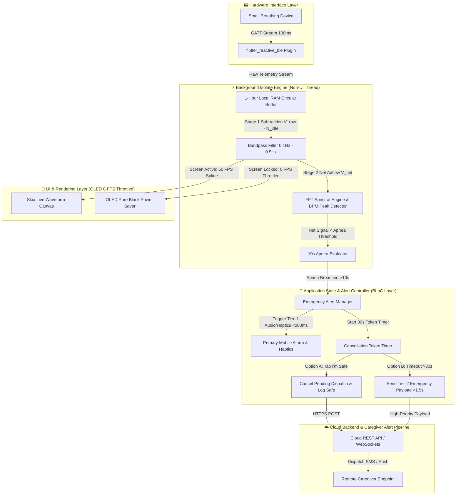

# 🏛️ Technical Architecture Spine: Sleep Apnea Detection App

> **Architecture Paradigm:** Reactive BLoC + Worker Isolate Stream Pipeline + Atomic UI Design System  
> **Target Scope:** Cross-Platform Flutter Mobile Application & BLE Bio-Signal Telemetry Gateway  

---

## 1. Core Architectural Paradigm & Invariants



---

## 2. Architectural Decisions (ADs) & Structural Rules

### AD-1: BLE Telemetry Gateway & Connection Management
* **Binds:** `lib/core/ble/ble_manager.dart`
* **Prevents:** BLE packet dropping, UI thread stuttering, and unhandled disconnection states.
* **Rule:** 
  1. BLE scanning, MTU size negotiation (target: **247 bytes**), and GATT characteristic notification streaming (`UUID: 0000FFE1-...`) shall be managed by a singleton `BleManager`.
  2. Auto-reconnect shall execute an exponential backoff strategy ($1\text{s}, 2\text{s}, 4\text{s}, \text{max } 8\text{s}$) to restore connection within **< 3.0 seconds**.
  3. Telemetry streaming shall use a 1-hour circular RAM ring buffer (`CircularBuffer<TelemetryPacket>(360000)`) to store raw data during BLE drops.

### AD-2: Two-Stage Pre-Sleep Calibration & Baseline Engine
* **Binds:** `lib/core/signal/calibration_engine.dart`
* **Prevents:** Ambient thermal drift, phantom BLE noise floors, and false positive apnea alarms.
* **Rule:**
  1. **Stage 1 (Idle Noise Subtraction):** Samples 5–10 seconds of unattached BLE noise to calculate $N_{\text{idle}} = \text{mean}(V_{\text{raw}})$. Net airflow is bound at $V_{\text{net}} = V_{\text{raw}} - N_{\text{idle}}$.
  2. **Stage 2 (Active Breath Training):** Samples 10–20 seconds of attached breathing to extract inhalation peak ($V_{\max}$) and exhalation trough ($V_{\min}$).
  3. **Apnea Threshold:** Dynamically binds zero-airflow apnea threshold to $\text{Threshold}_{\text{apnea}} = 0.10 \times (V_{\max} - V_{\min})$.
  4. **Wear Verification Guardrail:** Session start is blocked if active amplitude $\Delta V < \text{Threshold}_{\min}$.

### AD-3: Signal Offloading & Background Worker Isolates
* **Binds:** `lib/core/signal/signal_processor_isolate.dart`
* **Prevents:** Main UI thread frame drops during heavy Fast Fourier Transform (FFT) calculations.
* **Rule:**
  1. Moving average filtering, $N_{\text{idle}}$ subtraction, and FFT spectral frequency peak extraction (256-point window) shall execute inside a dedicated background **Dart Isolate** (`compute()` or `Isolate.spawn()`).
  2. The main UI thread shall only receive processed, throttled UI state objects (`AirflowUiPoint`, `BpmState`, `ApneaAlertState`).

### AD-4: Emergency Response & Cancellation Token Pattern
* **Binds:** `lib/core/services/emergency_alert_manager.dart`
* **Prevents:** False emergency alerts to caregivers and unhandled local alarm timeouts.
* **Rule:**
  1. Upon detecting net airflow below $\text{Threshold}_{\text{apnea}}$ for $>10$ seconds, `EmergencyAlertManager` shall instantly trigger Tier-1 local mobile audio (>75 dB) and haptic vibration pulses (<200ms latency).
  2. An asynchronous 30-second **Cancellation Token** timer is spawned.
  3. If the user taps **"I'm Safe / I'm Awake"** within 30 seconds, the cancellation token is cancelled, local alarms stop, and a `"PATIENT_SAFE"` payload is sent to the cloud.
  4. If the timer expires without tap or airflow restoration ($V_{\text{net}} > 1.5 \times \text{Threshold}$ for 5s), Tier-2 Cloud Emergency Dispatch fires immediately (<1.5s latency).

### AD-5: Ultra-Low Power Architecture & 0-FPS Display Throttling
* **Binds:** `lib/ui/organisms/live_waveform_chart.dart`, `lib/main.dart`
* **Prevents:** Excessive phone battery drain during overnight 8-hour sleep sessions.
* **Rule:**
  1. When the mobile screen is turned off or locked (`WidgetsBindingObserver` paused state), the Live Waveform Chart shall throttle rendering to **0 FPS** (pausing Canvas repaints completely while background isolate logging continues).
  2. Active Sleep Mode UI shall enforce pure OLED black (`#000000` background) and minimum screen brightness.
  3. Mobile background permissions shall register Android Foreground Service (`connectedDevice|dataSync`) and iOS `UIBackgroundModes: bluetooth-central, processing` to guarantee zero OS background termination.
  4. Total overnight power consumption shall remain **< 8.0% total battery over 8 hours**.

### AD-6: Security & Health Privacy Standards
* **Binds:** `lib/core/network/api_client.dart`, `lib/core/security/crypto_util.dart`
* **Prevents:** Unauthorized access to Personal Health Information (PHI) and unencrypted BLE interception.
* **Rule:**
  1. BLE data packets shall be encrypted using AES-128 transit encryption.
  2. Cloud REST/WebSocket communication shall mandate TLS 1.3 HTTPS with certificate pinning.
  3. Stored cloud logs and caregiver contacts shall be encrypted at rest (AES-256) compliant with HIPAA Security Rule and GDPR Article 9.

---

## 3. Technology Stack & Starter Dependency Invariants

```yaml
environment:
  sdk: ">=3.0.0 <4.0.0"
  flutter: ">=3.10.0"

dependencies:
  flutter:
    sdk: flutter
  # Core BLE & Reactive Streams
  flutter_reactive_ble: ^5.0.2
  rxdart: ^0.27.7
  # State Management
  flutter_bloc: ^8.1.3
  # UI & GPU Chart Rendering
  fl_chart: ^0.68.0
  google_fonts: ^6.2.1
  cupertino_icons: ^1.0.6
  # Local Storage & Ring Buffer
  hive: ^2.2.3
  hive_flutter: ^1.1.0
  # Networking & Emergency Alerts
  dio: ^5.4.3+1
  web_socket_channel: ^3.0.0
  flutter_local_notifications: ^17.1.2
  vibration: ^2.0.1
```

---

## 4. Deferred Technical Decisions

The following architectural choices are explicitly deferred to feature development:
1. **Cloud Backend Infrastructure:** Node.js Express/NestJS vs. Supabase BaaS (to be ratified during Cloud Gateway Sprint).
2. **SMS Gateway Provider:** Twilio vs. AWS SNS for Tier-2 Caregiver SMS Dispatch.
3. **Doctor PDF Generation Library:** `pdf` Flutter package vs. Server-side Puppeteer PDF rendering.
