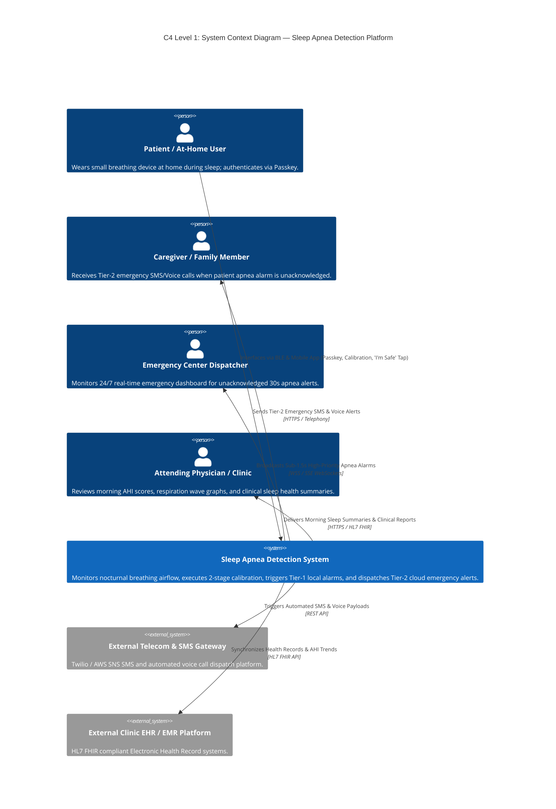
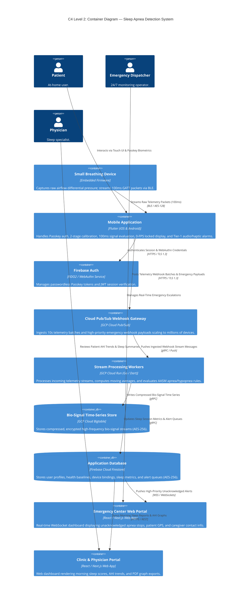
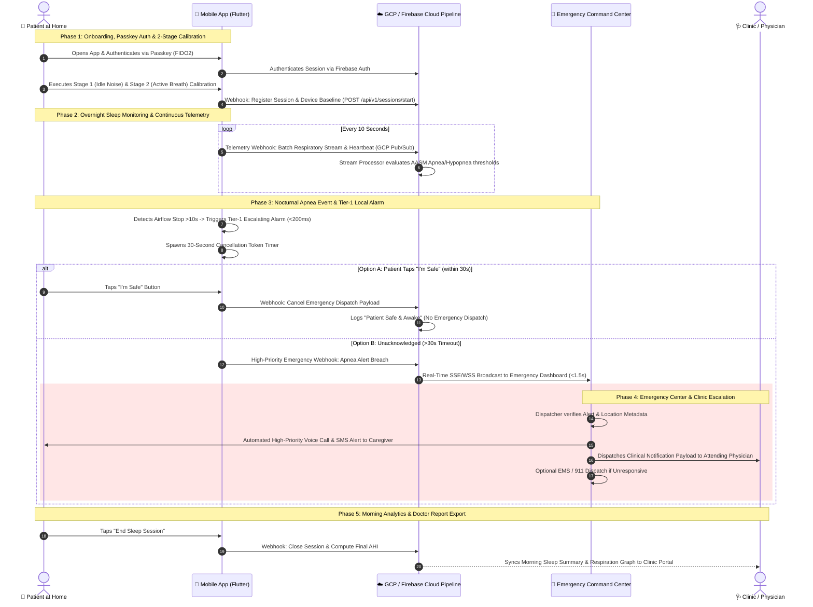
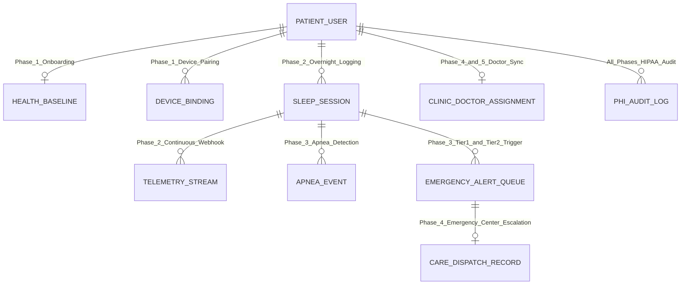

# 🏛️ Enterprise Architecture Specification
## Sleep Apnea Detection App & Emergency Command Platform

> **Architecture Framework:** C4 Model (Context & Container) + BPMN 2.0 Process Modeling + Conceptual Data Architecture  
> **Target Scope:** Global Platform Scaling to Millions of Concurrent Devices  

---

## 1. C4 Architecture Model

### 1.1 C4 Level 1: System Context Diagram

The System Context diagram illustrates the high-level boundary of the **Sleep Apnea Detection Platform** and its interactions with human actors and external enterprise systems.

---

### 1.2 C4 Level 2: Container Diagram

The Container diagram decomposes the system into executable applications, data stores, stream processing workers, and web portals.

---

## 2. BPMN 2.0 Business Process Model

The business process maps the end-to-end operational lifecycle from bedtime setup to morning doctor report delivery across 5 distinct phases.

---

## 3. BPMN-Derived High-Level Conceptual Data Model

To guarantee that every data requirement generated throughout the BPMN process workflow is fulfilled, the conceptual data model maps directly to each process phase:

---

### 3.1 Traceability Matrix: BPMN Process Data Requirements $\rightarrow$ Conceptual Entities

| BPMN Process Phase | Data Produced / Transformed in Workflow | Derived Conceptual Entity | Key Data Attributes | HIPAA Safeguard Level |
| :--- | :--- | :--- | :--- | :--- |
| **Phase 1: Onboarding & Calibration** | Passkey FIDO2 token, age, weight, height, computed BMI, $N_{\text{idle}}$ noise floor, $V_{pp}$ breath baseline, BLE MAC address. | `PATIENT_USER`, `HEALTH_BASELINE`, `DEVICE_BINDING` | `user_id`, `passkey_credential_id`, `age`, `weight_kg`, `height_cm`, `computed_bmi`, `idle_noise_floor`, `device_hardware_id`, `ble_mac`. | **Level 1 (PHI)** — AES-256 Encryption at Rest. |
| **Phase 2: Overnight Telemetry** | 100ms raw airflow samples, 10s webhook stream batch, sequence number, heartbeats, battery level. | `SLEEP_SESSION`, `TELEMETRY_STREAM` | `session_id`, `user_id`, `start_time`, `sequence_num`, `net_airflow_samples`, `compressed_bio_signals`, `battery_pct`. | **Level 1 (PHI)** — Compressed AES-256 Time-Series Blob. |
| **Phase 3: Apnea & Tier-1 Alarm** | Airflow stop timestamp, apnea duration (>10s), peak-to-trough breach margin, 30s cancellation token, "I'm Safe" tap timestamp. | `APNEA_EVENT`, `EMERGENCY_ALERT_QUEUE` | `event_id`, `session_id`, `triggered_at`, `apnea_duration_seconds`, `patient_acknowledged`, `cancellation_token_id`. | **Level 1 (PHI)** — Real-Time Alert Event Queue. |
| **Phase 4: Emergency Center & Caregiver** | GPS coordinates, address, emergency contact phone, dispatcher action log, SMS/Voice call dispatch timestamp, EMS status. | `CARE_DISPATCH_RECORD`, `CLINIC_DOCTOR_ASSIGNMENT` | `dispatch_id`, `alert_id`, `dispatcher_id`, `caregiver_phone`, `gps_lat_long`, `ems_dispatched`, `doctor_npi`. | **Level 1 (PHI)** — Role-Based Access Control (RBAC). |
| **Phase 5: Morning Analytics & Doctor** | Session end time, total sleep duration, final AHI score, total apnea stops, quality score (0–100), doctor share payload. | `SLEEP_SESSION`, `CLINIC_DOCTOR_ASSIGNMENT` | `end_time`, `total_duration_hours`, `ahi_score`, `quality_score`, `doctor_share_token_id`. | **Level 1 (PHI)** — HL7 FHIR Export Stream. |
| **All Phases** | User ID, action performed, accessed table/entity, IP address, timestamp. | `PHI_AUDIT_LOG` | `audit_id`, `user_id`, `action_type`, `accessed_entity`, `ip_address`, `timestamp`. | **Level 2 (Audit)** — Immutable Write-Once Log. |

---

## 4. Architectural Summary

* **C4 Architecture Model:** Fully articulates C4 Level 1 (System Context) and C4 Level 2 (Container Diagram) showing Flutter App, BLE Hardware, Firebase Auth, GCP Pub/Sub, Cloud Run, Bigtable, Firestore, Emergency Center Web Portals, and Clinic Portals.
* **BPMN 2.0 Process Model:** Complete 5-phase operational workflow linking Patient $\rightarrow$ Mobile App $\rightarrow$ GCP Cloud $\rightarrow$ 24/7 Command Center $\rightarrow$ Doctor.
* **Conceptual Data Model:** 100% traceable to every data requirement generated across the BPMN process workflow, fully categorized under HIPAA Level 1 (PHI) and Level 2 (PII) safeguards.
