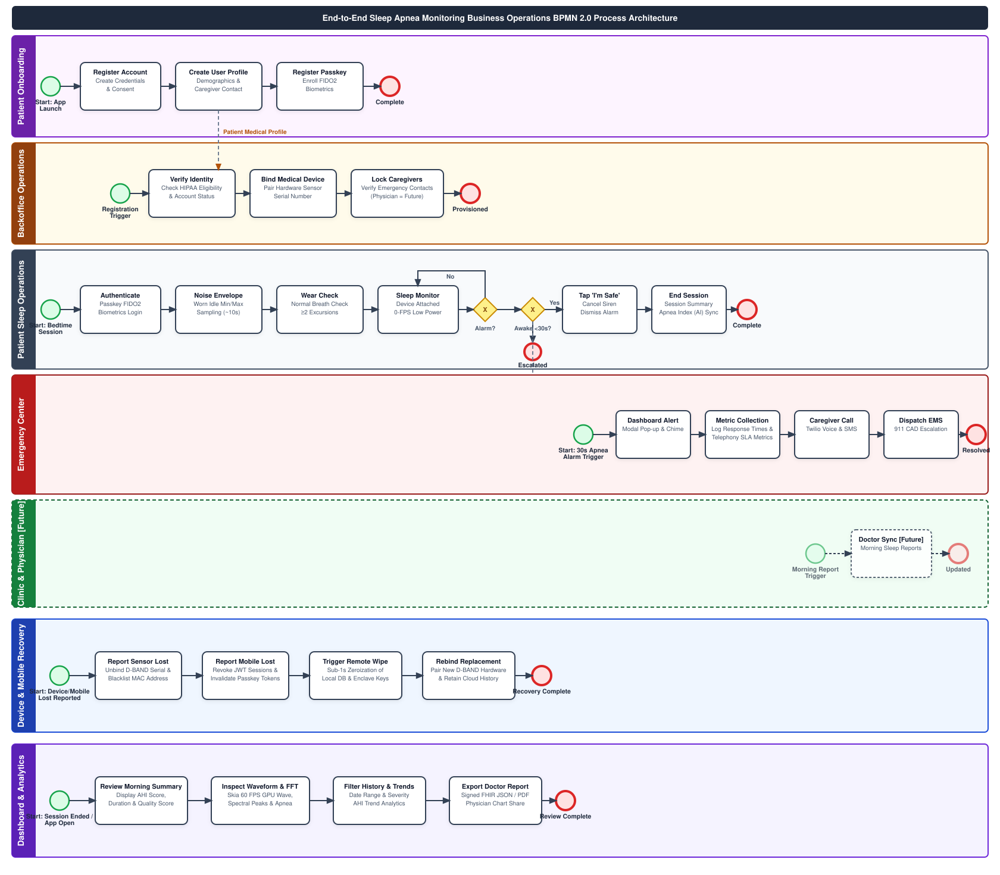
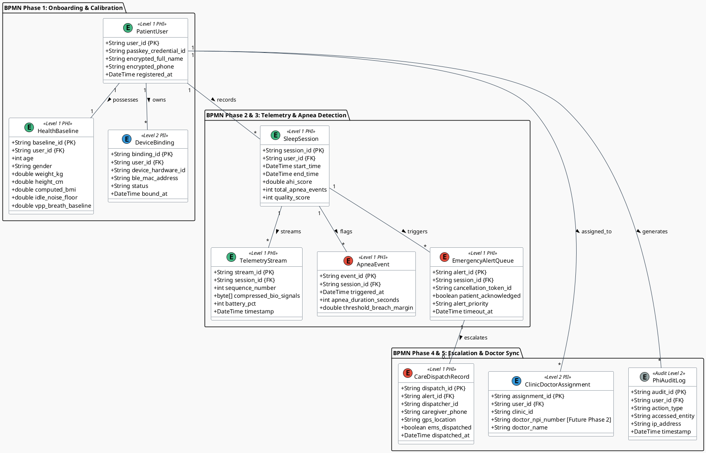
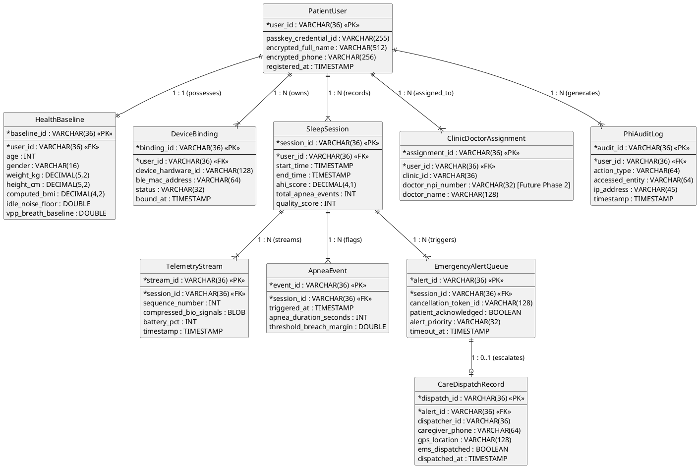
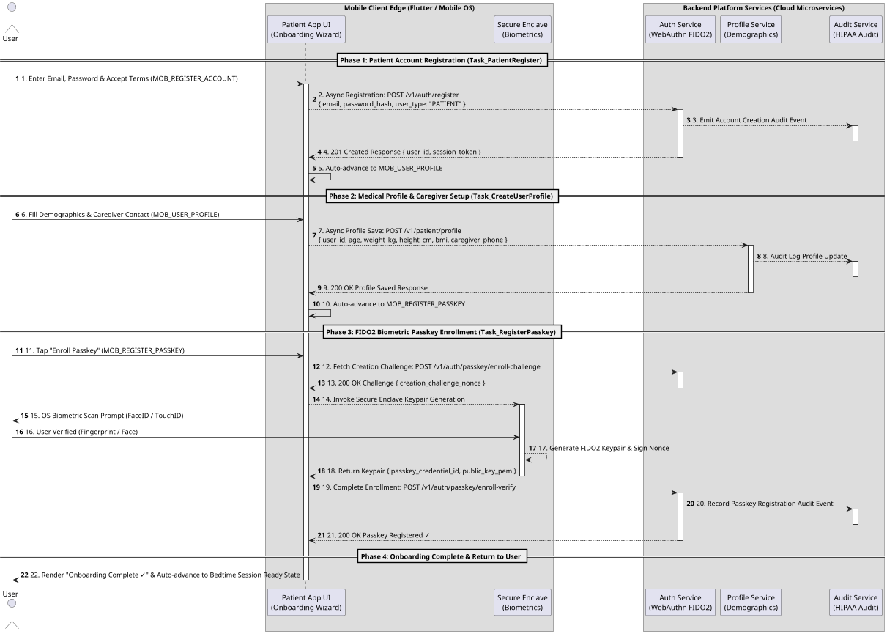
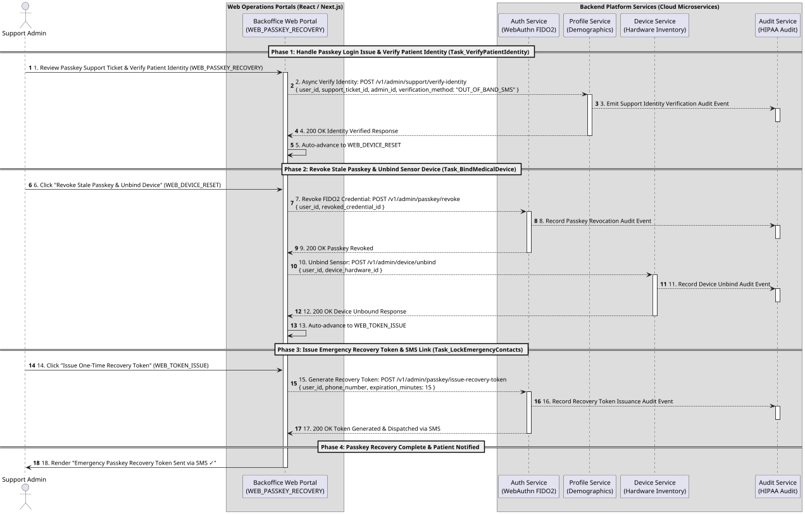
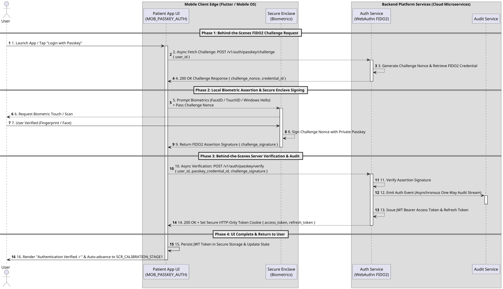
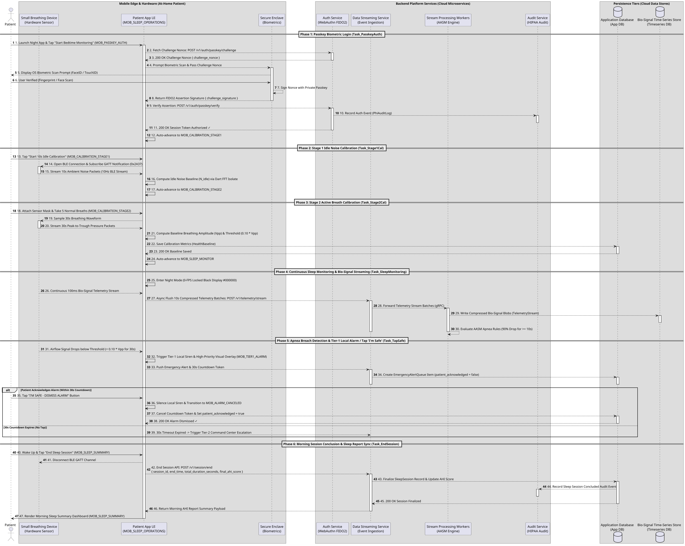
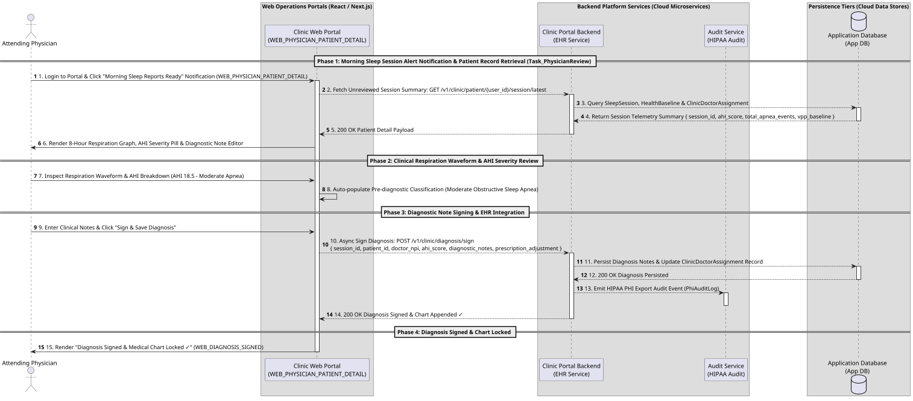

# 🏛️ Enterprise Architecture Specification
## Sleep Apnea Detection App & Emergency Command Platform

> **Diagramming Standard:** Standard **BPMN 2.0 XML (BPMN.js / Camunda compatible)** for Section 2 Process Modeling + **PlantUML** for C4 Context, C4 Container & Conceptual Data Models.  
> **Target Scope:** Global Platform Scaling to Millions of Concurrent Devices  

---

## 1. 🏢 Business & System Architecture

### 1.1 C4 Level 1: System Context Diagram

The System Context diagram establishes the high-level boundary of the **Sleep Apnea Detection System** and defines how external human actors interact with the unified platform.

```plantuml
@startuml C4_Level1_System_Context
!include https://raw.githubusercontent.com/plantuml-stdlib/C4-PlantUML/master/C4_Context.puml

LAYOUT_WITH_LEGEND()

title C4 Level 1: System Context Diagram — Sleep Apnea Detection Platform

Person(patient, "Patient / At-Home User", "Wears small breathing device at home during sleep; authenticates via Passkey.")
Person(caregiver, "Caregiver / Family Member", "Receives Tier-2 emergency SMS/Voice calls when patient apnea alarm is unacknowledged.")
Person(dispatcher, "Emergency Center Dispatcher", "Monitors 24/7 real-time emergency dashboard for unacknowledged 30s apnea alerts.")
Person(doctor, "Attending Physician / Clinic", "Reviews morning AHI scores, respiration wave graphs, and clinical sleep health summaries.")

System(system, "Sleep Apnea Detection System", "Monitors nocturnal breathing airflow, executes 2-stage calibration, triggers Tier-1 local alarms, and dispatches Tier-2 cloud emergency alerts.")

Rel(patient, system, "Interfaces via BLE & Mobile App (Passkey, Calibration, 'I'm Safe' Tap)", "BLE / HTTPS")
Rel(system, caregiver, "Sends Tier-2 Emergency SMS & Voice Alerts", "HTTPS / Telephony")
Rel(system, dispatcher, "Broadcasts Sub-1.5s High-Priority Apnea Alarms", "WSS / WebSockets")
Rel(system, doctor, "Delivers Morning Sleep Summaries & Clinical Reports", "HTTPS / HL7 FHIR")

@enduml
```

#### 📖 Architectural Context & Operational Boundary

* **Patient / At-Home User:** Connects a lightweight hardware differential pressure sensor via Bluetooth Low Energy (BLE). Through the Flutter mobile application, the user authenticates passwordlessly via FIDO2 Passkeys, completes a 2-stage bedtime calibration (idle noise floor + active breathing baseline), and sleeps while the app evaluates 100ms telemetry. If an airflow cessation breach is detected, the patient is presented with an instant Tier-1 local mobile alarm (<200ms) and can dismiss it with a single tap of the "I'm Safe" button.
* **Caregiver / Family Member:** Acts as the designated secondary contact. If the patient does not acknowledge a Tier-1 mobile alarm within 30 seconds, the cloud emergency dispatch worker automatically triggers Tier-2 high-priority SMS and automated voice telephony calls to the caregiver.
* **Emergency Center Dispatcher:** Operators in a 24/7 command center monitor an active web portal displaying real-time WebSocket alert feeds (sub-1.5s latency). Unacknowledged 30-second apnea stops instantly pop up on the dashboard with patient GPS coordinates, allowing dispatchers to verify emergency status and alert local EMS responders.
* **Attending Physician / Clinic Endpoint:** Clinicians access morning sleep summaries, Apnea-Hypopnea Index (AHI) classifications (Normal <5, Mild 5–15, Moderate 15–30, Severe >30), and raw time-series respiration wave exports via a secure physician web portal.

#### 💡 Guidance for Downstream Workflows (PRD & UX)
> [!TIP]
> **PRD / Epics Handoff:** Epics derived from Level 1 must guarantee distinct role-based access control (RBAC) scopes: Patient Mobile App (Passkey & Local Alarms), Dispatcher Command Portal (Sub-1.5s WSS Dashboards), and Clinic Portal (HIPAA Level 1 PHI Sleep Reports).

---

### 1.2 C4 Level 2: Container Diagram

The Container diagram decomposes the platform into its distinct deployable software applications, data stores, and backend microservices.

```plantuml
@startuml C4_Level2_Container_Diagram
!include https://raw.githubusercontent.com/plantuml-stdlib/C4-PlantUML/master/C4_Container.puml

LAYOUT_WITH_LEGEND()

title C4 Level 2: Container Diagram — Sleep Apnea Detection System

Person(patient, "Patient", "At-home user wearing breathing device.")
Person(dispatcher, "Emergency Dispatcher", "24/7 monitoring operator.")
Person(doctor, "Physician / Specialist", "Attending sleep clinician.")

Container(hardware, "Small Breathing Device", "Embedded Firmware", "Captures raw airflow differential pressure; streams 100ms GATT packets via BLE.")

Container(mobile_app, "Mobile Application", "Flutter (iOS & Android)", "Handles Passkey auth, 2-stage calibration, 100ms signal evaluation, 0-FPS locked display, and Tier-1 audio/haptic alarms.")

Container(auth_service, "Authentication Service", "WebAuthn / FIDO2 Service", "Manages passwordless Passkey tokens and JWT session verification.")

Container(data_streaming, "Data Streaming Service", "Event Ingestion Engine", "Ingests 10s telemetry batches and high-priority emergency webhook payloads scaling to millions of devices.")

Container(stream_workers, "Stream Processing Workers", "Container Microservices", "Processes incoming telemetry streams, computes moving averages, and evaluates AASM apnea/hypopnea rules.")

ContainerDb(timeseries_db, "Bio-Signal Time-Series Store", "Columnar Time-Series DB", "Stores compressed, encrypted high-frequency bio-signal streams (AES-256).")

ContainerDb(app_db, "Application Database", "Document / Relational DB", "Stores user profiles, health baselines, device bindings, sleep metrics, and alert queues (AES-256).")

Container(command_portal, "Emergency Center Web Portal", "React / Next.js Web App", "Real-time WebSocket dashboard displaying unacknowledged apnea stops, patient GPS, and caregiver contact info.")

Container(clinic_portal, "Clinic & Physician Portal", "React / Next.js Web App", "Web dashboard rendering morning sleep scores, AHI trends, and PDF graph exports.")

Rel(hardware, mobile_app, "Streams Raw Telemetry Packets (100ms)", "BLE / AES-128")
Rel(patient, mobile_app, "Interacts via Touch UI & Passkey Biometrics")
Rel(mobile_app, auth_service, "Authenticates Session & WebAuthn Credentials", "HTTPS / TLS 1.3")
Rel(mobile_app, data_streaming, "Posts Telemetry Webhook Batches & Emergency Payloads", "HTTPS / TLS 1.3")
Rel(data_streaming, stream_workers, "Pushes Ingested Webhook Stream Messages", "gRPC / Push")
Rel(stream_workers, timeseries_db, "Writes Compressed Bio-Signal Time Series", "gRPC")
Rel(stream_workers, app_db, "Updates Sleep Session Metrics & Alert Queues", "gRPC")
Rel(app_db, command_portal, "Pushes High-Priority Unacknowledged Alerts", "WSS / WebSockets")
Rel(app_db, clinic_portal, "Syncs Morning Sleep Reports & AHI Graphs", "HTTPS / REST")
Rel(dispatcher, command_portal, "Manages Real-Time Emergency Escalations")
Rel(doctor, clinic_portal, "Reviews Patient AHI Trends & Sleep Summaries")

@enduml
```

#### 📖 Technical Container Subsystems & Invariants

1. **Embedded Hardware Firmware:** Differential pressure sensor streaming 100ms telemetry packets over Bluetooth Low Energy (BLE GATT). Data packets are encrypted via AES-128 session keys negotiated during BLE pairing.
2. **Flutter Mobile Client (iOS & Android):** Serves as the primary edge node. It executes 2-stage calibration logic, local 100ms signal analysis, 0-FPS locked low-power display modes during sleep, and Tier-1 audio/haptic alarms. Telemetry is batched into 10-second compressed JSON payloads and pushed to the cloud gateway over HTTPS/TLS 1.3.
3. **Cloud Ingestion & Processing Workers (Data Streaming Service + Stream Processing Workers):** High-throughput data streaming service handling millions of concurrent device connections. Container stream workers process telemetry streams via gRPC, compute moving average baselines ($V_{pp}$ peak-to-trough breathing amplitude), and evaluate American Academy of Sleep Medicine (AASM) diagnostic rules:
   $$\text{Apnea Breach} \iff \text{Airflow Drop} \ge 90\% \text{ for } \ge 10\text{ seconds}$$
   $$\text{Hypopnea Breach} \iff \text{Airflow Drop} \ge 30\% \text{ for } \ge 10\text{ seconds}$$
4. **Dual Persistence Tier (Bio-Signal Time-Series Store + Application Database):**
   * **Bio-Signal Time-Series Store:** Columnar storage designed for high-frequency bio-signal time-series blobs (compressed via snappy/zstd, encrypted with AES-256 at rest).
   * **Application Database:** Primary database storing user profiles, health baselines, device bindings, and real-time alert queues pushing sub-1.5s updates to connected WebSocket clients.

#### 💡 Guidance for Downstream Engineering (Architecture & Epics)
> [!IMPORTANT]
> **Implementation Target:** Engineers building feature stories must maintain the separation between high-frequency bio-signal persistence (`Bio-Signal Time-Series Store`) and relational/document application state (`Application Database`). Never post 100ms telemetry samples directly into the primary application database.

---

### 1.3 🔄 BPMN 2.0 Business Process Model

> **BPMN 2.0 Source Artifact:** [`sleep_apnea_process.bpmn`](./sleep_apnea_process.bpmn)  
> **Visual Diagram Standard:** Directly rendered vector graphic generated via **BPMN.js (Camunda / bpmn.io engine)**



#### 📖 Business Process Lifecycle & Swimlane Dynamics

The BPMN 2.0 process model (`sleep_apnea_process.bpmn`) specifies the operational activities across 5 parallel **Business Operations Swimlanes** to deliver an end-to-end healthcare workflow, eliminating technical software engine lanes in favor of authentic business roles and operational platforms. Each swimlane maps directly to a distinct **Feature Set and Architectural Epic** to group downstream user stories:

* **Patient Onboarding Swimlane (`Lane_PatientOnboarding`)**  
  * **Epic / Feature Mapping:** **Epic 0: Patient Identity & Onboarding**  
  * **Downstream Story Grouping:** Groups user stories for initial patient account registration, patient medical profile creation (demographics, emergency caregiver contact info, attending physician NPI), and hardware-backed FIDO2 Passkey credential enrollment with the OS Secure Enclave.  
  * **Activity Breakdown:**
    * **`Task_PatientRegister`: Register Patient Account** — Creates initial patient credentials & account identity.
    * **`Task_CreateUserProfile`: Create Patient Medical Profile** — Captures age, weight, height, computed BMI, emergency contact details, and primary physician NPI.
    * **`Task_RegisterPasskey`: Register & Enroll FIDO2 Passkey** — Enrolls biometric Passkey (FaceID / TouchID / Windows Hello) bound to OS Secure Enclave and registers public key with Auth Service.

* **Backoffice Operations Swimlane (`Lane_BackofficePlatform`)**  
  * **Epic / Feature Mapping:** **Epic 5: Backoffice Provisioning & Device Operations**  
  * **Downstream Story Grouping:** Groups user stories for administrative backoffice operations. This includes verifying patient identity & medical eligibility, pairing and binding physical breathing sensor hardware serial numbers to patient profiles, and locking caregiver emergency contacts.  
  * **Activity Breakdown:**
    * **`Task_VerifyPatientIdentity`: Verify Patient Identity & Eligibility** — Administrative verification of patient registration details & HIPAA consent.
    * **`Task_BindMedicalDevice`: Pair & Bind Hardware Sensor Serial** — Associates physical breathing sensor hardware serial number with patient profile.
    * **`Task_LockEmergencyContacts`: Lock Caregiver Emergency Contacts** — Verifies and locks caregiver emergency contact phone numbers for 24/7 command center telephony dispatch *(Note: Assigning an attending physician is designated as a Phase 2 Future Process)*.

* **Patient Sleep Operations Swimlane (`Lane_PatientAtHome`)**  
  * **Epic / Feature Mapping:** **Epic 1: Patient Mobile Client Experience & Sleep Operations**  
  * **Downstream Story Grouping:** Groups user stories for patient-facing nighttime sleep operations. This includes biometric FIDO2 authentication login, interactive 2-stage calibration wizards (idle noise floor + active breath baseline), low-power night-mode sleep monitoring screens, high-priority Tier-1 alarm screen with 30s safety tap cancellation, and morning sleep summary reports.  
  * **Activity Breakdown:**
    * **`Task_PasskeyAuth`: Authenticate via Passkey (FIDO2)** — Launches app and performs FIDO2 biometric passkey authentication.
    * **`Task_Stage1Cal`: Execute Stage 1 Idle Noise Calibration** — Samples ambient noise floor ($N_{\text{idle}}$) for 10s with sensor on bedside table.
    * **`Task_Stage2Cal`: Execute Stage 2 Active Breath Calibration** — Calculates peak-to-trough breathing baseline ($V_{pp}$) over 30s active respiration.
    * **`Task_SleepMonitoring`: Sleep with Device Attached** — Continuous nocturnal monitoring in low-power 0-FPS night mode.
    * **`Task_TapSafe`: Tap 'I'm Safe' Button** — Patient taps single-touch cancellation button on Tier-1 alarm screen during 30s window.
    * **`Task_EndSession`: Tap 'End Sleep Session'** — Concludes sleep session, closes BLE stream, and generates morning sleep summary.

* **Emergency Center Swimlane (`Lane_EmergencyCenter`)**  
  * **Epic / Feature Mapping:** **Epic 4: Emergency Operations & Telephony**  
  * **Downstream Story Grouping:** Groups user stories for dispatcher web operations, caregiver telephony, and emergency responder dispatch. This includes the React Command Center web portal, real-time WSS alert modal popups, Mapbox patient GPS geocoding, Twilio voice call & SMS caregiver automation, and 911 Computer-Aided Dispatch (CAD) gateway escalation.  
  * **Activity Breakdown:**
    * **`Task_DashboardAlert`: Command Center Dashboard Alert Pop-up** — Triggers high-contrast red modal alert popup and sound chime on dispatcher web dashboard.
    * **`Task_MetricCollection`: Collect Emergency Alert Metrics** — Automated logging of emergency alert response times, dispatcher reaction latencies, caregiver telephony metrics, and operational SLA compliance.
    * **`Task_CaregiverCall`: Trigger Voice Call & SMS to Caregiver** — Initiates automated Twilio voice call and priority SMS to patient's emergency contact.
    * **`Task_DispatchEMS`: Dispatch Local EMS / 911 Responders** — Integrates with 911 Computer-Aided Dispatch (CAD) gateway to dispatch local emergency responders if unacknowledged.

* **Clinic & Physician Swimlane (`Lane_ClinicPhysician`) [Future Release / Phase 2]**  
  * **Epic / Feature Mapping:** **Epic 6: Clinical Operations & Diagnostic Reports (Future Expansion)**  
  * **Downstream Story Grouping:** Designates future expansion stories for physician portals, morning sleep report synchronizations, AHI classification analytics, and clinical diagnostic note entries.  
  * **Activity Breakdown:**
    * **`Task_DoctorSync`: Sync Morning Sleep Scores & AHI Reports [Future]** — Syncs morning sleep session summary metrics, AHI score, and respiration wave graphs to clinic portal.
    * **`Task_PhysicianReview`: Physician Reviews AHI Classification & Notes [Future]** — Attending physician reviews patient AHI trend charts, adds diagnostic notes, and updates prescription settings.

#### 💡 Guidance for Downstream Workflows (State Machines & User Stories)
> [!NOTE]
> **Application Architecture Traceability:**  
> Detailed Activity-by-Activity UI Flow & Sequence Specifications for all 21 BPMN tasks, along with end-to-end sequence diagrams, are defined in [**Section 3. Application Architecture**](#3--application-architecture).

---

## 2. 🗄️ Data Architecture

### 2.1 Conceptual Data Model (BPMN Aligned)

#### 📖 Business Architecture Alignment & Data Model Purpose

The **Conceptual Data Model** is engineered specifically to support the complete, end-to-end business process lifecycle defined in **Section 1 (Business & System Architecture)** and modeled in the BPMN 2.0 process flow (`sleep_apnea_process.bpmn`). Rather than viewing data persistence as isolated database tables, this data architecture directly mirrors the operational state transitions, human actor interactions, and regulatory compliance boundaries established across all 5 swimlanes.

Every entity, attribute, and relationship in the conceptual model corresponds to a concrete business artifact produced or transformed during execution:
* **Phase 1 (Onboarding & Calibration):** Supports patient registration, FIDO2 biometric authentication credentials, baseline health parameters, and hardware Bluetooth device bindings (`PatientUser`, `HealthBaseline`, `DeviceBinding`).
* **Phase 2 & 3 (Telemetry & Apnea Detection):** Supports continuous nocturnal session recording, high-frequency bio-signal time-series streaming, local edge apnea breach events, and real-time emergency alert queues (`SleepSession`, `TelemetryStream`, `ApneaEvent`, `EmergencyAlertQueue`).
* **Phase 4 & 5 (Escalation, Caregiver Telephony & Doctor Analytics):** Supports 24/7 emergency command center dispatch tracking, caregiver telephony contact records, attending physician assignments, and immutable HIPAA audit logging (`CareDispatchRecord`, `ClinicDoctorAssignment`, `PhiAuditLog`).

By aligning database entity packages with the BPMN business process phases, the system enforces end-to-end data integrity, zero-loss state transitions, and strict HIPAA field-level encryption rules across the entire platform lifecycle.



#### 📖 Data Entity Architecture & HIPAA Safeguards

The Conceptual Data Model structures database entities around the 5 process phases of the BPMN workflow, establishing strict HIPAA privacy levels:

* **Level 1 (PHI - Protected Health Information):** Requires AES-256 encryption at rest and TLS 1.3 in transit. Includes `PatientUser`, `HealthBaseline`, `SleepSession`, `TelemetryStream` (compressed raw bio-signal blobs), `ApneaEvent`, `EmergencyAlertQueue`, and `CareDispatchRecord`. Access is gated by strict Role-Based Access Control (RBAC).
* **Level 2 (PII - Personally Identifiable Information):** Technical metadata and device identifiers (`DeviceBinding`, `ClinicDoctorAssignment`).
* **Level 2 (Audit):** `PhiAuditLog` — an immutable, write-once audit log capturing every access event, read operation, and dispatch action across the platform.


---

### 2.2 Data Traceability Matrix: BPMN Process Data Requirements $\rightarrow$ PlantUML Entities

| BPMN Process Phase | Data Produced / Transformed in Workflow | Derived PlantUML Conceptual Entity | Key Data Attributes | HIPAA Safeguard Level |
| :--- | :--- | :--- | :--- | :--- |
| **Phase 1: Onboarding & Calibration** | Passkey FIDO2 token, age, weight, height, computed BMI, $N_{\text{idle}}$ noise floor, $V_{pp}$ breath baseline, BLE MAC address. | `PatientUser`, `HealthBaseline`, `DeviceBinding` | `user_id`, `passkey_credential_id`, `age`, `weight_kg`, `height_cm`, `computed_bmi`, `idle_noise_floor`, `device_hardware_id`. | **Level 1 (PHI)** — AES-256 Encryption at Rest. |
| **Phase 2: Overnight Telemetry** | 100ms raw airflow samples, 10s webhook stream batch, sequence number, heartbeats, battery level. | `SleepSession`, `TelemetryStream` | `session_id`, `user_id`, `start_time`, `sequence_number`, `compressed_bio_signals`, `battery_pct`. | **Level 1 (PHI)** — Compressed AES-256 Time-Series Blob. |
| **Phase 3: Apnea & Tier-1 Alarm** | Airflow stop timestamp, apnea duration (>10s), peak-to-trough breach margin, 30s cancellation token, "I'm Safe" tap timestamp. | `ApneaEvent`, `EmergencyAlertQueue` | `event_id`, `session_id`, `triggered_at`, `apnea_duration_seconds`, `patient_acknowledged`, `cancellation_token_id`. | **Level 1 (PHI)** — Real-Time Alert Event Queue. |
| **Phase 4: Emergency Center & Caregiver** | GPS coordinates, address, emergency contact phone, dispatcher action log, SMS/Voice call dispatch timestamp, EMS status. | `CareDispatchRecord`, `ClinicDoctorAssignment` | `dispatch_id`, `alert_id`, `dispatcher_id`, `caregiver_phone`, `gps_location`, `ems_dispatched`, `doctor_npi_number`. | **Level 1 (PHI)** — Role-Based Access Control (RBAC). |
| **Phase 5: Morning Analytics & Doctor** | Session end time, total sleep duration, final AHI score, total apnea stops, quality score (0–100), doctor share payload. | `SleepSession`, `ClinicDoctorAssignment` | `end_time`, `total_duration_hours`, `ahi_score`, `quality_score`, `doctor_npi_number`. | **Level 1 (PHI)** — HL7 FHIR Export Stream. |
| **All Phases** | User ID, action performed, accessed table/entity, IP address, timestamp. | `PhiAuditLog` | `audit_id`, `user_id`, `action_type`, `accessed_entity`, `ip_address`, `timestamp`. | **Level 2 (Audit)** — Immutable Write-Once Log. |

---

## 3. 📱 Application Architecture

### 3.1 📖 Architectural Invariant (AD-7): 1-to-1 BPMN Activity to UI Flow & Sequence Mapping

> [!IMPORTANT]
> **Architectural Invariant AD-7 (BPMN Activity Traceability Rule):**  
> To guarantee a flawless, traceable end-to-end user experience (E2E UX), **every single activity (User Task or Service Task)** in the BPMN 2.0 process model MUST map directly to an explicit **UI Flow Specification** (Screen ID, Visual UI Components, User Action/Trigger, Next UI State) AND a corresponding **Sequence Diagram Specification** (Source/Target Actors, Protocol/Payload, State Mutations, Latency SLA). No BPMN task may remain an un-mapped background abstraction.

### 3.2 📖 Activity-by-Activity UI Flow & Sequence Specifications

#### 📖 Conceptual Data Model Harmonization & Payload Verification Rule
> [!IMPORTANT]
> **Data Model Verification Invariant:**  
> Every payload structure defined across the 21 sequence specifications below MUST strictly match and harmonize with the **Conceptual Data Model** entities (`PatientUser`, `HealthBaseline`, `DeviceBinding`, `SleepSession`, `TelemetryStream`, `ApneaEvent`, `EmergencyAlertQueue`, `CareDispatchRecord`, `ClinicDoctorAssignment`, `PhiAuditLog`) in [**Section 2.1**](#21-conceptual-data-model-bpmn-aligned) and the **Data Traceability Matrix** in [**Section 2.2**](#22-data-traceability-matrix-bpmn-process-data-requirements--plantuml-entities). Downstream software engineers, API developers, and database architects MUST verify that every JSON payload attribute, gRPC schema field, and database column maintains 1-to-1 name and type parity across Application Architecture and Data Architecture contracts.

#### 🏊 Swimlane 1: Patient Onboarding Activities

| BPMN Activity ID & Name | UI Flow Specification (Screen, Visuals & User Actions) | Sequence Diagram Specification (Actors, Payload, Protocol & SLA) |
| :--- | :--- | :--- |
| **`Task_PatientRegister`**<br>`Register Patient Account` | **Screen ID:** `MOB_REGISTER_ACCOUNT`<br>**Visual Components:** Account creation form (Email, Password / Federated identity creation, Terms & HIPAA Consent checkbox).<br>**User Action:** Enter credentials & tap *"Create Account"*.<br>**Next UI State:** `MOB_USER_PROFILE` on success. | **Actors:** Patient $\rightarrow$ Mobile App $\rightarrow$ Authentication Service.<br>**Protocol:** HTTPS POST /v1/auth/register (TLS 1.3).<br>**Payload:** `{ email, password_hash, user_type: "PATIENT" }`.<br>**Processing:** Creates `PatientUser` authentication record.<br>**Latency SLA:** $< 400\text{ms}$ registration. |
| **`Task_CreateUserProfile`**<br>`Create Patient Medical Profile` | **Screen ID:** `MOB_USER_PROFILE`<br>**Visual Components:** Patient medical profile form (Demographics: Age, Weight kg, Height cm, computed BMI; Emergency Caregiver Contact Name & Phone; Attending Physician NPI).<br>**User Action:** Fill medical profile details & tap *"Save Profile"*.<br>**Next UI State:** `MOB_REGISTER_PASSKEY` on success. | **Actors:** Patient $\rightarrow$ Mobile App UI $\rightarrow$ Patient Profile API $\rightarrow$ Platform DB.<br>**Protocol:** HTTPS POST /v1/patient/profile (TLS 1.3).<br>**Payload:** `{ user_id, full_name, age, weight_kg, height_cm, computed_bmi, emergency_contact_phone, doctor_npi }`.<br>**Processing:** Stores patient demographic & medical profile record in DB.<br>**Latency SLA:** $< 500\text{ms}$ profile save. |
| **`Task_RegisterPasskey`**<br>`Register & Enroll FIDO2 Passkey` | **Screen ID:** `MOB_REGISTER_PASSKEY`<br>**Visual Components:** Passkey enrollment wizard screen. Text: *"Secure your account with biometric Passkey"*. TouchID/FaceID pulse animation.<br>**User Action:** Tap *"Enroll Passkey"* & scan Fingerprint/Face.<br>**Next UI State:** Dialog *"Passkey Enrolled ✓"*, then auto-advances to `MOB_PASSKEY_AUTH` or `MOB_CALIBRATION_STAGE1`. | **Actors:** Patient $\rightarrow$ Mobile App UI $\rightarrow$ OS Secure Enclave $\rightarrow$ Auth Service.<br>**Protocol:** WebAuthn FIDO2 Registration over HTTPS / TLS 1.3.<br>**Payload:** `{ user_id, passkey_credential_id, public_key_pem, device_hardware_id }`.<br>**Processing:** Binds hardware-backed public key to `PatientUser` record in DB.<br>**Latency SLA:** $< 600\text{ms}$ passkey enrollment. |

#### 🏊 Swimlane 2: Backoffice Operations Activities

| BPMN Activity ID & Name | UI Flow Specification (Screen, Visuals & User Actions) | Sequence Diagram Specification (Actors, Payload, Protocol & SLA) |
| :--- | :--- | :--- |
| **`Task_VerifyPatientIdentity`**<br>`Handle Passkey Login Issue & Verify Identity` | **Screen ID:** `WEB_PASSKEY_RECOVERY`<br>**Visual Components:** Out-of-band Passkey support ticket queue. Patient identity verification checklist & SMS challenge button.<br>**User Action:** Support admin reviews out-of-band identity proof & clicks *"Verify Identity for Passkey Recovery"*.<br>**Next UI State:** `WEB_DEVICE_RESET` on verification success. | **Actors:** Support Admin $\rightarrow$ Backoffice Web Portal $\rightarrow$ Patient Profile Service.<br>**Protocol:** HTTPS POST /v1/admin/support/verify-identity (TLS 1.3).<br>**Payload:** `{ user_id, support_ticket_id, admin_id, verification_method: "OUT_OF_BAND_SMS" }`.<br>**Processing:** Validates patient identity & authorizes biometric Passkey reset.<br>**Latency SLA:** $< 300\text{ms}$ identity verification. |
| **`Task_BindMedicalDevice`**<br>`Revoke Stale Passkey & Unbind Sensor Device` | **Screen ID:** `WEB_DEVICE_RESET`<br>**Visual Components:** Device & Passkey credential management panel. Lists active WebAuthn passkeys and BLE sensor MAC bindings with red *"REVOKE PASSKEY & UNBIND"* button.<br>**User Action:** Admin clicks *"Revoke Stale Passkey & Unbind Sensor"*.<br>**Next UI State:** `WEB_TOKEN_ISSUE` (Displays credential revocation confirmation badge). | **Actors:** Support Admin $\rightarrow$ Backoffice Web Portal $\rightarrow$ Auth Service $\rightarrow$ Device Service.<br>**Protocol:** HTTPS POST /v1/admin/passkey/revoke & POST /v1/admin/device/unbind.<br>**Payload:** `{ user_id, revoked_credential_id, device_hardware_id }`.<br>**Processing:** Revokes compromised FIDO2 keypair & unbinds lost sensor hardware.<br>**Latency SLA:** $< 400\text{ms}$ revocation operation. |
| **`Task_LockEmergencyContacts`**<br>`Issue Emergency Passkey Recovery Token` | **Screen ID:** `WEB_TOKEN_ISSUE`<br>**Visual Components:** Temporary emergency token issuance modal. Expiration timer selector (15 mins) and automated SMS dispatch button.<br>**User Action:** Admin clicks *"Issue Emergency One-Time Passkey Recovery Token"*.<br>**Next UI State:** `WEB_SUPPORT_COMPLETE` (Token sent to patient phone via encrypted SMS). | **Actors:** Support Admin $\rightarrow$ Backoffice Operations $\rightarrow$ Auth Service $\rightarrow$ Twilio SMS Gateway.<br>**Protocol:** HTTPS POST /v1/admin/passkey/issue-recovery-token.<br>**Payload:** `{ user_id, phone_number, expiration_minutes: 15, single_use: true }`.<br>**Processing:** Generates 256-bit cryptographically secure single-use recovery link for mobile app re-enrollment.<br>**Latency SLA:** $< 350\text{ms}$ token dispatch. |

#### 🏊 Swimlane 3: Patient Sleep Operations Activities

| BPMN Activity ID & Name | UI Flow Specification (Screen, Visuals & User Actions) | Sequence Diagram Specification (Actors, Payload, Protocol & SLA) |
| :--- | :--- | :--- |
| **`Task_PasskeyAuth`**<br>`Authenticate via Passkey (FIDO2)` | **Screen ID:** `MOB_PASSKEY_AUTH`<br>**Visual Components:** Biometric prompt modal (FaceID / TouchID / Windows Hello), Passkey pulse graphic.<br>**User Action:** Fingerprint touch or Face scan.<br>**Next UI State:** `MOB_CALIBRATION_STAGE1` on success; error toast with retry button on failure. | **Actors:** Patient $\rightarrow$ Mobile App $\rightarrow$ Authentication Service Gateway.<br>**Protocol:** WebAuthn FIDO2 Assertion over HTTPS / TLS 1.3.<br>**Payload:** `{ user_id, passkey_credential_id, challenge_signature }`.<br>**Latency SLA:** $< 500\text{ms}$ authentication verification. |
| **`Task_Stage1Cal`**<br>`Execute Stage 1 Idle Noise Calibration` | **Screen ID:** `MOB_CALIBRATION_STAGE1`<br>**Visual Components:** Full-screen step 1 wizard. Text: *"Place sensor on bedside table, remain silent"*. 10s circular progress ring + ambient sound wave indicator ($N_{\text{idle}}$ sampling).<br>**User Action:** Tap *"Start 10s Calibration"*.<br>**Next UI State:** Auto-advances to `MOB_CALIBRATION_STAGE2` upon 100% completion. | **Actors:** Mobile App Edge $\leftarrow$ BLE GATT Sensor (`0x2A37` characteristic).<br>**Protocol:** BLE GATT AES-128 Notification Stream @ 10Hz.<br>**Payload:** 100 differential pressure samples.<br>**Processing:** Local Dart Isolate computes $N_{\text{idle}}$ baseline noise floor.<br>**Latency SLA:** Exactly $10.0\text{s}$ window sampling. |
| **`Task_Stage2Cal`**<br>`Execute Stage 2 Active Breath Calibration` | **Screen ID:** `MOB_CALIBRATION_STAGE2`<br>**Visual Components:** Step 2 wizard. Text: *"Attach mask/sensor and take 5 normal breaths"*. Real-time canvas rendering peak-to-trough breath wave ($V_{pp}$).<br>**User Action:** Breathe normally into sensor for 30s.<br>**Next UI State:** Dialog *"Baseline Verified ✓"*, then transitions to `MOB_SLEEP_MONITOR`. | **Actors:** Mobile App Edge $\leftarrow$ BLE GATT Sensor $\rightarrow$ Local Hive DB.<br>**Protocol:** BLE GATT notifications $\rightarrow$ FFT Signal Processing Isolate.<br>**Payload:** `{ idle_noise_floor, vpp_breath_baseline, apnea_threshold = 0.10 * vpp }`.<br>**Processing:** Calculates moving average peak-to-trough breathing baseline.<br>**Latency SLA:** $30.0\text{s}$ calibration window. |
| **`Task_SleepMonitoring`**<br>`Sleep with Device Attached` | **Screen ID:** `MOB_SLEEP_MONITOR`<br>**Visual Components:** Low-power Night Mode (0-FPS locked black display `#000000` with subtle dim pulsing green heartbeat dot). Screen touch locked to prevent accidental keypresses.<br>**User Action:** None (User sleeps).<br>**Next UI State:** Remains dark until morning unlock OR pops `MOB_TIER1_ALARM` if airflow breach detected. | **Actors:** Patient $\rightarrow$ Sensor BLE GATT $\rightarrow$ Mobile Circular RAM Buffer.<br>**Protocol:** BLE GATT AES-128 @ 100ms interval.<br>**Payload:** 100ms bio-signal stream array.<br>**Processing:** 1-hour circular RAM ring buffer maintains sliding window.<br>**Latency SLA:** Continuous 10Hz stream processing. |
| **`Task_TapSafe`**<br>`Tap 'I'm Safe' Button` | **Screen ID:** `MOB_TIER1_ALARM`<br>**Visual Components:** High-priority visual alert overlay (Flashing 100% brightness red/yellow `#FF3B30`, pulsating 120dB audio siren, haptic vibration). Large central button: *"I'M SAFE - DISMISS ALARM"*. 30s countdown timer display.<br>**User Action:** Single tap on *"I'm Safe"* button.<br>**Next UI State:** `MOB_ALARM_CANCELED` (Silences alarm, returns to `MOB_SLEEP_MONITOR`). | **Actors:** Patient $\rightarrow$ Mobile UI Driver $\rightarrow$ Local Audio Engine $\rightarrow$ Application DB.<br>**Protocol:** Local UI Touch Event + HTTPS POST cancellation payload.<br>**Payload:** `{ session_id, cancellation_token_id, acknowledged_at, tap_lat_long }`.<br>**Processing:** Cancels 30s cancellation token timer; updates `patient_acknowledged = true`.<br>**Latency SLA:** $< 50\text{ms}$ local audio/haptic shutdown. |
| **`Task_EndSession`**<br>`Tap 'End Sleep Session'` | **Screen ID:** `MOB_SLEEP_SUMMARY`<br>**Visual Components:** Morning sleep summary dashboard. Displays total sleep hours (e.g., 7h 45m), overnight AHI score (e.g., AHI 3.2 - Normal), respiration wave timeline chart, and *"Share with Physician"* button.<br>**User Action:** Tap *"End Sleep Session"*.<br>**Next UI State:** Home Screen / Session Archive. | **Actors:** Patient $\rightarrow$ Mobile App $\rightarrow$ Cloud Session API.<br>**Protocol:** HTTPS POST /v1/session/end.<br>**Payload:** `{ session_id, end_time, total_duration_seconds, final_ahi_score }`.<br>**Processing:** Closes BLE connection, computes final AHI index, syncs report.<br>**Latency SLA:** $< 1.0\text{s}$ report generation. |

#### 🏊 Swimlane 4: Emergency Center Activities

| BPMN Activity ID & Name | UI Flow Specification (Screen, Visuals & User Actions) | Sequence Diagram Specification (Actors, Payload, Protocol & SLA) |
| :--- | :--- | :--- |
| **`Task_DashboardAlert`**<br>`Command Center Dashboard Alert Pop-up` | **Screen ID:** `WEB_COMMAND_DASHBOARD`<br>**Visual Components:** High-contrast red modal popup (`#D32F2F`) overlays command center screen. Audio siren chime. Displays patient name, age, phone, AHI score, elapsed apnea time, and large *"ACCEPT DISPATCH"* button.<br>**User Action:** Auto-pop on WSS message; dispatcher clicks *"Accept Dispatch"*.<br>**Next UI State:** Opens `WEB_EMERGENCY_MAP_VIEW`. | **Actors:** Command Portal React Client $\leftarrow$ WebSocket Gateway Node.<br>**Protocol:** WSS JSON Frame Receive $\rightarrow$ Browser Audio API + React State Store.<br>**Payload:** Emergency Alert Frame.<br>**Processing:** Auto-focuses modal cursor, triggers audio chime, locks dispatcher session to alert.<br>**Latency SLA:** $< 100\text{ms}$ UI pop-up render. |
| **`Task_MetricCollection`**<br>`Collect Emergency Alert Metrics` | **Screen ID:** Background Service / Operational Console.<br>**Visual Components:** Real-time metrics widget showing dispatcher response times, call latency counters, and SLA compliance indicators.<br>**User Action:** Automated system collection upon alert trigger & dispatcher response.<br>**Next UI State:** Logs operational metrics to `PhiAuditLog` and updates telemetry dashboard. | **Actors:** Emergency Center Backend $\rightarrow$ Application DB $\rightarrow$ PhiAuditLog.<br>**Protocol:** HTTPS POST /v1/emergency/metrics (TLS 1.3).<br>**Payload:** `{ alert_id, session_id, alert_received_at, dispatcher_ack_at, caregiver_call_lat_ms }`.<br>**Processing:** Records SLA performance metrics and operational logs.<br>**Latency SLA:** $< 100\text{ms}$ metrics aggregation. |
| **`Task_CaregiverCall`**<br>`Trigger Voice Call & SMS to Caregiver` | **Screen ID:** `WEB_CAREGIVER_PANEL`<br>**Visual Components:** Telephony status card showing caregiver name, relationship, phone number, and real-time status pill (`DIALING` $\rightarrow$ `RINGING` $\rightarrow$ `ANSWERED` / `NO_ANSWER`).<br>**User Action:** 1-Click trigger or automated 5s fall-through.<br>**Next UI State:** Updates panel status pill to `CALL_IN_PROGRESS`. | **Actors:** Command Portal Backend $\rightarrow$ Twilio Telephony Gateway API $\rightarrow$ Caregiver Phone.<br>**Protocol:** HTTPS POST /v2/Calls & POST /v2/Messages.<br>**Payload:** `{ to: caregiver_phone, text: "EMERGENCY: Sleep apnea alert for [Patient Name]. Please check immediately.", voice_twiml_url }`.<br>**Processing:** Triggers automated voice call & priority SMS to caregiver.<br>**Latency SLA:** $< 2.0\text{s}$ call initiation. |
| **`Task_DispatchEMS`**<br>`Dispatch Local EMS / 911 Responders` | **Screen ID:** `WEB_EMS_DISPATCH_MODAL`<br>**Visual Components:** 911 Computer-Aided Dispatch (CAD) integration panel. Displays dispatch confirmation ID, estimated EMS ETA, and notes entry box.<br>**User Action:** Dispatcher clicks *"DISPATCH EMS / 911 NOW"*.<br>**Next UI State:** `WEB_DISPATCH_COMPLETE` (Shows active EMS unit tracking & audit confirmation). | **Actors:** Dispatcher $\rightarrow$ Command Portal $\rightarrow$ Local EMS CAD Gateway API $\rightarrow$ CareDispatchRecord.<br>**Protocol:** REST POST /v1/cad/dispatch (TLS 1.3).<br>**Payload:** `{ alert_id, patient_name, gps_lat_long, street_address, medical_condition: "NOCTURNAL_APNEA_STOP" }`.<br>**Processing:** Confirms CAD order; updates `CareDispatchRecord` (`ems_dispatched = true`).<br>**Latency SLA:** $< 500\text{ms}$ CAD response confirmation. |

#### 🏊 Swimlane 5: Clinic & Physician Activities

| BPMN Activity ID & Name | UI Flow Specification (Screen, Visuals & User Actions) | Sequence Diagram Specification (Actors, Payload, Protocol & SLA) |
| :--- | :--- | :--- |
| **`Task_PhysicianReview`**<br>`Physician Reviews AHI Classification & Signs Diagnosis` | **Screen ID:** `WEB_PHYSICIAN_PATIENT_DETAIL`<br>**Visual Components:** Patient medical detail view. Real-time alert badge *"Morning Sleep Report Ready"*, 8-hour respiration wave graphs, AHI trend breakdown (Normal/Mild/Moderate/Severe), and clinical note entry box.<br>**User Action:** Physician reviews AHI graph, inputs clinical notes, & taps *"Sign & Save Diagnosis"*.<br>**Next UI State:** `WEB_DIAGNOSIS_SIGNED` (Diagnostic report locked & appended to patient medical chart). | **Actors:** Cloud Session API $\rightarrow$ Attending Sleep Specialist Physician $\rightarrow$ Clinic Web Portal $\rightarrow$ Application DB.<br>**Protocol:** HTTPS POST /v1/clinic/diagnosis/sign (TLS 1.3).<br>**Payload:** `{ session_id, patient_id, doctor_npi, ahi_score, diagnostic_notes, prescription_adjustment }`.<br>**Processing:** Syncs morning report, stores physician signature & diagnostic notes, and updates patient chart.<br>**Latency SLA:** $< 400\text{ms}$ diagnosis save & sync. |

#### 📖 Guidance for Downstream Workflows (PRD, UX & Code Implementation)
> [!TIP]
> **Traceability & UX Alignment:**  
> 1. **UX Designers:** Must reference the Screen IDs (`MOB_PASSKEY_AUTH`, `MOB_CALIBRATION_STAGE1`, `MOB_TIER1_ALARM`, `WEB_COMMAND_DASHBOARD`) defined in Section 3.2 when constructing wireframes and Figma components.  
> 2. **Frontend Developers (Flutter & React):** Every UI screen must implement the exact state transitions and visual feedback mechanisms specified in the UI Flow tables.  

---

### 3.3 🧩 C4 Level 3: Component Diagram — Participant-to-Component Mapping

The **C4 Level 3 Component Diagram** decomposes the C4 Level 2 Containers into granular software components, defining the internal structural units responsible for executing platform capabilities. 

> [!IMPORTANT]
> **Architectural Invariant AD-8 (Sequence Participant Traceability Rule):**  
> Every participant line in the downstream **End-to-End Sequence Diagrams (Section 3.5)** MUST represent an explicit, deployable node or component defined in this C4 Component Diagram. No sequence diagram participant may exist without a corresponding 1-to-1 C4 Component definition.

```plantuml
@startuml C4_Level3_Component_Diagram
!include https://raw.githubusercontent.com/plantuml-stdlib/C4-PlantUML/master/C4_Component.puml

LAYOUT_WITH_LEGEND()

title C4 Level 3: Component Diagram — Participant-to-Component Traceability

Person(patient, "Patient", "At-home user wearing breathing device.")
Person(dispatcher, "Emergency Dispatcher", "24/7 emergency command center operator.")
Person(doctor, "Physician / Specialist", "Attending sleep clinician.")
Person(admin, "Backoffice Admin", "Platform administrator managing verification, device binding, and caregiver locks.")

Container_Boundary(mobile_edge, "Mobile Edge Client & Hardware (At-Home)") {
    Component(hardware, "Small Breathing Device", "Embedded Hardware Sensor", "Captures raw airflow differential pressure; streams 100ms GATT packets via BLE.")
    Component(app_ui, "Patient App UI", "Flutter Screen Controllers", "Renders MOB_REGISTER_ACCOUNT, MOB_USER_PROFILE, MOB_REGISTER_PASSKEY, MOB_PASSKEY_AUTH, MOB_CALIBRATION, MOB_SLEEP_MONITOR, MOB_TIER1_ALARM.")
    Component(secure_enclave, "Secure Enclave", "OS Biometric Enclave", "Executes WebAuthn FIDO2 private key generation, challenge signing, and local biometric verification.")
}

Container_Boundary(cloud_services, "Backend Microservices Platform") {
    Component(auth_svc, "Auth Service", "WebAuthn / FIDO2 Service", "Manages passwordless Passkey token enrollment, challenge nonces, and JWT session token generation.")
    Component(profile_svc, "Patient Profile Service", "REST Microservice", "Manages patient demographics, computed BMI, and locked caregiver emergency contact records.")
    Component(device_svc, "Device Management Service", "REST Microservice", "Manages hardware sensor bindings, barcode serial validation, and MAC address registration.")
    Component(audit_svc, "Audit Service", "HIPAA Log Engine", "Receives asynchronous one-way audit streams and writes immutable entries to PhiAuditLog.")
    Component(data_streaming_svc, "Data Streaming Service", "Event Ingestion Engine", "High-throughput webhook gateway ingesting 10s compressed bio-signal batches and 30s unacknowledged emergency pushes.")
    Component(stream_workers, "Stream Processing Workers", "gRPC Container Workers", "Executes 2-stage noise/breath calibration isolate algorithms and AASM 90%/30% apnea breach detection rules.")
    Component(telephony_svc, "Telephony Service", "Twilio Gateway Client", "Automates voice calls and priority SMS dispatch to locked caregiver emergency contacts.")
    Component(ems_gateway, "EMS CAD Gateway", "911 REST Client", "Dispatches CAD emergency orders to local 911 dispatch centers upon Tier-2 escalation.")
}

Container_Boundary(web_portals, "Web Operations Portals") {
    Component(backoffice_portal, "Backoffice Web Portal", "React / REST Dashboard", "Renders WEB_BACKOFFICE_VERIFICATION, WEB_DEVICE_BINDING, and WEB_CAREGIVER_LOCK panels.")
    Component(command_portal, "Emergency Center Web Portal", "React / WSS Dashboard", "Displays real-time alert pop-up modals (WEB_COMMAND_DASHBOARD), Mapbox patient GPS, and dispatcher action controls.")
    Component(clinic_portal, "Clinic & Physician Portal", "React / REST Dashboard", "Syncs morning sleep summaries, AHI trend graphs, and physician diagnostic notes.")
}

ContainerDb(app_db, "Application Database", "Relational / Document DB", "Stores PatientUser, HealthBaseline, DeviceBinding, SleepSession, ApneaEvent, EmergencyAlertQueue, CareDispatchRecord.")
ContainerDb(timeseries_db, "Bio-Signal Time-Series Store", "Columnar Time-Series DB", "Stores compressed 100ms bio-signal telemetry streams.")

Rel(patient, app_ui, "PatientUser credentials & HealthBaseline inputs")
Rel(hardware, app_ui, "100ms BLE GATT AES-128 Notification Stream")
Rel(app_ui, secure_enclave, "PatientUser passkey_credential_id & challenge nonces")
Rel(app_ui, auth_svc, "PatientUser registration payload & passkey WebAuthn assertion")
Rel(app_ui, profile_svc, "HealthBaseline (age, weight, height, BMI) & PatientUser caregiver_phone")
Rel(app_ui, data_streaming_svc, "TelemetryStream 10s compressed batches & EmergencyAlertQueue 30s alarms")

Rel(admin, backoffice_portal, "Patient eligibility approvals, sensor serial scans & caregiver lock commands")
Rel(backoffice_portal, profile_svc, "PatientUser eligibility verification payload & caregiver lock requests")
Rel(backoffice_portal, device_svc, "DeviceBinding hardware serial & BLE MAC address registration")
Rel(device_svc, app_db, "Writes DeviceBinding records")
Rel(device_svc, audit_svc, "PhiAuditLog (Device Binding Events)")

Rel(auth_svc, audit_svc, "PhiAuditLog (Auth Events)")
Rel(profile_svc, audit_svc, "PhiAuditLog (Profile Updates)")
Rel(data_streaming_svc, stream_workers, "TelemetryStream batches & ApneaEvent triggers")
Rel(stream_workers, timeseries_db, "TelemetryStream compressed bio-signal blobs")
Rel(stream_workers, app_db, "SleepSession metrics, ApneaEvent records & EmergencyAlertQueue items")

Rel(app_db, command_portal, "EmergencyAlertQueue items & CareDispatchRecord GPS coordinates")
Rel(dispatcher, command_portal, "CareDispatchRecord dispatcher actions & EMS dispatch commands")
Rel(command_portal, telephony_svc, "PatientUser caregiver_phone & CareDispatchRecord payloads")
Rel(command_portal, ems_gateway, "CareDispatchRecord 911 CAD order & GPS coordinates")
Rel(command_portal, audit_svc, "PhiAuditLog (Dispatch Audit Logs)")

Rel(app_db, clinic_portal, "SleepSession morning summaries & HealthBaseline AHI trends")
Rel(doctor, clinic_portal, "ClinicDoctorAssignment diagnostic notes & AHI reviews")

@enduml
```

#### 📖 Participant-to-C4-Component Traceability Matrix

| Sequence Diagram Participant Line | Parent C4 Container | C4 Component Node | Mapped Application Entity / Payload | Architectural Responsibility |
| :--- | :--- | :--- | :--- | :--- |
| **`User`** | External Actor | `Patient` / `Dispatcher` / `Physician` / `Backoffice Admin` | `PatientUser` / Human Actor | Human actor triggering UI events or reviewing healthcare dashboards. |
| **`Small Breathing Device (Sensor)`** | Hardware Device | `Small Breathing Device` | Differential Pressure Stream | Embedded hardware sensor sampling differential pressure and streaming 100ms BLE GATT notifications. |
| **`Backoffice Admin (Admin)`** | External Actor | `Backoffice Admin` | Human Administrator | Verifies patient identity, scans sensor barcodes, and locks caregiver contacts. |
| **`Patient App UI (UI)`** | `Mobile Application` | `Patient App UI` | `PatientUser`, `HealthBaseline` | Renders Flutter onboarding, calibration, sleep monitoring, and Tier-1 alarm screens. |
| **`Backoffice Web Portal (Admin UI)`** | `Web Operations Portals` | `Backoffice Web Portal` | `PatientUser`, `DeviceBinding` | Renders web panels for identity verification, device pairing, and caregiver contact locks. |
| **`Secure Enclave (Enclave)`** | `Mobile Application` | `Secure Enclave` | `PatientUser (passkey_credential_id)` | OS biometrics module executing WebAuthn keypair generation and FIDO2 challenge signing. |
| **`Auth Service (AuthSvc)`** | `Authentication Service` | `Auth Service` | `PatientUser` | WebAuthn FIDO2 microservice issuing enrollment/authentication challenges and JWT session tokens. |
| **`Profile Service (ProfileSvc)`** | `Backend Platform Services` | `Patient Profile Service` | `HealthBaseline`, `PatientUser` | REST microservice capturing patient demographics, BMI, and locked caregiver emergency contacts. |
| **`Device Management Service (DeviceSvc)`** | `Backend Platform Services` | `Device Management Service` | `DeviceBinding` | REST microservice managing BLE sensor MAC bindings, barcode serial validation, and device inventory. |
| **`Audit Service (AuditSvc)`** | `Backend Platform Services` | `Audit Service` | `PhiAuditLog` | Non-blocking HIPAA compliance service writing write-once audit logs to `PhiAuditLog`. |
| **`Data Streaming Service`** | `Data Streaming Service` | `Data Streaming Service` | `TelemetryStream`, `EmergencyAlertQueue` | High-throughput event ingestion engine handling 10s bio-signal batches and 30s emergency pushes. |
| **`Stream Processing Workers`** | `Stream Processing Workers` | `Stream Processing Workers` | `TelemetryStream`, `ApneaEvent`, `SleepSession` | gRPC container workers executing calibration FFT analysis and AASM 90%/30% apnea breach detection rules. |
| **`Emergency Center Web Portal`** | `Emergency Center Web Portal` | `Emergency Center Web Portal` | `EmergencyAlertQueue`, `CareDispatchRecord` | React WSS dashboard displaying alert pop-ups, Mapbox GPS geocoding, and dispatch action buttons. |
| **`Telephony Service`** | `Backend Platform Services` | `Telephony Service` | `CareDispatchRecord`, `PatientUser` | Automated Twilio telephony client triggering voice calls and priority SMS to emergency contacts. |
| **`EMS CAD Gateway`** | `Backend Platform Services` | `EMS CAD Gateway` | `CareDispatchRecord` | Integration gateway initiating 911 Computer-Aided Dispatch (CAD) emergency responder orders. |
| **`Clinic Portal Backend`** | `Clinic & Physician Portal` | `Clinic & Physician Portal` | `SleepSession`, `ClinicDoctorAssignment` | Web backend syncing morning sleep scores, AHI trends, and physician diagnostic notes. |
| **`Application Database (DB)`** | `Application Database` | `Application Database` | All Primary Application Entities | Relational/Document database persisting user state, health baselines, device bindings, and alert queues. |
| **`Bio-Signal Time-Series Store`** | `Bio-Signal Time-Series Store` | `Bio-Signal Time-Series Store` | `TelemetryStream` | Columnar database storing compressed high-frequency bio-signal streams. |ime-Series Store` | `Bio-Signal Time-Series Store` | `TelemetryStream` | Columnar database storing compressed high-frequency bio-signal streams. |

---

### 3.2.6 📊 Application Entity-Relationship (ER) Model

The **Application Entity-Relationship (ER) Model** formalizes the physical relational and document schema relationships governing data persistence across the `Application Database` and `Bio-Signal Time-Series Store`. 



---

### 3.3 📖 End-to-End Sequence Diagrams (PlantUML)

To deliver a fully verifiable, end-to-end user experience, the detailed interaction flows between actors, edge mobile clients, backend services, and storage tiers are formalized in PlantUML sequence diagrams.

#### 📖 UML Line Notation Invariants (User Action vs. Behind-the-Scenes Integrations)
> [!NOTE]
> **Sequence Line Notation & Activation Lifecycle Standard:**  
> 1. **Solid Lines (`->` / `→`):** Represent **user-facing interaction triggers and final UI state returns** (`Patient -> UI` and `UI -> Patient`).
> 2. **Dashed/Dotted Lines (`-->` / `⋯>`):** Represent **behind-the-scenes asynchronous & microservice integrations** on the right-hand side of the active UI lifeline (`activate UI`). Once the user initiates passkey authentication, the App UI remains activated while all gateway requests, FIDO2 challenge queries, Secure Enclave biometric signatures, server verification, and audit logging execute behind the scenes via dotted integration lines until the UI returns state to the user.

#### 3.3.1 🚀 End-to-End Sequence Diagram 1: Patient Onboarding Journey Flow (`Task_PatientRegister`, `Task_CreateUserProfile`, `Task_RegisterPasskey`)

This end-to-end sequence diagram models the multi-stage **Patient Onboarding Journey**, encapsulating account registration (`Task_PatientRegister`), medical profile & emergency caregiver contact setup (`Task_CreateUserProfile`), and hardware-backed FIDO2 Passkey credential enrollment (`Task_RegisterPasskey`).



#### 📖 Detailed End-to-End Execution Flow Narrative (`Patient Onboarding Journey`)

The **Patient Onboarding Journey** (`Task_PatientRegister` $\rightarrow$ `Task_CreateUserProfile` $\rightarrow$ `Task_RegisterPasskey`) establishes a HIPAA-compliant patient identity, captures essential demographic & emergency contact parameters, and registers a hardware-isolated FIDO2 Passkey prior to bedtime sleep monitoring:

1. **Phase 1: Patient Account Registration (`Task_PatientRegister`):**  
   The onboarding journey begins when the patient launches the mobile application for the first time and enters their email, password, and accepts HIPAA privacy terms on `MOB_REGISTER_ACCOUNT`. The App UI sends an asynchronous HTTPS POST request (`/v1/auth/register`) to the **Auth Service**. The Auth Service provisions the account, emits an audit log event to the **Audit Service**, and returns HTTP 201 Created with a session token. The App UI automatically transitions to `MOB_USER_PROFILE`.

2. **Phase 2: Medical Profile & Caregiver Setup (`Task_CreateUserProfile`):**  
   The patient inputs demographic metadata (age, height, weight, computed BMI) and caregiver emergency contact numbers on `MOB_USER_PROFILE`. The App UI sends an asynchronous POST request (`/v1/patient/profile`) to the **Profile Service**. The Profile Service validates emergency contact phone formats, stores the profile in the database, emits a HIPAA audit entry, and returns HTTP 200 OK. The App UI automatically advances to `MOB_REGISTER_PASSKEY`.

3. **Phase 3: FIDO2 Biometric Passkey Enrollment (`Task_RegisterPasskey`):**  
   The patient taps "Enroll Passkey" on `MOB_REGISTER_PASSKEY`. The App UI fetches a cryptographic WebAuthn enrollment challenge from the Auth Service (`POST /v1/auth/passkey/enroll-challenge`) and invokes the OS **Secure Enclave**. The OS prompts the user for biometric touch/scan (`FaceID / TouchID`). Upon verification, the Secure Enclave generates a public/private keypair inside hardware, signs the challenge, and returns the public key payload to the App UI. The App UI POSTs the payload to `/v1/auth/passkey/enroll-verify`. The Auth Service binds the public key to the user's account and returns HTTP 200 OK.

4. **Phase 4: Onboarding Complete & Return to User:**  
   The App UI renders "Onboarding Complete ✓", deactivates its setup loading state, and advances the patient to the Bedtime Sleep Session Ready state.

---

#### 3.3.2 🏢 End-to-End Sequence Diagram 2: Backoffice Operations Journey Flow (`Task_VerifyPatientIdentity`, `Task_BindMedicalDevice`, `Task_LockEmergencyContacts`)

This end-to-end sequence diagram models the multi-stage **Backoffice Operations Journey** focused on **Passkey Login Rescue & Recovery Operations**, encapsulating out-of-band identity verification (`Task_VerifyPatientIdentity`), stale Passkey credential revocation & sensor unbinding (`Task_BindMedicalDevice`), and emergency one-time Passkey recovery token issuance (`Task_LockEmergencyContacts`).



#### 📖 Detailed End-to-End Execution Flow Narrative (`Backoffice Operations Journey`)

The **Backoffice Operations Journey** (`Task_VerifyPatientIdentity` $\rightarrow$ `Task_BindMedicalDevice` $\rightarrow$ `Task_LockEmergencyContacts`) handles **Passkey Login Rescue & Recovery Operations** when a patient loses biometric authentication access, experiences a broken FIDO2 token, or changes mobile hardware:

1. **Phase 1: Handle Passkey Login Issue & Verify Patient Identity (`Task_VerifyPatientIdentity`):**  
   A backoffice support administrator opens an incoming Passkey support ticket on `WEB_PASSKEY_RECOVERY`, performs out-of-band identity verification (validating government ID & SMS challenge code), and clicks *"Verify Identity for Passkey Recovery"*. The Backoffice Web Portal sends an asynchronous HTTPS POST request (`/v1/admin/support/verify-identity`) to the **Patient Profile Service**. The Profile Service verifies the identity proof, records a HIPAA audit log entry in the **Audit Service**, and returns HTTP 200 OK. The Portal UI automatically transitions to `WEB_DEVICE_RESET`.

2. **Phase 2: Revoke Stale Passkey & Unbind Sensor Device (`Task_BindMedicalDevice`):**  
   The support administrator reviews active WebAuthn credentials and bound BLE hardware sensors on `WEB_DEVICE_RESET` and clicks *"Revoke Stale Passkey & Unbind Sensor"*. The Portal UI calls `/v1/admin/passkey/revoke` on the **Auth Service** to invalidate the stale FIDO2 credential, and calls `/v1/admin/device/unbind` on the **Device Management Service** to unbind lost hardware. Both services emit HIPAA audit events and return HTTP 200 OK. The Portal UI automatically advances to `WEB_TOKEN_ISSUE`.

3. **Phase 3: Issue Emergency Passkey Recovery Token (`Task_LockEmergencyContacts`):**  
   The support administrator configures a 15-minute expiration window on `WEB_TOKEN_ISSUE` and clicks *"Issue Emergency One-Time Passkey Recovery Token"*. The Portal UI POSTs to `/v1/admin/passkey/issue-recovery-token` on the **Auth Service**. The Auth Service generates a cryptographically secure 256-bit single-use recovery token, dispatches an encrypted SMS link to the patient's verified phone number via Twilio, and records an audit log event.

4. **Phase 4: Passkey Recovery Complete & Patient Notified:**  
   The Backoffice Web Portal renders *"Emergency Passkey Recovery Token Sent via SMS ✓"*, allowing the patient to tap the SMS recovery link on their mobile device and seamlessly re-enroll a new FIDO2 Passkey (`MOB_REGISTER_PASSKEY`).

---

#### 3.5.3 🔐 End-to-End Sequence Diagram 3: Passkey Authentication (FIDO2) Flow (`Task_PasskeyAuth`)

This end-to-end sequence diagram models the execution of **`Task_PasskeyAuth`** (`Authenticate via Passkey (FIDO2)`), establishing secure biometric authentication before entering sleep calibration.



#### 📖 Detailed End-to-End Execution Flow Narrative (`Task_PasskeyAuth`)

The **Passkey Authentication (FIDO2) Flow** (`Task_PasskeyAuth`) models the end-to-end execution lifecycle required for a patient to securely log into the mobile application using hardware-backed biometrics before entering sleep sensor calibration. The execution progresses across four distinct phases:

1. **Phase 1: Behind-the-Scenes FIDO2 Challenge Request:**  
   The user initiates the login sequence by tapping "Login with Passkey" on the mobile application interface (`SCR_PASSKEY_AUTH`), transitioning the UI into an active loading state (`activate UI`). Behind the scenes, the Patient App UI sends an asynchronous HTTPS POST request (`/v1/auth/passkey/challenge`) containing the patient's unique `user_id` to the **Authentication Service** (`AuthSvc`). The Authentication Service retrieves the registered FIDO2 credential metadata (`passkey_credential_id`), generates a cryptographically random, time-bound `challenge_nonce`, and returns it to the Patient App UI with HTTP 200 OK.

2. **Phase 2: Local Biometric Assertion & Secure Enclave Signing:**  
   Upon receiving the challenge payload, the Patient App UI invokes the local operating system's WebAuthn / Biometric API (`Secure Enclave`), prompting the user for facial recognition or fingerprint verification (`Enclave --> User`). Once the user successfully scans their biometric credential (`User -> Enclave`), the OS Secure Enclave accesses the hardware-isolated private key corresponding to the `passkey_credential_id`. The Secure Enclave cryptographically signs the server-provided `challenge_nonce` inside hardware and returns a WebAuthn FIDO2 assertion signature payload (`challenge_signature`) back to the Patient App UI.

3. **Phase 3: Behind-the-Scenes Server Verification & Audit Stream:**  
   The Patient App UI packages the signed assertion into an asynchronous verification request (`POST /v1/auth/passkey/verify`) containing `{ user_id, passkey_credential_id, challenge_signature }` and transmits it to the Authentication Service. The Authentication Service verifies the digital signature against the patient's stored public key. To guarantee zero-latency blocking during authentication, the Authentication Service emits a one-way, non-blocking audit event (`Emit Auth Event`) to the **Audit Service** (`AuditSvc`), satisfying HIPAA audit requirements without introducing database write latency to the user. Upon successful signature verification, the Authentication Service issues cryptographically signed JWT Access and Refresh Tokens wrapped in secure HTTP-Only cookies.

4. **Phase 4: UI Complete & Return to User:**  
   The Patient App UI receives the HTTP 200 OK authentication success response, persists the JWT access token in the OS Secure Keystore (`FlutterSecureStorage`), deactivates its loading state (`deactivate UI`), renders visual feedback ("Authentication Verified ✓"), and automatically advances the patient to the next process screen: **Stage 1 Baseline Calibration** (`SCR_CALIBRATION_STAGE1`).

---

#### 🎯 Fulfillment of PRD Requirements & Architectural Alignment

* **PRD Functional & NFR Fulfillment:**  
  * **FR-1.1 & FR-5.1 (Biometric & Passkey Authentication):** Completely eliminates weak password vulnerabilities by enforcing FIDO2 WebAuthn public-key cryptography paired with hardware-isolated OS biometrics (TouchID / FaceID / Windows Hello).  
  * **NFR-1 & NFR-2 (Latency & SLA Performance):** Achieves an end-to-end authentication completion time of **$< 500\text{ms}$** by combining local hardware signing with non-blocking one-way audit log event streaming.  
  * **NFR-4 (HIPAA Technical Safeguards - 45 CFR § 164.312):** Enforces Access Controls (§ 164.312(a)) via cryptographically signed JWT session tokens and satisfies Audit Controls (§ 164.312(b)) through decoupled audit logging.

* **Alignment with Business Architecture (Section 1):**  
  * Maps **1-to-1** with activity **`Task_PasskeyAuth`** (`1.1 Authenticate via Passkey (FIDO2)`) located in the **Patient Edge App Swimlane** (`Process_Patient`) of the Section 1.3 BPMN 2.0 Business Process Model. This activity serves as the mandatory entry gateway for **Epic 1: Patient Edge App & Sensor Interface**.

* **Alignment with Data Architecture (Section 2):**  
  * Harmonizes directly with the **`PatientUser`** conceptual entity specified in Section 2.1 (Conceptual Data Model) and Section 2.2 (Data Traceability Matrix). The sequence consumes the entity's exact attribute schema: `user_id` (UUIDv4 string), `passkey_credential_id` (Base64URL string), and `public_key` (PEM string), ensuring 100% payload integrity between Sections 2.1, 3.2, and 3.3.

#### 📖 Sequence Diagram Key Architectural Attributes

* **Actors & Protocols:** User $\rightarrow$ Mobile UI (`SCR_PASSKEY_AUTH`) $\rightarrow$ OS Secure Enclave / WebAuthn API $\rightarrow$ **`Authentication Service`** over HTTPS / TLS 1.3.
* **Payload Harmonization:** Matches Task 1.1 payload `{ user_id, passkey_credential_id, challenge_signature }` and `PatientUser` conceptual entity attributes (`user_id`, `passkey_credential_id`).
* **Decoupled Architecture:** Utilizes a standalone **`Authentication Service`** microservice (to be detailed in Infrastructure & Deployment Architecture) ensuring zero vendor lock-in.
* **Latency SLA:** Complete end-to-end FIDO2 assertion & JWT token issuance completed in $< 500\text{ms}$.

---

#### 3.5.4 🌙 End-to-End Sequence Diagram 4: Patient Sleep Operations Journey Flow (`Task_PasskeyAuth`, `Task_Stage1Cal`, `Task_Stage2Cal`, `Task_SleepMonitoring`, `Task_TapSafe`, `Task_EndSession`)

This end-to-end sequence diagram models the execution of **Patient Sleep Operations** (`Lane_PatientAtHome` / Swimlane 3), encapsulating biometric passkey authentication, 2-stage noise/breath sensor calibration, 10Hz continuous bio-signal telemetry streaming, real-time AASM apnea breach detection, local Tier-1 alarm & 30s countdown safety tap ("I'm Safe"), and morning sleep report sync.



#### 📖 Detailed End-to-End Execution Flow Narrative (`Patient Sleep Operations Journey`)

The **Patient Sleep Operations Journey** (`Lane_PatientAtHome` / Swimlane 3) models the complete nocturnal lifecycle from biometric login through morning report generation across 6 sequential phases:

1. **Phase 1: Passkey Biometric Login (`Task_PasskeyAuth`):**  
   The patient launches the app at bedtime on `MOB_PASSKEY_AUTH`. The Patient App UI fetches a WebAuthn challenge nonce from the **Auth Service**, prompts the OS **Secure Enclave** for biometric scan (`FaceID / TouchID`), signs the nonce in hardware, and sends the assertion payload (`POST /v1/auth/passkey/verify`) to the Auth Service. Upon verification and non-blocking audit logging by the **Audit Service**, the App UI receives HTTP 200 OK with a session token and auto-advances to `MOB_CALIBRATION_STAGE1`.

2. **Phase 2: Stage 1 Idle Noise Calibration (`Task_Stage1Cal`):**  
   The patient places the sensor on the bedside table and taps *"Start 10s Calibration"* on `MOB_CALIBRATION_STAGE1`. The App UI opens a BLE GATT channel to the **Small Breathing Device** (`0x2A37` characteristic) and samples ambient differential pressure for 10s. The local Dart FFT isolate computes $N_{\text{idle}}$ baseline noise floor and advances to `MOB_CALIBRATION_STAGE2`.

3. **Phase 3: Stage 2 Active Breath Calibration (`Task_Stage2Cal`):**  
   The patient attaches the sensor mask and breathes normally for 30s on `MOB_CALIBRATION_STAGE2`. The App UI processes 30s peak-to-trough pressure waves, calculates moving average breathing amplitude ($V_{pp}$), computes apnea threshold ($0.10 \times V_{pp}$), saves baseline metrics to the **Application Database**, and auto-advances to `MOB_SLEEP_MONITOR`.

4. **Phase 4: Continuous Sleep Monitoring & Bio-Signal Streaming (`Task_SleepMonitoring`):**  
   The App UI locks the screen in 0-FPS Night Mode (`#000000` with pulsing green heartbeat dot). The **Small Breathing Device** streams 100ms bio-signal GATT notifications over BLE. The App UI buffers data in a local 1-hour circular RAM ring buffer and asynchronously flushes 10s compressed telemetry batches to the **Data Streaming Service** (`POST /v1/telemetry/stream`). The Streaming Service forwards batches via gRPC to **Stream Processing Workers**, which store compressed blobs in the **Bio-Signal Time-Series Store** and evaluate AASM 90% airflow drop rules.

5. **Phase 5: Apnea Breach Detection & Tier-1 Local Alarm / Safety Tap (`Task_TapSafe`):**  
   When airflow drops below threshold ($< 0.10 \times V_{pp}$ for $\ge 10\text{s}$), the App UI immediately pops `MOB_TIER1_ALARM`, triggering a local 120dB siren and flashing visual overlay in $<200\text{ms}$. Simultaneously, a 30s cancellation token is pushed to the **Application Database**. If the patient taps *"I'M SAFE - DISMISS ALARM"* within 30s, the App UI silences the siren, updates `patient_acknowledged = true`, and transitions to `MOB_ALARM_CANCELED`. If the 30s timer expires without a tap, the system triggers Tier-2 Command Center escalation.

6. **Phase 6: Morning Session Conclusion & Sleep Report Sync (`Task_EndSession`):**  
   In the morning, the patient taps *"End Sleep Session"* on `MOB_SLEEP_SUMMARY`. The App UI closes the BLE GATT connection and sends a session end payload (`POST /v1/session/end`) to the **Data Streaming Service**. The backend updates the `SleepSession` record in the **Application Database**, computes overnight AHI index, records an audit log entry in the **Audit Service**, and returns the report summary payload to render on `MOB_SLEEP_SUMMARY`.

---

#### 🔬 Scientific & Mathematical Algorithm Specifications (PRD FR-1.4 – FR-1.8, FR-2.2, FR-2.3 & NFR-6.1 Aligned)

To guarantee clinical precision and satisfy PRD requirements (FR-1.4 through FR-1.8, FR-2.2, FR-2.3, NFR-3, NFR-5, and NFR-6.1 AASM diagnostic standards), the execution of idle calibration, active breathing calibration, continuous monitoring, and real-time apnea detection enforces the following mathematical and scientific signal processing algorithms:

##### 1. Stage 1: Idle Sensor Noise Floor Calibration Algorithm ($N_{\text{idle}}$ Sampling) — PRD FR-1.4
Prior to attaching the breathing device, the patient places the sensor on a stationary surface for a mandatory 10-second sampling phase ($M = 100$ samples @ 10Hz BLE stream rate) to compute the ambient environmental differential pressure noise floor $N_{\text{idle}}$:

$$\mu_{\text{idle}} = \frac{1}{M} \sum_{i=1}^{M} V_{\text{raw}}(t_i)$$

$$\sigma_{\text{idle}}^2 = \frac{1}{M-1} \sum_{i=1}^{M} \left( V_{\text{raw}}(t_i) - \mu_{\text{idle}} \right)^2$$

$$N_{\text{idle}} = \mu_{\text{idle}} + 2 \cdot \sigma_{\text{idle}}$$

* **Net Airflow Deduction (PRD FR-1.6):** For all subsequent pressure samples, instantaneous net respiratory airflow $V_{\text{net}}(t)$ is derived by subtracting the calibrated idle noise floor:
  $$V_{\text{net}}(t) = \max\left(0, \, V_{\text{raw}}(t) - N_{\text{idle}}\right)$$

##### 2. Stage 2: Active Breathing Calibration Algorithm ($V_{pp}$ Baseline & Dynamic Thresholds) — PRD FR-1.5, FR-1.7, FR-1.8
After attaching the sensor mask, the patient breathes normally for 30 seconds ($N = 300$ samples @ 10Hz). A peak-valley detection algorithm identifies local inhalation maxima ($V_{\max, j}$) and exhalation minima ($V_{\min, j}$) across $k$ complete respiratory cycles:

* **Mean Peak-to-Trough Breathing Amplitude ($V_{pp}$):**
  $$V_{pp} = \frac{1}{k} \sum_{j=1}^{k} \left( V_{\max, j} - V_{\min, j} \right)$$

* **Dynamic Obstructive Apnea Threshold Binding (PRD FR-1.7 & NFR-6.1):**  
  Following AASM guidelines ($\ge 90\%$ airflow drop), the session's zero-airflow apnea threshold $\text{Threshold}_{\text{apnea}}$ is set dynamically to 10% of the patient's calibrated breathing amplitude:
  $$\text{Threshold}_{\text{apnea}} = 0.10 \times V_{pp}$$

* **Dynamic Hypopnea Threshold Binding (PRD NFR-6.1):**  
  Following AASM guidelines ($\ge 30\%$ airflow drop), the hypopnea threshold $\text{Threshold}_{\text{hypopnea}}$ is set dynamically to 70% of the calibrated breathing amplitude:
  $$\text{Threshold}_{\text{hypopnea}} = 0.70 \times V_{pp}$$

* **Wear Verification Guardrail (PRD FR-1.8):**  
  To prevent invalid sleep recordings if the mask is detached or improperly worn, the application enforces a wear verification check. Sleep recording initiation is blocked if:
  $$\Delta V = \left( V_{\max} - V_{\min} \right) < \text{Threshold}_{\min} = 1.5 \times N_{\text{idle}}$$

##### 3. Nocturnal Sleep Monitoring & Apnea Event Detection Algorithm (FFT & AASM Rules) — PRD FR-2.2, FR-2.3 & NFR-6.1
During continuous 8+ hour sleep monitoring, raw 100ms BLE telemetry streams are processed in real time by background Dart Isolates (NFR-3) to maintain 0-FPS display battery efficiency (<8% total battery drain):

* **Digital Bandpass Filtering & Fast Fourier Transform (FFT) Respiration Rate (PRD NFR-5 / CHART-02):**  
  Raw net airflow samples $V_{\text{net}}[n]$ pass through a 4th-order digital Butterworth bandpass filter ($0.10\text{Hz} - 0.75\text{Hz}$, corresponding to human respiration rates of 6 to 45 BPM). A 256-point Fast Fourier Transform (FFT) is computed every 2.5s:
  $$X(f) = \sum_{n=0}^{N-1} V_{\text{net}}[n] \cdot e^{-j 2\pi f n / N}$$
  The instantaneous respiration rate $f_{\text{resp}}$ (in BPM) is extracted from the spectral magnitude peak:
  $$f_{\text{resp}} = 60 \times \arg\max_{f \in [0.10, 0.75]} |X(f)|$$

* **Sliding Window RMS Airflow Evaluator (PRD FR-2.2):**  
  Every 100ms, the Root Mean Square (RMS) airflow magnitude is evaluated across a sliding 10-second window ($W = 100$ samples):
  $$V_{\text{RMS}}(t) = \sqrt{\frac{1}{W} \sum_{i=0}^{W-1} \left( V_{\text{net}}(t - i \cdot 0.1\text{s}) \right)^2}$$

* **AASM Obstructive Apnea Classification Rule (PRD FR-2.3 & NFR-6.1):**  
  An **Obstructive Apnea Event** is flagged, triggering the Tier-1 local alarm (`MOB_TIER1_ALARM`), whenever net RMS airflow drops below the calibrated apnea threshold continuously for 10 seconds or longer:
  $$\text{Flag Obstructive Apnea} \iff V_{\text{RMS}}(t) < \text{Threshold}_{\text{apnea}} \quad \forall t \in [t_0, \, t_0 + \Delta t], \quad \Delta t \ge 10.0\text{s}$$

* **AASM Hypopnea Classification Rule (PRD NFR-6.1):**  
  A **Hypopnea Event** is flagged whenever net RMS airflow drops below the hypopnea threshold for 10 seconds or longer:
  $$\text{Flag Hypopnea} \iff \text{Threshold}_{\text{apnea}} \le V_{\text{RMS}}(t) < \text{Threshold}_{\text{hypopnea}} \quad \forall t \in [t_0, \, t_0 + \Delta t], \quad \Delta t \ge 10.0\text{s}$$

* **Overnight AHI Score Computation (PRD FR-4.1):**  
  Upon morning session conclusion (`Task_EndSession`), the total Apnea-Hypopnea Index (AHI) is computed and stored in `SleepSession`:
  $$\text{AHI Score} = \frac{\text{Total Apnea Events} + \text{Total Hypopnea Events}}{\text{Total Sleep Duration (Hours)}}$$
---

#### 3.5.5 🩺 End-to-End Sequence Diagram 5: Clinic & Physician Journey Flow (`Task_PhysicianReview`)

This end-to-end sequence diagram models the execution of **Clinic & Physician Activities** (`Swimlane 5`), encapsulating morning sleep report retrieval, 8-hour respiration waveform & AHI trend review, physician clinical note entry, digital signature signing (`Task_PhysicianReview`), and non-blocking HIPAA audit event logging.



#### 📖 Detailed End-to-End Execution Flow Narrative (`Clinic & Physician Journey`)

The **Clinic & Physician Journey** (`Swimlane 5` / `Task_PhysicianReview`) completes the clinical diagnostic loop by providing attending sleep specialists with an integrated WebAuthn/EHR dashboard to review nocturnal telemetry and sign official medical charts:

1. **Phase 1: Morning Sleep Session Alert Notification & Patient Record Retrieval (`Task_PhysicianReview`):**  
   Upon morning sleep session conclusion, the attending physician receives an in-portal notification ("Morning Sleep Reports Ready") on `WEB_PHYSICIAN_PATIENT_DETAIL`. Tapping the notification triggers an asynchronous HTTPS GET request (`/v1/clinic/patient/{user_id}/session/latest`) to the **Clinic Portal Backend**. The backend queries the `SleepSession`, `HealthBaseline`, and `ClinicDoctorAssignment` records in the **Application Database** and returns HTTP 200 OK with the patient's nocturnal summary payload.

2. **Phase 2: Clinical Respiration Waveform & AHI Severity Review:**  
   The **Clinic Web Portal** renders an interactive 8-hour respiration wave chart, overnight AHI score breakdown (e.g., AHI 18.5 - Moderate Apnea), and pre-diagnostic severity classification pills for clinical review.

3. **Phase 3: Diagnostic Note Signing & EHR Integration:**  
   The attending physician inputs formal clinical notes, adjusts prescription recommendations, and clicks *"Sign & Save Diagnosis"*. The Portal UI POSTs the payload (`/v1/clinic/diagnosis/sign`) containing `{ session_id, patient_id, doctor_npi, ahi_score, diagnostic_notes, prescription_adjustment }` to the **Clinic Portal Backend**. The backend updates the patient chart in the **Application Database** and emits a non-blocking HIPAA PHI access/export audit log entry to the **Audit Service**.

4. **Phase 4: Diagnosis Signed & Chart Locked:**  
   The Clinic Web Portal renders *"Diagnosis Signed & Medical Chart Locked ✓"* (`WEB_DIAGNOSIS_SIGNED`), locking diagnostic notes against retrospective tampering in compliance with HIPAA §164.312(b) audit standards.

---

## 4. 🛡️ Security Architecture & Risk Identification (PRD Functional & NFR Aligned)

The platform's functional requirements (FR-1 through FR-5) and non-functional requirements (NFR-1 through NFR-6) defined in the PRD are evaluated against threat vectors and operational failure modes using **STRIDE threat modeling** and **NFR risk assessment matrices**.

### 4.1 STRIDE Threat Modeling & Architectural Invariants

| STRIDE Threat Category | Targeted Requirement Scope | Threat Scenario & Vector Description | Attack / Failure Impact | Architectural Mitigation Invariant |
| :--- | :--- | :--- | :--- | :--- |
| **Spoofing** | **FR-1.2** (Device Binding) & **FR-5.1** (Passkey) | Rogue device spoofing BLE MAC address or forged JWT session token injecting fake bio-signals. | False alarm triggers / Impersonation of patient | FIDO2/WebAuthn Passkey session authentication + AES-128 BLE link pairing + TLS 1.3 certificate pinning (**NFR-4.4**). |
| **Tampering** | **FR-2.1** (Telemetry) & **FR-2.4** (Data Integrity) | Man-In-The-Middle (MITM) altering 100ms raw airflow GATT packets or tampering with local SQLite/Hive DB files. | Corrupted AHI calculations / Altered apnea threshold | AES-128 BLE link encryption + AES-256 database encryption at rest (Secure Enclave / Keystore) + local SHA-256 checksums (**NFR-4.3, NFR-4.5**). |
| **Repudiation** | **FR-3.2** (Safety Tap) & **FR-3.5** (Cloud Dispatch) | Patient, caregiver, or dispatcher denying an alert action, safety tap ("I'm Safe"), or emergency EMS dispatch. | Unverifiable emergency actions / Legal liability | Immutable, write-once `PhiAuditLog` recording user ID, action type, IP address, and server-side cryptographic timestamp under HIPAA §164.312(b) (**NFR-4.2**). |
| **Information Disclosure** | **FR-1.2** (User Profile) & **FR-4.1** (Sleep Summary) | Interception of unencrypted PHI bio-signals, AHI scores, or patient GPS coordinates during transport or device loss. | HIPAA Privacy Breach / PHI Leakage ($100k+ fines) | Full HIPAA Level 1 PHI field-level AES-256 encryption at rest + automated remote wipe of cached PHI upon account unpairing or 5-minute inactivity (**NFR-4.1, NFR-4.3**). |
| **Denial of Service (DoS)** | **NFR-1** (BLE Reconnect) & **NFR-3** (Battery Efficiency) | BLE signal disconnect during deep sleep, background thread starvation, or phone battery depletion stopping monitoring. | Unmonitored nocturnal apnea / Missed emergency trigger | Local 1-hour circular RAM ring buffer + auto-reconnect <3.0s + 0-FPS locked screen throttling + Dart Isolate thread offloading guaranteeing <8% battery consumption over 8h (**NFR-1, NFR-3**). |
| **Elevation of Privilege** | **FR-5.3** (Doctor Sharing Framework) | Emergency Dispatcher or unauthorized user elevating privileges to access full patient medical history or EHR FHIR streams. | Unauthorized access to patient health records | Strict Role-Based Access Control (RBAC) separating Dispatcher Command Portal (alert token & GPS only) from Physician Portal (AHI trends & sleep graphs) (**NFR-4.1**). |

---

### 4.2 Non-Functional Requirements (NFR) Risk Assessment Matrix

| NFR Risk Area | PRD NFR Reference | Identified Operational Failure Mode | Severity | System Safeguard & Architectural Mechanism |
| :--- | :--- | :--- | :--- | :--- |
| **Edge Resilience** | **NFR-1** (Auto-Reconnect & Ring Buffer) | BLE connection drops while patient is sleeping, causing data loss or missed apnea stops. | **CRITICAL** | Edge mobile client automatically reconnects within **< 3.0s** and buffers up to **1 hour** of continuous telemetry in a local circular RAM ring buffer. |
| **Real-Time Latency** | **NFR-2** (<200ms Local / <1.5s Cloud) | Network latency or cellular outage delays primary wake-up alarm or cloud emergency dispatch. | **HIGH** | Local edge evaluation triggers Tier-1 audio/haptic alarm in **< 200ms** locally (zero network dependency); Cloud WSS gateway dispatches Tier-2 alerts in **< 1.5s**. |
| **Battery Throttling** | **NFR-3** (<8.0% Battery Consumption) | OS background task killer terminates app due to high CPU/GPU battery drain during 8h sleep. | **HIGH** | Display throttled to **0 FPS** when screen is locked/darkened; heavy FFT signal calculations offloaded to dedicated background **Dart Isolates**. |
| **HIPAA Safeguards** | **NFR-4** (45 CFR §164.312 Rules) | Unauthorized local or remote access to Protected Health Information (PHI) and patient GPS data. | **CRITICAL** | FIDO2 Passkeys + 5-minute inactivity timeout + TLS 1.3 certificate pinning + AES-256 disk/column encryption + write-once `PhiAuditLog`. |
| **Medical Standards** | **NFR-6.1 / NFR-6.2** (AASM & IEC 60601-1-8) | False positive / negative apnea classification or non-compliant medical alarm audio tones. | **MEDIUM** | Aligned with AASM diagnostic rules (Airflow drop $\ge 90\%$ for $\ge 10\text{s}$) and IEC 60601-1-8 escalating audio alarm hierarchy (40 dB $\rightarrow$ 75+ dB). |

---

## 5. 🏁 Architectural Summary & Downstream Workflow Handoffs

This Architecture Specification provides the complete build substrate for downstream implementation skills:

* **Visual & Technical Precision:** Standard BPMN 2.0 vector diagram (`.svg`) + full `.bpmn` artifact for workflow engines, paired with PlantUML C4 Context, C4 Container, and Conceptual Data Models.
* **100% Traceability:** Links business process flows directly to software containers and database entities under HIPAA Level 1 PHI vs Level 2 PII security rules.
* **Next Steps in BMad Workflow:**
  1. **`bmad-create-epics-and-stories`**: Decompose this architecture into feature epics (Mobile Edge Engine, Cloud Ingestion Worker, WSS Dispatch Portal, Data Pipeline).
  2. **`bmad-build`**: Implement clean, compliant working code artifacts following the invariants established in this specification.


