# 🏛️ Enterprise Architecture Specification
## Sleep Apnea Detection App & Emergency Command Platform

> **Diagramming Standard:** Standard **BPMN 2.0 XML (BPMN.js / Camunda compatible)** for Section 2 Process Modeling + **PlantUML** for C4 Context, C4 Container & Conceptual Data Models.  
> **Target Scope:** Global Platform Scaling to Millions of Concurrent Devices  

---

## 1. 🏢 Business & System Architecture

### 1.1 C4 Level 1: System Context Diagram

The System Context diagram establishes the high-level boundary of the **Sleep Apnea Detection & Respiratory Health Platform** and defines how external human actors interact with the unified platform.

```plantuml
@startuml C4_Level1_System_Context
!include https://raw.githubusercontent.com/plantuml-stdlib/C4-PlantUML/master/C4_Context.puml

LAYOUT_WITH_LEGEND()

title C4 Level 1: System Context Diagram — Sleep Apnea Detection & Respiratory Health Platform

Person(patient, "Patient / At-Home & Athletic User", "Wears lightweight D-BAND ductless thermal sensor at home during sleep or exercise; authenticates via Passkey.")
Person(caregiver, "Caregiver / Family Member", "Receives Tier-2 emergency SMS/Voice calls when patient apnea alarm is unacknowledged.")
Person(dispatcher, "Emergency Center Dispatcher", "Monitors 24/7 real-time emergency dashboard for unacknowledged 30s apnea alerts.")
Person(doctor, "Attending Physician / Clinical Researcher", "Reviews morning AHI scores, respiration wave graphs, and AI big data clinical research analytics.")

System(system, "Sleep Apnea Detection Platform", "Monitors nocturnal breathing airflow, executes 2-stage thermal calibration, converts ΔT to lung volume, triggers Tier-1 local alarms, and dispatches Tier-2 cloud emergency alerts.")

Rel(patient, system, "Interfaces via BLE 5.0 & Mobile App (Passkey, 4-Mode UX, Thermal Calibration, 'I'm Safe' Tap)", "BLE / HTTPS")
Rel(system, caregiver, "Sends Tier-2 Emergency SMS & Voice Alerts", "HTTPS / Telephony")
Rel(system, dispatcher, "Broadcasts Sub-1.5s High-Priority Apnea Alarms", "WSS / WebSockets")
Rel(system, doctor, "Delivers Morning Sleep Summaries & EHR/Big Data Reports", "HTTPS / HL7 FHIR")

@enduml
```

#### 📖 Architectural Context & Operational Boundary

* **Patient / At-Home & Athletic User:** Connects the **D-BAND (Ductless-Breath ANalysis Device)** lightweight conducting polymer thermal sensor array via Bluetooth Low Energy (BLE 5.0+). Unlike traditional CPAP machines requiring uncomfortable masks, tubes, or turbines, D-BAND is a **ductless, maskless, portable, battery-operated, and quiet** sensor worn at home ($388 USD target price). Through the Flutter mobile app, the user authenticates passwordlessly via FIDO2 Passkeys, selects from 4 operational modes (Sleep Monitoring, Athletic Training, Health Check, Meditation), completes a 2-stage thermal calibration (idle room noise floor + active breathing thermal baseline), and sleeps while the app evaluates 100ms telemetry. If an airflow cessation breach occurs, the patient receives a sub-200ms Tier-1 local mobile alarm.
* **Caregiver / Family Member:** Acts as the designated secondary contact. If the patient does not acknowledge a Tier-1 mobile alarm within 30 seconds, the cloud emergency dispatch worker automatically triggers Tier-2 high-priority SMS and automated voice telephony calls to the caregiver.
* **Emergency Center Dispatcher:** Operators in a 24/7 command center monitor an active web portal displaying real-time WebSocket alert feeds (sub-1.5s latency). Unacknowledged 30-second apnea stops instantly pop up on the dashboard with patient GPS coordinates, allowing dispatchers to verify emergency status and alert local EMS responders.
* **Attending Physician / Clinical Researcher:** Clinicians and researchers access morning sleep summaries, Apnea-Hypopnea Index (AHI) classifications (Normal <5, Mild 5–15, Moderate 15–30, Severe >30), time-series respiration wave exports, and de-identified cloud big data analytics for AI model refinement (PolyU / CUHK clinical research platform).

#### 💡 Guidance for Downstream Workflows (PRD & UX)
> [!TIP]
> **PRD / Epics Handoff:** Epics derived from Level 1 must guarantee distinct role-based access control (RBAC) scopes: Patient Mobile App (Passkey, 4-Mode UX, Local Alarms), Dispatcher Command Portal (Sub-1.5s WSS Dashboards), and Clinic Portal (HIPAA Level 1 PHI Sleep Reports & Big Data AI Analytics).

---

### 1.1.1 🏛️ Architectural Decisions & System Invariants (AD-01 to AD-12)

The following core invariants govern all mobile application, BLE sensor driver, data processing, security, and UI design layers:

- **AD-01 (Atomic Design System Hierarchy):** Strict separation across UI Atoms, Molecules, 14 Organisms, and Page Templates.
- **AD-02 (BLoC + RxDart Unidirectional Data Flow):** Event streams managed via `flutter_bloc` and `rxdart`; UI-facing BLoCs decimate the 10Hz bio-signal to ≤5 FPS via `sampleTime`/`throttleTime` and use `switchMap` event transformers. The single upstream bio-signal source that feeds every BLoC is the boot-time unified queue defined in **AD-12** — BLoCs subscribe to it, never to a driver or GATT channel directly.
- **AD-03 (FIDO2 / WebAuthn Biometric Authentication):** Passwordless Passkey login enforcing HIPAA 45 CFR § 164.312(a) technical access control.
- **AD-04 (2-Stage Thermal Sensor Calibration):** Stage 1 room noise floor ($N_{\text{idle}}$) + Stage 2 active breath baseline ($V_{pp}$) setting dynamic zero-airflow thresholds ($0.10 \times V_{pp}$).
- **AD-05 (Wear Verification Guardrail):** Recording blocked if active breathing delta $\Delta V < 1.5 \times N_{\text{idle}}$.
- **AD-06 (0-FPS Night Mode):** Pitch-black screen lock state (`#000000`, <8.0% battery drain over 8h) with 10Hz RAM ring buffer.
- **AD-07 (Two-Tier Emergency Response):** Sub-200ms latency escalating siren tones ($40\text{dB} \to 75+\text{dB}$) & haptics, 30s "I'm Safe" tap, 5s auto-silence, and Tier-2 caregiver dispatch.
- **AD-08 (Developer Options & Contextual Simulator Bar):** Interactive simulation of calibration ($N_{\text{idle}}$ & $V_{pp}$) and sleep cycle alarms via `DeveloperOptionsPage` and `DeveloperSimulatorBarOrganism`.
- **AD-09 (Cryptographic Encryption):** AES-128 BLE link encryption, HTTPS TLS 1.3 in transit, AES-256 SQLCipher local database encryption at rest.
- **AD-10 (Clinical Respiration & GPU Charting):** 60 FPS Skia GPU line plots (`fl_chart`), 256-point FFT spectral graphs, AHI score rings, and signed FHIR JSON / PDF exports.
- **AD-11 (SOLID Dependency Inversion & `IBLESensorDriver` Interface Polymorphism):**  
  * **Binds:** All BLE sensor telemetry drivers (`BLESensorDriver`, `BleTelemetryService`, `FlutterBlueSensorDriver`), stream evaluators (`ApneaEvaluator`, `BleBloc`), and live UI views (`MeasurementPage`).  
  * **Prevents:** Tightly coupling UI pages or monitoring evaluators to specific hardware or simulation drivers, enabling zero-code-change driver swapping and unit test mocking.  
  * **Rule:** High-level monitoring services (`ApneaEvaluator`, `BleBloc`) and UI pages (`MeasurementPage`) MUST depend exclusively on the abstract interface `IBLESensorDriver`. Physical hardware drivers (`FlutterBlueSensorDriver`), mock drivers (`BLESensorDriver`), and background simulation engines (`BleTelemetryService`) MUST implement `IBLESensorDriver`. Constructor Dependency Injection (DI) MUST be used to pass driver instances.
- **AD-12 (App-Boot Unified Reactive Bio-Signal Ingestion Queue):**
  * **Binds:** App bootstrap (`main()` / composition root), the BLE background receiver service, every `IBLESensorDriver` implementation (`FlutterBlueSensorDriver`, `BleTelemetryService`, `BLESensorDriver`), and all downstream bio-signal consumers (`BleBloc`, `ApneaEvaluator`, `MeasurementPage`, the Stage-1 idle and Stage-2 active-breath calibration controllers, and `SleepMonitoringBloc`).
  * **Prevents:** Per-screen or per-phase BLE subscriptions that each open their own GATT channel; divergent queue primitives (a plain `StreamController` or `PublishSubject`) that drop the latest-value replay a late subscriber needs; calibration and nocturnal monitoring racing to own the connection lifecycle; a driver swap (AD-11) forcing consumers to re-subscribe.
  * **Rule:** On application launch the BLE background receiver service MUST start and stay resident for the process lifetime — Android **Foreground Service** (`foregroundServiceType` `connectedDevice`\|`dataSync`, persistent notification) and iOS `UIBackgroundModes` = `bluetooth-central`. Bootstrap binds **exactly one** active `IBLESensorDriver` by Constructor DI (per AD-11). Every inbound sample — a physical GATT notification **or** a `BleTelemetryService` simulator tick — MUST be pushed with RxDart `.add()` into a **single process-wide `BehaviorSubject<double>`** exposed as the driver's `thermalStream` / `signalStream` (`ValueStream<double>`). All consumers (Stage-1 5–10 s idle calibration, Stage-2 10–30 s active-breath calibration, and 8+ h nocturnal monitoring) MUST consume that one stream; none may open its own BLE subscription or instantiate a second queue. Queue identity and the `ValueStream` reference are stable across a driver swap. The receiver **service and queue** start at boot; the physical BLE radio link (`scanAndConnect`) MAY be established lazily — when a bound D-BAND is in range or the first consumer requires it — and is then held alive by the Foreground Service for the session, preserving the AD-06 `<8%` / 8 h battery budget. `EndSession` calls `stopTelemetryLogging()` only; the receiver service and queue survive for the next session.

---

### 1.2 C4 Level 2: Container Diagram

The Container diagram decomposes the platform into its distinct deployable software applications, data stores, and backend microservices.

```plantuml
@startuml C4_Level2_Container_Diagram
!include https://raw.githubusercontent.com/plantuml-stdlib/C4-PlantUML/master/C4_Container.puml

LAYOUT_WITH_LEGEND()

title C4 Level 2: Container Diagram — Sleep Apnea Detection & Respiratory Health Platform

Person(patient, "Patient", "At-home user wearing D-BAND ductless sensor.")
Person(dispatcher, "Emergency Dispatcher", "24/7 monitoring operator.")
Person(doctor, "Physician / Researcher", "Attending clinician / AI researcher.")

Container(hardware, "D-BAND Sensor Hardware", "Conducting Polymer Firmware", "Captures 10Hz inhale/exhale thermal deviations (ΔT); streams GATT notifications via BLE.")

Container(mobile_app, "Mobile Application", "Flutter (iOS & Android)", "Handles Passkey auth, 4-mode UX, thermal-to-volumetric conversion, 0-FPS night mode, and Tier-1 audio/haptic alarms.")

Container(auth_service, "Authentication Service", "WebAuthn / FIDO2 Service", "Manages passwordless Passkey tokens and JWT session verification.")

Container(data_streaming, "Data Streaming Service", "Event Ingestion Engine", "Ingests 10s telemetry batches and high-priority emergency webhook payloads scaling to millions of devices.")

Container(stream_workers, "Stream Processing Workers & AI Engine", "Container Microservices", "Processes telemetry streams via gRPC, evaluates AASM apnea rules, and executes AI waveform analytics.")

ContainerDb(timeseries_db, "Bio-Signal Time-Series Store", "Columnar Time-Series DB", "Stores compressed, encrypted high-frequency bio-signal streams (AES-256).")

ContainerDb(app_db, "Application Database & Big Data Store", "Document / Relational DB", "Stores user profiles, health baselines, device bindings, sleep metrics, alert queues, and big data research analytics.")

Container(command_portal, "Emergency Center Web Portal", "React / Next.js Web App", "Real-time WebSocket dashboard displaying unacknowledged apnea stops, patient GPS, and caregiver contact info.")

Container(clinic_portal, "Clinic & Physician Portal", "React / Next.js Web App", "Web dashboard rendering morning sleep scores, AHI trends, AI waveform classification, and PDF exports.")

Rel(hardware, mobile_app, "Streams Raw Thermal ΔT Packets (10Hz)", "BLE / AES-128")
Rel(patient, mobile_app, "Interacts via Touch UI & Passkey Biometrics")
Rel(mobile_app, auth_service, "Authenticates Session & WebAuthn Credentials", "HTTPS / TLS 1.3")
Rel(mobile_app, data_streaming, "Posts Telemetry Webhook Batches & Emergency Payloads", "HTTPS / TLS 1.3")
Rel(data_streaming, stream_workers, "Pushes Ingested Webhook Stream Messages", "gRPC / Push")
Rel(stream_workers, timeseries_db, "Writes Compressed Bio-Signal Time Series", "gRPC")
Rel(stream_workers, app_db, "Updates Sleep Session Metrics, Alert Queues & AI Big Data", "gRPC")
Rel(app_db, command_portal, "Pushes High-Priority Unacknowledged Alerts", "WSS / WebSockets")
Rel(app_db, clinic_portal, "Syncs Morning Sleep Reports, AHI Graphs & AI Analytics", "HTTPS / REST")
Rel(dispatcher, command_portal, "Manages Real-Time Emergency Escalations")
Rel(doctor, clinic_portal, "Reviews Patient AHI Trends & Clinical Research Data")

@enduml
```

#### 📖 Technical Container Subsystems & Invariants

1. **D-BAND Sensor Hardware Firmware:** Patented conducting polymer thermal sensor array capturing 10Hz inhale ($T_{\text{inhale}}$) and exhalation ($T_{\text{exhale}}$) temperature deviations ($\Delta T = T_{\text{exhale}} - T_{\text{inhale}}$) streaming over Bluetooth Low Energy (`0x180D` service / `0x2A37` characteristic). Data packets are encrypted via AES-128 session keys.
2. **Flutter Mobile Client (iOS & Android):** Primary edge node. It executes 2-stage thermal calibration, local 100ms signal conversion ($\Delta T \rightarrow V_{\text{volumetric}}$), 4-mode operational state management (Sleep Monitoring, Athletic Training, Health Check, Meditation), 0-FPS locked low-power display modes during sleep, and Tier-1 audio/haptic alarms. Telemetry is batched into 10-second compressed JSON payloads and pushed to the cloud gateway over HTTPS/TLS 1.3. On launch it starts an **always-on background BLE receiver service** (Android Foreground Service / iOS `bluetooth-central` background mode) that pushes every inbound sample — physical D-BAND GATT notification or in-process simulator tick — into a single unified `BehaviorSubject<double>` reactive queue consumed by calibration and monitoring alike (**AD-12**).
3. **Cloud Ingestion & Processing Workers (Data Streaming Service + Stream Processing Workers & AI Engine):** High-throughput data streaming service handling millions of concurrent device connections. Container stream workers process telemetry streams via gRPC, compute moving average baselines ($V_{pp}$ peak-to-trough breathing amplitude), execute AI waveform pattern analytics (PolyU / CUHK clinical model), and evaluate American Academy of Sleep Medicine (AASM) diagnostic rules:
   $$\text{Apnea Breach} \iff \text{Airflow Drop} \ge 90\% \text{ for } \ge 10\text{ seconds}$$
   $$\text{Hypopnea Breach} \iff \text{Airflow Drop} \ge 30\% \text{ for } \ge 10\text{ seconds}$$
4. **Dual Persistence Tier (Bio-Signal Time-Series Store + Application Database & Big Data Store):**
   * **Bio-Signal Time-Series Store:** Columnar storage designed for high-frequency bio-signal time-series blobs (compressed via snappy/zstd, encrypted with AES-256 at rest).
   * **Application Database & Big Data Store:** Primary database storing user profiles, health baselines, device bindings, real-time alert queues pushing sub-1.5s updates to connected WebSocket clients, and de-identified big data research records.

#### 💡 Guidance for Downstream Engineering (Architecture & Epics)
> [!IMPORTANT]
> **Implementation Target:** Engineers building feature stories must maintain the separation between high-frequency bio-signal persistence (`Bio-Signal Time-Series Store`) and relational/document application state (`Application Database`). Never post 100ms telemetry samples directly into the primary application database.

---

### 1.3 🔄 BPMN 2.0 Business Process Model

> **BPMN 2.0 Source Artifact:** [`sleep_apnea_process.bpmn`](./sleep_apnea_process.bpmn)  
> **Visual Diagram Standard:** Directly rendered vector graphic generated via **BPMN.js (Camunda / bpmn.io engine)**


#### 📖 Business Process Lifecycle & Swimlane Dynamics

The BPMN 2.0 process model (`sleep_apnea_process.bpmn`) specifies the operational activities across 5 parallel **Business Operations Swimlanes** to deliver an end-to-end healthcare workflow, eliminating technical software engine lanes in favor of authentic business roles and operational platforms. Each swimlane maps directly to a distinct **Feature Set and Architectural Epic** to group downstream user stories:

* **Patient Onboarding Swimlane (`Lane_PatientOnboarding`)**  
  * **Epic / Feature Mapping:** **Epic 0: Patient Identity & Onboarding**  
  * **Downstream Story Grouping:** Groups user stories for initial patient account registration, patient medical profile creation (demographics, emergency caregiver contact info, attending physician NPI), and hardware-backed FIDO2 Passkey credential enrollment with the OS Secure Enclave.  
  * **Activity Breakdown:**
    * **`Task_PatientRegister`: Register Patient Account** — Creates initial patient credentials & account identity.
    * **`Task_CreateUserProfile`: Create Patient Medical Profile** — Captures age, weight, height, computed BMI, emergency contact details, and primary physician NPI.
    * **`Task_RegisterPasskey`: Register & Enroll FIDO2 Passkey** — Enrolls biometric Passkey (FaceID / TouchID / Windows Hello) bound to OS Secure Enclave and registers public key with Auth Service.

* **Backoffice Operations Swimlane (`Lane_BackofficePlatform`)**  
  * **Epic / Feature Mapping:** **Epic 5: Backoffice Provisioning & Device Operations**  
  * **Downstream Story Grouping:** Groups user stories for administrative backoffice operations. This includes verifying patient identity & medical eligibility, pairing and binding physical breathing sensor hardware serial numbers to patient profiles, and locking caregiver emergency contacts.  
  * **Activity Breakdown:**
    * **`Task_VerifyPatientIdentity`: Verify Patient Identity & Eligibility** — Administrative verification of patient registration details & HIPAA consent.
    * **`Task_BindMedicalDevice`: Pair & Bind Hardware Sensor Serial** — Associates physical breathing sensor hardware serial number with patient profile.
    * **`Task_LockEmergencyContacts`: Lock Caregiver Emergency Contacts** — Verifies and locks caregiver emergency contact phone numbers for 24/7 command center telephony dispatch *(Note: Assigning an attending physician is designated as a Phase 2 Future Process)*.

* **Patient Sleep Operations Swimlane (`Lane_PatientAtHome`)**  
  * **Epic / Feature Mapping:** **Epic 1: Patient Mobile Client Experience & Sleep Operations**  
  * **Downstream Story Grouping:** Groups user stories for patient-facing nighttime sleep operations. This includes biometric FIDO2 authentication login, interactive 2-stage calibration wizards (idle noise floor + active breath baseline), low-power night-mode sleep monitoring screens, high-priority Tier-1 alarm screen with 30s safety tap cancellation, and morning sleep summary reports.  
  * **Activity Breakdown:**
    * **`Task_PasskeyAuth`: Authenticate via Passkey (FIDO2)** — Launches app and performs FIDO2 biometric passkey authentication.
    * **`Task_Stage1Cal`: Execute Stage 1 Idle Noise Calibration** — Samples ambient noise floor ($N_{\text{idle}}$) for 10s with sensor on bedside table.
    * **`Task_Stage2Cal`: Execute Stage 2 Active Breath Calibration** — Calculates peak-to-trough breathing baseline ($V_{pp}$) over 30s active respiration.
    * **`Task_SleepMonitoring`: Sleep with Device Attached** — Continuous nocturnal monitoring in low-power 0-FPS night mode.
    * **`Task_TapSafe`: Tap 'I'm Safe' Button** — Patient taps single-touch cancellation button on Tier-1 alarm screen during 30s window.
    * **`Task_EndSession`: Tap 'End Sleep Session'** — Concludes sleep session, closes BLE stream, and generates morning sleep summary.

* **Emergency Center Swimlane (`Lane_EmergencyCenter`)**  
  * **Epic / Feature Mapping:** **Epic 4: Emergency Operations & Telephony**  
  * **Downstream Story Grouping:** Groups user stories for dispatcher web operations, caregiver telephony, and emergency responder dispatch. This includes the React Command Center web portal, real-time WSS alert modal popups, Mapbox patient GPS geocoding, Twilio voice call & SMS caregiver automation, and 911 Computer-Aided Dispatch (CAD) gateway escalation.  
  * **Activity Breakdown:**
    * **`Task_DashboardAlert`: Command Center Dashboard Alert Pop-up** — Triggers high-contrast red modal alert popup and sound chime on dispatcher web dashboard.
    * **`Task_MetricCollection`: Collect Emergency Alert Metrics** — Automated logging of emergency alert response times, dispatcher reaction latencies, caregiver telephony metrics, and operational SLA compliance.
    * **`Task_CaregiverCall`: Trigger Voice Call & SMS to Caregiver** — Initiates automated Twilio voice call and priority SMS to patient's emergency contact.
    * **`Task_DispatchEMS`: Dispatch Local EMS / 911 Responders** — Integrates with 911 Computer-Aided Dispatch (CAD) gateway to dispatch local emergency responders if unacknowledged.

* **Clinic & Physician Swimlane (`Lane_ClinicPhysician`) [Future Release / Phase 2]**  
  * **Epic / Feature Mapping:** **Epic 6: Clinical Operations & Diagnostic Reports (Future Expansion)**  
  * **Downstream Story Grouping:** Designates future expansion stories for physician portals, morning sleep report synchronizations, AHI classification analytics, and clinical diagnostic note entries.  
  * **Activity Breakdown:**
    * **`Task_DoctorSync`: Sync Morning Sleep Scores & AHI Reports [Future]** — Syncs morning sleep session summary metrics, AHI score, and respiration wave graphs to clinic portal.
    * **`Task_PhysicianReview`: Physician Reviews AHI Classification & Notes [Future]** — Attending physician reviews patient AHI trend charts, adds diagnostic notes, and updates prescription settings.

* **Device Loss & Mobile Recovery Operations Swimlane (`Lane_DeviceLostRecovery`)**  
  * **Epic / Feature Mapping:** **Epic 7: Device Loss, Mobile Recovery & Security Wipe Operations**  
  * **Downstream Story Grouping:** Groups user stories for reporting lost/stolen D-BAND sensors, reporting lost/stolen mobile phones, executing WebAuthn session revocations, issuing automated HIPAA remote wipes, and re-binding replacement hardware.  
  * **Activity Breakdown:**
    * **`Task_ReportDeviceLost`: Report D-BAND Sensor Lost / Stolen** — Patient or support rep invokes lost sensor workflow; cloud executes `POST /api/v1/devices/unbind` and flags hardware serial as `DEPRECATED/LOST`.
    * **`Task_ReportMobileLost`: Report Mobile Phone Lost / Stolen** — Patient or caregiver logs into Web Portal to report stolen mobile device; Auth Service revokes all active JWT session tokens and invalidates Passkey bindings.
    * **`Task_TriggerRemoteWipe`: Issue Cryptographic Remote Wipe Signal** — Cloud issues HIPAA §164.312 remote wipe payload, zeroizing local SQLCipher databases and Secure Enclave master keys on the lost phone node.
    * **`Task_RebindReplacementDevice`: Pair & Bind Replacement D-BAND Device** — Patient pairs a new replacement D-BAND hardware sensor, executing `POST /api/v1/devices/bind` to seamlessly resume sleep monitoring without data loss.

* **Mobile Dashboard Review & Analytics Swimlane (`Lane_MobileDashboardReview`)**  
  * **Epic / Feature Mapping:** **Epic 8: Mobile Patient Dashboard & Historical Analytics**  
  * **Downstream Story Grouping:** Groups user stories for reviewing morning sleep summaries, displaying interactive Skia/`fl_chart` respiration waveforms, analyzing 256-point FFT frequency spectrums, filtering date-based historical sessions, and exporting signed FHIR-compliant clinical charts for physician sharing.  
  * **Activity Breakdown:**
    * **`Task_ReviewMorningSummary`: Review Morning Sleep Summary & AHI Score** — Displays total sleep duration, overnight AHI score (apnea/hypopnea events per hour), intervention count, and quality score.
    * **`Task_InspectRespirationWaveform`: Inspect Interactive Respiration Waveform & FFT Spectrum** — Renders 60 FPS GPU interactive wave graph with pinch-to-zoom and spectral peak respiration rate extraction.
    * **`Task_FilterHistoricalSessions`: Filter Historical Sleep Sessions & Trends** — Date range and severity filtering across encrypted local SQLCipher history database.
    * **`Task_ExportDoctorReport`: Generate Signed Clinical Report for Physician** — Generates signed FHIR JSON / PDF clinical chart for primary care doctor sharing.

#### 💡 Guidance for Downstream Workflows (State Machines & User Stories)
> [!NOTE]
> **Application Architecture Traceability:**  
> Detailed Activity-by-Activity UI Flow & Sequence Specifications for all 25 BPMN tasks, along with end-to-end sequence diagrams, are defined in [**Section 3. Application Architecture**](#3--application-architecture).

---

## 2. 🗄️ Data Architecture

### 2.1 Conceptual Data Model (BPMN Aligned)

#### 📖 Business Architecture Alignment & Data Model Purpose

The **Conceptual Data Model** is engineered specifically to support the complete, end-to-end business process lifecycle defined in **Section 1 (Business & System Architecture)** and modeled in the BPMN 2.0 process flow (`sleep_apnea_process.bpmn`). Rather than viewing data persistence as isolated database tables, this data architecture directly mirrors the operational state transitions, human actor interactions, and regulatory compliance boundaries established across all 5 swimlanes.

Every entity, attribute, and relationship in the conceptual model corresponds to a concrete business artifact produced or transformed during execution:
* **Phase 1 (Onboarding & Calibration):** Supports patient registration, FIDO2 biometric authentication credentials, baseline health parameters, and hardware Bluetooth device bindings (`PatientUser`, `HealthBaseline`, `DeviceBinding`).
* **Phase 2 & 3 (Telemetry & Apnea Detection):** Supports continuous nocturnal session recording, high-frequency bio-signal time-series streaming, local edge apnea breach events, and real-time emergency alert queues (`SleepSession`, `TelemetryStream`, `ApneaEvent`, `EmergencyAlertQueue`).
* **Phase 4, 5, 6 & 7 (Escalation, Caregiver Telephony, Doctor Analytics, Lost Recovery & Mobile Dashboard):** Supports 24/7 emergency command center dispatch tracking, caregiver telephony contact records, attending physician assignments, lost device remote wipe recovery, morning summary dashboard reviews, 60 FPS Skia GPU waveform analysis, historical trend filtering, signed FHIR clinical exports, and immutable HIPAA audit logging (`CareDispatchRecord`, `ClinicDoctorAssignment`, `DeviceRecoveryRecord`, `PhiAuditLog`).

By aligning database entity packages with the BPMN business process phases, the system enforces end-to-end data integrity, zero-loss state transitions, and strict HIPAA field-level encryption rules across the entire platform lifecycle.

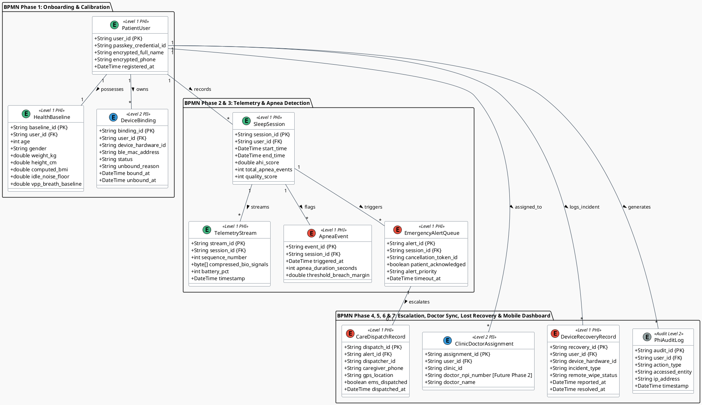

#### 📖 Data Entity Architecture & HIPAA Safeguards

The Conceptual Data Model structures database entities around the 6 process phases of the BPMN workflow, establishing strict HIPAA privacy levels:

* **Level 1 (PHI - Protected Health Information):** Requires AES-256 encryption at rest and TLS 1.3 in transit. Includes `PatientUser`, `HealthBaseline`, `SleepSession`, `TelemetryStream` (compressed raw bio-signal blobs), `ApneaEvent`, `EmergencyAlertQueue`, `CareDispatchRecord`, and `DeviceRecoveryRecord` (tracking lost device reports, session revocations, and remote wipe events). Access is gated by strict Role-Based Access Control (RBAC).
* **Level 2 (PII - Personally Identifiable Information):** Technical metadata and device identifiers (`DeviceBinding`, `ClinicDoctorAssignment`).
* **Level 2 (Audit):** `PhiAuditLog` — an immutable, write-once audit log capturing every access event, read operation, unbinding request, remote wipe signal, and dispatch action across the platform.


---

### 2.2 Data Traceability Matrix: BPMN Process Data Requirements $\rightarrow$ PlantUML Entities

| BPMN Process Phase | Data Produced / Transformed in Workflow | Derived PlantUML Conceptual Entity | Key Data Attributes | HIPAA Safeguard Level |
| :--- | :--- | :--- | :--- | :--- |
| **Phase 1: Onboarding & Calibration** | Passkey FIDO2 token, age, weight, height, computed BMI, $N_{\text{idle}}$ noise floor, $V_{pp}$ breath baseline, BLE MAC address. | `PatientUser`, `HealthBaseline`, `DeviceBinding` | `user_id`, `passkey_credential_id`, `age`, `weight_kg`, `height_cm`, `computed_bmi`, `idle_noise_floor`, `device_hardware_id`. | **Level 1 (PHI)** — AES-256 Encryption at Rest. |
| **Phase 2: Overnight Telemetry** | 100ms raw airflow samples, 10s webhook stream batch, sequence number, heartbeats, battery level. | `SleepSession`, `TelemetryStream` | `session_id`, `user_id`, `start_time`, `sequence_number`, `compressed_bio_signals`, `battery_pct`. | **Level 1 (PHI)** — Compressed AES-256 Time-Series Blob. |
| **Phase 3: Apnea & Tier-1 Alarm** | Airflow stop timestamp, apnea duration (>10s), peak-to-trough breach margin, 30s cancellation token, "I'm Safe" tap timestamp. | `ApneaEvent`, `EmergencyAlertQueue` | `event_id`, `session_id`, `triggered_at`, `apnea_duration_seconds`, `patient_acknowledged`, `cancellation_token_id`. | **Level 1 (PHI)** — Real-Time Alert Event Queue. |
| **Phase 4: Emergency Center & Caregiver** | GPS coordinates, address, emergency contact phone, dispatcher action log, SMS/Voice call dispatch timestamp, EMS status. | `CareDispatchRecord`, `ClinicDoctorAssignment` | `dispatch_id`, `alert_id`, `dispatcher_id`, `caregiver_phone`, `gps_location`, `ems_dispatched`, `doctor_npi_number`. | **Level 1 (PHI)** — Role-Based Access Control (RBAC). |
| **Phase 5: Morning Analytics & Doctor** | Session end time, total sleep duration, final AHI score, total apnea stops, quality score (0–100), doctor share payload. | `SleepSession`, `ClinicDoctorAssignment` | `end_time`, `total_duration_hours`, `ahi_score`, `quality_score`, `doctor_npi_number`. | **Level 1 (PHI)** — HL7 FHIR Export Stream. |
| **Phase 6: Device & Mobile Lost Recovery** | Hardware loss report, lost MAC address, WebAuthn revocation token, remote wipe execution signal, replacement hardware serial pairing. | `DeviceBinding`, `DeviceRecoveryRecord`, `PhiAuditLog` | `recovery_id`, `user_id`, `incident_type`, `remote_wipe_status`, `unbound_reason`, `reported_at`, `status`. | **Level 1 (PHI)** — Cryptographic Wipe Audit & RBAC. |
| **Phase 7: Mobile Dashboard Review & Analytics** | Morning summary metrics, AHI score, 60 FPS Skia GPU waveform data, 256-point FFT spectral peaks, date-range history filter, signed FHIR clinical export payload. | `SleepSession`, `TelemetryStream`, `PhiAuditLog` | `session_id`, `ahi_score`, `quality_score`, `total_apnea_events`, `compressed_bio_signals`, `action_type = "EXPORT_DOCTOR_REPORT"`. | **Level 1 (PHI)** — Encrypted SQLCipher DB & Signed FHIR Export. |
| **All Phases** | User ID, action performed, accessed table/entity, IP address, timestamp. | `PhiAuditLog` | `audit_id`, `user_id`, `action_type`, `accessed_entity`, `ip_address`, `timestamp`. | **Level 2 (Audit)** — Immutable Write-Once Log. |

---

## 3. 📱 Application Architecture

### 3.1 📖 Architectural Invariant (AD-7): 1-to-1 BPMN Activity to UI Flow & Sequence Mapping

> [!IMPORTANT]
> **Architectural Invariant AD-7 (BPMN Activity Traceability Rule):**  
> To guarantee a flawless, traceable end-to-end user experience (E2E UX), **every single activity (User Task or Service Task)** in the BPMN 2.0 process model MUST map directly to an explicit **UI Flow Specification** (Screen ID, Visual UI Components, User Action/Trigger, Next UI State) AND a corresponding **Sequence Diagram Specification** (Source/Target Actors, Protocol/Payload, State Mutations, Latency SLA). No BPMN task may remain an un-mapped background abstraction.

### 3.2 📖 Activity-by-Activity UI Flow & Sequence Specifications

#### 📖 Conceptual Data Model Harmonization & Payload Verification Rule
> [!IMPORTANT]
> **Data Model Verification Invariant:**  
> Every payload structure defined across the 21 sequence specifications below MUST strictly match and harmonize with the **Conceptual Data Model** entities (`PatientUser`, `HealthBaseline`, `DeviceBinding`, `SleepSession`, `TelemetryStream`, `ApneaEvent`, `EmergencyAlertQueue`, `CareDispatchRecord`, `ClinicDoctorAssignment`, `PhiAuditLog`) in [**Section 2.1**](#21-conceptual-data-model-bpmn-aligned) and the **Data Traceability Matrix** in [**Section 2.2**](#22-data-traceability-matrix-bpmn-process-data-requirements--plantuml-entities). Downstream software engineers, API developers, and database architects MUST verify that every JSON payload attribute, gRPC schema field, and database column maintains 1-to-1 name and type parity across Application Architecture and Data Architecture contracts.

#### 🏊 Swimlane 1: Patient Onboarding Activities

| BPMN Activity ID & Name | UI Flow Specification (Screen, Visuals & User Actions) | Sequence Diagram Specification (Actors, Payload, Protocol & SLA) |
| :--- | :--- | :--- |
| **`Task_PatientRegister`**<br>`Register Patient Account` | **Screen ID:** `MOB_REGISTER_ACCOUNT`<br>**Visual Components:** Account creation form (Email, Password / Federated identity creation, Terms & HIPAA Consent checkbox).<br>**User Action:** Enter credentials & tap *"Create Account"*.<br>**Next UI State:** `MOB_USER_PROFILE` on success. | **Actors:** Patient $\rightarrow$ Mobile App $\rightarrow$ Authentication Service.<br>**Protocol:** HTTPS / TLS 1.3 (Request-Reply Endpoint [IF-01]).<br>**Payload:** `{ email, password_hash, user_type: "PATIENT" }`.<br>**Processing:** Creates `PatientUser` authentication record.<br>**Latency SLA:** $< 400\text{ms}$ registration. |
| **`Task_CreateUserProfile`**<br>`Create Patient Medical Profile` | **Screen ID:** `MOB_USER_PROFILE`<br>**Visual Components:** Patient medical profile form (Demographics: Age, Weight kg, Height cm, computed BMI; Emergency Caregiver Contact Name & Phone; Attending Physician NPI).<br>**User Action:** Fill medical profile details & tap *"Save Profile"*.<br>**Next UI State:** `MOB_REGISTER_PASSKEY` on success. | **Actors:** Patient $\rightarrow$ Mobile App UI $\rightarrow$ Patient Profile API $\rightarrow$ Platform DB.<br>**Protocol:** HTTPS / TLS 1.3 (Request-Reply Endpoint [IF-02]).<br>**Payload:** `{ user_id, full_name, age, weight_kg, height_cm, computed_bmi, emergency_contact_phone, doctor_npi }`.<br>**Processing:** Stores patient demographic & medical profile record in DB.<br>**Latency SLA:** $< 500\text{ms}$ profile save. |
| **`Task_RegisterPasskey`**<br>`Register & Enroll FIDO2 Passkey` | **Screen ID:** `MOB_REGISTER_PASSKEY`<br>**Visual Components:** Passkey enrollment wizard screen. Text: *"Secure your account with biometric Passkey"*. TouchID/FaceID pulse animation.<br>**User Action:** Tap *"Enroll Passkey"* & scan Fingerprint/Face.<br>**Next UI State:** Dialog *"Passkey Enrolled ✓"*, then auto-advances to `MOB_PASSKEY_AUTH` or `MOB_CALIBRATION_STAGE1`. | **Actors:** Patient $\rightarrow$ Mobile App UI $\rightarrow$ OS Secure Enclave $\rightarrow$ Auth Service.<br>**Protocol:** WebAuthn FIDO2 Assertion over HTTPS / TLS 1.3 (Request-Reply [IF-03, IF-04]).<br>**Payload:** `{ user_id, passkey_credential_id, public_key_pem, device_hardware_id }`.<br>**Processing:** Binds hardware-backed public key to `PatientUser` record in DB.<br>**Latency SLA:** $< 600\text{ms}$ passkey enrollment. |

#### 🏊 Swimlane 2: Backoffice Operations Activities

| BPMN Activity ID & Name | UI Flow Specification (Screen, Visuals & User Actions) | Sequence Diagram Specification (Actors, Payload, Protocol & SLA) |
| :--- | :--- | :--- |
| **`Task_VerifyPatientIdentity`**<br>`Handle Passkey Login Issue & Verify Identity` | **Screen ID:** `WEB_PASSKEY_RECOVERY`<br>**Visual Components:** Out-of-band Passkey support ticket queue. Patient identity verification checklist & SMS challenge button.<br>**User Action:** Support admin reviews out-of-band identity proof & clicks *"Verify Identity for Passkey Recovery"*.<br>**Next UI State:** `WEB_DEVICE_RESET` on verification success. | **Actors:** Support Admin $\rightarrow$ Backoffice Web Portal $\rightarrow$ Patient Profile Service.<br>**Protocol:** HTTPS / TLS 1.3 (Request-Reply Endpoint [IF-05]).<br>**Payload:** `{ user_id, support_ticket_id, admin_id, verification_method: "OUT_OF_BAND_SMS" }`.<br>**Processing:** Validates patient identity & authorizes biometric Passkey reset.<br>**Latency SLA:** $< 300\text{ms}$ identity verification. |
| **`Task_BindMedicalDevice`**<br>`Revoke Stale Passkey & Unbind Sensor Device` | **Screen ID:** `WEB_DEVICE_RESET`<br>**Visual Components:** Device & Passkey credential management panel. Lists active WebAuthn passkeys and BLE sensor MAC bindings with red *"REVOKE PASSKEY & UNBIND"* button.<br>**User Action:** Admin clicks *"Revoke Stale Passkey & Unbind Sensor"*.<br>**Next UI State:** `WEB_TOKEN_ISSUE` (Displays credential revocation confirmation badge). | **Actors:** Support Admin $\rightarrow$ Backoffice Web Portal $\rightarrow$ Auth Service $\rightarrow$ Device Service.<br>**Protocol:** HTTPS / TLS 1.3 (Request-Reply Commands [IF-06, IF-07]).<br>**Payload:** `{ user_id, revoked_credential_id, device_hardware_id }`.<br>**Processing:** Revokes compromised FIDO2 keypair & unbinds lost sensor hardware.<br>**Latency SLA:** $< 400\text{ms}$ revocation operation. |
| **`Task_LockEmergencyContacts`**<br>`Issue Emergency Passkey Recovery Token` | **Screen ID:** `WEB_TOKEN_ISSUE`<br>**Visual Components:** Temporary emergency token issuance modal. Expiration timer selector (15 mins) and automated SMS dispatch button.<br>**User Action:** Admin clicks *"Issue Emergency One-Time Passkey Recovery Token"*.<br>**Next UI State:** `WEB_SUPPORT_COMPLETE` (Token sent to patient phone via encrypted SMS). | **Actors:** Support Admin $\rightarrow$ Backoffice Operations $\rightarrow$ Auth Service $\rightarrow$ Twilio SMS Gateway.<br>**Protocol:** HTTPS / TLS 1.3 + SMS API (Outbound Push [IF-08]).<br>**Payload:** `{ user_id, phone_number, expiration_minutes: 15, single_use: true }`.<br>**Processing:** Generates 256-bit cryptographically secure single-use recovery link for mobile app re-enrollment.<br>**Latency SLA:** $< 350\text{ms}$ token dispatch. |

#### 🏊 Swimlane 3: Patient Sleep Operations Activities

| BPMN Activity ID & Name | UI Flow Specification (Screen, Visuals & User Actions) | Sequence Diagram Specification (Actors, Payload, Protocol & SLA) |
| :--- | :--- | :--- |
| **`Task_PasskeyAuth`**<br>`Authenticate via Passkey (FIDO2)` | **Screen ID:** `MOB_PASSKEY_AUTH`<br>**Visual Components:** Biometric prompt modal (FaceID / TouchID / Windows Hello), Passkey pulse graphic.<br>**User Action:** Fingerprint touch or Face scan.<br>**Next UI State:** `MOB_CALIBRATION_STAGE1` on success; error toast with retry button on failure. | **Actors:** Patient $\rightarrow$ Mobile App $\rightarrow$ Authentication Service Gateway.<br>**Protocol:** WebAuthn FIDO2 Assertion over HTTPS / TLS 1.3 (Request-Reply [IF-09, IF-10]).<br>**Payload:** `{ user_id, passkey_credential_id, challenge_signature }`.<br>**Latency SLA:** $< 500\text{ms}$ authentication verification. |
| **`Task_Stage1Cal`**<br>`Execute Stage 1 Idle Noise Calibration` | **Screen ID:** `MOB_CALIBRATION_STAGE1`<br>**Visual Components:** Full-screen step 1 wizard. Text: *"Place sensor on bedside table, remain silent"*. 10s circular progress ring + ambient sound wave indicator ($N_{\text{idle}}$ sampling).<br>**User Action:** Tap *"Start 10s Calibration"*.<br>**Next UI State:** Auto-advances to `MOB_CALIBRATION_STAGE2` upon 100% completion. | **Actors:** Mobile App Edge $\leftarrow$ BLE GATT Sensor (`0x2A37` characteristic).<br>**Protocol:** BLE GATT AES-128 Notification Stream @ 10Hz [IF-11].<br>**Payload:** 100 differential pressure samples.<br>**Processing:** Local Dart Isolate computes $N_{\text{idle}}$ baseline noise floor.<br>**Latency SLA:** Exactly $10.0\text{s}$ window sampling. |
| **`Task_Stage2Cal`**<br>`Execute Stage 2 Active Breath Calibration` | **Screen ID:** `MOB_CALIBRATION_STAGE2`<br>**Visual Components:** Step 2 wizard. Text: *"Attach mask/sensor and take 5 normal breaths"*. Real-time canvas rendering peak-to-trough breath wave ($V_{pp}$).<br>**User Action:** Breathe normally into sensor for 30s.<br>**Next UI State:** Dialog *"Baseline Verified ✓"*, then transitions to `MOB_SLEEP_MONITOR`. | **Actors:** Mobile App Edge $\leftarrow$ BLE GATT Sensor $\rightarrow$ Local Hive DB.<br>**Protocol:** BLE GATT notifications $\rightarrow$ FFT Signal Processing Isolate [IF-11].<br>**Payload:** `{ idle_noise_floor, vpp_breath_baseline, apnea_threshold = 0.10 * vpp }`.<br>**Processing:** Calculates moving average peak-to-trough breathing baseline.<br>**Latency SLA:** $30.0\text{s}$ calibration window. |
| **`Task_SleepMonitoring`**<br>`Sleep with Device Attached` | **Screen ID:** `MOB_SLEEP_MONITOR`<br>**Visual Components:** Low-power Night Mode (0-FPS locked black display `#000000` with subtle dim pulsing green heartbeat dot). Screen touch locked to prevent accidental keypresses.<br>**User Action:** None (User sleeps).<br>**Next UI State:** Remains dark until morning unlock OR pops `MOB_TIER1_ALARM` if airflow breach detected. | **Actors:** Patient $\rightarrow$ Sensor BLE GATT $\rightarrow$ Mobile Circular RAM Buffer.<br>**Protocol:** BLE GATT AES-128 @ 100ms interval [IF-11] + HTTPS/gRPC Batch Stream [IF-12].<br>**Payload:** 100ms bio-signal stream array.<br>**Processing:** 1-hour circular RAM ring buffer maintains sliding window.<br>**Latency SLA:** Continuous 10Hz stream processing. |
| **`Task_TapSafe`**<br>`Tap 'I'm Safe' Button` | **Screen ID:** `MOB_TIER1_ALARM`<br>**Visual Components:** High-priority visual alert overlay (Flashing 100% brightness red/yellow `#FF3B30`, pulsating 120dB audio siren, haptic vibration). Large central button: *"I'M SAFE - DISMISS ALARM"*. 30s countdown timer display.<br>**User Action:** Single tap on *"I'm Safe"* button.<br>**Next UI State:** `MOB_ALARM_CANCELED` (Silences alarm, returns to `MOB_SLEEP_MONITOR`). | **Actors:** Patient $\rightarrow$ Mobile UI Driver $\rightarrow$ Local Audio Engine $\rightarrow$ Application DB.<br>**Protocol:** Local UI Touch Event + Request-Reply Cancellation Payload.<br>**Payload:** `{ session_id, cancellation_token_id, acknowledged_at, tap_lat_long }`.<br>**Processing:** Cancels 30s cancellation token timer; updates `patient_acknowledged = true`.<br>**Latency SLA:** $< 50\text{ms}$ local audio/haptic shutdown. |
| **`Task_EndSession`**<br>`Tap 'End Sleep Session'` | **Screen ID:** `MOB_SLEEP_SUMMARY`<br>**Visual Components:** Morning sleep summary dashboard. Displays total sleep hours (e.g., 7h 45m), overnight AHI score (e.g., AHI 3.2 - Normal), respiration wave timeline chart, and *"Share with Physician"* button.<br>**User Action:** Tap *"End Sleep Session"*.<br>**Next UI State:** Home Screen / Session Archive. | **Actors:** Patient $\rightarrow$ Mobile App $\rightarrow$ Cloud Session API.<br>**Protocol:** HTTPS / TLS 1.3 (Request-Reply [IF-16]).<br>**Payload:** `{ session_id, end_time, total_duration_seconds, final_ahi_score }`.<br>**Processing:** Closes BLE connection, computes final AHI index, syncs report.<br>**Latency SLA:** $< 1.0\text{s}$ report generation. |

#### 🏊 Swimlane 4: Emergency Center Activities

| BPMN Activity ID & Name | UI Flow Specification (Screen, Visuals & User Actions) | Sequence Diagram Specification (Actors, Payload, Protocol & SLA) |
| :--- | :--- | :--- |
| **`Task_DashboardAlert`**<br>`Command Center Dashboard Alert Pop-up` | **Screen ID:** `WEB_COMMAND_DASHBOARD`<br>**Visual Components:** High-contrast red modal popup (`#D32F2F`) overlays command center screen. Audio siren chime. Displays patient name, age, phone, AHI score, elapsed apnea time, and large *"ACCEPT DISPATCH"* button.<br>**User Action:** Auto-pop on WSS message; dispatcher clicks *"Accept Dispatch"*.<br>**Next UI State:** Opens `WEB_EMERGENCY_MAP_VIEW`. | **Actors:** Command Portal React Client $\leftarrow$ WebSocket Gateway Node.<br>**Protocol:** WSS TLS 1.3 (Real-Time Push Notification [IF-13]).<br>**Payload:** Emergency Alert Frame.<br>**Processing:** Auto-focuses modal cursor, triggers audio chime, locks dispatcher session to alert.<br>**Latency SLA:** $< 100\text{ms}$ UI pop-up render. |
| **`Task_MetricCollection`**<br>`Collect Emergency Alert Metrics` | **Screen ID:** Background Service / Operational Console.<br>**Visual Components:** Real-time metrics widget showing dispatcher response times, call latency counters, and SLA compliance indicators.<br>**User Action:** Automated system collection upon alert trigger & dispatcher response.<br>**Next UI State:** Logs operational metrics to `PhiAuditLog` and updates telemetry dashboard. | **Actors:** Emergency Center Backend $\rightarrow$ Application DB $\rightarrow$ PhiAuditLog.<br>**Protocol:** gRPC / HTTP/2 (Asynchronous One-Way Audit Stream [IF-19]).<br>**Payload:** `{ alert_id, session_id, alert_received_at, dispatcher_ack_at, caregiver_call_lat_ms }`.<br>**Processing:** Records SLA performance metrics and operational logs.<br>**Latency SLA:** $< 100\text{ms}$ metrics aggregation. |
| **`Task_CaregiverCall`**<br>`Trigger Voice Call & SMS to Caregiver` | **Screen ID:** `WEB_CAREGIVER_PANEL`<br>**Visual Components:** Telephony status card showing caregiver name, relationship, phone number, and real-time status pill (`DIALING` $\rightarrow$ `RINGING` $\rightarrow$ `ANSWERED` / `NO_ANSWER`).<br>**User Action:** 1-Click trigger or automated 5s fall-through.<br>**Next UI State:** Updates panel status pill to `CALL_IN_PROGRESS`. | **Actors:** Command Portal Backend $\rightarrow$ Twilio Telephony Gateway API $\rightarrow$ Caregiver Phone.<br>**Protocol:** HTTPS / TLS 1.3 (Outbound Webhook Push [IF-14]).<br>**Payload:** `{ to: caregiver_phone, text: "EMERGENCY: Sleep apnea alert for [Patient Name]. Please check immediately.", voice_twiml_url }`.<br>**Processing:** Triggers automated voice call & priority SMS to caregiver.<br>**Latency SLA:** $< 2.0\text{s}$ call initiation. |
| **`Task_DispatchEMS`**<br>`Dispatch Local EMS / 911 Responders` | **Screen ID:** `WEB_EMS_DISPATCH_MODAL`<br>**Visual Components:** 911 Computer-Aided Dispatch (CAD) integration panel. Displays dispatch confirmation ID, estimated EMS ETA, and notes entry box.<br>**User Action:** Dispatcher clicks *"DISPATCH EMS / 911 NOW"*.<br>**Next UI State:** `WEB_DISPATCH_COMPLETE` (Shows active EMS unit tracking & audit confirmation). | **Actors:** Dispatcher $\rightarrow$ Command Portal $\rightarrow$ Local EMS CAD Gateway API $\rightarrow$ CareDispatchRecord.<br>**Protocol:** HTTPS / TLS 1.3 (Request-Reply CAD Gateway [IF-15]).<br>**Payload:** `{ alert_id, patient_name, gps_lat_long, street_address, medical_condition: "NOCTURNAL_APNEA_STOP" }`.<br>**Processing:** Confirms CAD order; updates `CareDispatchRecord` (`ems_dispatched = true`).<br>**Latency SLA:** $< 500\text{ms}$ CAD response confirmation. |

#### 🏊 Swimlane 5: Clinic & Physician Activities

| BPMN Activity ID & Name | UI Flow Specification (Screen, Visuals & User Actions) | Sequence Diagram Specification (Actors, Payload, Protocol & SLA) |
| :--- | :--- | :--- |
| **`Task_PhysicianReview`**<br>`Physician Reviews AHI Classification & Signs Diagnosis` | **Screen ID:** `WEB_PHYSICIAN_PATIENT_DETAIL`<br>**Visual Components:** Patient medical detail view. Real-time alert badge *"Morning Sleep Report Ready"*, 8-hour respiration wave graphs, AHI trend breakdown (Normal/Mild/Moderate/Severe), and clinical note entry box.<br>**User Action:** Physician reviews AHI graph, inputs clinical notes, & taps *"Sign & Save Diagnosis"*.<br>**Next UI State:** `WEB_DIAGNOSIS_SIGNED` (Diagnostic report locked & appended to patient medical chart). | **Actors:** Cloud Session API $\rightarrow$ Attending Sleep Specialist Physician $\rightarrow$ Clinic Web Portal $\rightarrow$ Application DB.<br>**Protocol:** HTTPS / TLS 1.3 (Request-Reply Transactions [IF-17, IF-18]).<br>**Payload:** `{ session_id, patient_id, doctor_npi, ahi_score, diagnostic_notes, prescription_adjustment }`.<br>**Processing:** Syncs morning report, stores physician signature & diagnostic notes, and updates patient chart.<br>**Latency SLA:** $< 400\text{ms}$ diagnosis save & sync. |

#### 🏊 Swimlane 6: Device Loss & Mobile Recovery Activities

| BPMN Activity ID & Name | UI Flow Specification (Screen, Visuals & User Actions) | Sequence Diagram Specification (Actors, Payload, Protocol & SLA) |
| :--- | :--- | :--- |
| **`Task_ReportDeviceLost`**<br>`Report D-BAND Sensor Lost / Stolen` | **Screen ID:** `MOB_REPORT_DEVICE_LOST` / `WEB_REPORT_DEVICE_LOST`<br>**Visual Components:** Device status management card displaying active D-BAND serial & MAC address with red *"UNBIND & REPORT LOST"* button.<br>**User Action:** Patient or support rep taps *"Unbind & Report Sensor Lost"*.<br>**Next UI State:** `MOB_DEVICE_UNBOUND_SUCCESS` (Shows status pill `DEPRECATED/LOST`). | **Actors:** Mobile App / Web Portal $\rightarrow$ Device Management Service $\rightarrow$ Application DB.<br>**Protocol:** HTTPS / TLS 1.3 (Request-Reply Command [IF-20]).<br>**Payload:** `{ user_id, device_hardware_id, reason: "LOST_OR_STOLEN" }`.<br>**Processing:** Marks device `DEPRECATED/LOST`, revokes BLE binding, emits audit log.<br>**Latency SLA:** $< 300\text{ms}$ unbind execution. |
| **`Task_ReportMobileLost`**<br>`Report Mobile Phone Lost / Stolen` | **Screen ID:** `WEB_REPORT_MOBILE_LOST`<br>**Visual Components:** Web self-service portal screen for lost phone report. Lists paired mobile devices with red *"REVOKE SESSION & REMOTE WIPE"* button.<br>**User Action:** Patient or caregiver clicks *"Revoke All Mobile Sessions & Wipe PHI"*.<br>**Next UI State:** `WEB_SESSION_REVOKED_SUCCESS` (Confirms JWT token revocation & push wipe). | **Actors:** Web Portal $\rightarrow$ Auth Service $\rightarrow$ Push Notification Service.<br>**Protocol:** HTTPS / TLS 1.3 (Request-Reply Command [IF-21]).<br>**Payload:** `{ user_id, mobile_device_id, trigger_wipe: true }`.<br>**Processing:** Revokes all active JWT tokens, invalidates WebAuthn credentials, issues wipe payload.<br>**Latency SLA:** $< 250\text{ms}$ session revocation. |
| **`Task_TriggerRemoteWipe`**<br>`Issue Cryptographic Remote Wipe Signal` | **Screen ID:** Background System Service / Client OS Notification Receiver.<br>**Visual Components:** OS background task receiver listening for remote wipe payload or 10 failed Passkey retries.<br>**User Action:** Automated client execution upon push notification or local threshold breach.<br>**Next UI State:** App self-terminates and redirects to initial OS launch screen. | **Actors:** Cloud Push Service $\rightarrow$ Client Edge OS $\rightarrow$ Local SQLCipher DB & OS Secure Enclave.<br>**Protocol:** Encrypted Push Notification / Local Security Event.<br>**Payload:** `{ command: "REMOTE_WIPE_ZEROIZATION", user_id }`.<br>**Processing:** Sub-1s zeroization deleting local Hive/SQLCipher databases & Secure Enclave keys.<br>**Latency SLA:** $< 1.0\text{s}$ wipe execution. |
| **`Task_RebindReplacementDevice`**<br>`Pair & Bind Replacement D-BAND Device` | **Screen ID:** `MOB_REBIND_DEVICE`<br>**Visual Components:** BLE discovery screen. Displays available replacement D-BAND sensors with *"PAIR & BIND REPLACEMENT"* button.<br>**User Action:** Tap *"Pair & Bind Replacement Sensor"*.<br>**Next UI State:** `MOB_DEVICE_BOUND_SUCCESS` (Returns to Home / Bedtime Calibration). | **Actors:** Patient $\rightarrow$ Mobile App $\rightarrow$ Device Management Service $\rightarrow$ Application DB.<br>**Protocol:** BLE GATT Pairing + HTTPS / TLS 1.3 (`POST /api/v1/devices/bind` [IF-22]).<br>**Payload:** `{ user_id, new_device_hardware_id, new_ble_mac_address }`.<br>**Processing:** Binds new D-BAND sensor to user profile; retains cloud sleep history.<br>**Latency SLA:** $< 500\text{ms}$ re-binding API. |

#### 🏊 Swimlane 7: Mobile Dashboard Review & Analytics Activities

| BPMN Activity ID & Name | UI Flow Specification (Screen, Visuals & User Actions) | Sequence Diagram Specification (Actors, Payload, Protocol & SLA) |
| :--- | :--- | :--- |
| **`Task_ReviewMorningSummary`**<br>`Review Morning Sleep Summary & AHI Score` | **Screen ID:** `MOB_SLEEP_SUMMARY`<br>**Visual Components:** Morning sleep summary card. Displays total sleep duration (e.g. 7h 45m), AHI score badge (e.g., `AHI 3.2 - Normal`), intervention count, and quality score ring.<br>**User Action:** Patient views morning metrics & taps *"Inspect Respiration Waveform"*.<br>**Next UI State:** `MOB_GRAPH_WAVEFORM`. | **Actors:** Patient $\rightarrow$ Mobile App UI $\rightarrow$ Application DB.<br>**Protocol:** Local SQLCipher Query / HTTPS TLS 1.3 Endpoint [IF-16].<br>**Payload:** `{ session_id, duration_seconds, ahi_score, quality_score, intervention_count }`.<br>**Processing:** Renders morning sleep metrics summary.<br>**Latency SLA:** $< 200\text{ms}$ rendering SLA. |
| **`Task_InspectRespirationWaveform`**<br>`Inspect Respiration Waveform & FFT Spectrum` | **Screen ID:** `MOB_GRAPH_WAVEFORM`<br>**Visual Components:** Interactive 60 FPS Skia GPU waveform line chart (`fl_chart`), 256-point FFT spectral peak bar graph, and SpO2 trend timeline.<br>**User Action:** Pinch-to-zoom, pan across overnight telemetry, & toggle FFT magnitude spectrum.<br>**Next UI State:** `MOB_HISTORY_FILTER`. | **Actors:** Mobile App Edge UI $\rightarrow$ Skia GPU Layer $\rightarrow$ FFT Isolate.<br>**Protocol:** Local Flutter Render Pipeline + Dart Isolate Memory Buffer.<br>**Payload:** `{ 10Hz_telemetry_array, 256_pt_fft_spectrum, respiration_rate_bpm }`.<br>**Processing:** Hardware accelerated Skia GPU chart rendering.<br>**Latency SLA:** Continuous 60 FPS smooth rendering. |
| **`Task_FilterHistoricalSessions`**<br>`Filter Historical Sleep Sessions & Trends` | **Screen ID:** `MOB_HISTORY_FILTER`<br>**Visual Components:** Calendar history view with date range pickers, severity filters (All, Normal, Hypopnea, Apnea), and list of past sleep sessions.<br>**User Action:** Select date range & tap *"Apply Severity Filter"*.<br>**Next UI State:** Updates session history list with filtered metrics. | **Actors:** Patient $\rightarrow$ Mobile App UI $\rightarrow$ Local Encrypted SQLCipher DB.<br>**Protocol:** Encrypted Local SQL Query (Request-Reply).<br>**Payload:** `{ start_date, end_date, severity_filter: "ALL" }`.<br>**Processing:** Queries local encrypted database history.<br>**Latency SLA:** $< 150\text{ms}$ local query SLA. |
| **`Task_ExportDoctorReport`**<br>`Generate Signed Clinical Report for Physician` | **Screen ID:** `MOB_EXPORT_DOCTOR_REPORT`<br>**Visual Components:** Doctor report export modal with FHIR JSON preview, PDF chart generator button, and *"Share with Physician"* button.<br>**User Action:** Patient taps *"Generate Signed Report & Share with Doctor"*.<br>**Next UI State:** Launches native OS share sheet with signed PDF / JSON clinical chart. | **Actors:** Patient $\rightarrow$ Mobile App UI $\rightarrow$ Patient Profile Service.<br>**Protocol:** HTTPS / TLS 1.3 (Request-Reply [IF-17, IF-18]).<br>**Payload:** `{ patient_id, session_id, fhir_json_payload, digital_signature }`.<br>**Processing:** Formats FHIR JSON and generates signed PDF chart.<br>**Latency SLA:** $< 800\text{ms}$ report generation. |

#### 📖 Guidance for Downstream Workflows (PRD, UX & Code Implementation)
> [!TIP]
> **Traceability & UX Alignment:**  
> 1. **UX Designers:** Must reference the Screen IDs (`MOB_PASSKEY_AUTH`, `MOB_CALIBRATION_STAGE1`, `MOB_TIER1_ALARM`, `WEB_COMMAND_DASHBOARD`, `MOB_REPORT_DEVICE_LOST`, `WEB_REPORT_MOBILE_LOST`) defined in Section 3.2 when constructing wireframes and Figma components.  
> 2. **Frontend Developers (Flutter & React):** Every UI screen must implement the exact state transitions and visual feedback mechanisms specified in the UI Flow tables.  

---

### 3.3 🧩 C4 Level 3: Component Diagram — Participant-to-Component Mapping

The **C4 Level 3 Component Diagram** decomposes the C4 Level 2 Containers into granular software components, defining the internal structural units responsible for executing platform capabilities. 

> [!IMPORTANT]
> **Architectural Invariant AD-8 (Sequence Participant Traceability Rule):**  
> Every participant line in the downstream **End-to-End Sequence Diagrams (Section 3.5)** MUST represent an explicit, deployable node or component defined in this C4 Component Diagram. No sequence diagram participant may exist without a corresponding 1-to-1 C4 Component definition.

```plantuml
@startuml C4_Level3_Component_Diagram
!include https://raw.githubusercontent.com/plantuml-stdlib/C4-PlantUML/master/C4_Component.puml
scale 0.7

LAYOUT_WITH_LEGEND()

title C4 Level 3: Component Diagram — Participant-to-Component Traceability

Person(patient, "Patient", "At-home user wearing breathing device.")
Person(dispatcher, "Emergency Dispatcher", "24/7 emergency command center operator.")
Person(doctor, "Physician / Specialist", "Attending sleep clinician.")
Person(admin, "Backoffice Admin", "Platform administrator managing verification, device binding, and caregiver locks.")

Container_Boundary(mobile_edge, "Mobile Edge Client & Hardware (At-Home)") {
    Component(hardware, "Small Breathing Device", "Embedded Hardware Sensor", "Captures raw airflow differential pressure; streams 100ms GATT packets via BLE.")
    Component(ble_receiver, "BLE Background Receiver Service", "Android Foreground Service / iOS bluetooth-central + RxDart", "Starts at app boot; DI-binds one IBLESensorDriver (physical or simulator) and pushes every 10Hz sample into a single process-wide BehaviorSubject<double> unified queue (AD-12).")
    Component(app_ui, "Patient App UI", "Flutter Screen Controllers", "Renders MOB_REGISTER_ACCOUNT, MOB_USER_PROFILE, MOB_REGISTER_PASSKEY, MOB_PASSKEY_AUTH, MOB_CALIBRATION, MOB_SLEEP_MONITOR, MOB_TIER1_ALARM; subscribes to the unified queue for calibration & monitoring.")
    Component(secure_enclave, "Secure Enclave", "OS Biometric Enclave", "Executes WebAuthn FIDO2 private key generation, challenge signing, and local biometric verification.")
}

Container_Boundary(cloud_services, "Backend Microservices Platform") {
    Component(auth_svc, "Auth Service", "WebAuthn / FIDO2 Service", "Manages passwordless Passkey token enrollment, challenge nonces, and JWT session token generation.")
    Component(profile_svc, "Patient Profile Service", "REST Microservice", "Manages patient demographics, computed BMI, and locked caregiver emergency contact records.")
    Component(device_svc, "Device Management Service", "REST Microservice", "Manages hardware sensor bindings, barcode serial validation, and MAC address registration.")
    Component(audit_svc, "Audit Service", "HIPAA Log Engine", "Receives asynchronous one-way audit streams and writes immutable entries to PhiAuditLog.")
    Component(data_streaming_svc, "Data Streaming Service", "Event Ingestion Engine", "High-throughput webhook gateway ingesting 10s compressed bio-signal batches and 30s unacknowledged emergency pushes.")
    Component(stream_workers, "Stream Processing Workers", "gRPC Container Workers", "Executes 2-stage noise/breath calibration isolate algorithms and AASM 90%/30% apnea breach detection rules.")
    Component(telephony_svc, "Telephony Service", "Twilio Gateway Client", "Automates voice calls and priority SMS dispatch to locked caregiver emergency contacts.")
    Component(ems_gateway, "EMS CAD Gateway", "911 REST Client", "Dispatches CAD emergency orders to local 911 dispatch centers upon Tier-2 escalation.")
}

Container_Boundary(web_portals, "Web Operations Portals") {
    Component(backoffice_portal, "Backoffice Web Portal", "React / REST Dashboard", "Renders WEB_BACKOFFICE_VERIFICATION, WEB_DEVICE_BINDING, and WEB_CAREGIVER_LOCK panels.")
    Component(command_portal, "Emergency Center Web Portal", "React / WSS Dashboard", "Displays real-time alert pop-up modals (WEB_COMMAND_DASHBOARD), Mapbox patient GPS, and dispatcher action controls.")
    Component(clinic_portal, "Clinic & Physician Portal", "React / REST Dashboard", "Syncs morning sleep summaries, AHI trend graphs, and physician diagnostic notes.")
}

ContainerDb(app_db, "Application Database", "Relational / Document DB", "Stores PatientUser, HealthBaseline, DeviceBinding, SleepSession, ApneaEvent, EmergencyAlertQueue, CareDispatchRecord.")
ContainerDb(timeseries_db, "Bio-Signal Time-Series Store", "Columnar Time-Series DB", "Stores compressed 100ms bio-signal telemetry streams.")

Rel(patient, app_ui, "PatientUser credentials & HealthBaseline inputs")
Rel(hardware, ble_receiver, "100ms BLE GATT AES-128 Notification Stream")
Rel(ble_receiver, app_ui, "Unified BehaviorSubject<double> bio-signal stream (calibration + monitoring subscribers)")
Rel(app_ui, secure_enclave, "PatientUser passkey_credential_id & challenge nonces")
Rel(app_ui, auth_svc, "PatientUser registration payload & passkey WebAuthn assertion")
Rel(app_ui, profile_svc, "HealthBaseline (age, weight, height, BMI) & PatientUser caregiver_phone")
Rel(app_ui, data_streaming_svc, "TelemetryStream 10s compressed batches & EmergencyAlertQueue 30s alarms")

Rel(admin, backoffice_portal, "Patient eligibility approvals, sensor serial scans & caregiver lock commands")
Rel(backoffice_portal, profile_svc, "PatientUser eligibility verification payload & caregiver lock requests")
Rel(backoffice_portal, device_svc, "DeviceBinding hardware serial & BLE MAC address registration")
Rel(device_svc, app_db, "Writes DeviceBinding records")
Rel(device_svc, audit_svc, "PhiAuditLog (Device Binding Events)")

Rel(auth_svc, audit_svc, "PhiAuditLog (Auth Events)")
Rel(profile_svc, audit_svc, "PhiAuditLog (Profile Updates)")
Rel(data_streaming_svc, stream_workers, "TelemetryStream batches & ApneaEvent triggers")
Rel(stream_workers, timeseries_db, "TelemetryStream compressed bio-signal blobs")
Rel(stream_workers, app_db, "SleepSession metrics, ApneaEvent records & EmergencyAlertQueue items")

Rel(app_db, command_portal, "EmergencyAlertQueue items & CareDispatchRecord GPS coordinates")
Rel(dispatcher, command_portal, "CareDispatchRecord dispatcher actions & EMS dispatch commands")
Rel(command_portal, telephony_svc, "PatientUser caregiver_phone & CareDispatchRecord payloads")
Rel(command_portal, ems_gateway, "CareDispatchRecord 911 CAD order & GPS coordinates")
Rel(command_portal, audit_svc, "PhiAuditLog (Dispatch Audit Logs)")

Rel(app_db, clinic_portal, "SleepSession morning summaries & HealthBaseline AHI trends")
Rel(doctor, clinic_portal, "ClinicDoctorAssignment diagnostic notes & AHI reviews")

@enduml
```

#### 📖 Participant-to-C4-Component Traceability Matrix

| Sequence Diagram Participant Line | Parent C4 Container | C4 Component Node | Mapped Application Entity / Payload | Architectural Responsibility |
| :--- | :--- | :--- | :--- | :--- |
| **`User`** | External Actor | `Patient` / `Dispatcher` / `Physician` / `Backoffice Admin` | `PatientUser` / Human Actor | Human actor triggering UI events or reviewing healthcare dashboards. |
| **`Small Breathing Device (Sensor)`** | Hardware Device | `Small Breathing Device` | Differential Pressure Stream | Embedded hardware sensor sampling differential pressure and streaming 100ms BLE GATT notifications. |
| **`BLE Background Receiver Service (Receiver)`** | `Mobile Application` | `BLE Background Receiver Service` | `TelemetryStream` (on-device, pre-batch) | Boot-time Android Foreground Service / iOS `bluetooth-central` singleton; DI-binds one `IBLESensorDriver` and pushes every 10Hz sample into the single process-wide `BehaviorSubject<double>` unified queue consumed by Stage-1/Stage-2 calibration and 8+ h monitoring (`AD-11`, `AD-12`, PRD `FR-1.11`). |
| **`Backoffice Admin (Admin)`** | External Actor | `Backoffice Admin` | Human Administrator | Verifies patient identity, scans sensor barcodes, and locks caregiver contacts. |
| **`Patient App UI (UI)`** | `Mobile Application` | `Patient App UI` | `PatientUser`, `HealthBaseline` | Renders Flutter onboarding, calibration, sleep monitoring, and Tier-1 alarm screens. |
| **`Backoffice Web Portal (Admin UI)`** | `Web Operations Portals` | `Backoffice Web Portal` | `PatientUser`, `DeviceBinding` | Renders web panels for identity verification, device pairing, and caregiver contact locks. |
| **`Secure Enclave (Enclave)`** | `Mobile Application` | `Secure Enclave` | `PatientUser (passkey_credential_id)` | OS biometrics module executing WebAuthn keypair generation and FIDO2 challenge signing. |
| **`Auth Service (AuthSvc)`** | `Authentication Service` | `Auth Service` | `PatientUser` | WebAuthn FIDO2 microservice issuing enrollment/authentication challenges and JWT session tokens. |
| **`Profile Service (ProfileSvc)`** | `Backend Platform Services` | `Patient Profile Service` | `HealthBaseline`, `PatientUser` | REST microservice capturing patient demographics, BMI, and locked caregiver emergency contacts. |
| **`Device Management Service (DeviceSvc)`** | `Backend Platform Services` | `Device Management Service` | `DeviceBinding` | REST microservice managing BLE sensor MAC bindings, barcode serial validation, and device inventory. |
| **`Audit Service (AuditSvc)`** | `Backend Platform Services` | `Audit Service` | `PhiAuditLog` | Non-blocking HIPAA compliance service writing write-once audit logs to `PhiAuditLog`. |
| **`Data Streaming Service`** | `Data Streaming Service` | `Data Streaming Service` | `TelemetryStream`, `EmergencyAlertQueue` | High-throughput event ingestion engine handling 10s bio-signal batches and 30s emergency pushes. |
| **`Stream Processing Workers`** | `Stream Processing Workers` | `Stream Processing Workers` | `TelemetryStream`, `ApneaEvent`, `SleepSession` | gRPC container workers executing calibration FFT analysis and AASM 90%/30% apnea breach detection rules. |
| **`Emergency Center Web Portal`** | `Emergency Center Web Portal` | `Emergency Center Web Portal` | `EmergencyAlertQueue`, `CareDispatchRecord` | React WSS dashboard displaying alert pop-ups, Mapbox GPS geocoding, and dispatch action buttons. |
| **`Telephony Service`** | `Backend Platform Services` | `Telephony Service` | `CareDispatchRecord`, `PatientUser` | Automated Twilio telephony client triggering voice calls and priority SMS to emergency contacts. |
| **`EMS CAD Gateway`** | `Backend Platform Services` | `EMS CAD Gateway` | `CareDispatchRecord` | Integration gateway initiating 911 Computer-Aided Dispatch (CAD) emergency responder orders. |
| **`Clinic Portal Backend`** | `Clinic & Physician Portal` | `Clinic & Physician Portal` | `SleepSession`, `ClinicDoctorAssignment` | Web backend syncing morning sleep scores, AHI trends, and physician diagnostic notes. |
| **`Application Database (DB)`** | `Application Database` | `Application Database` | All Primary Application Entities | Relational/Document database persisting user state, health baselines, device bindings, and alert queues. |
| **`Bio-Signal Time-Series Store`** | `Bio-Signal Time-Series Store` | `Bio-Signal Time-Series Store` | `TelemetryStream` | Columnar database storing compressed high-frequency bio-signal streams. |ime-Series Store` | `Bio-Signal Time-Series Store` | `TelemetryStream` | Columnar database storing compressed high-frequency bio-signal streams. |

---

### 3.4 📊 Application Entity-Relationship (ER) Model

The **Application Entity-Relationship (ER) Model** formalizes the physical relational and document schema relationships governing data persistence across the `Application Database` and `Bio-Signal Time-Series Store`. 

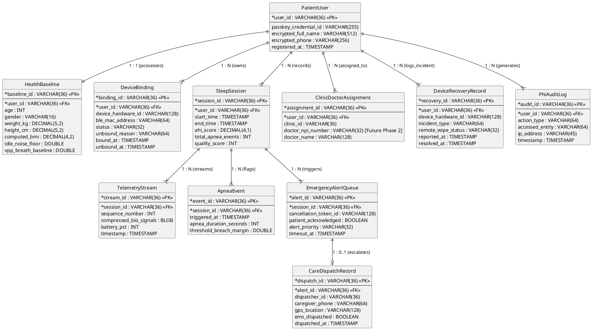

---

### 3.5 📖 End-to-End Sequence Diagrams (PlantUML)

To deliver a fully verifiable, end-to-end user experience, the detailed interaction flows between actors, edge mobile clients, backend services, and storage tiers are formalized in PlantUML sequence diagrams.

#### 📖 UML Line Notation Invariants (User Action vs. Behind-the-Scenes Integrations)
> [!NOTE]
> **Sequence Line Notation & Activation Lifecycle Standard:**  
> 1. **Solid Lines (`->` / `→`):** Represent **user-facing interaction triggers and final UI state returns** (`Patient -> UI` and `UI -> Patient`).
> 2. **Dashed/Dotted Lines (`-->` / `⋯>`):** Represent **behind-the-scenes asynchronous & microservice integrations** on the right-hand side of the active UI lifeline (`activate UI`). Once the user initiates passkey authentication, the App UI remains activated while all gateway requests, FIDO2 challenge queries, Secure Enclave biometric signatures, server verification, and audit logging execute behind the scenes via dotted integration lines until the UI returns state to the user.

#### 3.5.1 🚀 End-to-End Sequence Diagram 1: Patient Onboarding Journey Flow (`Task_PatientRegister`, `Task_CreateUserProfile`, `Task_RegisterPasskey`)

This end-to-end sequence diagram models the multi-stage **Patient Onboarding Journey**, encapsulating account registration (`Task_PatientRegister`), medical profile & emergency caregiver contact setup (`Task_CreateUserProfile`), and hardware-backed FIDO2 Passkey credential enrollment (`Task_RegisterPasskey`).

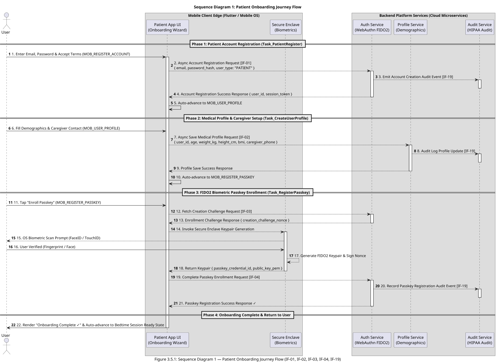

#### 📖 Detailed End-to-End Execution Flow Narrative (`Patient Onboarding Journey`)

The **Patient Onboarding Journey** (`Task_PatientRegister` $\rightarrow$ `Task_CreateUserProfile` $\rightarrow$ `Task_RegisterPasskey`) establishes a HIPAA-compliant patient identity, captures essential demographic & emergency contact parameters, and registers a hardware-isolated FIDO2 Passkey prior to bedtime sleep monitoring:

1. **Phase 1: Patient Account Registration (`Task_PatientRegister`):**  
   The onboarding journey begins when the patient launches the mobile application for the first time and enters their email, password, and accepts HIPAA privacy terms on `MOB_REGISTER_ACCOUNT`. The App UI triggers an asynchronous account registration integration flow (`IF-01`) to the **Auth Service**. The Auth Service provisions the account, emits a non-blocking audit event (`IF-19`) to the **Audit Service**, and returns a registration success response with a session token. The App UI automatically transitions to `MOB_USER_PROFILE`.

2. **Phase 2: Medical Profile & Caregiver Setup (`Task_CreateUserProfile`):**  
   The patient inputs demographic metadata (age, height, weight, computed BMI) and caregiver emergency contact numbers on `MOB_USER_PROFILE`. The App UI triggers an asynchronous medical profile setup integration flow (`IF-02`) to the **Profile Service**. The Profile Service validates emergency contact phone formats, stores the profile in the database, emits a HIPAA audit entry (`IF-19`), and returns a profile saved success response. The App UI automatically advances to `MOB_REGISTER_PASSKEY`.

3. **Phase 3: FIDO2 Biometric Passkey Enrollment (`Task_RegisterPasskey`):**  
   The patient taps "Enroll Passkey" on `MOB_REGISTER_PASSKEY`. The App UI requests a cryptographic WebAuthn enrollment challenge from the Auth Service (`IF-03`) and invokes the OS **Secure Enclave**. The OS prompts the user for biometric touch/scan (`FaceID / TouchID`). Upon verification, the Secure Enclave generates a public/private keypair inside hardware, signs the challenge, and returns the public key payload to the App UI. The App UI submits the passkey verification payload (`IF-04`). The Auth Service binds the public key to the user's account and returns a passkey registration success confirmation.

4. **Phase 4: Onboarding Complete & Return to User:**  
   The App UI renders "Onboarding Complete ✓", deactivates its setup loading state, and advances the patient to the Bedtime Sleep Session Ready state.

---

#### 3.5.2 🏢 End-to-End Sequence Diagram 2: Backoffice Operations Journey Flow (`Task_VerifyPatientIdentity`, `Task_BindMedicalDevice`, `Task_LockEmergencyContacts`)

This end-to-end sequence diagram models the multi-stage **Backoffice Operations Journey** focused on **Passkey Login Rescue & Recovery Operations**, encapsulating out-of-band identity verification (`Task_VerifyPatientIdentity`), stale Passkey credential revocation & sensor unbinding (`Task_BindMedicalDevice`), and emergency one-time Passkey recovery token issuance (`Task_LockEmergencyContacts`).

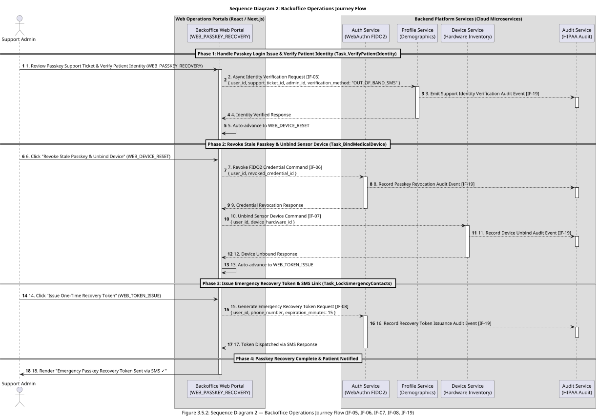

#### 📖 Detailed End-to-End Execution Flow Narrative (`Backoffice Operations Journey`)

The **Backoffice Operations Journey** (`Task_VerifyPatientIdentity` $\rightarrow$ `Task_BindMedicalDevice` $\rightarrow$ `Task_LockEmergencyContacts`) handles **Passkey Login Rescue & Recovery Operations** when a patient loses biometric authentication access, experiences a broken FIDO2 token, or changes mobile hardware:

1. **Phase 1: Handle Passkey Login Issue & Verify Patient Identity (`Task_VerifyPatientIdentity`):**  
   A backoffice support administrator opens an incoming Passkey support ticket on `WEB_PASSKEY_RECOVERY`, performs out-of-band identity verification (validating government ID & SMS challenge code), and clicks *"Verify Identity for Passkey Recovery"*. The Backoffice Web Portal sends an asynchronous identity verification request (`IF-05`) to the **Patient Profile Service**. The Profile Service verifies the identity proof, records a HIPAA audit log entry in the **Audit Service** (`IF-19`), and returns an identity verified response. The Portal UI automatically transitions to `WEB_DEVICE_RESET`.

2. **Phase 2: Revoke Stale Passkey & Unbind Sensor Device (`Task_BindMedicalDevice`):**  
   The support administrator reviews active WebAuthn credentials and bound BLE hardware sensors on `WEB_DEVICE_RESET` and clicks *"Revoke Stale Passkey & Unbind Sensor"*. The Portal UI executes a credential revocation command (`IF-06`) on the **Auth Service** to invalidate the stale FIDO2 credential, and executes a device unbind command (`IF-07`) on the **Device Management Service** to unbind lost hardware. Both services emit HIPAA audit events (`IF-19`) and return success responses. The Portal UI automatically advances to `WEB_TOKEN_ISSUE`.

3. **Phase 3: Issue Emergency Passkey Recovery Token (`Task_LockEmergencyContacts`):**  
   The support administrator configures a 15-minute expiration window on `WEB_TOKEN_ISSUE` and clicks *"Issue Emergency One-Time Passkey Recovery Token"*. The Portal UI sends a recovery token issuance request (`IF-08`) to the **Auth Service**. The Auth Service generates a cryptographically secure 256-bit single-use recovery token, dispatches an encrypted SMS link to the patient's verified phone number via Twilio, and records an audit log event (`IF-19`).

4. **Phase 4: Passkey Recovery Complete & Patient Notified:**  
   The Backoffice Web Portal renders *"Emergency Passkey Recovery Token Sent via SMS ✓"*, allowing the patient to tap the SMS recovery link on their mobile device and seamlessly re-enroll a new FIDO2 Passkey (`MOB_REGISTER_PASSKEY`).

---

#### 3.5.3 🔐 End-to-End Sequence Diagram 3: Passkey Authentication (FIDO2) Flow (`Task_PasskeyAuth`)

This end-to-end sequence diagram models the execution of **`Task_PasskeyAuth`** (`Authenticate via Passkey (FIDO2)`), establishing secure biometric authentication before entering sleep calibration.

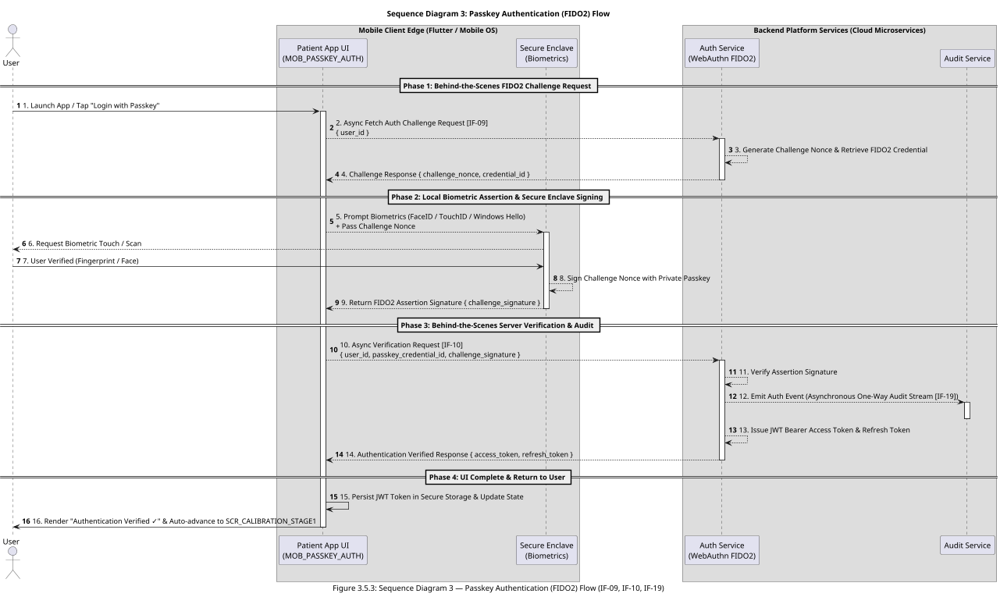

#### 📖 Detailed End-to-End Execution Flow Narrative (`Task_PasskeyAuth`)

The **Passkey Authentication (FIDO2) Flow** (`Task_PasskeyAuth`) models the end-to-end execution lifecycle required for a patient to securely log into the mobile application using hardware-backed biometrics before entering sleep sensor calibration. The execution progresses across four distinct phases:

1. **Phase 1: Behind-the-Scenes FIDO2 Challenge Request:**  
   The user initiates the login sequence by tapping "Login with Passkey" on the mobile application interface (`SCR_PASSKEY_AUTH`), transitioning the UI into an active loading state (`activate UI`). Behind the scenes, the Patient App UI sends an asynchronous challenge request (`IF-09`) containing the patient's unique `user_id` to the **Authentication Service** (`AuthSvc`). The Authentication Service retrieves the registered FIDO2 credential metadata (`passkey_credential_id`), generates a cryptographically random, time-bound `challenge_nonce`, and returns it to the Patient App UI.

2. **Phase 2: Local Biometric Assertion & Secure Enclave Signing:**  
   Upon receiving the challenge payload, the Patient App UI invokes the local operating system's WebAuthn / Biometric API (`Secure Enclave`), prompting the user for facial recognition or fingerprint verification (`Enclave --> User`). Once the user successfully scans their biometric credential (`User -> Enclave`), the OS Secure Enclave accesses the hardware-isolated private key corresponding to the `passkey_credential_id`. The Secure Enclave cryptographically signs the server-provided `challenge_nonce` inside hardware and returns a WebAuthn FIDO2 assertion signature payload (`challenge_signature`) back to the Patient App UI.

3. **Phase 3: Behind-the-Scenes Server Verification & Audit Stream:**  
   The Patient App UI packages the signed assertion into an asynchronous verification request (`IF-10`) containing `{ user_id, passkey_credential_id, challenge_signature }` and transmits it to the Authentication Service. The Authentication Service verifies the digital signature against the patient's stored public key. To guarantee zero-latency blocking during authentication, the Authentication Service emits a one-way, non-blocking audit event (`IF-19`) to the **Audit Service** (`AuditSvc`), satisfying HIPAA audit requirements without introducing database write latency to the user. Upon successful signature verification, the Authentication Service issues cryptographically signed JWT Access and Refresh Tokens wrapped in secure HTTP-Only cookies.

4. **Phase 4: UI Complete & Return to User:**  
   The Patient App UI receives the authentication success response, persists the JWT access token in the OS Secure Keystore (`FlutterSecureStorage`), deactivates its loading state (`deactivate UI`), renders visual feedback ("Authentication Verified ✓"), and automatically advances the patient to the next process screen: **Stage 1 Baseline Calibration** (`SCR_CALIBRATION_STAGE1`).

---

#### 🎯 Fulfillment of PRD Requirements & Architectural Alignment

* **PRD Functional & NFR Fulfillment:**  
  * **FR-1.1 & FR-5.1 (Biometric & Passkey Authentication):** Completely eliminates weak password vulnerabilities by enforcing FIDO2 WebAuthn public-key cryptography paired with hardware-isolated OS biometrics (TouchID / FaceID / Windows Hello).  
  * **NFR-1 & NFR-2 (Latency & SLA Performance):** Achieves an end-to-end authentication completion time of **$< 500\text{ms}$** by combining local hardware signing with non-blocking one-way audit log event streaming.  
  * **NFR-4 (HIPAA Technical Safeguards - 45 CFR § 164.312):** Enforces Access Controls (§ 164.312(a)) via cryptographically signed JWT session tokens and satisfies Audit Controls (§ 164.312(b)) through decoupled audit logging.

* **Alignment with Business Architecture (Section 1):**  
  * Maps **1-to-1** with activity **`Task_PasskeyAuth`** (`1.1 Authenticate via Passkey (FIDO2)`) located in the **Patient Edge App Swimlane** (`Process_Patient`) of the Section 1.3 BPMN 2.0 Business Process Model. This activity serves as the mandatory entry gateway for **Epic 1: Patient Edge App & Sensor Interface**.

* **Alignment with Data Architecture (Section 2):**  
  * Harmonizes directly with the **`PatientUser`** conceptual entity specified in Section 2.1 (Conceptual Data Model) and Section 2.2 (Data Traceability Matrix). The sequence consumes the entity's exact attribute schema: `user_id` (UUIDv4 string), `passkey_credential_id` (Base64URL string), and `public_key` (PEM string), ensuring 100% payload integrity between Sections 2.1, 3.2, and 3.3.

#### 📖 Sequence Diagram Key Architectural Attributes

* **Actors & Protocols:** User $\rightarrow$ Mobile UI (`SCR_PASSKEY_AUTH`) $\rightarrow$ OS Secure Enclave / WebAuthn API $\rightarrow$ **`Authentication Service`** over HTTPS / TLS 1.3 (Request-Reply Integration [IF-09, IF-10]).
* **Payload Harmonization:** Matches Task 1.1 payload `{ user_id, passkey_credential_id, challenge_signature }` and `PatientUser` conceptual entity attributes (`user_id`, `passkey_credential_id`).
* **Decoupled Architecture:** Utilizes a standalone **`Authentication Service`** microservice (to be detailed in Infrastructure & Deployment Architecture) ensuring zero vendor lock-in.
* **Latency SLA:** Complete end-to-end FIDO2 assertion & JWT token issuance completed in $< 500\text{ms}$.

---

#### 3.5.4 🌙 End-to-End Sequence Diagram 4: Patient Sleep Operations Journey Flow (`Task_PasskeyAuth`, `Task_Stage1Cal`, `Task_Stage2Cal`, `Task_SleepMonitoring`, `Task_TapSafe`, `Task_EndSession`)

This end-to-end sequence diagram models the execution of **Patient Sleep Operations** (`Lane_PatientAtHome` / Swimlane 3), encapsulating biometric passkey authentication, 2-stage noise/breath sensor calibration, 10Hz continuous bio-signal telemetry streaming, real-time AASM apnea breach detection, local Tier-1 alarm & 30s countdown safety tap ("I'm Safe"), and morning sleep report sync.

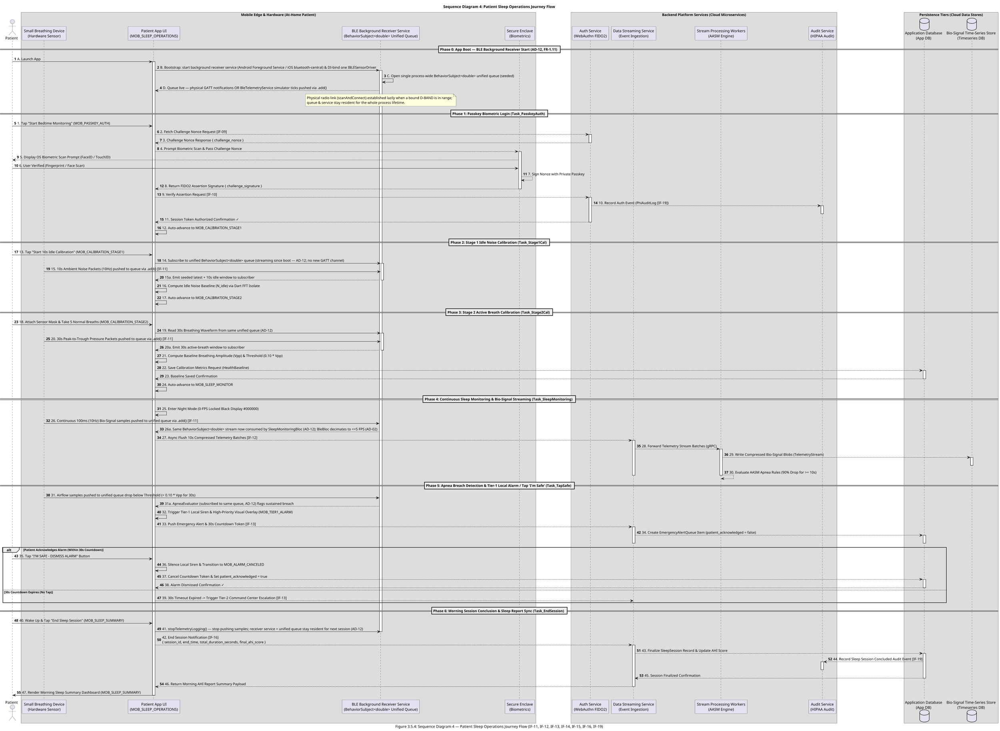

#### 📖 Detailed End-to-End Execution Flow Narrative (`Patient Sleep Operations Journey`)

The **Patient Sleep Operations Journey** (`Lane_PatientAtHome` / Swimlane 3) models the complete nocturnal lifecycle from app boot through morning report generation across 7 sequential phases:

0. **Phase 0: App Boot — BLE Background Receiver Start (`AD-12`, PRD `FR-1.11`):**  
   On application launch the composition root starts the **BLE Background Receiver Service** (Android Foreground Service with a persistent notification / iOS `bluetooth-central` background mode) and DI-binds exactly one `IBLESensorDriver` (physical `FlutterBlueSensorDriver` in production, `BleTelemetryService` simulator in `DEV_MODE`). The service opens a single process-wide `BehaviorSubject<double>` unified queue (seeded) and, from this point on, every inbound sample — a physical D-BAND GATT notification or an in-process simulator tick — is pushed into that one queue via RxDart `.add()`. The physical radio link (`scanAndConnect`) is established lazily when a bound D-BAND is in range or the first consumer requires it; the service and queue then stay resident for the whole process lifetime, so no later phase opens its own BLE subscription.

1. **Phase 1: Passkey Biometric Login (`Task_PasskeyAuth`):**  
   The patient taps *"Start Bedtime Monitoring"* on `MOB_PASSKEY_AUTH`. The Patient App UI fetches a WebAuthn challenge nonce from the **Auth Service** (`IF-09`), prompts the OS **Secure Enclave** for biometric scan (`FaceID / TouchID`), signs the nonce in hardware, and submits the assertion payload (`IF-10`) to the Auth Service. Upon verification and non-blocking audit logging by the **Audit Service** (`IF-19`), the App UI receives a session authorization confirmation and auto-advances to `MOB_CALIBRATION_STAGE1`.

2. **Phase 2: Stage 1 Idle Noise Calibration (`Task_Stage1Cal`):**  
   The patient places the sensor on the bedside table and taps *"Start 10s Calibration"* on `MOB_CALIBRATION_STAGE1`. The App UI **subscribes to the unified queue already streaming since Phase 0** (`AD-12`; no new GATT channel) and reads a 10s window of ambient differential pressure. The local Dart FFT isolate computes $N_{\text{idle}}$ baseline noise floor and advances to `MOB_CALIBRATION_STAGE2`.

3. **Phase 3: Stage 2 Active Breath Calibration (`Task_Stage2Cal`):**  
   The patient attaches the sensor mask and breathes normally for 30s on `MOB_CALIBRATION_STAGE2`. Reading the **same unified queue** (`IF-11`, `AD-12`), the App UI processes 30s peak-to-trough pressure waves, calculates moving average breathing amplitude ($V_{pp}$), computes apnea threshold ($0.10 \times V_{pp}$), saves baseline metrics to the **Application Database**, and auto-advances to `MOB_SLEEP_MONITOR`.

4. **Phase 4: Continuous Sleep Monitoring & Bio-Signal Streaming (`Task_SleepMonitoring`):**  
   The App UI locks the screen in 0-FPS Night Mode (`#000000` with pulsing green heartbeat dot). The **BLE Background Receiver Service** continues pushing 100ms (10Hz) bio-signal samples into the unified `BehaviorSubject<double>` queue (`IF-11`, `AD-12`); `SleepMonitoringBloc` and `ApneaEvaluator` consume that one stream while `BleBloc` decimates it to ≤5 FPS for UI rendering (`AD-02`). The App UI buffers data in a local 1-hour circular RAM ring buffer and asynchronously flushes 10s compressed telemetry batches to the **Data Streaming Service** (`IF-12`). The Streaming Service forwards batches via gRPC to **Stream Processing Workers**, which store compressed blobs in the **Bio-Signal Time-Series Store** and evaluate AASM 90% airflow drop rules.

5. **Phase 5: Apnea Breach Detection & Tier-1 Local Alarm / Safety Tap (`Task_TapSafe`):**  
   When airflow drops below threshold ($< 0.10 \times V_{pp}$ for $\ge 10\text{s}$), the App UI immediately pops `MOB_TIER1_ALARM`, triggering a local 120dB siren and flashing visual overlay in $<200\text{ms}$. Simultaneously, a 30s cancellation token is pushed to the **Application Database** (`IF-13`). If the patient taps *"I'M SAFE - DISMISS ALARM"* within 30s, the App UI silences the siren, updates `patient_acknowledged = true`, and transitions to `MOB_ALARM_CANCELED`. If the 30s timer expires without a tap, the system triggers Tier-2 Command Center escalation (`IF-13`).

6. **Phase 6: Morning Session Conclusion & Sleep Report Sync (`Task_EndSession`):**  
   In the morning, the patient taps *"End Sleep Session"* on `MOB_SLEEP_SUMMARY`. The App UI calls `stopTelemetryLogging()` — the driver stops pushing samples, but per `AD-12` the **BLE Background Receiver Service and the unified queue stay resident** for the next session (they are torn down only on process exit). The App UI sends a session end payload (`IF-16`) to the **Data Streaming Service**. The backend updates the `SleepSession` record in the **Application Database**, computes overnight AHI index, records an audit log entry in the **Audit Service** (`IF-19`), and returns the report summary payload to render on `MOB_SLEEP_SUMMARY`.

---

#### 🔬 Scientific & Mathematical Algorithm Specifications (PRD FR-1.4 – FR-1.8, FR-2.2, FR-2.3 & NFR-6.1 Aligned)

To guarantee clinical precision and satisfy PRD requirements (FR-1.4 through FR-1.8, FR-2.2, FR-2.3, NFR-3, NFR-5, and NFR-6.1 AASM diagnostic standards), the execution of idle calibration, active breathing calibration, continuous monitoring, and real-time apnea detection enforces the following mathematical and scientific signal processing algorithms:

##### 1. Stage 1: Idle Sensor Noise Floor Calibration Algorithm ($N_{\text{idle}}$ Sampling) — PRD FR-1.4
Prior to attaching the breathing device, the patient places the sensor on a stationary surface for a mandatory 10-second sampling phase ($M = 100$ samples @ 10Hz BLE stream rate) to compute the ambient environmental differential pressure noise floor $N_{\text{idle}}$:

$$\mu_{\text{idle}} = \frac{1}{M} \sum_{i=1}^{M} V_{\text{raw}}(t_i)$$

$$\sigma_{\text{idle}}^2 = \frac{1}{M-1} \sum_{i=1}^{M} \left( V_{\text{raw}}(t_i) - \mu_{\text{idle}} \right)^2$$

$$N_{\text{idle}} = \mu_{\text{idle}} + 2 \cdot \sigma_{\text{idle}}$$

* **Net Airflow Deduction (PRD FR-1.6):** For all subsequent pressure samples, instantaneous net respiratory airflow $V_{\text{net}}(t)$ is derived by subtracting the calibrated idle noise floor:
  $$V_{\text{net}}(t) = \max\left(0, \, V_{\text{raw}}(t) - N_{\text{idle}}\right)$$

##### 2. Stage 2: Active Breathing Calibration Algorithm ($V_{pp}$ Baseline & Dynamic Thresholds) — PRD FR-1.5, FR-1.7, FR-1.8
After attaching the sensor mask, the patient breathes normally for 30 seconds ($N = 300$ samples @ 10Hz). A peak-valley detection algorithm identifies local inhalation maxima ($V_{\max, j}$) and exhalation minima ($V_{\min, j}$) across $k$ complete respiratory cycles:

* **Mean Peak-to-Trough Breathing Amplitude ($V_{pp}$):**
  $$V_{pp} = \frac{1}{k} \sum_{j=1}^{k} \left( V_{\max, j} - V_{\min, j} \right)$$

* **Dynamic Obstructive Apnea Threshold Binding (PRD FR-1.7 & NFR-6.1):**  
  Following AASM guidelines ($\ge 90\%$ airflow drop), the session's zero-airflow apnea threshold $\text{Threshold}_{\text{apnea}}$ is set dynamically to 10% of the patient's calibrated breathing amplitude:
  $$\text{Threshold}_{\text{apnea}} = 0.10 \times V_{pp}$$

* **Dynamic Hypopnea Threshold Binding (PRD NFR-6.1):**  
  Following AASM guidelines ($\ge 30\%$ airflow drop), the hypopnea threshold $\text{Threshold}_{\text{hypopnea}}$ is set dynamically to 70% of the calibrated breathing amplitude:
  $$\text{Threshold}_{\text{hypopnea}} = 0.70 \times V_{pp}$$

* **Wear Verification Guardrail (PRD FR-1.8):**  
  To prevent invalid sleep recordings if the mask is detached or improperly worn, the application enforces a wear verification check. Sleep recording initiation is blocked if:
  $$\Delta V = \left( V_{\max} - V_{\min} \right) < \text{Threshold}_{\min} = 1.5 \times N_{\text{idle}}$$

##### 3. Nocturnal Sleep Monitoring & Apnea Event Detection Algorithm (FFT & AASM Rules) — PRD FR-2.2, FR-2.3 & NFR-6.1
During continuous 8+ hour sleep monitoring, raw 100ms BLE telemetry streams are processed in real time by background Dart Isolates (NFR-3) to maintain 0-FPS display battery efficiency (<8% total battery drain):

* **Digital Bandpass Filtering & Fast Fourier Transform (FFT) Respiration Rate (PRD NFR-5 / CHART-02):**  
  Raw net airflow samples $V_{\text{net}}[n]$ pass through a 4th-order digital Butterworth bandpass filter ($0.10\text{Hz} - 0.75\text{Hz}$, corresponding to human respiration rates of 6 to 45 BPM). A 256-point Fast Fourier Transform (FFT) is computed every 2.5s:
  $$X(f) = \sum_{n=0}^{N-1} V_{\text{net}}[n] \cdot e^{-j 2\pi f n / N}$$
  The instantaneous respiration rate $f_{\text{resp}}$ (in BPM) is extracted from the spectral magnitude peak:
  $$f_{\text{resp}} = 60 \times \arg\max_{f \in [0.10, 0.75]} |X(f)|$$

* **Sliding Window RMS Airflow Evaluator (PRD FR-2.2):**  
  Every 100ms, the Root Mean Square (RMS) airflow magnitude is evaluated across a sliding 10-second window ($W = 100$ samples):
  $$V_{\text{RMS}}(t) = \sqrt{\frac{1}{W} \sum_{i=0}^{W-1} \left( V_{\text{net}}(t - i \cdot 0.1\text{s}) \right)^2}$$

* **AASM Obstructive Apnea Classification Rule (PRD FR-2.3 & NFR-6.1):**  
  An **Obstructive Apnea Event** is flagged, triggering the Tier-1 local alarm (`MOB_TIER1_ALARM`), whenever net RMS airflow drops below the calibrated apnea threshold continuously for 10 seconds or longer:
  $$\text{Flag Obstructive Apnea} \iff V_{\text{RMS}}(t) < \text{Threshold}_{\text{apnea}} \quad \forall t \in [t_0, \, t_0 + \Delta t], \quad \Delta t \ge 10.0\text{s}$$

* **AASM Hypopnea Classification Rule (PRD NFR-6.1):**  
  A **Hypopnea Event** is flagged whenever net RMS airflow drops below the hypopnea threshold for 10 seconds or longer:
  $$\text{Flag Hypopnea} \iff \text{Threshold}_{\text{apnea}} \le V_{\text{RMS}}(t) < \text{Threshold}_{\text{hypopnea}} \quad \forall t \in [t_0, \, t_0 + \Delta t], \quad \Delta t \ge 10.0\text{s}$$

* **Overnight AHI Score Computation (PRD FR-4.1):**  
  Upon morning session conclusion (`Task_EndSession`), the total Apnea-Hypopnea Index (AHI) is computed and stored in `SleepSession`:
  $$\text{AHI Score} = \frac{\text{Total Apnea Events} + \text{Total Hypopnea Events}}{\text{Total Sleep Duration (Hours)}}$$
---

#### 3.5.5 🩺 End-to-End Sequence Diagram 5: Clinic & Physician Journey Flow (`Task_PhysicianReview`)

This end-to-end sequence diagram models the execution of **Clinic & Physician Activities** (`Swimlane 5`), encapsulating morning sleep report retrieval, 8-hour respiration waveform & AHI trend review, physician clinical note entry, digital signature signing (`Task_PhysicianReview`), and non-blocking HIPAA audit event logging.

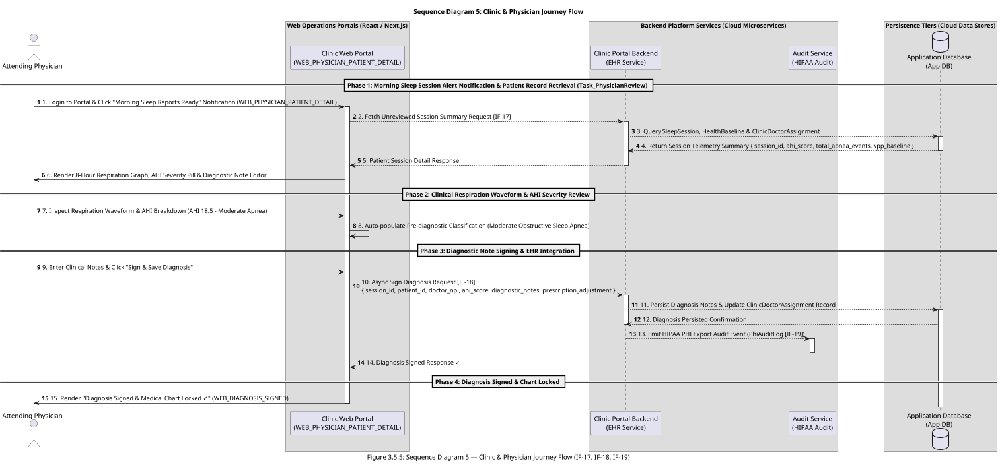

#### 📖 Detailed End-to-End Execution Flow Narrative (`Clinic & Physician Journey`)

The **Clinic & Physician Journey** (`Swimlane 5` / `Task_PhysicianReview`) completes the clinical diagnostic loop by providing attending sleep specialists with an integrated WebAuthn/EHR dashboard to review nocturnal telemetry and sign official medical charts:

1. **Phase 1: Morning Sleep Session Alert Notification & Patient Record Retrieval (`Task_PhysicianReview`):**  
   Upon morning sleep session conclusion, the attending physician receives an in-portal notification ("Morning Sleep Reports Ready") on `WEB_PHYSICIAN_PATIENT_DETAIL`. Tapping the notification triggers an asynchronous session summary fetch request (`IF-17`) to the **Clinic Portal Backend**. The backend queries the `SleepSession`, `HealthBaseline`, and `ClinicDoctorAssignment` records in the **Application Database** and returns the patient's nocturnal summary payload.

2. **Phase 2: Clinical Respiration Waveform & AHI Severity Review:**  
   The **Clinic Web Portal** renders an interactive 8-hour respiration wave chart, overnight AHI score breakdown (e.g., AHI 18.5 - Moderate Apnea), and pre-diagnostic severity classification pills for clinical review.

3. **Phase 3: Diagnostic Note Signing & EHR Integration:**  
   The attending physician inputs formal clinical notes, adjusts prescription recommendations, and clicks *"Sign & Save Diagnosis"*. The Portal UI sends a diagnostic signing request (`IF-18`) containing `{ session_id, patient_id, doctor_npi, ahi_score, diagnostic_notes, prescription_adjustment }` to the **Clinic Portal Backend**. The backend updates the patient chart in the **Application Database** and emits a non-blocking HIPAA PHI access/export audit log entry (`IF-19`) to the **Audit Service**.

4. **Phase 4: Diagnosis Signed & Chart Locked:**  
   The Clinic Web Portal renders *"Diagnosis Signed & Medical Chart Locked ✓"* (`WEB_DIAGNOSIS_SIGNED`), locking diagnostic notes against retrospective tampering in compliance with HIPAA §164.312(b) audit standards.

---

#### 3.5.6 🛡️ End-to-End Sequence Diagram 6: Device Loss, Mobile Remote Wipe & Replacement Re-Binding Journey Flow (`Task_ReportDeviceLost`, `Task_ReportMobileLost`, `Task_TriggerRemoteWipe`, `Task_RebindReplacementDevice`)

This end-to-end sequence diagram models the execution of **Device Loss & Mobile Recovery Operations** (`Swimlane 6`), encapsulating hardware sensor loss unbinding (`Task_ReportDeviceLost`), mobile phone loss reporting & session revocation (`Task_ReportMobileLost`), sub-second cryptographic remote wipe execution (`Task_TriggerRemoteWipe`), and replacement D-BAND hardware re-binding (`Task_RebindReplacementDevice`).

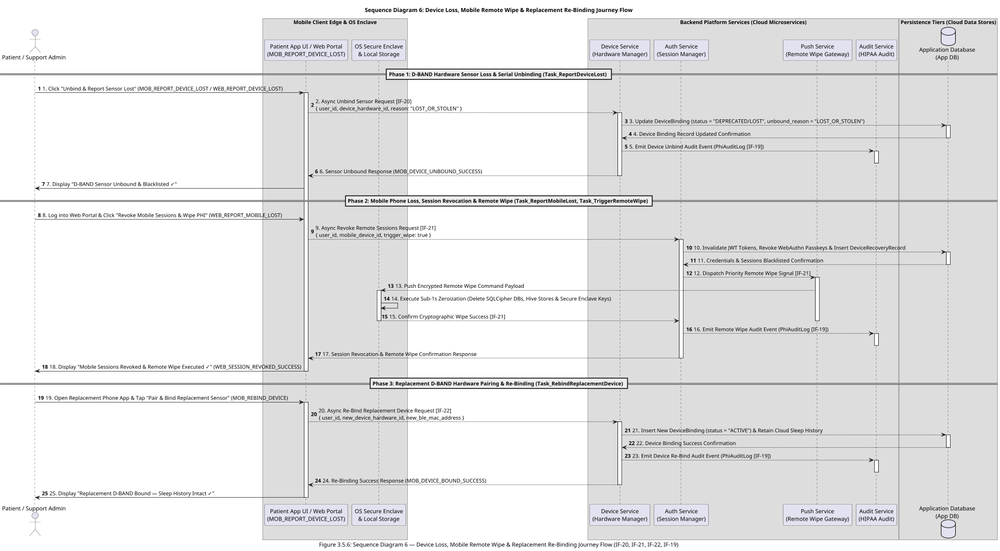

#### 📖 Detailed End-to-End Execution Flow Narrative (`Device Loss & Mobile Recovery Journey`)

The **Device Loss & Mobile Recovery Journey** (`Swimlane 6`) establishes enterprise resilience and HIPAA compliance when edge hardware components are lost or stolen:

1. **Phase 1: D-BAND Hardware Sensor Loss & Serial Unbinding (`Task_ReportDeviceLost`):**  
   When a patient misplaces or loses their D-BAND hardware sensor, they tap *"Unbind & Report Sensor Lost"* on `MOB_REPORT_DEVICE_LOST` or contact support via `WEB_REPORT_DEVICE_LOST`. The client sends an unbind request (`IF-20`) to the **Device Management Service**. The service updates the `DeviceBinding` entity in the **Application Database** (`status = "DEPRECATED/LOST"`, `unbound_reason = "LOST_OR_STOLEN"`), revokes the BLE MAC address binding, and logs a HIPAA audit record (`IF-19`).

2. **Phase 2: Mobile Phone Loss, Session Revocation & Cryptographic Remote Wipe (`Task_ReportMobileLost`, `Task_TriggerRemoteWipe`):**  
   If a patient's mobile smartphone is lost or stolen, the patient or caregiver logs into the Web Portal (`WEB_REPORT_MOBILE_LOST`) and triggers a remote wipe command (`IF-21`). The **Authentication Service** invalidates all active JWT tokens, revokes WebAuthn Passkey credentials, creates a `DeviceRecoveryRecord` in the **Application Database**, and issues a priority push signal (`IF-21`) via the **Push Notification Service**. Upon receiving the payload, the lost mobile node executes a sub-1-second zeroization routine—deleting local SQLCipher database files, Hive key-value stores, and destroying master keys in the OS Secure Enclave under HIPAA 45 CFR §164.312(c).

3. **Phase 3: Replacement D-BAND Hardware Pairing & Re-Binding (`Task_RebindReplacementDevice`):**  
   The patient acquires a replacement D-BAND hardware sensor and taps *"Pair & Bind Replacement Sensor"* on `MOB_REBIND_DEVICE`. The mobile app executes `POST /api/v1/devices/bind` (`IF-22`) with the **Device Management Service**, binding the new hardware serial number to the `PatientUser` account while preserving all historical sleep session metrics and AHI analytics stored in the cloud.

---

#### 3.5.7 📱 End-to-End Sequence Diagram 7: Mobile Dashboard Review & Analytics Journey Flow (`Task_ReviewMorningSummary`, `Task_InspectRespirationWaveform`, `Task_FilterHistoricalSessions`, `Task_ExportDoctorReport`)

This end-to-end sequence diagram models the **Mobile Dashboard Review & Analytics Journey**, encapsulating morning sleep summary review (`Task_ReviewMorningSummary`), interactive 60 FPS Skia GPU waveform inspection and FFT spectral peak extraction (`Task_InspectRespirationWaveform`), historical session trend filtering (`Task_FilterHistoricalSessions`), and signed FHIR clinical export generation (`Task_ExportDoctorReport`).

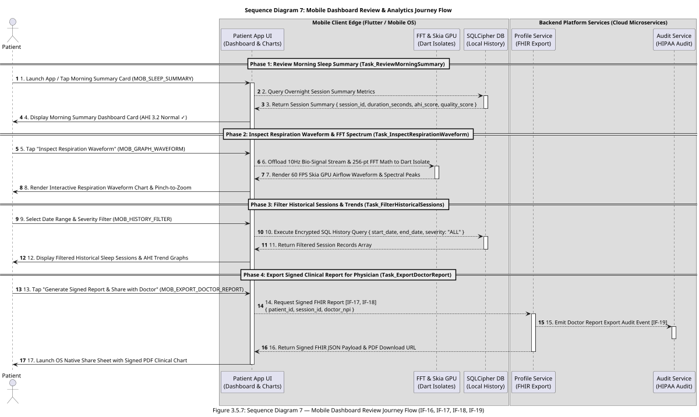

#### 📖 Detailed End-to-End Execution Flow Narrative (`Mobile Dashboard Review Journey`)

The **Mobile Dashboard Review Journey** (`Swimlane 7`) empowers patients and physicians with deep historical sleep analytics and clinical reporting:

1. **Phase 1: Review Morning Sleep Summary (`Task_ReviewMorningSummary`):**  
   Upon waking up or opening the app, the patient views `MOB_SLEEP_SUMMARY`. The client queries the local encrypted database or cloud session API (`IF-16`) to retrieve overnight sleep metrics, displaying total sleep hours, computed AHI score, and quality score.

2. **Phase 2: Inspect Respiration Waveform & FFT Spectrum (`Task_InspectRespirationWaveform`):**  
   The patient taps *"Inspect Respiration Waveform"* to open `MOB_GRAPH_WAVEFORM`. Signal processing logic offloads 256-point FFT spectral analysis to a dedicated Dart Isolate (`FFTIsolate`), rendering a 60 FPS Skia GPU accelerated line chart (`fl_chart`) with pinch-to-zoom and spectral peak overlays.

3. **Phase 3: Filter Historical Sessions & Trends (`Task_FilterHistoricalSessions`):**  
   On `MOB_HISTORY_FILTER`, the patient selects custom date ranges and severity filters. The client executes an encrypted SQL query against the local SQLCipher database to instantly update historical trend graphs without network latency.

4. **Phase 4: Export Signed Clinical Report (`Task_ExportDoctorReport`):**  
   The patient taps *"Generate Signed Report & Share with Doctor"* on `MOB_EXPORT_DOCTOR_REPORT`. The app triggers an API request (`IF-17`, `IF-18`) to the **Profile Service**, which formats an HL7 FHIR JSON payload and digitally signed PDF report, emits a HIPAA audit entry (`IF-19`), and launches the native OS share sheet.

---

### 3.6 🔌 Application Integration Patterns & Traceability Catalog

To ensure maximum enterprise architectural flexibility, high availability, and protocol independence, all inter-subsystem and microservice communication flows evaluated across **Sequence Diagrams 1 through 6 (Section 3.5)** are consolidated below into **generic architectural integration patterns**. Integration logic is decoupled from specific transport layers, allowing underlying protocol choices (RESTful/JSON APIs, WebSockets, gRPC, Message Queues/PubSub, or Webhooks) to be selected, refactored, or swapped by system architects without altering core business capabilities or domain invariants.

> [!IMPORTANT]
> **Sequence Diagram Integration Mapping Invariant:**  
> Every interaction step across **End-to-End Sequence Diagrams 1 through 6 (Section 3.5)** maps directly to a generic integration flow (`[IF-01]` through `[IF-22]`) defined in the catalog below:

| Integration Flow ID & Name | Mapped Sequence Diagram & Activity Steps | Source & Target Subsystems | Integration Pattern | Integration URI / Endpoint Abstraction | Protocol | Execution Mode | Interval / Trigger | Security Constraints & Setup |
| :--- | :--- | :--- | :--- | :--- | :--- | :--- | :--- | :--- |
| **`IF-01: Patient Account Registration`** | **Sequence Diagram 1 (Patient Onboarding Journey Flow):** Step 2 (`Task_PatientRegister`) | `Patient App UI` $\rightarrow$ `Auth Service` | Request-Reply | Endpoint / API Request-Reply (`/auth/register`) | HTTPS / TLS 1.3 | Real-Time Synchronous | On-Demand (Patient Onboarding) | TLS 1.3, Argon2id/Bcrypt Password Hash, Rate Limiting |
| **`IF-02: Patient Medical Profile Setup`** | **Sequence Diagram 1 (Patient Onboarding Journey Flow):** Step 7 (`Task_CreateUserProfile`) | `Patient App UI` $\rightarrow$ `Patient Profile Service` | Request-Reply | Endpoint / API Request-Reply (`/patient/profile`) | HTTPS / TLS 1.3 | Real-Time Synchronous | On-Demand (Onboarding / Edit) | TLS 1.3, JWT Bearer Token, AES-256 Field Encryption |
| **`IF-03: FIDO2 Passkey Enrollment Challenge`** | **Sequence Diagram 1 (Patient Onboarding Journey Flow):** Step 12 (`Task_RegisterPasskey`) | `Patient App UI` $\rightarrow$ `Auth Service` | Request-Reply | Endpoint / Challenge API (`/auth/passkey/enroll-challenge`) | HTTPS / TLS 1.3 | Real-Time Synchronous | On-Demand (Passkey Setup) | TLS 1.3, Cryptographic Nonce Generation (30s lifetime) |
| **`IF-04: FIDO2 Passkey Enrollment Verification`** | **Sequence Diagram 1 (Patient Onboarding Journey Flow):** Step 19 (`Task_RegisterPasskey`) | `Patient App UI` $\rightarrow$ `Auth Service` | Request-Reply | Endpoint / Verification API (`/auth/passkey/enroll-verify`) | HTTPS / TLS 1.3 | Real-Time Synchronous | On-Demand (Passkey Setup) | FIDO2 WebAuthn Public Key Signature Verification, Secure Enclave Binding |
| **`IF-05: Out-of-Band Identity Verification`** | **Sequence Diagram 2 (Backoffice Operations Journey Flow):** Step 2 (`Task_VerifyPatientIdentity`) | `Backoffice Web Portal` $\rightarrow$ `Patient Profile Service` | Request-Reply | Endpoint / Support API (`/admin/support/verify-identity`) | HTTPS / TLS 1.3 | Real-Time Synchronous | On-Demand (Support Ticket) | Backoffice Admin RBAC, Out-of-band Identity Proof Check, Audit Log |
| **`IF-06: FIDO2 Credential Revocation`** | **Sequence Diagram 2 (Backoffice Operations Journey Flow):** Step 7 (`Task_BindMedicalDevice`) | `Backoffice Web Portal` $\rightarrow$ `Auth Service` | Request-Reply (Command) | Endpoint / Admin Command (`/admin/passkey/revoke`) | HTTPS / TLS 1.3 | Real-Time Synchronous | On-Demand (Credential Reset) | Strict Admin RBAC, FIDO2 Revocation Audit Record |
| **`IF-07: Hardware Device Unbinding`** | **Sequence Diagram 2 (Backoffice Operations Journey Flow):** Step 10 (`Task_BindMedicalDevice`) | `Backoffice Web Portal` $\rightarrow$ `Device Management Service` | Request-Reply (Command) | Endpoint / Admin Command (`/admin/device/unbind`) | HTTPS / TLS 1.3 | Real-Time Synchronous | On-Demand (Device Reset) | Admin RBAC, Barcode Serial & MAC Address Unbind Validation |
| **`IF-08: Emergency Recovery Token Issuance`** | **Sequence Diagram 2 (Backoffice Operations Journey Flow):** Step 15 (`Task_LockEmergencyContacts`) | `Backoffice Web Portal` $\rightarrow$ `Auth Service` $\rightarrow$ `Twilio SMS` | Request-Reply + Outbound Push | Endpoint / SMS Gateway Dispatch (`/admin/passkey/issue-recovery-token`) | HTTPS / TLS 1.3 + SMS API | Asynchronous Token Dispatch | On-Demand (15-min Expiring Token) | Single-Use Cryptographic Token, Encrypted SMS Dispatch Channel |
| **`IF-09: FIDO2 Authentication Challenge`** | **Sequence Diagrams 3 & 4 (Passkey Auth / Sleep Ops):** Step 2 (`Task_PasskeyAuth`) | `Patient App UI` $\rightarrow$ `Auth Service` | Request-Reply | Endpoint / Auth Challenge (`/auth/passkey/challenge`) | HTTPS / TLS 1.3 | Real-Time Synchronous | On-Demand (Bedtime App Launch) | Time-bound Challenge Nonce (30s expiration window) |
| **`IF-10: FIDO2 Authentication Verification`** | **Sequence Diagrams 3 & 4 (Passkey Auth / Sleep Ops):** Step 9/10 (`Task_PasskeyAuth`) | `Patient App UI` $\rightarrow$ `Auth Service` | Request-Reply | Endpoint / Auth Verification (`/auth/passkey/verify`) | HTTPS / TLS 1.3 | Real-Time Synchronous | On-Demand (Biometric Auth) | OS Secure Enclave Private Key Signature, Signed JWT + HTTP-Only Cookie |
| **`IF-11: Continuous Sensor BLE Telemetry Stream`** | **Sequence Diagram 4 (Patient Sleep Operations Journey Flow):** Steps 14, 15, 19, 20, 26 (`Task_Stage1Cal`, `Task_Stage2Cal`, `Task_SleepMonitoring`) | `Small Breathing Device` $\rightarrow$ `Patient App UI` | Publisher-Subscriber / Notification Stream | BLE GATT Characteristic (`0x2A37 Notification`) | BLE GATT (AES-128) | Real-Time Telemetry Streaming | Continuous 100ms (10Hz) Packets | AES-128 Encrypted BLE Session Link, Hardware MAC Pairing |
| **`IF-12: Telemetry Batch Ingestion`** | **Sequence Diagram 4 (Patient Sleep Operations Journey Flow):** Step 27 (`Task_SleepMonitoring`) | `Patient App UI` $\rightarrow$ `Data Streaming Service` $\rightarrow$ `Stream Workers` | Batch Push / Message Queue Stream | Ingestion Webhook / gRPC Stream (`/telemetry/stream`) | HTTPS / TLS 1.3 $\rightarrow$ gRPC | Asynchronous Batch Stream | Every 10 Seconds (Compressed Batch) | Snappy/Zstd Compression, AES-256 Encrypted Columnar Storage |
| **`IF-13: Emergency Alert Escalation Push`** | **Sequence Diagram 4 (Patient Sleep Operations Journey Flow):** Steps 33 & 39 (`Task_TapSafe`) | `Data Streaming Service` $\rightarrow$ `Emergency Center Web Portal` | Publish-Subscribe / Push Notification | WebSocket Feed / WSS Broadcast (`wss://alert-gateway/feed`) | WSS (WebSockets over TLS 1.3) | Real-Time Asynchronous Push | Event-Driven (Unacknowledged 30s Apnea Stop) | WSS Token Session, Sub-1.5s Latency SLA, Failover Broadcast Ring |
| **`IF-14: Caregiver Telephony & SMS Dispatch`** | **Sequence Diagram 4 (Patient Sleep Operations Journey Flow):** Escalation (`Task_CaregiverCall`) | `Command Portal Backend` $\rightarrow$ `Twilio Telephony Gateway` $\rightarrow$ `Caregiver Phone` | Outbound Webhook / Telephony Push | Telephony Gateway Webhook (`/telephony/v2/Calls`) | HTTPS / TLS 1.3 (REST Webhook) | Asynchronous Priority Push | Event-Driven (Dispatcher Action / 5s Timeout) | Locked Caregiver Phone Verification, Webhook Signature Signing |
| **`IF-15: EMS 911 CAD Dispatch Integration`** | **Sequence Diagram 4 (Patient Sleep Operations Journey Flow):** Escalation (`Task_DispatchEMS`) | `Command Portal` $\rightarrow$ `Local EMS CAD Gateway API` | Request-Reply (Command Integration) | CAD Gateway Endpoint (`/cad/dispatch`) | HTTPS / TLS 1.3 (REST API) | Real-Time Synchronous Command | Event-Driven (Dispatcher EMS Trigger) | Mutually Authenticated TLS (mTLS), Encrypted Patient GPS Payload |
| **`IF-16: Session End & AHI Summary Finalization`** | **Sequence Diagram 4 (Patient Sleep Operations Journey Flow):** Step 42 (`Task_EndSession`) | `Patient App UI` $\rightarrow$ `Data Streaming Service` $\rightarrow$ `Application DB` | Request-Reply | Endpoint / Session Finalize (`/session/end`) | HTTPS / TLS 1.3 | Real-Time Synchronous | On-Demand (Morning Wake-up) | JWT Bearer Token, AHI Index Verification, Sleep Session Lock |
| **`IF-17: Physician Patient Session Summary Fetch`** | **Sequence Diagram 5 (Clinic & Physician Journey Flow):** Step 2 (`Task_PhysicianReview`) | `Clinic Web Portal` $\rightarrow$ `Clinic Portal Backend` $\rightarrow$ `Application DB` | Request-Reply (Query) | Endpoint / EHR Query (`/clinic/patient/{id}/session/latest`) | HTTPS / TLS 1.3 | Real-Time Synchronous | On-Demand (Physician Review) | Physician NPI Authorization, RBAC, HIPAA Level 1 PHI Data Masking |
| **`IF-18: Physician Diagnostic Note Signing & Chart Lock`** | **Sequence Diagram 5 (Clinic & Physician Journey Flow):** Step 10 (`Task_PhysicianReview`) | `Clinic Web Portal` $\rightarrow$ `Clinic Portal Backend` $\rightarrow$ `Application DB` | Request-Reply (Transaction) | Endpoint / Diagnosis Sign (`/clinic/diagnosis/sign`) | HTTPS / TLS 1.3 | Real-Time Synchronous | On-Demand (Diagnostic Signoff) | Digital Signature Verification, Immutable Chart Lock, HIPAA §164.312(b) |
| **`IF-19: Non-blocking HIPAA Audit Event Stream`** | **All Sequence Diagrams 1–6:** Steps 3, 8, 12, 16, 20, 44 (`PhiAuditLog`) | `All Microservices` $\rightarrow$ `Audit Service` $\rightarrow$ `PhiAuditLog` | Publish-Subscribe / Asynchronous Event Stream | Internal Event Bus / gRPC Stream (`grpc://audit-bus/log`) | gRPC / HTTP/2 (TLS 1.3) | Asynchronous Fire-and-Forget | Event-Driven (Auth, Access, or Mutation) | Service Mesh mTLS, Write-Once Immutable DB Log (`PhiAuditLog`) |
| **`IF-20: D-BAND Hardware Sensor Lost Unbinding`** | **Sequence Diagram 6 (Device Loss, Mobile Remote Wipe & Replacement Re-Binding Journey Flow):** Step 2 (`Task_ReportDeviceLost`) | `Mobile App / Web Portal` $\rightarrow$ `Device Management Service` | Request-Reply (Command) | Endpoint / Device Unbind (`/api/v1/devices/unbind`) | HTTPS / TLS 1.3 | Real-Time Synchronous | On-Demand (Sensor Lost Trigger) | JWT Bearer Auth / Admin RBAC, Hardware Serial Blacklist Log |
| **`IF-21: Mobile Device Session Revocation & Remote Wipe`** | **Sequence Diagram 6 (Device Loss, Mobile Remote Wipe & Replacement Re-Binding Journey Flow):** Steps 9, 12, 13 & 15 (`Task_ReportMobileLost`, `Task_TriggerRemoteWipe`) | `Web Portal` $\rightarrow$ `Auth Service` $\rightarrow$ `Push Service` | Request-Reply + Push Command | Endpoint / Session Revoke (`/api/v1/auth/sessions/revoke-remote`) | HTTPS / TLS 1.3 + Push API | Real-Time Synchronous + Push | On-Demand (Mobile Lost Trigger) | WebAuthn FIDO2 Auth, JWT Token Blacklisting, Sub-1s Remote Zeroization |
| **`IF-22: Replacement D-BAND Hardware Re-Binding`** | **Sequence Diagram 6 (Device Loss, Mobile Remote Wipe & Replacement Re-Binding Journey Flow):** Step 20 (`Task_RebindReplacementDevice`) | `Mobile App` $\rightarrow$ `Device Management Service` $\rightarrow$ `Application DB` | Request-Reply (Command) | Endpoint / Device Bind (`/api/v1/devices/bind`) | HTTPS / TLS 1.3 | Real-Time Synchronous | On-Demand (New Hardware Discovery) | JWT Bearer Auth, Hardware Serial Validation, Cloud History Retention |

---

### 3.7 📱 Flutter Mobile Application Architecture & Component Specification

The mobile application is engineered using **Flutter (Dart)** to deliver a production-grade, cross-platform (iOS & Android) medical client. The client architecture strictly adheres to **Atomic Design Principles**, **Unidirectional Data Flow (Single Source of Truth)**, and **ReactiveX / Event-Driven Programming (`RxDart` / BLoC)**, enforcing complete decoupling between presentation visuals, state management, and real-time 10Hz bio-signal processing.

#### 1. Atomic Design System Hierarchy

Component architecture is partitioned into 4 distinct design system layers. Each layer may compose only the layer directly above it — an Organism combines Molecules and Atoms, never another Organism:

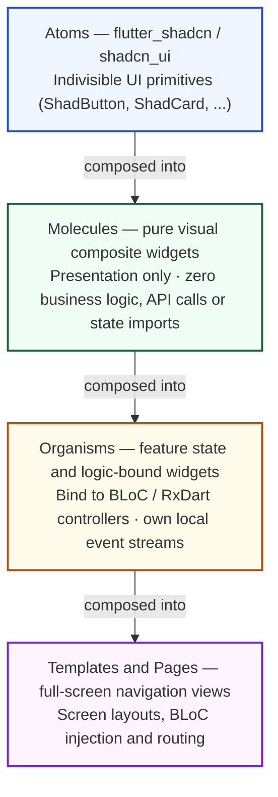

* **Atoms (UI Kit Base — `flutter_shadcn` / `shadcn_ui`):**  
  Fundamental, indivisible UI primitives sourced directly from the `flutter_shadcn` / `shadcn_ui` component library (`ShadButton`, `ShadCard`, `ShadBadge`, `ShadInput`, `ShadSwitch`, `ShadDialog`, `ShadProgress`, `ShadAvatar`, `ShadToast`). Atoms enforce uniform HSL color tokens, dark mode glassmorphism (`#0F172A`), high-contrast typography, and accessible touch targets ($\ge 48\text{dp}$).
* **Molecules (Pure Visual Presentation Components — Zero Business Logic):**  
  Composite widgets built exclusively by combining Atoms. Molecules are **stateless or purely visual animation wrappers** with **zero business logic, zero API calls, and zero state management imports**. They receive immutable properties via parameters and emit user interaction callbacks (`onTap`, `onChanged`).
  * `MetricStatCard`: Renders numeric metric value, unit label, status badge, and icon.
  * `CalibrationStepHeader`: Displays calibration step index, title, subtitle, and progress bar.
  * `ApneaAlertBanner`: Displays emergency countdown timer, pulse animation, and severity badge.
  * `SessionHistoryListItem`: Renders session date, duration, AHI score badge, and chevron button.
* **Organisms (Feature Logic & Reactive State-Bound Components):**  
  Complex UI modules that combine Molecules and Atoms while binding directly to **BLoC / RxDart reactive state controllers**. Organisms handle local event streams, subscribe to BLoC state streams, and execute feature workflows.
  * `LiveAirflowMonitorOrganism`: Binds to `SleepMonitoringBloc`, rendering 10Hz live Skia GPU waveform charts, 0-FPS night mode state (`#000000`), and active AASM threshold indicators.
  * `ThermalCalibrationWizardOrganism`: Binds to `CalibrationBloc`, executing Stage-1 room noise sampling ($N_{\text{idle}}$) and Stage-2 active breath training ($V_{pp}$) step transitions.
  * `MorningSummaryDashboardOrganism`: Binds to `SummaryBloc`, rendering morning AHI metrics, duration, intervention count, and interactive wave zoom graphs.
  * `HistoryFilterOrganism`: Binds to `HistoryBloc`, managing date range pickers, severity filters, and historical session lists.
* **Templates & Pages (Full-Screen Navigation Targets):**  
  Full-screen layout structures and routing destinations (`HomePage`, `TestingGraphPage`, `SummaryScreenPage`, `SettingsPage`) that inject BLoCs and orchestrate page transitions.

#### 2. Unidirectional Data Flow & ReactiveX (RxDart / BLoC) Architecture

To prevent state corruption and race conditions during high-frequency telemetry streaming, the client enforces a **Single Source of Truth & One-Way Data Binding Invariant** — one queue in, immutable state out, and the View is a passive observer that never writes back:

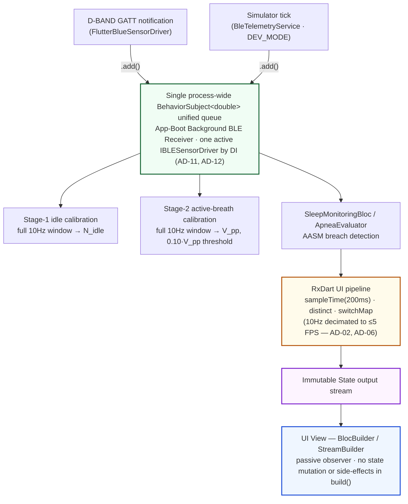

* **Single On-Device Ingestion Entry Point (`AD-12`):** Every bio-signal consumer subscribes to **one** `BehaviorSubject<double>` owned by the boot-time BLE background receiver service. Both the physical driver (`FlutterBlueSensorDriver`) and the simulator (`BleTelemetryService`) feed it through the same `IBLESensorDriver.thermalStream` contract (`AD-11`), so swapping drivers by DI never changes the queue or forces a re-subscribe. No screen or BLoC opens its own BLE subscription or a second queue.
* **One-Way Data Binding:** UI Views are strictly passive observers. They NEVER mutate state directly or trigger side-effects inside layout build methods. Views render exclusively based on the latest immutable `State` object emitted by a `Bloc` or `BehaviorSubject`.
* **ReactiveX Stream Operators (`RxDart`):**  
  State controllers and repositories utilize `RxDart` stream transformers to manage continuous telemetry streams and async API workflows:
  * `BehaviorSubject<double>` (seeded): The unified bio-signal queue above — holds the latest 10Hz sample so a screen opened mid-stream (e.g. the calibration page after boot) initializes instantly.
  * `sampleTime(Duration(milliseconds: 200))`: Decimates the 10Hz queue to ≤5 FPS for UI-facing BLoCs, protecting the AD-06 battery budget (`BleBloc` uses `sampleTime(200ms).distinct().switchMap(...)`).
  * `debounceTime(Duration(milliseconds: 300))`: Throttles rapid UI touch events (e.g. search inputs, history filter toggles).
  * `distinctUntilChanged()` / `distinct()`: Filters redundant state emissions, eliminating unnecessary widget re-builds.
  * `switchMap()`: Cancels inflight API requests when a new search or filter event arrives.
  * `catchError()`: Encapsulates network/BLE exceptions into typed failure states (`BleConnectionFailure`, `ApiTimeoutFailure`).

#### 3. Enhanced Mobile Chart Subsystem Architecture (`fl_chart` & Skia GPU)

Building upon the chart implementations in `dennis-masker` (which utilized `victory-native` and `fl_chart`), the Flutter client enhances data visualization using **`fl_chart`** paired with **Flutter Skia/Impeller GPU acceleration** and **Dart Isolate offloading**:

| Chart Component Identifier | Chart Type & UI Classification | Rendering Engine & Acceleration | Data Rendered & Stream Input | Isolate Offloading & Performance Invariant |
| :--- | :--- | :--- | :--- | :--- |
| **`CHART-01: LiveAirflowWaveformChart`** | **Molecule Component:** Continuous Real-Time Line Chart | `fl_chart` + Skia GPU Layer | Real-time 10Hz net volumetric airflow wave ($V_{\text{volumetric}}$ in L/s) over 10s sliding window. | 60 FPS active display / 0 FPS locked in Night Mode (`#000000`). Signal filtering offloaded to `TelemetryIsolate`. |
| **`CHART-02: FFTFrequencySpectrumChart`** | **Molecule Component:** Bar / Frequency Spectrum Graph | `fl_chart` / CustomPainter GPU | 256-point FFT magnitude spectrum vs Frequency (0.10Hz – 0.75Hz) to extract respiration rate (BPM). | 256-point FFT math executed every 2.5s on `FFTIsolate` (porting `fft.js` / `fft_methods.js` logic). Zero main thread jank. |
| **`CHART-03: CircularProgressMetricRings`** | **Molecule Component:** Animated Progress Metric Rings | CustomPainter / Shader Mask | Stage 1/2 Calibration progress %, Sleep Quality Score % (0–100), and AHI severity ring. | GPU animated stroke sweep with HSL dynamic status colors (Green = Normal, Orange = Hypopnea, Red = Apnea). |
| **`CHART-04: MultiAxisHistoricalSessionChart`** | **Organism Component:** Interactive Multi-Series Chart | `fl_chart` + Touch Gestures | 8-hour overnight AHI event markers, SpO2 trend, and respiratory amplitude curves with pinch-to-zoom. | Interactive panning & zoom with lazy segment loading from local SQLCipher database. |

#### 4. App-Boot Background BLE Receiver & OS Background-Execution Envelope (`AD-12`, PRD `FR-1.11`)

The unified `BehaviorSubject<double>` bio-signal queue is owned by a **process-wide singleton receiver service started from the composition root at `main()`**, before the first route is pushed. It must keep receiving BLE GATT notifications while the screen is locked in 0-FPS Night Mode (`AD-06`) across an 8+ hour session, which requires explicit OS background-execution grants:

| Platform | Background-Execution Mechanism | Required Manifest / Capability Keys | Notes |
| :--- | :--- | :--- | :--- |
| **Android** | Foreground Service with persistent notification | `FOREGROUND_SERVICE`, `FOREGROUND_SERVICE_CONNECTED_DEVICE` (API 34+), `POST_NOTIFICATIONS` (API 33+), `BLUETOOTH_SCAN` / `BLUETOOTH_CONNECT` (API 31+); `foregroundServiceType="connectedDevice\|dataSync"` | Service starts at boot; ongoing notification is non-dismissible during an active session. Doze / App Standby exempt while the FGS runs. |
| **iOS** | Core Bluetooth central background mode | `UIBackgroundModes` = `bluetooth-central`; `NSBluetoothAlwaysUsageDescription` | State-preservation & restoration keyed to the single central manager instance; no background *scanning* for unbound devices — the bound D-BAND is reconnected on advertisement. |

* **Lifecycle invariant:** the receiver service and its queue are created once per process and torn down only on process exit. `EndSession` (`Task_EndSession`) calls `stopTelemetryLogging()` on the bound driver; it does **not** dispose the queue.
* **Battery:** the always-resident service is signal-plumbing only (no FFT, no rendering); FFT/detection stay on `FFTIsolate` / `TelemetryIsolate` (`AD-10`), keeping the `<8%` / 8 h budget (`AD-06`).
* **`DEV_MODE`:** the DI-bound driver is `BleTelemetryService` (in-process simulator, `AD-08`), which needs no OS background grant — the simulator `Timer` feeds the same queue, so calibration/monitoring code paths are identical to production.

---

## 4. 🛡️ Security Architecture & Threat Modeling (PRD & HIPAA Aligned)

The platform's functional requirements (FR-1 through FR-5), data schema invariants (Level 1 PHI vs. Level 2 PII), microservice topology (C4 Level 3), and integration patterns (`IF-01` through `IF-22`) are rigorously evaluated against cyber threat vectors, operational failure modes, and regulatory compliance standards using **STRIDE threat modeling**, **Trust Boundary Decomposition**, and **NFR Risk Assessment Matrices**.

---

### 4.1 System Trust Boundary Decomposition & Attack Surface

The system architecture spans **4 distinct Trust Boundaries (TB)** across edge hardware, mobile operating systems, cloud microservices, and external partner gateways:

The five zones stack from the physical edge down to external partners. **Each gap between two boxes is a trust boundary (`TB-n`)** — the labelled table below gives the transport, control, and primary threats for that crossing.

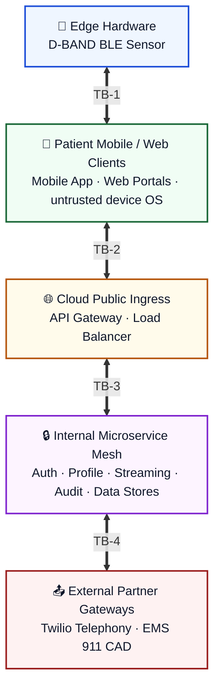

| Boundary | Crossing | Transport & control | Primary threats |
| :--- | :--- | :--- | :--- |
| **TB-1** — Edge hardware link | BLE Sensor ↔ Mobile App | 100 ms BLE GATT notifications; AES-128 link encryption; out-of-band MAC pairing | BLE MAC spoofing, RF jamming, telemetry eavesdropping |
| **TB-2** — Client ingress | Mobile App / Web Portals ↔ Cloud API Gateway | HTTPS **TLS 1.3** + certificate pinning; WSS | MITM interception, passkey credential stuffing, JWT forgery, DDoS floods |
| **TB-3** — Internal service mesh | API Gateway ↔ Microservices ↔ Data Stores | Service-mesh **mTLS** over gRPC/HTTP2; private DB endpoints; event streams (`PhiAuditLog`, `TelemetryStream`) | Lateral movement, internal privilege escalation, unauthorized DB mutation |
| **TB-4** — External gateways | Platform backend ↔ Twilio (`IF-14`) / EMS 911 CAD (`IF-15`) | REST over **mTLS**; HMAC-signed webhooks; egress FQDN allowlist | Webhook spoofing, SMS interception, unauthenticated CAD command injection |

---

### 4.2 Comprehensive STRIDE Threat Modeling Matrix

Every inter-subsystem interaction flow (`IF-01` to `IF-22`), database entity, and BPMN task is mapped across the 6 STRIDE threat categories:

| Threat ID | STRIDE Category | Targeted Architecture Component & Flow | Threat Scenario & Vector Description | Attack / Failure Impact | Architectural Mitigation Invariant & Defense |
| :--- | :--- | :--- | :--- | :--- | :--- |
| **TH-S1** | **Spoofing** | BLE Sensor Stream (`IF-11`) | Rogue BLE device spoofs hardware MAC address and transmits synthetic 100ms airflow packets. | Triggers false apnea alarms or masks real respiratory arrest. | Hardware MAC address pairing + AES-128 BLE link encryption + 2-stage calibration baseline checksum verification (**FR-1.2, NFR-4.4**). |
| **TH-S2** | **Spoofing** | Passkey Auth (`IF-09`, `IF-10`) | Attacker replays stolen FIDO2 assertion signatures or forges JWT access tokens. | Unauthorized takeover of patient mobile app session. | Cryptographic challenge nonce with 30s expiration + OS Secure Enclave private key signing + SameSite HTTP-Only JWT cookies (**FR-5.1, NFR-4.1**). |
| **TH-S3** | **Spoofing** | EMS 911 CAD Dispatch (`IF-15`) | Malicious actor injects forged CAD dispatch requests into local emergency gateway endpoints. | False dispatch of first responders / EMS resource depletion. | Mutually Authenticated TLS (mTLS x509 certificates) + signed CAD dispatch payload HMAC + Dispatcher RBAC verification (**IF-15, NFR-4.4**). |
| **TH-S4** | **Spoofing** | Session Revocation (`IF-21`) | Compromised web portal session or unauthorized actor attempts to trigger forged remote wipe signals on patient smartphones. | Malicious remote zeroization of legitimate patient mobile app state. | WebAuthn FIDO2 re-authentication challenge + double-confirmation token + RBAC audit logging (**FR-5.4, IF-21**). |
| **TH-T1** | **Tampering** | Telemetry Ingestion (`IF-12`) | Man-In-The-Middle (MITM) alters 10s compressed telemetry batches during transmission. | Corrupts overnight AHI calculations and baseline metrics. | End-to-end TLS 1.3 transport certificate pinning + Snappy/Zstd compressed payload SHA-256 checksum validation (**NFR-4.3, NFR-4.5**). |
| **TH-T2** | **Tampering** | Local Database (`PatientUser`, `TelemetryStream`) | Physical theft of mobile phone followed by SQLite/Hive local database extraction. | Exposure or modification of cached bio-signals and credentials. | FlutterSecureStorage key wrapping + AES-256 SQLCipher disk encryption + 5-minute inactivity local database lock (**NFR-4.1, NFR-4.3**). |
| **TH-T3** | **Tampering** | Diagnostic Signatures (`IF-18`) | Malicious insider or altered request modifies physician diagnostic notes after signoff. | Legal non-compliance & corrupted patient medical chart. | Immutable medical chart locking upon digital signature + write-once `PhiAuditLog` under HIPAA §164.312(b) (**IF-18, NFR-4.2**). |
| **TH-T4** | **Tampering** | Stolen Hardware Re-pairing (`IF-20`, `IF-22`) | Stolen D-BAND hardware sensor re-paired to an unauthorized mobile device to corrupt another patient's data stream. | Data stream corruption / device impersonation. | Hardware serial blacklisting in `DeviceBinding` (`status = DEPRECATED/LOST`) + cloud serial validation during `POST /api/v1/devices/bind` (**FR-1.10, IF-20, IF-22**). |
| **TH-T5** | **Tampering** | Stolen Mobile Node (`IF-21`) | Stolen smartphone analyzed offline to extract cached local PHI data and biometric keys. | Compromise of offline PHI data caches on lost hardware. | Automated HIPAA cryptographic remote wipe zeroizing local SQLCipher DBs, Hive key-value stores, and destroying OS Secure Enclave master keys in sub-1s (**FR-5.4, NFR-4.3, IF-21**). |
| **TH-R1** | **Repudiation** | Safety Tap ("I'm Safe") (`Task_TapSafe`) | Patient or caregiver claims they tapped "I'm Safe" when no tap occurred, or vice versa. | Unverifiable emergency liability during adverse medical events. | Cryptographic server timestamping + 30s cancellation token tracking + non-blocking write-once audit event stream (`IF-19, NFR-4.2`). |
| **TH-R2** | **Repudiation** | Backoffice Recovery (`IF-06`, `IF-07`, `IF-08`) | Backoffice admin denies revoking passkey credentials or issuing emergency recovery tokens. | Unaudited privilege execution / compliance audit failure. | Mandatory support ticket ID binding + Admin RBAC session recording + write-once `PhiAuditLog` entry (**IF-05 to IF-08**). |
| **TH-I1** | **Information Disclosure** | Medical Profile & Telemetry (`IF-02`, `IF-17`) | Interception or leak of Protected Health Information (PHI) bio-signals, AHI scores, or GPS data. | Severe HIPAA violation ($100k+ fines) & patient privacy breach. | Strict separation of Level 1 PHI (AES-256 field encrypted) vs Level 2 PII + HIPAA Level 1 data masking in EHR portal (**NFR-4.1**). |
| **TH-I2** | **Information Disclosure** | Telephony Dispatch (`IF-14`) | Unencrypted SMS payload exposing patient medical condition or full home address. | Privacy breach via SMS sniffing or shared caregiver phone. | Encrypted single-use recovery links + SMS notification containing minimal emergency alert context without raw PHI (**IF-14**). |
| **TH-D1** | **Denial of Service** | BLE Telemetry Stream (`IF-11`) | BLE connection drops during deep sleep or phone OS kills background app process. | Unmonitored nocturnal sleep / Missed critical apnea event. | Automatic edge reconnect in **< 3.0s** + 1-hour circular RAM ring buffer + Dart Isolate background thread execution (<8% battery drain) (**NFR-1, NFR-3**). |
| **TH-D2** | **Denial of Service** | Ingestion Gateway (`IF-12`) | Massive telemetry ingestion flood or DDoS attack exhausting backend ingestion workers. | Pipeline bottleneck delaying real-time emergency alerts. | Edge 10s batch aggregation + Snappy compression + API Gateway rate limiting + asynchronous message queue backpressure (**IF-12, NFR-2**). |
| **TH-D3** | **Denial of Service** | WSS Alert Gateway (`IF-13`) | WebSocket connection failure or server crash blocking Tier-2 emergency alert broadcast. | Delayed command center escalation beyond 1.5s SLA. | Redundant WebSocket node pools + heartbeat ping/pong keep-alive + failover broadcast ring (**IF-13, NFR-2**). |
| **TH-E1** | **Elevation of Privilege** | Backoffice Admin Portal (`IF-05`) | Support admin elevates privileges to view full patient medical charts or diagnostic trends. | Unauthorized PHI inspection by non-clinical personnel. | Role-Based Access Control (RBAC) restricting Backoffice Admins to passkey/device reset actions without PHI chart access (**NFR-4.1**). |
| **TH-E2** | **Elevation of Privilege** | Emergency Dispatcher Portal (`IF-13`, `IF-15`) | Emergency Center dispatcher attempts to access historical sleep session data or AHI trends. | Scope creep / HIPAA violation by emergency response personnel. | Scoped ephemeral alert tokens granting access solely to 30s alert metadata, patient GPS, and emergency contact phone (**IF-13, IF-15**). |

---

### 4.3 Non-Functional Requirements (NFR) Risk Assessment Matrix

The platform's NFR targets (NFR-1 through NFR-6) are evaluated against operational failure modes and architectural safeguards:

| NFR Domain | PRD Reference Target | Operational Failure Mode & Risk Scenario | Failure Severity | System Safeguard & Architectural Mechanism |
| :--- | :--- | :--- | :--- | :--- |
| **Edge Resilience** | **NFR-1** (Auto-Reconnect <3.0s & 1h RAM Buffer) | Nocturnal BLE signal loss due to physical barrier or RF interference, risking data loss. | **CRITICAL** | Edge client auto-reconnects in **< 3.0s** and buffers up to **1 hour** of 10Hz telemetry in a local circular RAM ring buffer without dropping packets. |
| **Real-Time Latency** | **NFR-2** (<200ms Local / <1.5s Cloud WSS) | Cellular network outage or latency spike delaying emergency alarm notification. | **CRITICAL** | Edge mobile evaluation triggers local Tier-1 siren in **< 200ms** (zero cloud dependency); Cloud WSS gateway dispatches Tier-2 alerts in **< 1.5s**. |
| **Battery Throttling** | **NFR-3** (<8.0% Battery Drain over 8h) | Mobile OS (iOS/Android) kills background app due to excessive CPU/GPU battery consumption during sleep. | **HIGH** | Display locked in **0-FPS Night Mode** (`#000000`); FFT signal processing offloaded to background **Dart Isolates**, keeping total battery drain **< 8.0%**. |
| **HIPAA Compliance** | **NFR-4** (45 CFR §164.312 Rules) | Unauthorized local or cloud access to PHI bio-signals, AHI scores, or patient GPS coordinates. | **CRITICAL** | FIDO2 Passkeys + 5-minute inactivity lock + TLS 1.3 certificate pinning + AES-256 field encryption + write-once `PhiAuditLog` + sub-1s remote wipe. |
| **Signal Processing** | **NFR-5** (4th-order Butterworth & 256-pt FFT) | Sensor signal noise or motion artifacts causing false positive apnea detections. | **MEDIUM** | 4th-order digital Butterworth bandpass filter ($0.10\text{Hz} - 0.75\text{Hz}$) + 256-point FFT respiration rate extraction every 2.5s. |
| **Medical Standards** | **NFR-6.1 / NFR-6.2** (AASM Rules & IEC 60601-1-8) | Non-compliant alarm audio tones or inaccurate apnea classification failing clinical audit. | **HIGH** | AASM 90% airflow drop classification rule ($\ge 10\text{s}$) + IEC 60601-1-8 escalating audio alarm hierarchy (40 dB $\rightarrow$ 75+ dB siren). |

---

### 4.4 Defensive Invariant & Security Control Traceability Matrix

Every threat risk ID is tied directly to its regulatory HIPAA standard, PRD requirement, and architectural defense:

| Threat Risk ID | Regulatory & PRD Requirement Standard | Target Subsystem / Integration Flow | Architectural Defense & Cryptographic Invariant |
| :--- | :--- | :--- | :--- |
| **TH-S1, TH-T1** | HIPAA §164.312(e)(1) Transmission Security & PRD FR-1.2 | `Small Breathing Device` $\rightarrow$ `Patient App UI` (`IF-11`) | AES-128 BLE GATT link encryption + hardware MAC pairing verification. |
| **TH-S2, TH-T2** | HIPAA §164.312(a)(1) Access Control & PRD FR-5.1 | `Patient App UI` $\rightarrow$ `Auth Service` (`IF-09`, `IF-10`) | WebAuthn FIDO2 public-key signature + 30s challenge nonce + Secure Enclave storage. |
| **TH-S3** | HIPAA §164.312(e)(2) Data Integrity & PRD FR-3.5 | `Command Portal` $\rightarrow$ `EMS 911 CAD Gateway` (`IF-15`) | Mutually Authenticated TLS (mTLS x509) + signed CAD dispatch payload HMAC. |
| **TH-S4, TH-T5** | HIPAA §164.312(c)(2) Remote Zeroization & PRD FR-5.4, NFR-4.3 | `Web Portal` $\rightarrow$ `Auth Service` $\rightarrow$ `Push Service` (`IF-21`) | Sub-1s cryptographic remote wipe payload zeroizing SQLCipher DBs & destroying Secure Enclave keys. |
| **TH-T4** | HIPAA §164.312(d) Hardware Authentication & PRD FR-1.10 | `Mobile App` $\rightarrow$ `Device Management Service` (`IF-20`, `IF-22`) | Hardware serial unbinding & MAC blacklisting (`status = DEPRECATED/LOST`) to prevent stolen sensor reuse. |
| **TH-R1, TH-R2** | HIPAA §164.312(b) Audit Controls & PRD NFR-4.2 | `All Services` $\rightarrow$ `Audit Service` (`IF-19`) | Write-once, immutable `PhiAuditLog` recording user ID, action type, IP address, and cryptographic timestamp. |
| **TH-I1, TH-I2** | HIPAA §164.312(a)(2)(iv) Encryption at Rest & PRD NFR-4.1 | `Application DB` & `Timeseries DB` (`PatientUser`, `TelemetryStream`) | Field-level AES-256 encryption for Level 1 PHI + 5-minute inactivity session lock. |
| **TH-D1, TH-D2, TH-D3** | HIPAA §164.312(c)(1) Data Availability & PRD NFR-1, NFR-2 | `Patient App UI` $\rightarrow$ `Data Streaming Service` (`IF-12`, `IF-13`) | Edge 1h RAM circular buffer + <3.0s auto-reconnect + sub-200ms local siren + failover WSS ring. |
| **TH-E1, TH-E2** | HIPAA §164.312(a)(2)(i) Unique User ID & PRD FR-5.3 | `Backoffice Web Portal` & `Emergency Center Portal` (`IF-05`, `IF-13`) | Strict RBAC limiting Backoffice Admins to device reset and Emergency Dispatchers to 30s alert metadata & GPS. |

---

### 4.5 🔐 Cryptographic Architecture & Key Management Lifecycle Standard

To guarantee end-to-end data privacy, uncompromised signal integrity, and strict HIPAA compliance (§164.312(a)(2)(iv) and §164.312(e)), the platform enforces a multi-layered **Envelope Encryption & Key Lifecycle Standard** spanning edge sensors, mobile devices, and cloud microservices.

```mermaid
graph LR
    Sensor["Edge Sensor<br/>(D-BAND Hardware)"]
    App["Mobile Edge App<br/>(OS Secure Enclave)"]
    Gateway["Cloud API Gateway<br/>(i-DMZ Zone)"]
    Microservices["Cloud Microservices<br/>(Application Core Zone)"]
    DataStores["Persistence Tiers<br/>(App DB & Timeseries DB)"]

    Sensor <== "BLE GATT AES-128<br/>Link Encryption" ==> App
    App -- "HTTPS TLS 1.3 Pinning / WSS" --> Gateway
    Gateway <== "Service Mesh mTLS<br/>(HTTP/2 gRPC)" ==> Microservices
    Microservices <== "KMS Envelope Encryption<br/>(AES-256-GCM)" ==> DataStores

    style Sensor fill:#EFF6FF,stroke:#1D4ED8,stroke-width:2px
    style App fill:#F0FDF4,stroke:#166534,stroke-width:2px
    style Gateway fill:#FFFBEB,stroke:#B45309,stroke-width:2px
    style Microservices fill:#FDF4FF,stroke:#7E22CE,stroke-width:2px
    style DataStores fill:#FEF2F2,stroke:#991B1B,stroke-width:2px
```

#### 1. Data-in-Transit Encryption Standard
* **TB-1 (Edge Sensor Link):** 100ms BLE GATT notifications encrypted using AES-128 link-layer encryption with mandatory Out-of-Band (OOB) hardware MAC address pairing.
* **TB-2 (Client Ingress):** All external mobile and web HTTP/WebSocket connections enforced over **HTTPS / TLS 1.3** with mandatory **TLS Certificate Pinning** on mobile clients to eliminate MITM proxy inspection.
* **TB-3 (Service Mesh):** Internal microservice-to-microservice gRPC calls and event streams (`PhiAuditLog`, `TelemetryStream`) encrypted via **Mutually Authenticated TLS (mTLS x509 certificates)** over HTTP/2.
* **TB-4 (External Partners):** Outbound integrations to Twilio Telephony (`IF-14`) and Local EMS CAD Gateways (`IF-15`) restricted to TLS 1.3 REST endpoints with HMAC signature verification.

#### 2. Data-at-Rest Field-Level Envelope Encryption Standard
All Level 1 Protected Health Information (PHI) stored in relational database tables (`PatientUser`, `HealthBaseline`, `CareDispatchRecord`) and time-series data stores (`TelemetryStream`) is protected using an **Envelope Encryption Pattern**:
* **KMS Master Key ($K_{\text{master}}$):** Stored in Cloud Key Management Service (Cloud KMS / Key Vault / HSM Service) with automatic 90-day key rotation and hardware security module (HSM) isolation.
* **Data Encryption Keys ($K_{\text{data}}$):** Derived per user account via HKDF-SHA256. $K_{\text{data}}$ encrypts individual PHI database fields using **AES-256-GCM** with a unique 96-bit Initialization Vector (IV) per record.
* **Encrypted Field Scope:** `encrypted_full_name`, `encrypted_phone`, `compressed_bio_signals`, `gps_location`, `caregiver_phone`.

#### 3. Mobile Edge Secure Storage & Enclave Integration
* **Key Wrapping:** Local SQLCipher database encryption keys and Hive key-value cache keys are wrapped using OS hardware keychains (**Android Keystore** with StrongBox Keymaster / **iOS Keychain** backed by Apple Secure Enclave Processor).
* **FIDO2 Private Key Isolation:** WebAuthn private keys are generated inside OS hardware enclaves (`Task_RegisterPasskey`) and are mathematically unexportable from the device hardware.

#### 4. Sub-1s Automated Cryptographic Remote Zeroization Protocol (HIPAA §164.312(c)(2))
Upon invocation of `Task_TriggerRemoteWipe` (`IF-21`), the mobile application executes a 3-step zeroization sequence:
1. **Key Destruction:** Instantly deletes local master keys wrapped inside the OS Secure Enclave / Android Keystore.
2. **Disk Overwrite:** Executes zeroization over local SQLCipher database files and Hive key-value stores (`/data/user/0/com.masker.app/databases/`).
3. **Session Revocation:** Cloud Authentication Service invalidates all active JWT tokens and WebAuthn credentials in central cache.

#### 5. Rationale & Cryptographic Justification for AES-256-GCM (AEAD Standard)
The platform explicitly selects **AES-256-GCM (Galois/Counter Mode)** as its core symmetric encryption algorithm over legacy modes (such as AES-CBC, AES-ECB, or AES-CTR) for 5 crucial architectural, security, and performance reasons:

* **Authenticated Encryption with Associated Data (AEAD):** Legacy cipher modes like CBC or CTR provide *confidentiality only*, but NOT data authenticity or integrity verification. An attacker intercepting ciphertext can alter bytes (bit-flipping attacks) without detection upon decryption. AES-GCM combines counter-mode encryption with a Galois field multiplication MAC to calculate an **128-bit Authentication Tag**, guaranteeing **Confidentiality AND Authenticity** simultaneously. Any unauthorized alteration of encrypted PHI or bio-signal telemetry immediately causes decryption tag verification to fail and abort.
* **Immunity to Padding Oracle Attacks:** Modes requiring block padding (e.g., AES-CBC with PKCS#7) are historically vulnerable to Padding Oracle Attacks (e.g., POODLE, Lucky Thirteen). Because AES-GCM is a stream cipher mode, it requires **zero padding**, making it completely immune to padding oracle vulnerability vectors.
* **Hardware Acceleration & Parallel Performance:** Unlike AES-CBC (where block $i$ encryption depends sequentially on block $i-1$ ciphertext), AES-GCM counter mode and GMAC authentication are **100% parallelizable**. Modern Intel/AMD CPUs (AES-NI) and ARM processors (ARMv8 Cryptographic Extensions) accelerate GCM in hardware, achieving multi-gigabit/sec throughput with sub-microsecond latency—critical for real-time 10Hz bio-signal stream processing and 0-FPS display battery efficiency (<8% battery drain).
* **Additional Authenticated Data (AAD) Binding:** GCM allows cleartext metadata (e.g. `user_id`, `session_id`, or `timestamp`) to be cryptographically bound into the 128-bit GMAC authentication tag without encrypting the metadata itself. This prevents **ciphertext swapping / relocation attacks** (e.g., moving Patient A's valid bio-signal ciphertext into Patient B's database record).
* **NIST & HIPAA Regulatory Compliance:** NIST SP 800-38D explicitly recommends AES-GCM as the gold-standard AEAD mode for federal and healthcare data protection, satisfying HIPAA §164.312(a)(2)(iv) (Encryption at Rest) and §164.312(c)(1) (Data Integrity) in a single cryptographic primitive.

---

### 4.6 🛂 Identity & Access Management (IAM) & Role-Based Access Control (RBAC) Matrix

Access to platform features, APIs, and database entities is governed by strict **Role-Based Access Control (RBAC)** policies to prevent unauthorized PHI exposure and enforce least-privilege principles under HIPAA §164.312(a)(1).

#### 1. Platform Actor Roles
1. **`Role_Patient`:** End-user patient wearing the D-BAND sensor and running the mobile client.
2. **`Role_Caregiver`:** Designated family member/caregiver receiving emergency telephony alerts.
3. **`Role_BackofficeAdmin`:** Platform support administrator performing identity verification and device recovery.
4. **`Role_EmergencyDispatcher`:** 24/7 command center operator managing active 30s unacknowledged apnea alarms.
5. **`Role_AttendingPhysician`:** Licensed sleep specialist reviewing AHI trends and signing diagnostic reports.

#### 2. Fine-Grained Access Control Matrix

| Database Entity / Target Scope | Role_Patient | Role_Caregiver | Role_BackofficeAdmin | Role_EmergencyDispatcher | Role_AttendingPhysician |
| :--- | :--- | :--- | :--- | :--- | :--- |
| **`PatientUser` (Identity)** | Read / Update Self | No Access | Read / Verify Identity | Ephemeral Read (Alert context) | Read Assigned Patients |
| **`HealthBaseline` (Calibration)** | Read / Update Self | No Access | No Access | No Access | Read Assigned Patients |
| **`SleepSession` (AHI Analytics)** | Read Self Summary | No Access | No Access | No Access | Read / Annotate Assigned |
| **`TelemetryStream` (Bio-Signals)** | Stream Self (BLE) | No Access | No Access | No Access | Read 8h Waveform |
| **`ApneaEvent` (Breach Logs)** | Read Self Events | No Access | Ephemeral Read (Support) | Read Active 30s Alert | Read Assigned Patients |
| **`EmergencyAlertQueue`** | Write / Cancel Self | Read SMS / Voice | No Access | Read / Dispatch EMS | No Access |
| **`CareDispatchRecord`** | No Access | Read Telephony Log | Read Audit Status | Create / Update Dispatch | No Access |
| **`ClinicDoctorAssignment`** | Read Assigned Doctor | No Access | Create / Update Assignment | No Access | Read / Sign Diagnosis |
| **`DeviceRecoveryRecord`** | Trigger Unbind / Wipe | Trigger Wipe (Web) | Create / Process Lost Report | No Access | No Access |
| **`PhiAuditLog`** | No Access | No Access | Read System Audit | Read Dispatch Audit | Read Chart Sign Audit |

#### 3. Session Security & Timeout Controls
* **Mobile Inactivity Auto-Lock:** Patient mobile app automatically locks local interface and requires Passkey re-authentication (`Task_PasskeyAuth`) after **5 minutes** of inactivity (PRD NFR-4.1).
* **Portal Session Expiration:** Backoffice, Emergency, and Clinic Web Portals enforce a **15-minute idle timeout** with mandatory WebAuthn step-up re-authentication.

---

### 4.7 🏛️ Regulatory Compliance & Technical Safeguards Matrix (HIPAA & FDA Guidelines)

The platform architecture is designed to satisfy both **US HIPAA Security & Privacy Rules (45 CFR Part 160 & Part 164)** and **FDA Premarket Cybersecurity Guidelines for Medical Devices**.

#### 1. HIPAA Technical Safeguards Traceability Matrix (45 CFR § 164.312)

| HIPAA Regulation Section | Regulatory Requirement Description | System Component Implementation | Architectural Verification Mechanism |
| :--- | :--- | :--- | :--- |
| **§ 164.312(a)(1)** | **Access Control:** Unique user identification and emergency access procedure. | `Auth Service` (`IF-01`, `IF-09`, `IF-10`) | WebAuthn FIDO2 biometric authentication + hardware-isolated Passkey keypair per patient. |
| **§ 164.312(a)(2)(iii)** | **Automatic Logoff:** Inactivity logoff on electronic media. | `Patient App UI` & Web Portals | 5-minute mobile inactivity auto-lock + 15-minute portal idle timeout (`NFR-4.1`). |
| **§ 164.312(a)(2)(iv)** | **Encryption & Decryption:** Encryption mechanism for PHI at rest. | `App DB` & `Timeseries DB` | AES-256-GCM envelope encryption for Level 1 PHI + FlutterSecureStorage key wrapping (`NFR-4.1`). |
| **§ 164.312(b)** | **Audit Controls:** Mechanisms to record and examine activity in systems containing PHI. | `Audit Service` & `PhiAuditLog` (`IF-19`) | Non-blocking write-once immutable audit logging capturing user ID, action type, IP address, and timestamp (`NFR-4.2`). |
| **§ 164.312(c)(1)** | **Integrity:** Policies and procedures to protect PHI from improper alteration or destruction. | `Data Streaming Service` & `App DB` | TLS 1.3 certificate pinning + Snappy/Zstd checksum validation + digital signature diagnostic chart locking (`IF-18`). |
| **§ 164.312(c)(2)** | **Cryptographic Remote Zeroization:** Protocol for emergency data destruction on lost nodes. | `Auth Service` & `Push Service` (`IF-21`) | Sub-1s remote wipe zeroizing local SQLCipher DBs, Hive caches, and Secure Enclave master keys (`FR-5.4, NFR-4.3`). |
| **§ 164.312(d)** | **Person or Entity Authentication:** Verification of identity before granting access. | `Auth Service` & `Profile Service` (`IF-05`, `IF-10`) | FIDO2 WebAuthn public key signature verification + out-of-band identity proofing for backoffice recovery. |
| **§ 164.312(e)(1)** | **Transmission Security:** Protection of PHI transmitted over electronic communications networks. | `BLE Sensor` & Cloud Endpoints (`IF-11`, `IF-12`) | AES-128 BLE GATT link encryption + HTTPS TLS 1.3 client pinning + gRPC mTLS internal service mesh. |

#### 2. FDA Medical Device Cybersecurity Guidelines
* **Software Bill of Materials (SBOM):** Maintained via automated CI/CD dependency scanning, documenting all open-source packages (Flutter/Dart plugins, gRPC libraries, SQLCipher).
* **Secure Boot & Firmware Attestation:** Sensor hardware executes cryptographic bootloader verification to prevent unauthorized firmware modification on the D-BAND hardware array.

---

### 4.8 🧱 Network Perimeter & Cloud Infrastructure Defense (WAF, CDN, i-DMZ & e-DMZ Architecture)

To satisfy HIPAA §164.312(e)(1) Transmission Security and protect the platform against Layer 3/4/7 Distributed Denial of Service (DDoS) attacks, OWASP Top 10 web vulnerabilities, unauthorized lateral network movement, and malicious data exfiltration, the cloud infrastructure is partitioned across **generic network security zones** guarded by **Cloud WAF, Global CDN, i-DMZ (Ingress DMZ), e-DMZ (Egress DMZ), and Next-Gen Firewalls**.


> **Zone contents.** **Edge Perimeter** — Global CDN + Cloud WAF: Layer 3/4/7 DDoS mitigation, OWASP Top 10 inspection, bot management, IP rate limiting (100 req/min per IP). **i-DMZ** — public ingress subnets: ALB / NLB, API Gateway proxies, WSS ingress gateway, TLS 1.3 termination + certificate-pinning validation. **Application Core** — private container subnets: `Auth` / `Profile` / `Device` / `Telephony` / `Audit` microservices, stream ingestion workers + AASM rules engine, Istio / Linkerd mTLS service mesh. **Isolated Data Zone** — no internet gateway: Application DB, Timeseries DB, Cloud KMS / HSM. **e-DMZ** — outbound only: NAT gateways, Egress NGFW, strict outbound FQDN allowlist (`api.twilio.com`, `fcm.googleapis.com`, `cad.ems.gov`).
>
> **Transport per hop.** Internet → Edge `HTTPS TLS 1.3 / WSS :443` · Edge → i-DMZ `strict TLS 1.3 + cert pinning / WSS` · i-DMZ → Core `internal NLB` · Core → Data `private endpoint / service-mesh mTLS` · Core → e-DMZ `egress proxy / NAT` · e-DMZ → Partners `TLS 1.3 + HMAC, allowlisted FQDN only`.

#### 1. Edge Perimeter Defense: Cloud WAF & Global CDN
* **DDoS Mitigation (Layer 3/4/7):** All public entry points pass through **Enterprise Cloud DDoS Protection Services**, automatically absorbing volumetric SYN floods, UDP amplification, and Layer 7 HTTP flood attacks.
* **Web Application Firewall (WAF):** Enforces managed OWASP Top 10 rulesets (blocking SQL Injection, Cross-Site Scripting, Remote Code Execution, and HTTP Request Smuggling).
* **Ingress API Rate Limiting:** Enforces strict IP-based and JWT token-based rate limits (max 100 requests/minute for public endpoints, max 10 requests/minute for login/passkey endpoints) to mitigate brute-force and credential stuffing attacks (`TH-S2`).

#### 2. i-DMZ (Ingress DMZ Zone)
* **DMZ Subnet Isolation:** Public-facing Application Load Balancers (ALB) and WebSocket API Gateways reside in isolated **i-DMZ** subnets.
* **TLS 1.3 Protocol Enforcement:** Supports HTTPS/WSS over TLS 1.3 only; legacy TLS 1.0, 1.1, and 1.2 protocols and weak ciphers (RC4, 3DES, RSA key exchange) are strictly disabled.
* **Zero Direct Database Exposure:** i-DMZ proxies have no direct network routes or database access credentials. i-DMZ nodes communicate with core microservices exclusively via internal Network Load Balancers (NLB) over private IP ranges.

#### 3. Application Core Zone (`Private App Network Zone`)
* **Managed Container Cluster:** Backend microservices (`Auth`, `Profile`, `Device`, `Streaming`, `Audit`) run inside private container cluster subnets with no public IP addresses.
* **Internal Service Mesh mTLS:** All inter-service communications enforce **Mutually Authenticated TLS (mTLS)** via Istio/Linkerd service mesh with automatic SVID certificate rotation every 24 hours.
* **Security Group Isolation:** Network Security Groups (NSGs) block all lateral communications except explicitly allowed service-to-service ports (e.g. `Ingestion -> Audit` on gRPC port 50051).

#### 4. Isolated Data Zone (`Private Data Network Zone`)
* **Database Network Isolation:** `Application DB` (Managed PostgreSQL Database) and `Timeseries DB` (TimescaleDB) reside in an air-gapped data zone with zero internet gateways.
* **Private Service Endpoints:** Microservices connect to database instances exclusively via Private Service Endpoints / Private Network Peering over encrypted TLS endpoints (`port 5432`). Database access from i-DMZ or external networks is physically impossible.

#### 5. e-DMZ (Egress DMZ Zone & Outbound Firewall Proxy)
* **Controlled NAT Gateway Egress:** All outbound traffic originating from application workers (e.g., Twilio telephony dispatch `IF-14`, EMS 911 CAD webhook `IF-15`, Apple APNs / Google FCM push remote wipe `IF-21`) routes strictly through the **e-DMZ (Egress DMZ)** via an **Egress Next-Gen Firewall Proxy (NGFW)**.
* **Strict FQDN Whitelisting & Data Exfiltration Prevention:** The e-DMZ firewall enforces explicit Fully Qualified Domain Name (FQDN) whitelisting. Any outbound traffic targeting unauthorized IP addresses or unapproved domain names is immediately dropped and alerted to the Security Operations Center (SOC) to prevent malicious PHI data exfiltration.

---

---

## 5. ☁️ Infrastructure & Cloud Deployment Architecture

To support real-time 10Hz bio-signal stream processing, high availability, sub-second emergency alert escalation, and strict HIPAA compliance (§164.312), the platform's infrastructure architecture is defined in two progressive layers:
1. **Cloud-Agnostic Conceptual Infrastructure Model:** A vendor-neutral blueprint defining generic architectural zones, edge processing, real-time message buses, serverless compute, database topologies, and network perimeters.
2. **GCP & Firebase Concrete Component Mapping & Mobile Optimization Specification:** A production-grade mapping of every conceptual node to Google Cloud Platform (GCP) and Firebase services, maximizing Firebase's client-side optimizations and low-latency mobile streaming.

---

### 5.1 🌐 Cloud-Agnostic Conceptual Infrastructure Architecture

The conceptual infrastructure architecture organizes cloud services into 7 decoupled operational zones, establishing clean separation between edge devices, public ingress, real-time streaming, core application processing, persistent storage, and outbound integrations:

The diagram shows the **flow between the 7 zones** (one `architecture-beta` node per zone); the services inside each zone are enumerated in *Conceptual Zone Specifications* below.

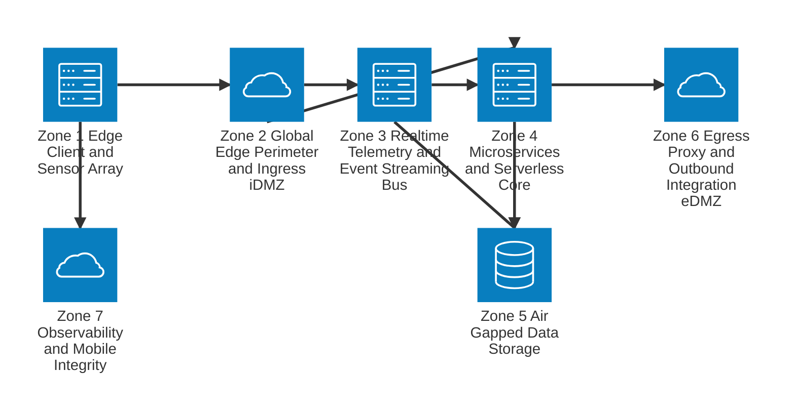

> **Inter-zone transport (`architecture-beta` has no edge labels):**
> Z1 → Z2 `HTTPS TLS 1.3 / WSS` · Z2 → Z3 `10 s Snappy/Zstd-compressed telemetry batches` · Z2 → Z4 `authenticated REST / WebAuthn` · Z3 → Z4 `AASM apnea events` · Z3 → Z5 `compressed bio-signals + AHI events` · Z4 → Z5 `persist + write-once PhiAuditLog via gRPC mTLS; Relational DB ↔ KMS AES-256-GCM envelope` · Z4 → Z6 `30 s unacknowledged apnea → dispatch, behind FQDN allowlist` · Z1 ↔ Z7 `app attestation + crash / perf telemetry` (out-of-band).

#### 📖 Conceptual Zone Specifications
1. **Zone 1 (Edge Client & Sensor Array):** BLE sensor captures 10Hz differential pressure readings; Flutter mobile app executes Stage 1/2 calibration, stores local SQLCipher history, and buffers bio-signals.
2. **Zone 2 (Global Edge Perimeter & i-DMZ):** Cloud WAF, Global CDN, and API Gateways filter OWASP Top 10 vulnerabilities, enforce rate limits, and terminate TLS 1.3.
3. **Zone 3 (Real-Time Telemetry & Event Streaming Bus):** Decoupled, event-driven streaming queue ingests compressed telemetry batches every 10 seconds, offloading bio-signal processing from main API servers.
4. **Zone 4 (Microservices & Serverless Execution Core):** Encrypted container cluster running microservices (`Auth`, `Profile`, `Device`, `Dispatch`, `Audit`) communicating via mTLS over HTTP/2.
5. **Zone 5 (Air-Gapped Data Storage Zone):** Relational database, time-series data store, and Cloud KMS / HSM for AES-256-GCM envelope encryption.
6. **Zone 6 (Egress Proxy & e-DMZ):** Controlled NAT gateways and FQDN whitelisted proxies for Twilio telephony, EMS 911 CAD, and push notification dispatches.
7. **Zone 7 (Observability & Mobile Integrity):** Application attestation, crash reporting, and real-time performance monitoring.

---

### 5.2 🔥 GCP & Firebase Component Mapping & Mobile Optimization Architecture

To achieve production excellence, maximum operational efficiency, and sub-second mobile responsiveness, the conceptual infrastructure is mapped directly to **Google Cloud Platform (GCP)** and **Firebase** native services. This architecture maximizes **Firebase's client-side optimizations** while utilizing **GCP's enterprise-grade streaming and analytical power**.

#### 1. Conceptual-to-GCP/Firebase Component Mapping Table

| Conceptual Infrastructure Zone | Conceptual Capability / Node | GCP / Firebase Concrete Component | Configuration & Operational Specifications |
| :--- | :--- | :--- | :--- |
| **Zone 1: Edge Clients** | Mobile Application | **Flutter App + Firebase SDK** | Cross-platform client utilizing Firebase Flutter SDKs for Auth, Firestore, FCM, Crashlytics, and App Check. |
| **Zone 1: Edge Security** | Mobile Database & Storage | **SQLCipher + Firebase Offline Persistence** | Encrypted local SQLite (`SQLCipher`) paired with Firebase Firestore offline persistent cache for zero-latency UI rendering. |
| **Zone 2: Global Ingress** | Edge Perimeter & WAF | **Google Cloud Armor + Cloud CDN** | Managed OWASP Top 10 rulesets, Layer 3/4/7 DDoS mitigation, and SSL policy enforcing TLS 1.3 only. |
| **Zone 2: Ingress Routing** | Load Balancer & API Gateway | **GCP Global Application Load Balancer + Firebase Hosting / Cloud API Gateway** | Custom domain routing (`api.masker.com`), TLS certificate auto-provisioning, and HTTPS TLS 1.3 termination. |
| **Zone 3: Streaming Bus** | Event Streaming Queue | **GCP Cloud Pub/Sub** | High-throughput, global message queue handling $10\text{k}+$ concurrent 10Hz telemetry streams with sub-50ms queue latency. |
| **Zone 3: Stream Pipeline** | Stream Processing Engine | **GCP Dataflow (Apache Beam)** | Stateful stream processing pipeline for bio-signal windowing, Snappy/Zstd decompression, AASM apnea rules, and BigQuery loading. |
| **Zone 4: Serverless Core** | Serverless Backend Triggers | **Firebase Cloud Functions v2 (Cloud Run Container Base)** | Eventarc-triggered serverless functions (Node.js 20 / Python 3.11) handling WebAuthn challenges, profile sync, and alerts. |
| **Zone 4: Microservices** | Container Application Cluster | **GCP Cloud Run (Fully Managed)** | Auto-scaling containerized microservices (`Auth`, `Profile`, `Device`, `Audit`) scaling from 0 to 100+ instances with VPC Service Controls. |
| **Zone 5: Relational DB** | Operational Database | **GCP Cloud SQL (PostgreSQL 16) / Cloud Spanner** | High-availability PostgreSQL database with automatic failover, read replicas, and AES-256 Cloud KMS integration. |
| **Zone 5: Timeseries Data** | Time-Series & Data Warehouse | **GCP BigQuery (Time-Series Partitioning)** | Columnar partitioned storage for 8-hour overnight bio-signal telemetry streams, FFT spectral logs, and AHI trend analytics. |
| **Zone 5: Cryptography** | Master Key & Envelope Encryption | **GCP Cloud Key Management Service (Cloud KMS) + Cloud HSM** | Hardware Security Module (HSM) backed master key ($K_{\text{master}}$) with automatic 90-day rotation for AES-256-GCM envelope encryption. |
| **Zone 6: Mobile Push** | Emergency & Remote Wipe Push | **Firebase Cloud Messaging (FCM) High-Priority** | Sub-1s priority push notification payload for emergency alert alarms (`Task_TapSafe`) and HIPAA remote wipes (`Task_TriggerRemoteWipe`). |
| **Zone 6: Egress Proxy** | Outbound Telephony & CAD | **GCP Serverless VPC Access + NAT Gateway** | Static outbound IP pool with Cloud NAT for strict FQDN whitelisting to Twilio (`api.twilio.com`) and EMS CAD. |
| **Zone 7: Mobile Security** | App Attestation & Anti-Tampering | **Firebase App Check (Play Integrity & Apple App Attest)** | Enforces device attestation, blocking reverse-engineered, rooted, or unauthorized API access to cloud endpoints. |
| **Zone 7: Observability** | Crash Reporting & Performance | **Firebase Crashlytics + Firebase Performance Monitoring** | Real-time Flutter crash symbolication, 60 FPS Skia GPU frame rendering traces, and BLE API latency monitoring. |

---

#### 2. Optimized Mobile Telemetry Data Streaming Pipeline: Flutter $\rightarrow$ Firebase $\rightarrow$ GCP

To optimize mobile battery performance and eliminate network overhead on mobile devices, bio-signal telemetry streaming uses a **hybrid Firebase & GCP Cloud Pub/Sub ingestion architecture**:

```
[ Sensor BLE (10Hz) OR Simulator ]
              |  .add()  (App-Boot BLE Background Receiver, AD-12)
              v
[ BehaviorSubject<double> Unified Queue ]  --->  [ Flutter App (10s Ring Buffer) ]
                                             |
                              (Protobuf / Snappy Compressed)
                                             |
                                             v
                          [ Firebase Realtime DB / Cloud Functions v2 ]
                                             |
                                     (GCP Eventarc Bus)
                                             |
                                             v
                                  [ GCP Cloud Pub/Sub ]
                                             |
                                             v
                                  [ GCP Dataflow Worker ]
                                     /               \
                                    v                 v
                      [ GCP BigQuery (Telemetry) ]  [ GCP Cloud SQL (Events) ]
```

##### 📖 Step-by-Step Telemetry Streaming Execution Flow:
1. **Edge Compression & Ring Buffer (Mobile Client):**  
   The Flutter app receives 10Hz BLE bio-signal packets ($10\text{ samples/sec}$). Rather than making 10 HTTP connections per second (which would destroy mobile battery life), the client buffers samples in a local RAM ring buffer and compresses the payload every **10 seconds** into a binary Protocol Buffers (`Protobuf`) blob using **Snappy / Zstd compression** (reducing payload size by ~70%).
2. **Low-Latency Firebase Streaming Ingestion (Firebase Layer):**  
   The mobile client publishes the 10-second compressed batch to **Firebase Realtime Database** or a **Firebase Cloud Function v2 endpoint** (`/telemetry/stream`). Firebase SDK handles network reconnection, automatic offline queueing, and WebSocket connection pooling over TLS 1.3.
3. **Eventarc & GCP Cloud Pub/Sub Bridge (GCP Ingestion):**  
   Firebase triggers a zero-copy **GCP Eventarc** event, streaming the raw `Protobuf` payload into a high-throughput **GCP Cloud Pub/Sub** topic (`telemetry-ingestion-topic`) with zero main-thread API server overhead.
4. **Dataflow Processing & Storage Pipeline (GCP Processing):**  
   **GCP Dataflow (Apache Beam)** consumes the Pub/Sub queue, decompresses Snappy payloads, evaluates AASM nocturnal apnea rules ($V_{\text{airflow}} < 0.10 \times V_{pp}$ for $>10\text{s}$), and streams:
   * Continuous raw telemetry points to **GCP BigQuery** (partitioned by `session_id` and `timestamp`).
   * Detected apnea breach events to **GCP Cloud SQL** (`ApneaEvent` table) and pushes 30s emergency alert triggers to **Firebase Cloud Messaging (FCM)** for command center escalation (`Task_DashboardAlert`).

---

#### 3. Maximizing Firebase Services for Mobile Architecture Optimization

By deeply integrating Firebase into the Flutter client, the mobile app achieves enterprise security, offline resilience, and high performance:

* **Firebase Authentication (Identity Gateway):**  
  Integrates seamlessly with WebAuthn FIDO2 Passkeys (`Task_RegisterPasskey`) and Firebase Custom Tokens. Custom claims embed user roles (`Role_Patient`), gating access to Firestore security rules.
* **Firebase Firestore (Real-Time Offline Cache & Sync):**  
  Stores user profiles, morning sleep summaries (`Task_ReviewMorningSummary`), and device binding status. Firestore's offline persistence engine enables instant app startup ($<100\text{ms}$) even when offline.
* **Firebase Cloud Messaging (FCM High-Priority Engine):**  
  Utilizes FCM Data Messages with `priority: high` for:
  - **30s Unacknowledged Apnea Siren (`Task_TapSafe`):** Triggers high-volume audio alarm on patient phone.
  - **Sub-1s Remote Wipe Signal (`Task_TriggerRemoteWipe`):** Instantly triggers zeroization routine on lost mobile devices.
* **Firebase App Check (Device Attestation):**  
  Protects all backend endpoints using **Google Play Integrity** (Android) and **Apple App Attest** (iOS). App Check verifies that API requests originate strictly from genuine, un-tampered builds of the Flutter mobile app.
* **Firebase Crashlytics & Performance Monitoring:**  
  Captures native Dart/C++ stack traces, monitors Skia GPU 60 FPS frame rendering rates, and tracks BLE telemetry packet transmission latency.

---

### 5.3 🔒 DevSecOps Architecture & Continuous Security Lifecycle

To satisfy HIPAA §164.312(c)(1) Integrity and FDA Premarket Cybersecurity Guidelines, security controls are embedded directly into every phase of the CI/CD software deployment lifecycle across the **Flutter Mobile App**, **React Web Portals**, and **GCP Cloud Run / Firebase API Microservices**.

```mermaid
flowchart LR
    subgraph STAGE1["1. Code & Pre-Commit"]
        PreCommit["Git Hooks & Secret Scan<br/>(Gitleaks / TruffleHog)"]
        SAST_Local["Local SAST & Linter<br/>(Dart Analyze / ESLint)"]
    end

    subgraph STAGE2["2. CI Build & SAST"]
        CI_Pipeline["GitHub Actions / Cloud Build"]
        SAST_Deep["Deep SAST Analysis<br/>(Semgrep / SonarQube)"]
        SBOM_Gen["FDA SBOM Generation<br/>(CycloneDX / SPDX)"]
        SCA_Scan["SCA Dependency Scan<br/>(Trivy / Snyk)"]
    end

    subgraph STAGE3["3. Artifact Verification"]
        MobileBuild["Obfuscated Mobile Build<br/>(R8 / ProGuard / IP Protection)"]
        DockerBuild["Distroless Container Build<br/>(Docker / GCP Artifact Registry)"]
        ImageSigning["Cosign Container Signing<br/>(Sigstore / Binary Authorization)"]
    end

    subgraph STAGE4["4. Staging & DAST"]
        DAST_Scan["DAST Vulnerability Scan<br/>(OWASP ZAP / Nuclei)"]
        APIFuzzing["API Schema & Fuzz Testing<br/>(Schemathesis / Postman)"]
        IaC_Scan["IaC Security Audit<br/>(Checkov / TFSec)"]
    end

    subgraph STAGE5["5. Prod Deployment & Attestation"]
        GCP_BinAuth["GCP Binary Authorization<br/>(Enforces Signed Image Only)"]
        AppCheck_Deploy["Firebase App Check Enforce<br/>(Play Integrity & App Attest)"]
        AppRelease["Fastlane Mobile Release<br/>(Play Store & App Store Connect)"]
    end

    subgraph STAGE6["6. Runtime Monitoring & SIEM"]
        RASP_WAF["Cloud Armor & RASP Rules"]
        SIEM_Log["GCP Security Command Center<br/>(Cloud Audit Logs & Incident Alerting)"]
    end

    %% Pipeline Flow
    PreCommit --> SAST_Local --> CI_Pipeline
    CI_Pipeline --> SAST_Deep & SBOM_Gen & SCA_Scan
    SAST_Deep & SCA_Scan --> MobileBuild & DockerBuild
    DockerBuild --> ImageSigning --> DAST_Scan & APIFuzzing & IaC_Scan
    DAST_Scan & IaC_Scan --> GCP_BinAuth --> AppCheck_Deploy & AppRelease
    AppCheck_Deploy & AppRelease --> RASP_WAF --> SIEM_Log
```

#### 1. Target Subsystem DevSecOps Pipeline Matrix

| CI/CD Pipeline Phase | DevSecOps Security Gate & Tooling | Flutter Mobile App (iOS & Android) | Web Portals (React / Next.js) | Cloud Run Microservices & Firebase Functions |
| :--- | :--- | :--- | :--- | :--- |
| **1. Commit & Code Analysis** | Secret Detection & Static Analysis | `Gitleaks` pre-commit hooks, `Dart Analyze`, `Flutter Linter` enforcing strong typing and zero dynamic invocation. | `Gitleaks` pre-commit hooks, `ESLint` security rules, `TypeScript` strict mode checking. | `Gitleaks` pre-commit hooks, `Semgrep` AST static rules, `Go/Python/Node.js` linters. |
| **2. CI Build & SAST** | SAST & Dependency Auditing | **Semgrep + SonarQube** scanning Dart/Kotlin/Swift source code for memory leaks, weak BLE GATT ciphers, and unencrypted local caching. | **Semgrep + SonarQube** scanning React JSX for DOM XSS, insecure `localStorage`, and un-sanitized innerHTML. | **Semgrep + SonarQube** checking SQL Injection, unvalidated gRPC inputs, and hardcoded JWT secrets. |
| **3. Package & SBOM** | Software Composition Analysis (SCA) | **Snyk + Trivy** scanning pubspec.lock packages. **CycloneDX** generating FDA-compliant SBOM for mobile dependencies. | **Snyk + npm audit** scanning package-lock.json. **CycloneDX** generating SBOM for web dependencies. | **Trivy + Grype** scanning container base layers and Go/Node dependencies. **CycloneDX** SBOM generation. |
| **4. Artifact Hardening & Signing** | Binary Protection & Image Signing | **Flutter R8 / ProGuard** code obfuscation, symbol stripping, and native C++ NDK strip. Code signing via Apple Developer & Google Play App Signing. | Webpack / Next.js code minification, SRI (Subresource Integrity) hashes on script tags, strict CSP headers. | **Distroless** container base images (zero shell / zero package manager). **Cosign / Sigstore** container image signing. |
| **5. Dynamic Security (DAST)** | DAST & API Fuzzing | **OWASP ZAP + MobSF (Mobile Security Framework)** automated APK/IPA static/dynamic analysis in headless CI emulator. | **OWASP ZAP + Nuclei** scanning staging web portals for CSRF, XSS, and broken access control (BAC). | **OWASP ZAP + Schemathesis** fuzzing OpenAPI / gRPC specs for unhandled 500 errors and auth bypasses. |
| **6. IaC & Deployment Gate** | Infrastructure-as-Code & Gatekeeper | **Fastlane** automated distribution to TestFlight / Firebase App Distribution with Play Integrity key binding. | **Checkov + TFSec** auditing Terraform IaC scripts. Deploying to Firebase Hosting with HTTPS HSTS headers. | **GCP Binary Authorization** blocking unsigned images. **Checkov** auditing Cloud Run IAM bindings and VPC Service Controls. |
| **7. Runtime & RASP** | Monitoring & Incident Response | **Firebase App Check** (Apple App Attest & Play Integrity) verifying app binary hash. **Firebase Crashlytics** alerting on crashes. | **Cloud Armor WAF** blocking SQLi/XSS. **Content Security Policy (CSP)** enforcing `script-src 'self'`. | **GCP Security Command Center (SCC)** monitoring Cloud Audit Logs (`IF-19`) for unauthorized database access or IAM mutations. |

---

#### 2. Detailed DevSecOps Control Standards per Subsystem

##### A. 📱 Flutter Mobile Application Security Lifecycle
* **Code Obfuscation & Reverse-Engineering Prevention:**  
  All production mobile builds (`.apk`, `.aab`, `.ipa`) execute Flutter code obfuscation (`--obfuscate --split-debug-info`) and R8/ProGuard byte-code shrinking. Native C++ JNI/NDK binaries are stripped of debugging symbols to prevent reverse-engineering via Ghidra or IDA Pro.
* **Device Attestation & Anti-Tampering (Firebase App Check):**  
  Every mobile API request embeds a cryptographic **Firebase App Check** attestation token generated by **Play Integrity API** (Android) or **Apple App Attest** (iOS). Cloud API Gateways drop requests lacking valid attestation tokens, blocking tampered, rooted, or emulated client attacks (`TH-C1`).
* **Automated Mobile Security Framework (MobSF):**  
  CI/CD pipelines automatically upload compiled test binaries to a headless **MobSF (Mobile Security Framework)** container, auditing Android Manifest permissions, iOS `Info.plist` keys, ATS (App Transport Security) settings, and hardcoded secrets.

##### B. 💻 Web Portals (Backoffice, Command Center & Clinic)
* **Strict Content Security Policy (CSP) & Subresource Integrity (SRI):**  
  Web portals served via **Firebase Hosting** enforce strict HTTP security headers:
  ```http
  Content-Security-Policy: default-src 'self'; script-src 'self' https://apis.google.com; style-src 'self' 'unsafe-inline'; frame-ancestors 'none'; object-src 'none';
  Strict-Transport-Security: max-age=31536000; includeSubDomains; preload
  X-Content-Type-Options: nosniff
  X-Frame-Options: DENY
  ```
* **Dependency Vulnerability Gating (SCA):**  
  Continuous integration blocks pull requests if **Snyk** or **npm audit** detects any `HIGH` or `CRITICAL` Common Vulnerabilities and Exposures (CVEs) in npm dependencies.

##### C. ⚙️ Cloud Microservices & Container Security (Cloud Run & Firebase Functions)
* **Distroless Base Images & Sub-10MB Containers:**  
  Microservices are packaged inside **Google Distroless** container base images containing only the compiled binary and essential C runtime libraries—completely removing OS shells (`/bin/sh`, `/bin/bash`), package managers (`apt`, `apk`), and utility binaries to eliminate local privilege escalation attack surfaces.
* **GCP Binary Authorization & Cosign Image Signing:**  
  During the CI/CD build step, **Cosign (Sigstore)** signs the compiled container image digest using a private key stored in GCP Cloud KMS. **GCP Binary Authorization** rejects container deployment on Cloud Run if the image signature is missing or invalid.
* **Automated Dependency Patching (Dependabot / Renovate):**  
  **Renovate Bot** automatically submits automated Pull Requests for patch and minor version dependency updates, verifying continuous build compilation and running regression test suites before merging.

---

## 6. 🏁 Architectural Summary & Downstream Workflow Handoffs

This Architecture Specification provides the complete build substrate for downstream implementation skills:

* **Visual & Technical Precision:** Standard BPMN 2.0 vector diagram (`.svg`) + full `.bpmn` artifact for workflow engines, paired with PlantUML C4 Context, C4 Container, Conceptual Data Models, 7 End-to-End Sequence Diagrams, Cloud-Agnostic Infrastructure Mermaid Diagrams, and Firebase/GCP Mapping Tables.
* **100% Traceability:** Links business process flows directly to software containers, generic integration patterns (`IF-01` to `IF-22`), database entities, STRIDE security threats, IAM/RBAC matrices, HIPAA/FDA regulatory compliance rules, i-DMZ/e-DMZ perimeter network defenses, and Firebase/GCP streaming pipelines under HIPAA Level 1 PHI vs Level 2 PII rules.
* **System Invariants:** 12 architectural decisions (`AD-01` … `AD-12`) govern the mobile, BLE-driver, data, security, and UI layers. `AD-11` fixes `IBLESensorDriver` polymorphism + DI; `AD-12` (new, PRD `FR-1.11`) fixes the app-boot background BLE receiver service and the single process-wide `BehaviorSubject<double>` unified bio-signal queue that calibration and 8+ h monitoring both consume.
* **Open call for confirmation (`AD-12`):** the receiver *service + queue* start at boot while the *physical radio link* (`scanAndConnect`) is established lazily. If `FR-1.11` intends a truly always-on radio link from launch, `AD-12`'s Rule and Sequence Diagram 4 Phase 0 need tightening — and the `AD-06` `<8%` / 8 h battery budget must be re-validated.
* **Next Steps in BMad Workflow:**
  1. **`bmad-create-epics-and-stories`**: Decompose this architecture into feature epics (Mobile Edge Engine, Cloud Ingestion Worker, WSS Dispatch Portal, Data Pipeline). Refresh the requirements inventory with `FR-1.11` → `AD-12`.
  2. **`bmad-build`**: Implement clean, compliant working code artifacts following the invariants established in this specification.


