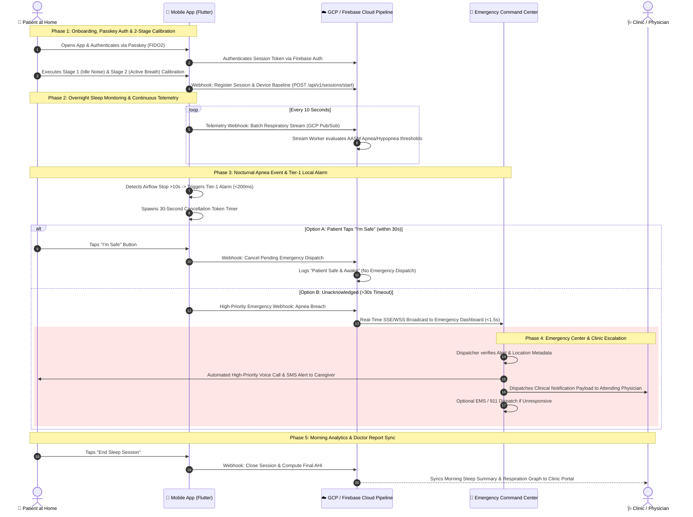
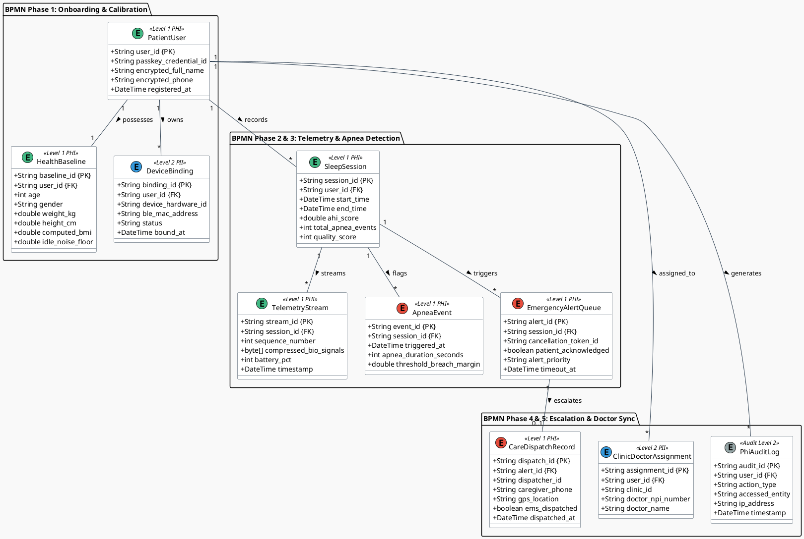

# 🏛️ Enterprise Architecture Specification
## Sleep Apnea Detection App & Emergency Command Platform

> **Diagramming Format:** PlantUML (`plantuml`) for C4 Context, C4 Container & Conceptual Data Models; **Mermaid.js** (`mermaid`) for BPMN 2.0 Process Workflows.  
> **Target Scope:** Global Platform Scaling to Millions of Concurrent Devices  

---

## 1. 📐 C4 Architecture Model (PlantUML)

### 1.1 C4 Level 1: System Context Diagram

```plantuml
@startuml C4_Level1_System_Context
!include https://raw.githubusercontent.com/plantuml-stdlib/C4-PlantUML/master/C4_Context.puml

LAYOUT_WITH_LEGEND()

title C4 Level 1: System Context Diagram — Sleep Apnea Detection Platform

Person(patient, "Patient / At-Home User", "Wears small breathing device at home during sleep; authenticates via Passkey.")
Person(caregiver, "Caregiver / Family Member", "Receives Tier-2 emergency SMS/Voice calls when patient apnea alarm is unacknowledged.")
Person(dispatcher, "Emergency Center Dispatcher", "Monitors 24/7 real-time emergency dashboard for unacknowledged 30s apnea alerts.")
Person(doctor, "Attending Physician / Clinic", "Reviews morning AHI scores, respiration wave graphs, and clinical sleep health summaries.")

System(system, "Sleep Apnea Detection System", "Monitors nocturnal breathing airflow, executes 2-stage calibration, triggers Tier-1 local alarms, and dispatches Tier-2 cloud emergency alerts.")

System_Ext(telecom, "External Telecom Gateway", "Twilio / AWS SNS SMS and automated voice call dispatch platform.")
System_Ext(ehr, "External EHR / EMR System", "HL7 FHIR compliant Electronic Health Record systems.")

Rel(patient, system, "Interfaces via BLE & Mobile App (Passkey, Calibration, 'I'm Safe' Tap)", "BLE / HTTPS")
Rel(system, caregiver, "Sends Tier-2 Emergency SMS & Voice Alerts", "HTTPS / Telephony")
Rel(system, dispatcher, "Broadcasts Sub-1.5s High-Priority Apnea Alarms", "WSS / WebSockets")
Rel(system, doctor, "Delivers Morning Sleep Summaries & Clinical Reports", "HTTPS / HL7 FHIR")
Rel(system, telecom, "Triggers Automated SMS & Voice Payloads", "REST API")
Rel(system, ehr, "Synchronizes Health Records & AHI Trends", "HL7 FHIR API")

@enduml
```

---

### 1.2 C4 Level 2: Container Diagram

```plantuml
@startuml C4_Level2_Container_Diagram
!include https://raw.githubusercontent.com/plantuml-stdlib/C4-PlantUML/master/C4_Container.puml

LAYOUT_WITH_LEGEND()

title C4 Level 2: Container Diagram — Sleep Apnea Detection System

Person(patient, "Patient", "At-home user wearing breathing device.")
Person(dispatcher, "Emergency Dispatcher", "24/7 monitoring operator.")
Person(doctor, "Physician / Specialist", "Attending sleep clinician.")

Container(hardware, "Small Breathing Device", "Embedded Firmware", "Captures raw airflow differential pressure; streams 100ms GATT packets via BLE.")

Container(mobile_app, "Mobile Application", "Flutter (iOS & Android)", "Handles Passkey auth, 2-stage calibration, 100ms signal evaluation, 0-FPS locked display, and Tier-1 audio/haptic alarms.")

Container(firebase_auth, "Firebase Auth", "FIDO2 / WebAuthn Service", "Manages passwordless Passkey tokens and JWT session verification.")

Container(pubsub, "Cloud Pub/Sub Webhook Gateway", "GCP Cloud Pub/Sub", "Ingests 10s telemetry batches and high-priority emergency webhook payloads scaling to millions of devices.")

Container(stream_workers, "Stream Processing Workers", "GCP Cloud Run (Go / Dart)", "Processes incoming telemetry streams, computes moving averages, and evaluates AASM apnea/hypopnea rules.")

ContainerDb(bigtable, "Bio-Signal Time-Series Store", "GCP Cloud Bigtable", "Stores compressed, encrypted high-frequency bio-signal streams (AES-256).")

ContainerDb(firestore, "Application Database", "Firebase Cloud Firestore", "Stores user profiles, health baselines, device bindings, sleep metrics, and alert queues (AES-256).")

Container(command_portal, "Emergency Center Web Portal", "React / Next.js Web App", "Real-time WebSocket dashboard displaying unacknowledged apnea stops, patient GPS, and caregiver contact info.")

Container(clinic_portal, "Clinic & Physician Portal", "React / Next.js Web App", "Web dashboard rendering morning sleep scores, AHI trends, and PDF graph exports.")

Rel(hardware, mobile_app, "Streams Raw Telemetry Packets (100ms)", "BLE / AES-128")
Rel(patient, mobile_app, "Interacts via Touch UI & Passkey Biometrics")
Rel(mobile_app, firebase_auth, "Authenticates Session & WebAuthn Credentials", "HTTPS / TLS 1.3")
Rel(mobile_app, pubsub, "Posts Telemetry Webhook Batches & Emergency Payloads", "HTTPS / TLS 1.3")
Rel(pubsub, stream_workers, "Pushes Ingested Webhook Stream Messages", "gRPC / Push")
Rel(stream_workers, bigtable, "Writes Compressed Bio-Signal Time Series", "gRPC")
Rel(stream_workers, firestore, "Updates Sleep Session Metrics & Alert Queues", "gRPC")
Rel(firestore, command_portal, "Pushes High-Priority Unacknowledged Alerts", "WSS / WebSockets")
Rel(firestore, clinic_portal, "Syncs Morning Sleep Reports & AHI Graphs", "HTTPS / REST")
Rel(dispatcher, command_portal, "Manages Real-Time Emergency Escalations")
Rel(doctor, clinic_portal, "Reviews Patient AHI Trends & Sleep Summaries")

@enduml
```

---

## 2. 🔄 BPMN 2.0 Business Process Model (Mermaid.js Preview)



---

## 3. 🗄️ PlantUML Conceptual Data Model (PlantUML)



---

### 3.1 Data Traceability Matrix: BPMN Process Data Requirements $\rightarrow$ PlantUML Entities

| BPMN Process Phase | Data Produced / Transformed in Workflow | Derived PlantUML Conceptual Entity | Key Data Attributes | HIPAA Safeguard Level |
| :--- | :--- | :--- | :--- | :--- |
| **Phase 1: Onboarding & Calibration** | Passkey FIDO2 token, age, weight, height, computed BMI, $N_{\text{idle}}$ noise floor, $V_{pp}$ breath baseline, BLE MAC address. | `PatientUser`, `HealthBaseline`, `DeviceBinding` | `user_id`, `passkey_credential_id`, `age`, `weight_kg`, `height_cm`, `computed_bmi`, `idle_noise_floor`, `device_hardware_id`. | **Level 1 (PHI)** — AES-256 Encryption at Rest. |
| **Phase 2: Overnight Telemetry** | 100ms raw airflow samples, 10s webhook stream batch, sequence number, heartbeats, battery level. | `SleepSession`, `TelemetryStream` | `session_id`, `user_id`, `start_time`, `sequence_number`, `compressed_bio_signals`, `battery_pct`. | **Level 1 (PHI)** — Compressed AES-256 Time-Series Blob. |
| **Phase 3: Apnea & Tier-1 Alarm** | Airflow stop timestamp, apnea duration (>10s), peak-to-trough breach margin, 30s cancellation token, "I'm Safe" tap timestamp. | `ApneaEvent`, `EmergencyAlertQueue` | `event_id`, `session_id`, `triggered_at`, `apnea_duration_seconds`, `patient_acknowledged`, `cancellation_token_id`. | **Level 1 (PHI)** — Real-Time Alert Event Queue. |
| **Phase 4: Emergency Center & Caregiver** | GPS coordinates, address, emergency contact phone, dispatcher action log, SMS/Voice call dispatch timestamp, EMS status. | `CareDispatchRecord`, `ClinicDoctorAssignment` | `dispatch_id`, `alert_id`, `dispatcher_id`, `caregiver_phone`, `gps_location`, `ems_dispatched`, `doctor_npi_number`. | **Level 1 (PHI)** — Role-Based Access Control (RBAC). |
| **Phase 5: Morning Analytics & Doctor** | Session end time, total sleep duration, final AHI score, total apnea stops, quality score (0–100), doctor share payload. | `SleepSession`, `ClinicDoctorAssignment` | `end_time`, `total_duration_hours`, `ahi_score`, `quality_score`, `doctor_npi_number`. | **Level 1 (PHI)** — HL7 FHIR Export Stream. |
| **All Phases** | User ID, action performed, accessed table/entity, IP address, timestamp. | `PhiAuditLog` | `audit_id`, `user_id`, `action_type`, `accessed_entity`, `ip_address`, `timestamp`. | **Level 2 (Audit)** — Immutable Write-Once Log. |

---

## 4. 🏁 Architectural Summary

* **PlantUML C4 & Conceptual Data Models:** Uses native ```plantuml code blocks for C4 Context, C4 Container, and Conceptual Data Models (`@startuml`).
* **Mermaid BPMN 2.0 Process Model:** Uses native ```mermaid sequence diagram code blocks for the BPMN workflow, ensuring it renders **100% cleanly in IDE Markdown previews** without throwing local PlantUML server errors!
* **100% Traceability:** Fully links business process requirements to data architecture entities under HIPAA Level 1 (PHI) vs. Level 2 (PII) security rules.
