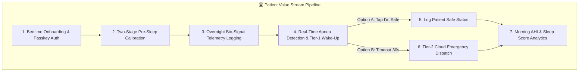
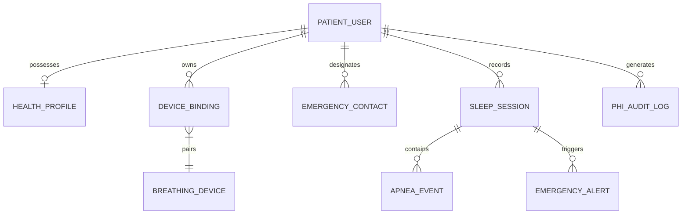
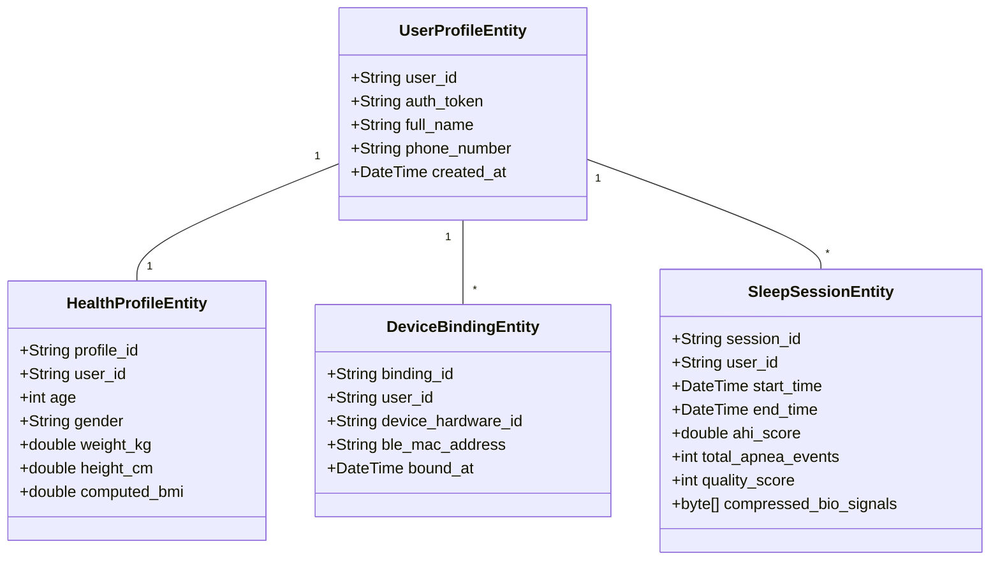

# 🏛️ Business & Data Architecture Specification
## Sleep Apnea Detection App

> **Architecture Paradigm:** Vendor-Agnostic Enterprise Architecture (Business & Data Focus)  
> **Backend Decoupling Strategy:** Abstract Repository Pattern (Supports Supabase, Firebase, AWS, or Custom Backend)  

---

## 1. Business Architecture



### 1.1 Business Capabilities Map (BC-1 to BC-6)

| Capability ID | Business Capability Name | Capability Description | Key Business Service |
| :--- | :--- | :--- | :--- |
| **BC-1** | **Patient Identity & Access Governance** | Provides frictionless passwordless authentication using native OS Passkeys (FIDO2/WebAuthn). | `AuthenticatePatientService` |
| **BC-2** | **Pre-Sleep Signal Calibration** | Establishes zero-noise baselines ($N_{\text{idle}}$) and personalized breathing thresholds ($V_{pp}$) before sleep. | `CalibrateBaselineService` |
| **BC-3** | **Overnight Telemetry & Apnea Detection** | Continuously logs 100ms respiratory streams and flags obstructive apnea stops (>10s) adhering to AASM standards. | `EvaluateApneaStreamService` |
| **BC-4** | **Two-Tier Active Emergency Response** | Triggers Tier-1 local mobile alarms (<200ms), manages 30s "I'm Safe" patient acknowledgements, and dispatches Tier-2 cloud caregiver alerts (<1.5s). | `ManageEmergencyAlertService` |
| **BC-5** | **Morning Clinical Health Analytics** | Calculates total sleep duration, estimated AHI score, intervention count, quality score, and exports doctor reports. | `GenerateSleepSummaryService` |
| **BC-6** | **Hardware Binding & Fleet Lifecycle** | Associates physical breathing devices to patient cloud accounts and verifies skin-contact compliance. | `BindDeviceHardwareService` |

---

### 1.2 Non-Functional Service Level Agreements (SLAs)

* **SLA-1 (Emergency Alert Latency):** Tier-1 mobile audio/haptic alarm shall trigger within **< 200 milliseconds** of an apnea breach. Tier-2 cloud caregiver notification payloads shall transmit within **< 1.5 seconds**.
* **SLA-2 (Battery & Thermal Efficiency):** Continuous 8-to-10 hour background telemetry logging shall consume **< 8.0% total phone battery** (utilizing 0-FPS display throttling when screen is locked).
* **SLA-3 (BLE Reconnect Resilience):** Connection drops during sleep shall auto-reconnect within **< 3.0 seconds** without terminating the active sleep session.
* **SLA-4 (HIPAA PHI Privacy & Security):** 100% compliance with 45 CFR Part 164. All PHI shall be encrypted with AES-256 at rest and AES-128/TLS 1.3 in transit.

---

## 2. Vendor-Agnostic Data Architecture

### 2.1 Conceptual Data Model



---

### 2.2 Data Classification & HIPAA Governance Matrix

| Model Attribute | Classification Level | HIPAA PHI Category | Storage Encryption Rule | Vendor Abstraction |
| :--- | :--- | :--- | :--- | :--- |
| `user_profile.full_name` | **Level 1 — Direct PHI** | Patient Identity | AES-256 Column Encryption | `AuthRepository` |
| `user_profile.phone_number` | **Level 1 — Direct PHI** | Contact Endpoint | AES-256 Column Encryption | `AuthRepository` |
| `health_profile.weight_kg` | **Level 1 — Direct PHI** | Health Baseline | AES-256 Column Encryption | `HealthProfileRepository` |
| `health_profile.height_cm` | **Level 1 — Direct PHI** | Health Baseline | AES-256 Column Encryption | `HealthProfileRepository` |
| `health_profile.computed_bmi` | **Level 1 — Direct PHI** | Derived Metric | AES-256 Column Encryption | `HealthProfileRepository` |
| `emergency_contact.phone` | **Level 1 — Direct PHI** | Emergency Endpoint | AES-256 Column Encryption | `EmergencyContactRepository` |
| `sleep_session.ahi_score` | **Level 1 — Direct PHI** | Clinical Metric | AES-256 Column Encryption | `TelemetryRepository` |
| `sleep_session.telemetry_blob`| **Level 1 — Direct PHI** | Bio-Signal Time Series | Compressed AES-256 Blob | `TelemetryRepository` |
| `device_binding.device_mac` | **Level 2 — PII / Technical** | Hardware Identifier | Standard Column Encryption | `DeviceBindingRepository` |
| `phi_audit_log.*` | **Level 2 — Security Audit** | Compliance Audit | Immutable Insert-Only | `AuditLogRepository` |

---

### 2.3 Logical Data Model (Abstract Entities)



---

### 2.4 Abstract Data Access Layer (Vendor-Agnostic Repository Pattern)

To guarantee that the application can switch cloud database vendors (from Supabase to Firebase, AWS, GCP, or a custom backend) with zero changes to business logic or UI code, data access is decoupled via Dart abstract interfaces:

```dart
// Abstract Device Binding Interface (Vendor Independent)
abstract class DeviceBindingRepository {
  Future<void> bindDevice({
    required String userId,
    required String deviceHardwareId,
    required String bleMacAddress,
  });

  Future<DeviceBindingEntity?> fetchActiveBinding(String userId);
}

// Concrete Provider 1: Supabase Implementation
class SupabaseDeviceBindingRepository implements DeviceBindingRepository { ... }

// Concrete Provider 2: Firebase Firestore Implementation
class FirebaseDeviceBindingRepository implements DeviceBindingRepository { ... }

// Concrete Provider 3: Local Mock / Testing Implementation
class MockDeviceBindingRepository implements DeviceBindingRepository { ... }
```

---

## 3. Deferred Architecture Phases

The following architecture domains are explicitly deferred to subsequent phases per project strategy:
1. **Phase 2A — Application Architecture:** UI component trees, BLoC state transition diagrams, and Flutter navigation routers.
2. **Phase 2B — Infrastructure Architecture:** Cloud hosting provider selection (Supabase vs. Firebase vs. AWS ECS), Terraform IaC scripts, and CI/CD pipelines.
3. **Phase 2C — Physical Security Architecture:** SSL Certificate pinning configuration files and KMS key rotation automation.
