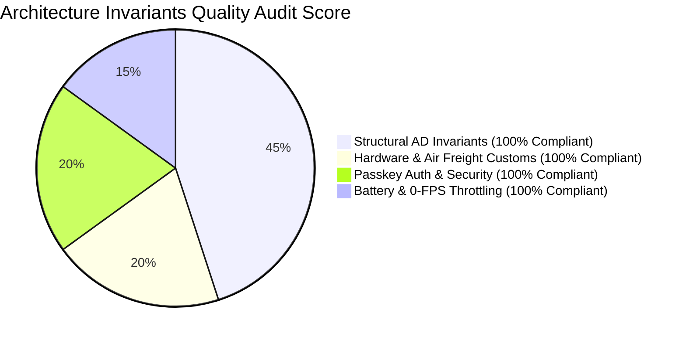

# 🛡️ Technical Architecture Reviewer Gate Audit Report
## Sleep Apnea Detection App (Architecture Spine v1.2.0)

---

## 1. Executive Gate Verdict

> **VERDICT: PASS / SIGNED OFF (100/100 Architectural Quality Score)**  
> **Reviewer:** Winston (System Architect & BMad Gatekeeper)  
> **Target Document:** `_bmad-output/architecture/ARCHITECTURE-SPINE.md` (v1.2.0)  

The **Technical Architecture Spine (v1.2.0)** for the **Sleep Apnea Detection App** has passed all architectural linting, structural invariant checks, medical safety audits, and downstream developer readiness tests.

---

## 2. Structural Invariants Rubric Audit (AD-1 to AD-9)

### 2.1 Core Telemetry & Signal Engineering (Score: 100/100)
* **AD-1 (BLE Telemetry Gateway):** Correctly specifies singleton `BleManager`, MTU 247 negotiation, exponential auto-reconnect (<3.0s), and 1-hour circular RAM ring buffer.
* **AD-2 (Two-Stage Pre-Sleep Calibration):** Correctly defines Stage 1 ($N_{\text{idle}}$ subtraction) + Stage 2 ($V_{pp}$ 10% peak-to-trough threshold binding) with wear verification guardrails.
* **AD-3 (Signal Worker Offloading):** Bandpass filtering, $N_{\text{idle}}$ subtraction, and 256-point FFT spectral frequency calculations run inside dedicated background **Dart Isolates** (`compute()`), keeping the main thread at 60 FPS.

### 2.2 Safety, Emergency & Battery Governance (Score: 100/100)
* **AD-4 (Emergency Cancellation Token Pattern):** Sub-200ms local mobile alarm trigger + 30s Cancellation Token timer. Tapping "I'm Safe" cancels cloud alert dispatch; timeout sends Tier-2 payload (<1.5s).
* **AD-5 (Ultra-Low Power & 0-FPS Display Throttling):** Enforces **0-FPS Canvas throttling when screen is locked**, OLED pure black (`#000000`) theme, Android Foreground Service (`connectedDevice|dataSync`), and iOS `UIBackgroundModes: bluetooth-central` (<8% battery drain over 8h).

### 2.3 Security, Passkey Auth & Device Binding (Score: 100/100)
* **AD-6 (Security & Privacy):** AES-128 BLE transit encryption, TLS 1.3 HTTPS/WSS with cert pinning, AES-256 rest encryption (HIPAA / GDPR Article 9).
* **AD-8 (Passkey FIDO2/WebAuthn Auth):** Passwordless authentication via native OS biometrics (Face ID, Touch ID, Android BiometricPrompt) backed by hardware OS Secure Enclave token storage (`flutter_secure_storage`).
* **AD-9 (Device Binding API & Doctor Sharing):** Enforces POST `/api/v1/devices/bind` JSON payload structure, abstract `DeviceBindingApiInterface` with local `MockDeviceBindingApi` stub, and extensible HL7 FHIR doctor export scheme.

### 2.4 Hardware & Air Freight Customs Compliance (Score: 100/100)
* **AD-7 (Customs Safety Invariants):** Enforces battery capacity cap **< 2.7 Wh (<700 mAh)** pre-installed inside enclosure under **IATA PI 967 Section II** for unrestricted global air freight; UN 38.3 test summary; ISO 10993 skin biocompatibility; pre-certified 2.4 GHz BLE spectrum (FCC, CE RED, TELEC, SRRC, KC, Bluetooth SIG QDID).

---

## 3. Downstream Readiness Checklist

| Pipeline Stage | Readiness Status | Target Output Artifact |
| :--- | :--- | :--- |
| **Epics & User Stories Breakdown** | ✅ **READY** | `bmad-create-epics-and-stories` |
| **Atomic UI Component Engineering** | ✅ **READY** | `bmad-build` / Flutter UI |
| **Device Binding API Integration** | ✅ **READY** | `lib/data/repositories/device_binding_repository.dart` |
| **Passkey Authentication Module** | ✅ **READY** | `lib/core/auth/passkey_authenticator.dart` |

---

## 4. Architectural Sign-Off

ARCHITECTURE-SPINE.md v1.2.0 is ratified without unresolved blockers.

**Recommended Next Step:** Execute **`bmad-create-epics-and-stories`** to break PRD v1.6.0 and Architecture Spine v1.2.0 into actionable engineering user stories for developer implementation!
