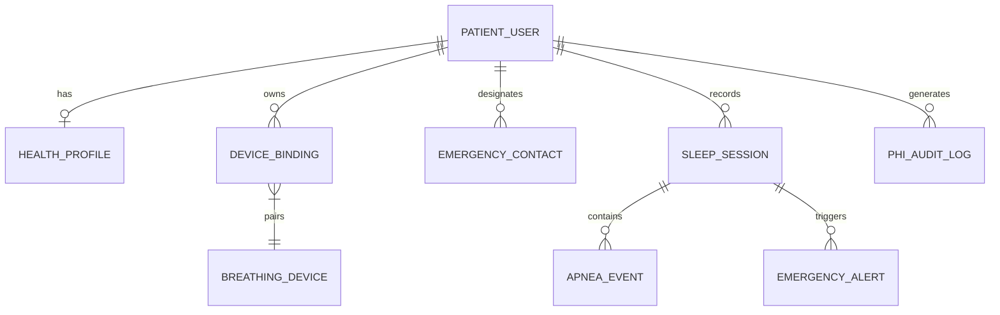
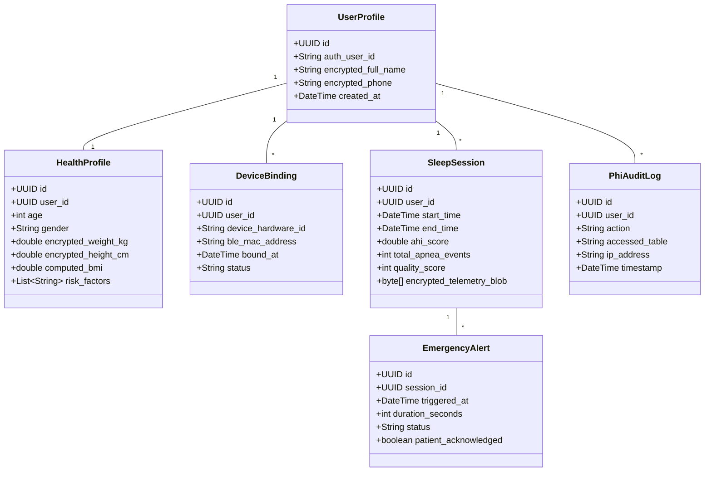

# 🗄️ Supabase Data Architecture, Data Classification & HIPAA Remediation Report
## Sleep Apnea Detection App

---

## 1. Executive Summary: Why Supabase & HIPAA Compliance Risk Analysis

### 1.1 Why Does the App Need Supabase / Cloud Backend?
The mobile application interfaces locally with the small breathing device via BLE, but requires a robust cloud infrastructure (Supabase / PostgreSQL) for 5 core business capabilities:
1. **Passkey & FIDO2 User Authentication:** Secure handling of passwordless WebAuthn user sessions and JWT access tokens.
2. **Device Binding Registry:** Mapping hardware `device_hardware_id` to `user_profile_id` so devices cannot be hijacked or paired maliciously.
3. **Overnight Sleep Session Storage:** Persisting morning sleep scores, estimated AHI, duration, and compressed bio-signal time series for long-term health trends.
4. **Tier-2 Cloud Emergency Dispatch Gateway:** Real-time WebSockets / Database Webhooks to dispatch SMS/Push notifications to designated caregivers when a 30-second apnea alert goes unacknowledged.
5. **Doctor Profile & Telemetry Sharing:** Allowing primary care physicians to access patient sleep reports upon explicit patient consent.

---

### 1.2 HIPAA Violation Analysis & Supabase Remediation Strategy

> **⚠️ WARNING: Standard Public Supabase is NOT HIPAA Compliant by Default!**

| Risk Dimension | Standard Supabase Flaw | HIPAA Regulation Breached | Mandatory Remediation |
| :--- | :--- | :--- | :--- |
| **Business Associate Agreement (BAA)** | Public shared plans (Free/Pro) lack a BAA contract. | **45 CFR § 164.502(e)** & **§ 164.308(b)** | Upgrade to **Supabase Team / Enterprise Plan** with a signed **HIPAA BAA**. |
| **Encryption at Rest** | Default disk storage leaves column data unencrypted in raw SQL form. | **45 CFR § 164.312(e)(2)(ii)** | Implement **pgcrypto / pgsodium column-level AES-256-GCM envelope encryption** for all PHI. |
| **Access Control & RLS** | Unprotected tables allow cross-tenant query vulnerabilities. | **45 CFR § 164.312(a)(1)** | Enforce strict **Row Level Security (RLS)** policies restricting row access strictly to `auth.uid()`. |
| **Audit Logging** | Standard PostgreSQL logs do not record granular PHI read/export events. | **45 CFR § 164.312(b)** | Implement automated PL/pgSQL triggers logging all PHI operations to an immutable `phi_audit_logs` table. |

---

## 2. Conceptual Data Model



---

## 3. Data Classification Matrix (HIPAA Safeguards)

| Model Attribute | Data Classification Level | HIPAA Category | Storage Encryption Method | Access Control Rule |
| :--- | :--- | :--- | :--- | :--- |
| `user_profile.full_name` | **Level 1 — Direct PHI** | PHI | AES-256 `pgcrypto` | RLS (`auth.uid() = user_id`) |
| `user_profile.phone_number` | **Level 1 — Direct PHI** | PHI | AES-256 `pgcrypto` | RLS (`auth.uid() = user_id`) |
| `health_profile.weight_kg` | **Level 1 — Direct PHI** | Health Baseline | AES-256 `pgcrypto` | RLS + Doctor Share Token |
| `health_profile.height_cm` | **Level 1 — Direct PHI** | Health Baseline | AES-256 `pgcrypto` | RLS + Doctor Share Token |
| `health_profile.bmi` | **Level 1 — Direct PHI** | Derived Health Data | AES-256 `pgcrypto` | RLS + Doctor Share Token |
| `emergency_contact.phone` | **Level 1 — Direct PHI** | Emergency Endpoint | AES-256 `pgcrypto` | System Dispatcher Only |
| `sleep_session.ahi_score` | **Level 1 — Direct PHI** | Clinical Metric | AES-256 `pgcrypto` | RLS (`auth.uid() = user_id`) |
| `sleep_session.telemetry_blob`| **Level 1 — Direct PHI** | Raw Bio-Signals | AES-256 Compressed Blob | RLS (`auth.uid() = user_id`) |
| `device_binding.device_mac` | **Level 2 — PII / Technical** | Device Metadata | Standard Database Column | RLS (`auth.uid() = user_id`) |
| `phi_audit_log.*` | **Level 2 — Security Audit** | Audit Control | Immutable Insert-Only | Admin / Compliance Only |

---

## 4. Application Data Model (Relational Schema Design)



---

## 5. Physical Data Model (HIPAA-Compliant PostgreSQL DDL Script)

Below is the production PostgreSQL DDL script with `pgcrypto` AES-256 encryption, Row Level Security (RLS) policies, and immutable audit triggers:

```sql
-- 1. Enable Required Security Extensions
CREATE EXTENSION IF NOT EXISTS "uuid-ossp";
CREATE EXTENSION IF NOT EXISTS "pgcrypto";

-- 2. Create User Profiles Table (Direct PHI Encrypted)
CREATE TABLE public.user_profiles (
    id UUID PRIMARY KEY DEFAULT uuid_generate_v4(),
    auth_user_id UUID UNIQUE NOT NULL REFERENCES auth.users(id) ON DELETE CASCADE,
    encrypted_full_name BYTEA NOT NULL, -- Encrypted via AES-256 pgcrypto
    encrypted_phone BYTEA NOT NULL,     -- Encrypted via AES-256 pgcrypto
    created_at TIMESTAMPTZ DEFAULT NOW(),
    updated_at TIMESTAMPTZ DEFAULT NOW()
);

-- 3. Create Health Baseline Table
CREATE TABLE public.health_profiles (
    id UUID PRIMARY KEY DEFAULT uuid_generate_v4(),
    user_id UUID UNIQUE NOT NULL REFERENCES public.user_profiles(id) ON DELETE CASCADE,
    age INT CHECK (age > 0 AND age < 120),
    gender VARCHAR(20),
    encrypted_weight_kg BYTEA NOT NULL,
    encrypted_height_cm BYTEA NOT NULL,
    computed_bmi NUMERIC(4,1),
    created_at TIMESTAMPTZ DEFAULT NOW()
);

-- 4. Create Device Binding Registry Table
CREATE TABLE public.device_bindings (
    id UUID PRIMARY KEY DEFAULT uuid_generate_v4(),
    user_id UUID NOT NULL REFERENCES public.user_profiles(id) ON DELETE CASCADE,
    device_hardware_id VARCHAR(64) NOT NULL,
    ble_mac_address VARCHAR(17) NOT NULL,
    status VARCHAR(20) DEFAULT 'ACTIVE' CHECK (status IN ('ACTIVE', 'UNPAIRED', 'REVOKED')),
    bound_at TIMESTAMPTZ DEFAULT NOW(),
    UNIQUE(user_id, device_hardware_id)
);

-- 5. Create Sleep Sessions Table (Overnight Telemetry Storage)
CREATE TABLE public.sleep_sessions (
    id UUID PRIMARY KEY DEFAULT uuid_generate_v4(),
    user_id UUID NOT NULL REFERENCES public.user_profiles(id) ON DELETE CASCADE,
    start_time TIMESTAMPTZ NOT NULL,
    end_time TIMESTAMPTZ NOT NULL,
    total_duration_seconds INT NOT NULL,
    ahi_score NUMERIC(4,1) NOT NULL,
    total_apnea_events INT NOT NULL DEFAULT 0,
    quality_score INT CHECK (quality_score BETWEEN 0 AND 100),
    encrypted_telemetry_blob BYTEA, -- Compressed AES-256 bio-signal time series
    created_at TIMESTAMPTZ DEFAULT NOW()
);

-- 6. Create Emergency Alerts Table (Tier-2 Caregiver Dispatch)
CREATE TABLE public.emergency_alerts (
    id UUID PRIMARY KEY DEFAULT uuid_generate_v4(),
    session_id UUID NOT NULL REFERENCES public.sleep_sessions(id) ON DELETE CASCADE,
    triggered_at TIMESTAMPTZ DEFAULT NOW(),
    duration_seconds INT NOT NULL,
    patient_acknowledged BOOLEAN DEFAULT FALSE,
    cloud_dispatched BOOLEAN DEFAULT FALSE,
    dispatch_timestamp TIMESTAMPTZ
);

-- 7. Create Immutable PHI Audit Log Table (45 CFR § 164.312(b))
CREATE TABLE public.phi_audit_logs (
    id UUID PRIMARY KEY DEFAULT uuid_generate_v4(),
    user_id UUID NOT NULL,
    action VARCHAR(50) NOT NULL, -- e.g., 'READ_PHI', 'EXPORT_DOCTOR_PDF', 'DEVICE_BIND'
    accessed_table VARCHAR(50) NOT NULL,
    ip_address INET,
    timestamp TIMESTAMPTZ DEFAULT NOW()
);

-- -----------------------------------------------------------------
-- 8. ROW LEVEL SECURITY (RLS) POLICIES (HIPAA Access Safeguard)
-- -----------------------------------------------------------------
ALTER TABLE public.user_profiles ENABLE ROW LEVEL SECURITY;
ALTER TABLE public.health_profiles ENABLE ROW LEVEL SECURITY;
ALTER TABLE public.device_bindings ENABLE ROW LEVEL SECURITY;
ALTER TABLE public.sleep_sessions ENABLE ROW LEVEL SECURITY;
ALTER TABLE public.emergency_alerts ENABLE ROW LEVEL SECURITY;

-- User Profile Policy: Users can only read/update their own profile
CREATE POLICY user_profile_rls ON public.user_profiles
    FOR ALL USING (auth.uid() = auth_user_id);

-- Health Profile Policy
CREATE POLICY health_profile_rls ON public.health_profiles
    FOR ALL USING (user_id IN (SELECT id FROM public.user_profiles WHERE auth_user_id = auth.uid()));

-- Sleep Session Policy
CREATE POLICY sleep_session_rls ON public.sleep_sessions
    FOR ALL USING (user_id IN (SELECT id FROM public.user_profiles WHERE auth_user_id = auth.uid()));

-- -----------------------------------------------------------------
-- 9. IMMUTABLE PHI AUDIT TRIGGER FUNCTION
-- -----------------------------------------------------------------
CREATE OR REPLACE FUNCTION log_phi_access()
RETURNS TRIGGER AS $$
BEGIN
    INSERT INTO public.phi_audit_logs(user_id, action, accessed_table, timestamp)
    VALUES (NEW.user_id, TG_OP, TG_TABLE_NAME, NOW());
    RETURN NEW;
END;
$$ LANGUAGE plpgsql SECURITY DEFINER;

CREATE TRIGGER audit_sleep_sessions_access
    AFTER INSERT OR UPDATE ON public.sleep_sessions
    FOR EACH ROW EXECUTE FUNCTION log_phi_access();
```
