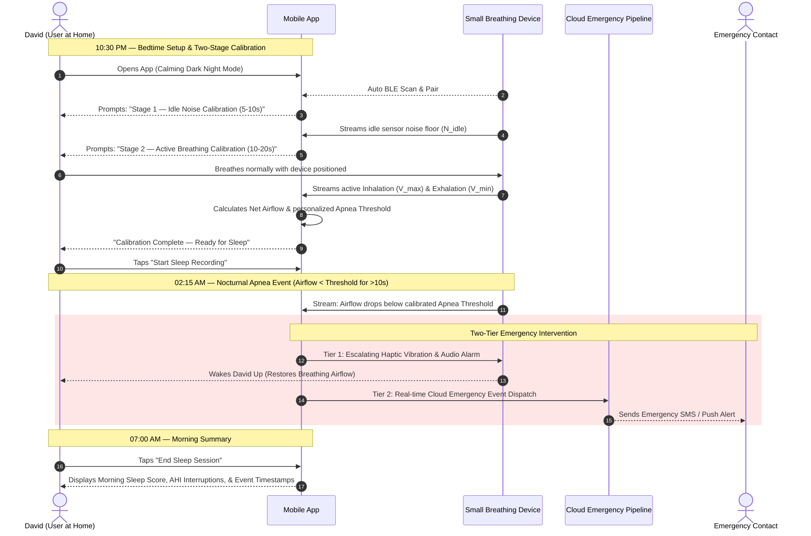

# 🫁 Product Requirements Document (PRD)
## Sleep Apnea Detection App

---

## 1. Executive Summary & Goals

### 1.1 Product Overview
The **Sleep Apnea Detection App** is a specialized consumer health mobile application designed to interface wirelessly via **Bluetooth Low Energy (BLE)** with a **small breathing device** used comfortably at home during sleep. 

The application transforms raw overnight bio-signals into actionable sleep apnea insights, eliminating the need for expensive, uncomfortable hospital sleep lab visits. When severe or prolonged breathing stops are detected during sleep, the application initiates an active **Two-Tier Emergency Response**:
1. **Tier-1 Local Wake-Up Alert:** Escalating haptic vibrations and audio alarms to wake the patient and restore breathing.
2. **Tier-2 Cloud Emergency Dispatch:** Real-time signal transmission to the cloud backend to notify designated emergency contacts or caregivers.

### 1.2 Strategic Business Goals
* **At-Home Accessibility:** Provide a comfortable, non-invasive alternative to clinical polysomnography (hospital sleep studies).
* **Proactive Safety:** Move from passive morning data logging to active overnight intervention during critical apnea episodes.
* **Signal Accuracy:** Eliminate false positives/negatives through a mandatory **Two-Stage Pre-Sleep Calibration Routine** that learns device noise floors and personalized breathing thresholds.

---

## 2. Target Personas & Primary User Journey

### 2.1 Target Persona: David (At-Home High-Risk Sleep Patient)
* **Age:** 48
* **Profile:** Suffers from severe loud snoring, morning fatigue, and unmonitored nocturnal breathing pauses. Sleeps at home with his spouse.
* **Core Need:** A comfortable, reliable at-home breathing monitor that wakes him during dangerous apnea stops and alerts his spouse if he does not respond.

### 2.2 User Journey 1 (UJ-1): Bedtime Calibration, Overnight Telemetry & Emergency Alert

---

## 3. Functional Requirements (FR)

### 3.1 FR-1: Device Pairing, Two-Stage Calibration & Baseline Engine

* **FR-1.1 (BLE Auto-Discovery):** The application shall automatically scan for, identify, and establish a low-energy Bluetooth (BLE) connection with the user's paired small breathing device.
* **FR-1.2 (Stage-1 Idle Sensor Calibration):** Prior to device attachment, the application shall execute a mandatory 5-to-10 second sampling phase of idle BLE data to compute the ambient sensor noise floor ($N_{\text{idle}}$) and zero-offset drift.
* **FR-1.3 (Stage-2 Active Breath Training):** Following device attachment, the application shall execute a 10-to-20 second active breathing calibration phase to record the user's peak inhalation ($V_{\max}$) and trough exhalation ($V_{\min}$) amplitudes.
* **FR-1.4 (Net Airflow Calculation):** The application shall calculate net respiratory airflow using $V_{\text{net}} = V_{\text{raw}} - N_{\text{idle}}$.
* **FR-1.5 (Dynamic Apnea Threshold Binding):** The application shall dynamically set the zero-airflow (Apnea) threshold for the session based on the calibrated net breathing baseline.
* **FR-1.6 (Wear Verification Guardrail):** The application shall block sleep recording initiation if the net active breathing signal fails to exceed the idle noise floor by a minimum confidence margin ($\Delta V > \text{Threshold}_{\min}$).

---

### 3.2 FR-2: Real-Time Overnight Telemetry & Apnea Detection

* **FR-2.1 (Continuous Background Logging):** The application shall log continuous respiratory airflow streams throughout an 8+ hour sleep window while operating in a low-power background state.
* **FR-2.2 (Real-Time Apnea Evaluator):** The application shall evaluate real-time net airflow against the session's calibrated Apnea threshold every 100 milliseconds.
* **FR-2.3 (Apnea Event Flagging):** An obstructive apnea event shall be flagged whenever net airflow remains below the calibrated zero-threshold continuously for longer than 10 seconds (configurable: 10s–30s).
* **FR-2.4 (Session Data Integrity):** Telemetry packets shall be timestamped locally and buffered during temporary signal interruptions to prevent data loss.

---

### 3.3 FR-3: Two-Tier Emergency Response & Intervention System

* **FR-3.1 (Tier-1 Escalating Local Alarm):** Upon flagging a critical apnea event (>10s breathing stop), the application shall immediately trigger local haptic vibrations (via phone/device) and an escalating audio alarm to wake the user.
* **FR-3.2 (Local Alarm Dismissal):** The local wake-up alarm shall automatically silence upon detecting restored active breathing airflow ($V_{\text{net}} > \text{Threshold}_{\text{normal}}$) or manual user tap.
* **FR-3.3 (Tier-2 Cloud Emergency Dispatch):** Simultaneously with Tier-1 activation, the application shall transmit an emergency alert payload (User ID, timestamp, GPS location, apnea duration) over HTTPS/WebSocket to the cloud backend.
* **FR-3.4 (Cloud Caregiver Notification):** The cloud backend shall dispatch multi-channel emergency alerts (Push Notification, SMS, Email) to designated emergency contacts if the local alarm is unacknowledged after 30 seconds.

---

### 3.4 FR-4: Morning Analytics, History & Sleep Health Insights

* **FR-4.1 (Morning Sleep Summary):** Upon session termination, the application shall calculate and display:
  * Total Sleep Duration (hours/minutes)
  * Estimated AHI (Apnea-Hypopnea Index — events per hour)
  * Count of Triggered Wake-Up Interventions
  * Overall Sleep Breathing Quality Score (0–100)
* **FR-4.2 (Interactive Respiration Timeline):** The application shall render an interactive overnight respiration wave graph with color-coded markers for flagged apnea episodes and wake-up events.
* **FR-4.3 (Calendar & History Filter):** Users shall be able to filter historical sleep sessions by day, week, or month using an interactive calendar strip.
* **FR-4.4 (Educational Library):** The application shall provide integrated articles and video guides on sleep hygiene, obstructive sleep apnea signs, and physician consultation guidance.

---

## 4. Non-Functional Requirements (NFR)

### 4.1 NFR-1: Reliability & BLE Reconnect Resilience
* **Auto-Reconnect:** In the event of a BLE disconnect during sleep, the application shall automatically re-establish connection within 3.0 seconds without terminating the recording session.
* **Data Recovery:** If BLE disconnection persists, the application shall buffer up to 1 hour of telemetry in device local storage and sync upon reconnection.

### 4.2 NFR-2: Performance & Alert Latency
* **Local Alert Trigger:** Tier-1 local haptic/audio alarms shall trigger within **< 200 milliseconds** of detecting an apnea threshold breach.
* **Cloud Signal Latency:** Tier-2 cloud emergency payload transmission shall complete within **< 1.5 seconds** under standard 4G/5G/Wi-Fi conditions.

### 4.3 NFR-3: Battery Efficiency & Thermal Safety
* **Overnight Battery Consumption:** Continuous 8-hour background telemetry and stream processing shall consume **< 12% total phone battery**.
* **Thermal Management:** Device background execution shall not exceed ambient operating temperatures (CPU throttling guardrails).

### 4.4 NFR-4: Security & Data Privacy
* **Encrypted Telemetry:** BLE data packets shall be encrypted in transit using AES-128.
* **Cloud Encryption:** All stored sleep telemetry and emergency payload logs in the cloud backend shall be encrypted at rest (AES-256) and compliant with HIPAA/GDPR health privacy standards.

---

## 5. Success Metrics & Key Performance Indicators (KPIs)

| Metric | Target | Verification Method |
| :--- | :--- | :--- |
| **Emergency Intervention Success** | 99.9% reliable trigger on true apnea stops | Automated signal simulation tests |
| **Pre-Sleep Calibration Completion** | >95% first-attempt success rate | In-app event telemetry |
| **Cloud Alert Latency** | < 1.5 seconds | End-to-end cloud dispatch monitoring |
| **Overnight Battery Efficiency** | < 12% drain over 8 hours | Battery profiling benchmarks |
| **False Positive Apnea Rate** | < 2% per session | Baseline noise floor verification |

---

## 6. Future Expansion Roadmap

* **Doctor-Ready PDF Export:** One-tap export of 8-hour overnight breathing graphs formatted for sleep medical specialists.
* **Smart Home IoT Action Triggers:** Automated cloud integration to turn on bedroom lights or raise bed incline during severe apnea alerts.
* **Positional Sleep Tracking:** Correlating nocturnal apnea episodes with body sleeping posture (back vs. side).
