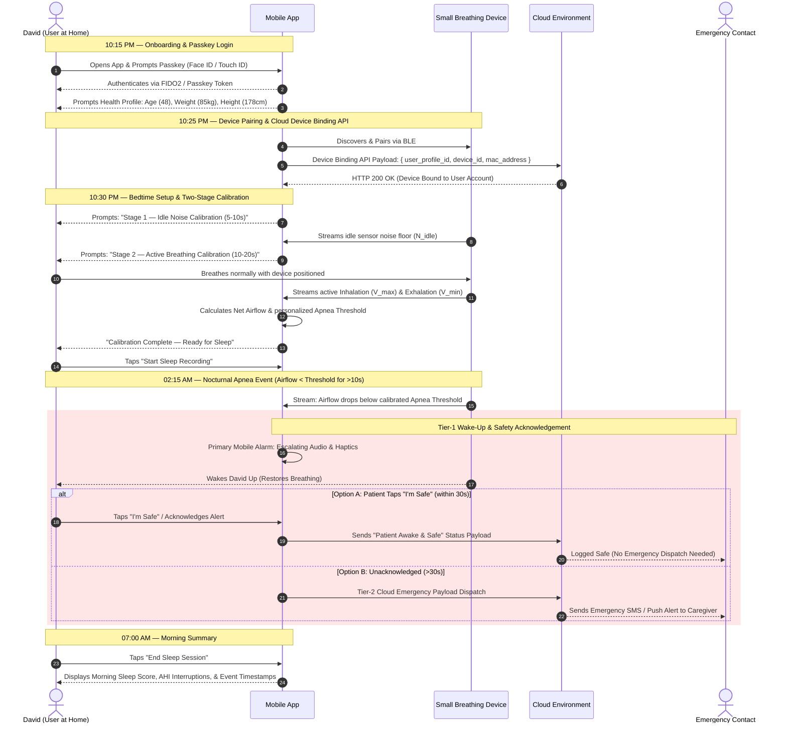

# 🫁 Product Requirements Document (PRD)
## Sleep Apnea Detection App

---

## 1. Executive Summary & Goals

### 1.1 Product Overview
The **Sleep Apnea Detection App** is a specialized consumer health mobile application designed to interface wirelessly via **Bluetooth Low Energy (BLE)** with a **small breathing device** used comfortably at home during sleep. 

The application transforms raw overnight bio-signals into actionable sleep apnea insights, eliminating the need for expensive, uncomfortable hospital sleep lab visits. Access is secured via passwordless **Passkey (FIDO2/WebAuthn)** biometrics. When severe or prolonged breathing stops are detected during sleep, the application initiates an active **Two-Tier Emergency Response**:
1. **Tier-1 Primary App & Device Wake-Up Alert:** Escalating smartphone audio alarms & haptics (and future device micro-electrical stimulation) to wake the patient and restore breathing.
2. **Tier-2 Cloud Emergency Dispatch & Safety Acknowledgement:** Real-time signal transmission to the cloud backend. If the patient acknowledges the alert via the app ("I'm Safe"), the cloud logs a safety event; if unacknowledged after 30 seconds, emergency notifications are dispatched to caregivers.

### 1.2 Strategic Business Goals
* **At-Home Accessibility:** Provide a comfortable, non-invasive alternative to clinical polysomnography (hospital sleep studies).
* **Frictionless Security:** Passwordless **Passkey** onboarding for instant, secure authentication.
* **Proactive Patient Safety:** Move from passive morning data logging to active overnight intervention during critical apnea episodes.
* **Device Binding & Doctor Integration Framework:** Standardized API contract for pairing hardware to cloud user accounts and extensible health profile sharing with physicians.

---

## 2. Target Personas & Primary User Journey

### 2.1 Target Persona: David (At-Home High-Risk Sleep Patient)
* **Age:** 48
* **Profile:** Suffers from severe loud snoring, morning fatigue, and unmonitored nocturnal breathing pauses. Sleeps at home with his spouse.
* **Core Need:** A comfortable, reliable at-home breathing monitor that wakes him during dangerous apnea stops and alerts his spouse if he does not respond.

### 2.2 User Journey 1 (UJ-1): Passkey Onboarding, Bedtime Calibration & Device Binding

---

## 3. Functional Requirements (FR)

### 3.1 FR-1: Device Pairing, Two-Stage Calibration & Device Binding Framework

* **FR-1.1 (BLE Auto-Discovery):** The application shall automatically scan for, identify, and establish a low-energy Bluetooth (BLE) connection with the user's paired small breathing device.
* **FR-1.2 (Device Binding API Framework):** Upon successful BLE pairing, the application shall execute the **Cloud Device Binding API** (`POST /api/v1/devices/bind`), transmitting an encrypted payload containing `user_profile_id`, `device_hardware_id`, `ble_mac_address`, and `binding_timestamp`.
* **FR-1.3 (Offline Device Binding Queue):** If the device is paired without active internet connectivity, the application shall queue the device binding payload locally and retry transmission upon network restoration.
* **FR-1.4 (Stage-1 Idle Sensor Calibration):** Prior to device attachment, the application shall execute a mandatory 5-to-10 second sampling phase of idle BLE data to compute ambient noise floor ($N_{\text{idle}}$).
* **FR-1.5 (Stage-2 Active Breath Training):** Following device attachment, the application shall execute a 10-to-20 second active breathing calibration phase to record peak inhalation ($V_{\max}$) and trough exhalation ($V_{\min}$).
* **FR-1.6 (Net Airflow Calculation):** The application shall calculate net respiratory airflow using $V_{\text{net}} = V_{\text{raw}} - N_{\text{idle}}$.
* **FR-1.7 (Dynamic Apnea Threshold Binding):** The application shall dynamically set the zero-airflow (Apnea) threshold for the session based on the calibrated net breathing baseline.
* **FR-1.8 (Wear Verification Guardrail):** The application shall block sleep recording initiation if active breathing signal $\Delta V < \text{Threshold}_{\min}$.

---

### 3.2 FR-2: Real-Time Overnight Telemetry & Apnea Detection

* **FR-2.1 (Continuous Background Logging):** The application shall log continuous respiratory airflow streams throughout an 8+ hour sleep window in a low-power background state.
* **FR-2.2 (Real-Time Apnea Evaluator):** The application shall evaluate real-time net airflow against the calibrated threshold every 100 milliseconds.
* **FR-2.3 (Apnea Event Flagging):** An obstructive apnea event shall be flagged whenever net airflow remains below threshold continuously for $>10$ seconds.
* **FR-2.4 (Session Data Integrity):** Telemetry packets shall be timestamped locally and buffered during temporary signal interruptions.

---

### 3.3 FR-3: Primary App Alarm, Patient Safety Acknowledgement & Cloud Dispatch

* **FR-3.1 (Primary Mobile App Alarm):** Upon flagging a critical apnea event (>10s breathing stop), the smartphone application shall trigger high-priority escalating audio tones (40 dB → 75+ dB) and full-screen haptic vibration pulses.
* **FR-3.2 (Patient "I'm Safe" Acknowledgement Action):** The application shall render a prominent, large touch target button (**"I'm Safe / I'm Awake"**) on the screen during an alarm event.
* **FR-3.3 (Patient Safety Signal to Cloud):** If the patient taps "I'm Safe" within 30 seconds of alarm initiation, the application shall silence the alarm and transmit a **"Patient Awake & Safe"** status signal.
* **FR-3.4 (Automatic Alarm Silence on Breathing Restoration):** If normal respiratory airflow is restored ($V_{\text{net}} > \text{Threshold}_{\text{normal}}$) continuously for 5 seconds without manual tap, the app shall auto-silence the alarm.
* **FR-3.5 (Tier-2 Cloud Emergency Dispatch on Timeout):** If the alarm remains unacknowledged after 30 seconds, the application shall transmit a high-priority **Emergency Dispatch Payload** to alert designated caregivers.

---

### 3.4 FR-4: Morning Analytics, History & Sleep Health Insights

* **FR-4.1 (Morning Sleep Summary):** Displays Total Sleep Duration, Estimated AHI (events/hour), Intervention Count, and Quality Score (0–100).
* **FR-4.2 (Interactive Respiration Timeline):** Renders interactive overnight wave graphs with color-coded markers for flagged apnea episodes and safety acknowledgements.
* **FR-4.3 (Calendar & History Filter):** Date-filtered historical sleep sessions.
* **FR-4.4 (Educational Library):** Integrated articles and instructional videos.

---

### 3.5 FR-5: Passkey Authentication, Health Profile & Doctor Sharing Framework

* **FR-5.1 (Passkey FIDO2/WebAuthn Authentication):** The application shall support passwordless authentication via **Passkeys**, utilizing native OS biometrics (Face ID, Touch ID, Android BiometricPrompt) and hardware secure enclave tokens.
* **FR-5.2 (Health Profile Management):** The application shall collect and manage the user's health baseline profile:
  * Weight (kg / lbs)
  * Height (cm / ft-in)
  * Age & Date of Birth
  * Gender
  * Automatically calculated BMI (Body Mass Index)
  * Known Sleep & Cardiovascular Risk Factors
* **FR-5.3 (Extensible Doctor Sharing Framework):** The application shall provide a dedicated **"Share Profile with Doctor"** UI module and extensible JSON data export engine formatted for future EHR/EMR physician integrations.

---

## 4. Non-Functional Requirements (NFR)

### 4.1 NFR-1: Reliability & BLE Reconnect Resilience
* **Auto-Reconnect:** Automatic BLE re-connection within 3.0 seconds.
* **Data Recovery:** 1-hour local circular RAM ring buffer for data preservation.

### 4.2 NFR-2: Performance & Alert Latency
* **Local Alert Trigger:** Primary mobile alarm triggers within **< 200 milliseconds**.
* **Cloud Signal Latency:** Safety acknowledgement and Tier-2 emergency payloads transmit within **< 1.5 seconds**.

### 4.3 NFR-3: Maximum Battery Efficiency & Ultra-Low Power Architecture
* **Maximum Overnight Battery Consumption:** Continuous 8-to-10 hour background sleep logging consumes **< 8.0% total phone battery**.
* **0-FPS Display Throttling:** 0 FPS rendering when screen is locked/darkened.
* **Isolate Worker Offloading:** FFT and signal calculations offloaded to background Dart Isolates.

### 4.4 NFR-4: Security & Data Privacy
* **Passkey Hardware Security:** Passkey private keys stored exclusively inside OS Secure Enclave / Keystore.
* **Encrypted Telemetry:** AES-128 BLE transit encryption; AES-256 cloud encryption at rest (HIPAA / GDPR Article 9).

### 4.5 NFR-5: Real-Time Data Visualization & Chart Specifications

| Chart Identifier | Visual Chart Type | Underlying Library | Data Rendered | Rendering & Performance Spec |
| :--- | :--- | :--- | :--- | :--- |
| **CHART-01** | **Live Airflow Telemetry Line Chart** | `fl_chart` / Skia GPU | Continuous respiratory airflow wave ($V_{\text{net}}$). | 60 FPS active / 0 FPS locked. 100ms updates with cubic spline smoothing. |
| **CHART-02** | **FFT Frequency Spectrum Graph** | `victory-native` / `fl_chart` | FFT magnitude vs. Frequency (Hz). | Renders spectral peaks to compute respiration rate (BPM). |
| **CHART-03** | **Circular Progress Metric Rings** | Circular Progress Indicator | Sleep Quality Score %, Calibration progress. | Animated stroke fill with dynamic status colors. |
| **CHART-04** | **Multi-Axis Historical Session Chart** | `fl_chart` | Overnight AHI events, SpO2, and Heart Rate over 8h. | Pinch-to-zoom and pan interactions with event markers. |

### 4.6 NFR-6: Clinical Standards, International Regulations & Air Freight

* **NFR-6.1 (AASM Diagnostic Standard Alignment):** Apnea ($\ge 90\%$ drop $\ge 10\text{s}$) & Hypopnea ($\ge 30\%$ drop $\ge 10\text{s}$) classification.
* **NFR-6.2 (IEC 60601-1-8 Medical Alarm Hierarchy):** High (>20s), Medium (10–20s), and Low (BLE drop) alarm priority levels.
* **NFR-6.3 (SaMD & Quality Management Framework):** Developed under FDA 21 CFR Part 820 / ISO 13485 framework.
* **NFR-6.4 (GDPR Article 9 & HIPAA Compliance):** PHI encryption with explicit user consent.
* **NFR-6.5 (Hardware Air Freight & Customs Compliance — UN 38.3 / IATA PI 967 / ISO 10993):** UN 38.3 battery certification, IATA PI 967 Section II **< 2.7 Wh (<700 mAh)** battery cap, ISO 10993 skin biocompatibility, pre-certified 2.4 GHz BLE spectrum (FCC, CE RED, TELEC, SRRC, KC, Bluetooth SIG QDID).

---

## 5. Success Metrics & Key Performance Indicators (KPIs)

| Metric | Target | Verification Method |
| :--- | :--- | :--- |
| **Passkey Authentication Success** | >98% first-attempt biometric login | In-app auth telemetry |
| **Device Binding API Success** | 100% cloud binding acknowledgment | End-to-end API integration tests |
| **Emergency Intervention Success** | 99.9% reliable trigger on true apnea stops | Automated signal simulation tests |
| **Overnight Battery Efficiency** | **< 8.0% drain over 8 hours** | Battery profiling benchmarks |
| **Air Freight Customs Approval** | 100% first-pass customs clearance | UN 38.3 & IATA PI 967 test summaries |

---

## 6. Future Expansion & Hardware Enhancement Roadmap

* **⚡ HW-ENHANCEMENT-1 (Device Micro-Electrical Stimulation - EMS/TENS):** Future hardware revisions of the small breathing device may integrate mild micro-electrical stimulation (safe EMS micro-pulses) delivered directly via the device hardware to gently stimulate airway muscles and wake the patient.
* **Full EHR/EMR Doctor Integration:** Direct HL7 FHIR API synchronization for seamless health profile and sleep report delivery to primary care physicians.
* **Smart Home IoT Action Triggers:** Automated cloud integration to turn on bedroom lights or raise bed incline during severe apnea alerts.
