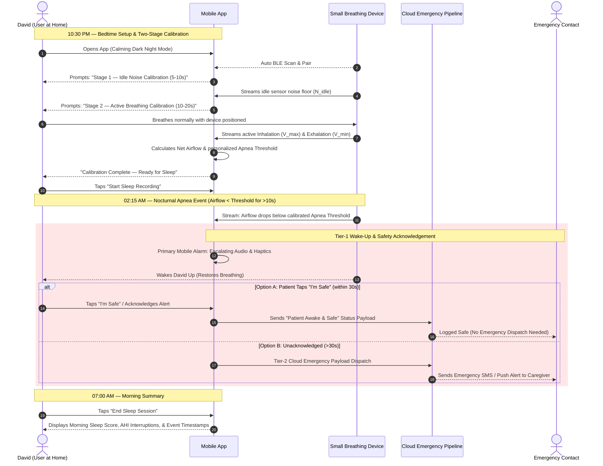

# 🫁 Product Requirements Document (PRD)
## Sleep Apnea Detection App

---

## 1. Executive Summary & Goals

### 1.1 Product Overview
The **Sleep Apnea Detection App** is a specialized consumer health mobile application designed to interface wirelessly via **Bluetooth Low Energy (BLE)** with a **small breathing device** used comfortably at home during sleep. 

The application transforms raw overnight bio-signals into actionable sleep apnea insights, eliminating the need for expensive, uncomfortable hospital sleep lab visits. When severe or prolonged breathing stops are detected during sleep, the application initiates an active **Two-Tier Emergency Response**:
1. **Tier-1 Primary App & Device Wake-Up Alert:** Escalating smartphone audio alarms & haptics (and future device micro-electrical stimulation) to wake the patient and restore breathing.
2. **Tier-2 Cloud Emergency Dispatch & Safety Acknowledgement:** Real-time signal transmission to the cloud backend. If the patient acknowledges the alert via the app ("I'm Safe"), the cloud logs a safety event; if unacknowledged after 30 seconds, emergency notifications are dispatched to caregivers.

### 1.2 Strategic Business Goals
* **At-Home Accessibility:** Provide a comfortable, non-invasive alternative to clinical polysomnography (hospital sleep studies).
* **Proactive Patient Safety:** Move from passive morning data logging to active overnight intervention during critical apnea episodes.
* **Signal Accuracy:** Eliminate false positives/negatives through a mandatory **Two-Stage Pre-Sleep Calibration Routine** that learns device noise floors and personalized breathing thresholds.

---

## 2. Target Personas & Primary User Journey

### 2.1 Target Persona: David (At-Home High-Risk Sleep Patient)
* **Age:** 48
* **Profile:** Suffers from severe loud snoring, morning fatigue, and unmonitored nocturnal breathing pauses. Sleeps at home with his spouse.
* **Core Need:** A comfortable, reliable at-home breathing monitor that wakes him during dangerous apnea stops and alerts his spouse if he does not respond.

### 2.2 User Journey 1 (UJ-1): Bedtime Calibration, Overnight Telemetry & Safety Acknowledgement Alert

---

## 3. Functional Requirements (FR)

### 3.1 FR-1: Device Pairing, Two-Stage Calibration & Baseline Engine

* **FR-1.1 (BLE Auto-Discovery):** The application shall automatically scan for, identify, and establish a low-energy Bluetooth (BLE) connection with the user's paired small breathing device.
* **FR-1.2 (Stage-1 Idle Sensor Calibration):** Prior to device attachment, the application shall execute a mandatory 5-to-10 second sampling phase of idle BLE data to compute the ambient sensor noise floor ($N_{\text{idle}}$) and zero-offset drift.
* **FR-1.3 (Stage-2 Active Breath Training):** Following device attachment, the application shall execute a 10-to-20 second active breathing calibration phase to record the user's peak inhalation ($V_{\max}$) and trough exhalation ($V_{\min}$) amplitudes.
* **FR-1.4 (Net Airflow Calculation):** The application shall calculate net respiratory airflow using $V_{\text{net}} = V_{\text{raw}} - N_{\text{idle}}$.
* **FR-1.5 (Dynamic Apnea Threshold Binding):** The application shall dynamically set the zero-airflow (Apnea) threshold for the session based on the calibrated net breathing baseline.
* **FR-1.6 (Wear Verification Guardrail):** The application shall block sleep recording initiation if the net active breathing signal fails to exceed the idle noise floor by a minimum confidence margin ($\Delta V > \text{Threshold}_{\min}$).

---

### 3.2 FR-2: Real-Time Overnight Telemetry & Apnea Detection

* **FR-2.1 (Continuous Background Logging):** The application shall log continuous respiratory airflow streams throughout an 8+ hour sleep window while operating in a low-power background state.
* **FR-2.2 (Real-Time Apnea Evaluator):** The application shall evaluate real-time net airflow against the session's calibrated Apnea threshold every 100 milliseconds.
* **FR-2.3 (Apnea Event Flagging):** An obstructive apnea event shall be flagged whenever net airflow remains below the calibrated zero-threshold continuously for longer than 10 seconds (configurable: 10s–30s).
* **FR-2.4 (Session Data Integrity):** Telemetry packets shall be timestamped locally and buffered during temporary signal interruptions to prevent data loss.

---

### 3.3 FR-3: Primary App Alarm, Patient Safety Acknowledgement & Cloud Dispatch

* **FR-3.1 (Primary Mobile App Alarm):** Upon flagging a critical apnea event (>10s breathing stop), the smartphone application shall trigger high-priority escalating audio tones (40 dB → 75+ dB) and full-screen haptic vibration pulses to wake the patient.
* **FR-3.2 (Patient "I'm Safe" Acknowledgement Action):** The application shall render a prominent, large touch target button (**"I'm Safe / I'm Awake"**) on the screen during an alarm event.
* **FR-3.3 (Patient Safety Signal to Cloud):** If the patient taps "I'm Safe" within 30 seconds of alarm initiation, the application shall silence the alarm and immediately transmit a **"Patient Awake & Safe"** status signal to the cloud platform.
* **FR-3.4 (Automatic Alarm Silence on Breathing Restoration):** If normal respiratory airflow is restored ($V_{\text{net}} > \text{Threshold}_{\text{normal}}$) continuously for 5 seconds without manual tap, the app shall auto-silence the alarm and record a self-resolved event.
* **FR-3.5 (Tier-2 Cloud Emergency Dispatch on Timeout):** If the alarm remains unacknowledged and breathing is not restored after 30 seconds, the application shall transmit a high-priority **Emergency Dispatch Payload** to the cloud backend to alert designated caregivers via SMS/Push Notification.

---

### 3.4 FR-4: Morning Analytics, History & Sleep Health Insights

* **FR-4.1 (Morning Sleep Summary):** Upon session termination, the application shall calculate and display:
  * Total Sleep Duration (hours/minutes)
  * Estimated AHI (Apnea-Hypopnea Index — events per hour)
  * Count of Triggered Wake-Up Interventions & Patient Safety Acknowledgements
  * Overall Sleep Breathing Quality Score (0–100)
* **FR-4.2 (Interactive Respiration Timeline):** The application shall render an interactive overnight respiration wave graph with color-coded markers for flagged apnea episodes, wake-up alarms, and safety acknowledgement timestamps.
* **FR-4.3 (Calendar & History Filter):** Users shall be able to filter historical sleep sessions by day, week, or month using an interactive calendar strip.
* **FR-4.4 (Educational Library):** The application shall provide integrated articles and video guides on sleep hygiene, obstructive sleep apnea signs, and physician consultation guidance.

---

## 4. Non-Functional Requirements (NFR)

### 4.1 NFR-1: Reliability & BLE Reconnect Resilience
* **Auto-Reconnect:** In the event of a BLE disconnect during sleep, the application shall automatically re-establish connection within 3.0 seconds without terminating the recording session.
* **Data Recovery:** If BLE disconnection persists, the application shall buffer up to 1 hour of telemetry in device local storage and sync upon reconnection.

### 4.2 NFR-2: Performance & Alert Latency
* **Local Alert Trigger:** Primary smartphone audio/haptic alarms shall trigger within **< 200 milliseconds** of detecting an apnea threshold breach.
* **Cloud Signal Latency:** Safety acknowledgement and Tier-2 emergency signal payloads shall transmit to the cloud backend within **< 1.5 seconds** under standard 4G/5G/Wi-Fi conditions.

### 4.3 NFR-3: Maximum Battery Efficiency & Ultra-Low Power Architecture
* **Maximum Overnight Battery Consumption:** Continuous 8-to-10 hour background sleep logging shall consume **< 8.0% total phone battery** (averaging $< 1.0\%$ battery drain per hour).
* **BLE Low-Power Packet Batching:** BLE connection parameters shall negotiate a batching interval ($15\text{ms} \le \text{connInterval} \le 30\text{ms}$) with 247-byte MTU payload batching to minimize Bluetooth radio CPU wakeups.
* **Isolate & Thread Offloading:** All signal filtering, noise subtraction, and FFT peak calculations shall execute on background Dart Isolates (worker threads), allowing the main mobile CPU to remain in a deep sleep state.
* **OLED Dark Mode & Screen Dimming:** During active sleep mode, the UI shall automatically dim screen brightness to minimum and render pure OLED black (`#000000` RGB) to eliminate display power draw.
* **0-FPS Display Throttling:** When the phone screen is turned off or locked, the UI rendering engine shall throttle to **0 FPS**, pausing all Canvas/Chart repaints while background telemetry processing continues.
* **Thermal Management:** Device background execution shall not exceed ambient operating temperatures (CPU thermal throttling guardrails).

### 4.4 NFR-4: Security & Data Privacy
* **Encrypted Telemetry:** BLE data packets shall be encrypted in transit using AES-128.
* **Cloud Encryption:** All stored sleep telemetry and emergency payload logs in the cloud backend shall be encrypted at rest (AES-256) and compliant with HIPAA/GDPR health privacy standards.

### 4.5 NFR-5: Real-Time Data Visualization & Chart Specifications

| Chart Identifier | Visual Chart Type | Underlying Library | Data Rendered | Rendering & Performance Spec |
| :--- | :--- | :--- | :--- | :--- |
| **CHART-01** | **Live Airflow Telemetry Line Chart** | `victory-native` / `fl_chart` (Skia GPU Accelerated) | Real-time continuous respiratory airflow wave ($V_{\text{net}}$) vs. Time (seconds). | **60 FPS render loop when screen active (0 FPS when locked).** 100ms stream updates with cubic spline smoothing. Dynamic Y-axis auto-scaling with zero-baseline reference. |
| **CHART-02** | **FFT Frequency Spectrum Graph** | `victory-native` (`VictoryChart`, `VictoryLine`) | Fast Fourier Transform magnitude vs. Frequency (Hz). | Renders spectral peaks derived from raw airflow telemetry to compute exact respiration rates (BPM). |
| **CHART-03** | **Circular Progress Metric Rings** | `react-native-circular-progress-indicator` | Sleep Quality Score %, Session Countdown timer, Calibration progress. | Animated stroke fill with dynamic status colors (Green: Optimal, Amber: Warning, Red: Apnea Threshold Breach). |
| **CHART-04** | **Multi-Axis Historical Session Chart** | `victory-native` (`VictoryChart`, `VictoryAxis`) | Overnight AHI events, SpO2 trends, and Heart Rate over 8-hour sleep timelines. | Pinch-to-zoom and pan interactions across multi-hour sleep timelines with color-coded event markers for wake-up alerts & safety acknowledgements. |

### 4.6 NFR-6: Clinical Standards, International Regulations & Hardware Air Freight Customs

* **NFR-6.1 (AASM Diagnostic Standard Alignment):** The evaluation engine shall classify respiratory events adhering to American Academy of Sleep Medicine (AASM) guidelines (Apnea $\ge 90\%$ drop $\ge 10\text{s}$, Hypopnea $\ge 30\%$ drop $\ge 10\text{s}$).
* **NFR-6.2 (IEC 60601-1-8 Medical Alarm Hierarchy):** Alarm prioritization follows High (>20s unacknowledged), Medium (10–20s), and Low (BLE drop) priority levels to eliminate alarm fatigue.
* **NFR-6.3 (SaMD & Quality Management Framework):** Developed under Software as a Medical Device (SaMD) principles (FDA 21 CFR Part 820 / ISO 13485).
* **NFR-6.4 (GDPR Article 9 & HIPAA Compliance):** PHI encryption (AES-128 transit / AES-256 rest) with explicit user consent.
* **NFR-6.5 (Hardware Air Freight & Customs Compliance — UN 38.3 / IATA PI 967 / ISO 10993):** The paired hardware device shall mandate:
  * **UN 38.3 Certification:** Battery safety testing (thermal, shock, vibration, altitude simulation).
  * **IATA PI 967 Section II (Pre-Installed Battery):** Pre-installed battery under **2.7 Wh (<700 mAh)** for unrestricted global passenger & cargo air freight.
  * **IEC 62133-2:** Global safety standard for secondary lithium cells in portable medical wearables.
  * **ISO 10993-5 / ISO 10993-10:** Biocompatibility testing for skin contact (cytotoxicity, irritation, sensitization).
  * **Global Wireless Certification:** Modular pre-certified BLE chips meeting FCC (USA), CE RED (EU), TELEC (Japan), SRRC (China), KC (Korea), and Bluetooth SIG QDID.

---

## 5. Success Metrics & Key Performance Indicators (KPIs)

| Metric | Target | Verification Method |
| :--- | :--- | :--- |
| **Emergency Intervention Success** | 99.9% reliable trigger on true apnea stops | Automated signal simulation tests |
| **Overnight Battery Efficiency** | **< 8.0% drain over 8 hours** | Battery profiling benchmarks |
| **Air Freight Customs Approval** | 100% first-pass customs clearance | UN 38.3 & IATA PI 967 test summaries |
| **Safety Acknowledgement Dispatch** | < 1.5s signal transmission to cloud | End-to-end cloud status verification |
| **Pre-Sleep Calibration Completion** | >95% first-attempt success rate | In-app event telemetry |

---

## 6. Future Expansion & Hardware Enhancement Roadmap

* **⚡ HW-ENHANCEMENT-1 (Device Micro-Electrical Stimulation - EMS/TENS):** Future hardware revisions of the small breathing device may integrate mild micro-electrical stimulation (safe EMS micro-pulses) delivered directly via the device hardware to gently stimulate airway muscles and wake the patient.
* **Doctor-Ready PDF Export:** One-tap export of 8-hour overnight breathing graphs formatted for sleep medical specialists.
* **Smart Home IoT Action Triggers:** Automated cloud integration to turn on bedroom lights or raise bed incline during severe apnea alerts.
* **Positional Sleep Tracking:** Correlating nocturnal apnea episodes with body sleeping posture (back vs. side).
