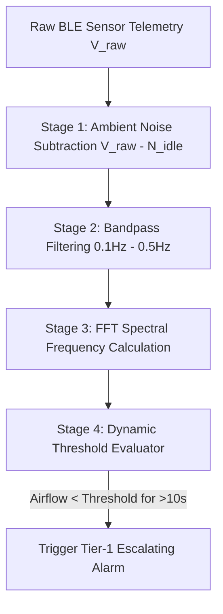

# 🩺 Domain Research Report: Clinical Sleep Medicine & Bio-Signal Engineering
## Sleep Apnea Detection App & Small Breathing Device

---

## 1. Clinical Overview of Sleep-Disordered Breathing

### 1.1 Classification of Nocturnal Apnea Events
Sleep-Disordered Breathing (SDB) encompasses three distinct physiological conditions:
* **Obstructive Sleep Apnea (OSA):** The most common form (~85% of cases), caused by physical collapse of upper airway soft tissues despite continued diaphragmatic effort.
* **Central Sleep Apnea (CSA):** Occurs when the brainstem fails to transmit neurological respiratory signals to the diaphragm, resulting in complete lack of respiratory effort.
* **Mixed Apnea:** A combination of CSA (initial neurological pause) followed by OSA (physical airway collapse upon attempted inspiration).

### 1.2 Clinical Event Definitions (AASM Standards)
Per American Academy of Sleep Medicine (AASM) clinical diagnostic standards:
* **Apnea Event:** Complete cessation of respiratory airflow ($\ge 90\%$ reduction from baseline) lasting at least **10 seconds**.
* **Hypopnea Event:** Partial airway obstruction resulting in a $\ge 30\%$ reduction in airflow lasting at least 10 seconds, accompanied by a $\ge 3\%$ blood oxygen desaturation ($SpO_2$) or neurological arousal.

### 1.3 Clinical AHI Severity Scale (Adults)
The **Apnea-Hypopnea Index (AHI)** measures average events per hour of sleep:

| AHI Range (events/hr) | Clinical Classification | Risk & Symptoms |
| :--- | :--- | :--- |
| **< 5** | **Normal** | Healthy nocturnal breathing baseline. |
| **5.0 – 14.9** | **Mild Sleep Apnea** | Mild daytime drowsiness, occasional snoring. |
| **15.0 – 29.9** | **Moderate Sleep Apnea** | Significant daytime fatigue, elevated hypertension risk. |
| **≥ 30.0** | **Severe Sleep Apnea** | High cardiovascular risk, nocturnal arrhythmia, severe hypoxia. |

---

## 2. Bio-Signal Telemetry & Signal Processing Engineering

### 2.1 Sensor Noise Floor ($N_{\text{idle}}$) & Baseline Calibration
Small MEMS airflow differential pressure sensors and thermistor sensors suffer from ambient thermal drift and baseline offsets. 
* **Noise Calibration Mathematics:** The 5–10s idle sampling phase calculates the baseline offset $N_{\text{idle}} = \frac{1}{M} \sum_{i=1}^{M} V_{\text{raw}}(t_i)$.
* **Net Airflow Signal:** The runtime airflow signal is computed as $V_{\text{net}}(t) = V_{\text{raw}}(t) - N_{\text{idle}}$.
* **Dynamic Apnea Threshold:** During the active 10–20s training phase, inhalation peak ($V_{\max}$) and exhalation trough ($V_{\min}$) establish peak-to-peak amplitude $V_{pp} = V_{\max} - V_{\min}$. The zero-airflow threshold is bound at:
  $$\text{Threshold}_{\text{apnea}} = \eta \cdot V_{pp} \quad (\text{where } \eta \approx 0.10 \text{ representing 10\% of active wave amplitude})$$

### 2.2 Fast Fourier Transform (FFT) Respiration Rate Engine
To derive respiration rate in Breaths Per Minute (BPM):
* Telemetry is sampled over a moving 30-second window ($N = 256$ points).
* Fast Fourier Transform calculates spectral density $S(f) = |\mathcal{F}\{V_{\text{net}}(t)\}|^2$.
* The fundamental breathing frequency $f_{\text{peak}}$ is identified within the physiological band $0.15 \text{ Hz} \le f \le 0.40 \text{ Hz}$ (corresponding to 9 to 24 BPM).
* Respiration Rate is calculated as:
  $$\text{BPM} = f_{\text{peak}} \times 60$$

---

## 3. Medical Alarm Safety Standards (IEC 60601-1-8 Compliance)

To ensure patient safety and prevent alarm fatigue, the app's two-tier alert engine complies with **IEC 60601-1-8** (International Collateral Standard for Medical Alarm Systems):

### 3.1 Alarm Priority Hierarchy
1. **High Priority (Immediate Risk):** Apnea event exceeding 20 seconds without patient movement or restored airflow.
   - *Signal:* Escalating audio (>75 dB) + continuous phone haptics + Cloud Emergency Dispatch.
2. **Medium Priority (Prompt Response Required):** Initial apnea threshold breach (10–20 seconds).
   - *Signal:* Moderate haptic pulse + low-decibel chime (40–55 dB).
3. **Low Priority (Informational):** BLE signal reconnection, low battery warning (<15%).
   - *Signal:* Visual banner notification only (no audio/haptics during sleep).

### 3.2 Alarm Fatigue Prevention
* **"I'm Safe" Patient Acknowledgement:** Provides a prominent 30-second single-tap dismissal window to silence high-priority alerts once the patient wakes up.
* **Auto-Silence Guardrail:** If normal breathing airflow ($V_{\text{net}} > 1.5 \times \text{Threshold}_{\text{apnea}}$) is sustained for 5 consecutive seconds, the local alarm automatically silences without requiring manual interaction.

---

## 4. Health Data Privacy & Regulatory Classifications

* **SaMD (Software as a Medical Device) Strategy:** The application operates as a **Class II Consumer Wellness & Screening Tool** with an upgrade path to FDA 510(k) clearance for home sleep apnea testing (HSAT).
* **HIPAA & GDPR Security Rules:**
  * **Transit:** AES-128 BLE encryption; TLS 1.3 HTTPS/WebSocket cloud payloads.
  * **Rest:** AES-256 cloud database encryption for all user profiles, sleep telemetry logs, and emergency dispatch contact details.
