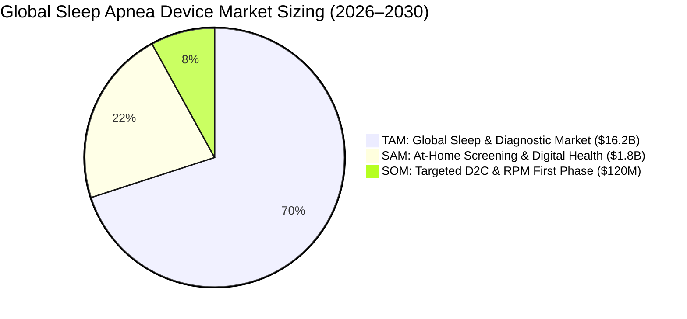
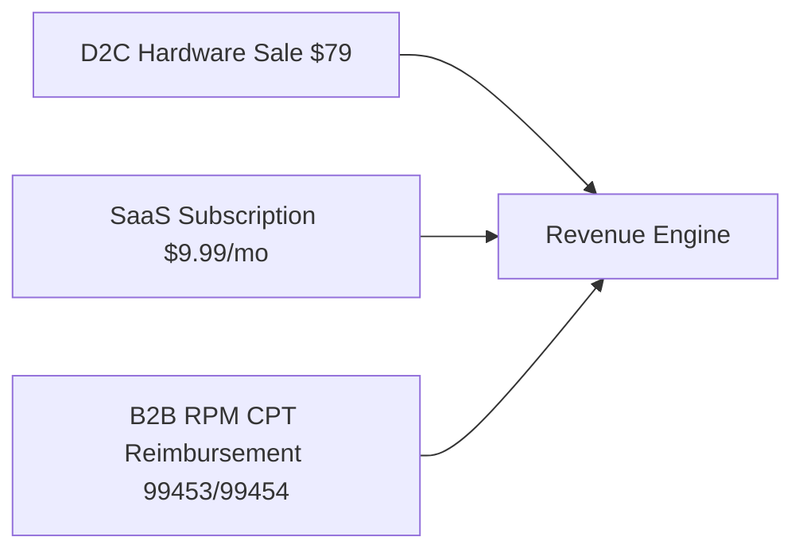

# 📊 Market Strategy & Competitive Analysis Report
## Sleep Apnea Detection App & Small Breathing Device

---

## 1. Executive Summary & Market Sizing (TAM / SAM / SOM)

The market for at-home sleep apnea monitoring is experiencing rapid expansion, driven by an estimated **936 million adults worldwide suffering from Obstructive Sleep Apnea (OSA)**—with over 80% remaining undiagnosed due to the high friction of hospital sleep studies.

### 1.1 Market Sizing Breakdown
* **Total Addressable Market (TAM):** **$16.2 Billion** (Global sleep apnea therapeutics & diagnostic devices market projected by 2030).
* **Serviceable Addressable Market (SAM):** **$1.8 Billion** (US & EU at-home digital sleep screening, wearable sensors, and remote monitoring platform market).
* **Serviceable Obtainable Market (SOM):** **$120 Million** (Initial 3-year target capturing direct-to-consumer snorers, high-risk sleep apnea patients, and remote care partners).

---

## 2. Competitive Landscape Matrix

| Product / Category | Form Factor | Sensing Technology | Real-Time Wake-Up Alarm? | Cloud Emergency Dispatch? | Noise Calibration Routine? | Target Use Case |
| :--- | :--- | :--- | :--- | :--- | :--- | :--- |
| **Sleep Apnea Detection App (Our Product)** | **Small Breathing Device** | **Direct Airflow ($V_{\max}$ / $V_{\min}$)** | **YES — Tier-1 Escalating Mobile Audio/Haptics + "I'm Safe" Tap** | **YES — Tier-2 Real-Time Cloud Dispatch to Family/Caregiver** | **YES — 2-Stage ($N_{\text{idle}}$ Noise Floor + Active Breath)** | **Proactive At-Home Sleep Apnea Detection & Active Safety** |
| **Wellue O2Ring** | Ring Oximeter | Finger SpO2 & Heart Rate | **Partial — Silent Ring Vibration on SpO2 drop** | **NO — Local Bluetooth storage only** | No (Factory preset) | Consumer Oximeter Tracking |
| **ResMed NightOwl** | Disposable Finger Sensor | Peripheral Arterial Tonometry (PAT) & SpO2 | **NO — Passive overnight recording** | **NO — Uploads report to doctor next morning** | No | Clinical Diagnostic HSAT |
| **Itamar WatchPAT** | Wrist & Finger Probe | Wrist PAT, Oximetry & Accelerometer | **NO — Passive diagnostic recording** | **NO — Next-day clinician portal** | No | FDA-Cleared Medical Diagnostic |
| **Acurable AcuPebble** | Neck Pebble | Acoustic Breathing Sound Sensing | **NO — Passive recording** | **NO — Next-day report** | No | Acoustic Clinical HSAT |
| **Apple Watch (Series 9/10)** | Smartwatch | Wrist Accelerometer "Breathing Disturbances" | **NO — Monthly retrospective notification** | **NO — No real-time wake-up trigger** | No | General Consumer Wellness |

---

## 3. Monetization & Business Models

### 3.1 Hybrid Monetization Strategy
1. **Direct-to-Consumer (D2C) Hardware + SaaS Subscription:**
   - **Hardware Purchase:** $79 one-time for small breathing device package.
   - **Freemium Tier:** Free basic sleep recording, 10-30s two-stage calibration, and 7-day sleep history.
   - **Premium SaaS Subscription ($9.99/month or $79/year):** Unlocks real-time Tier-2 Cloud Emergency Caregiver Dispatch, unlimited historical analytics, and one-tap Doctor-Ready PDF Export.

2. **B2B Remote Patient Monitoring (RPM) & Clinical Reimbursement:**
   - Partnering with telehealth clinics and sleep specialists using US CPT Reimbursement Codes:
     - **CPT 99453:** Initial setup & patient education ($19–$21 per patient).
     - **CPT 99454:** Monthly device data transmission over 16+ days ($50–$62 per patient/month).
     - **CPT 99457 / 99458:** Monthly clinical monitoring time ($48–$55 per 20-min increment).

---

## 4. Go-To-Market (GTM) Strategy & Execution Phases

* **Phase 1 — D2C E-Commerce Launch (Months 1–12):** Target chronic snorers and spouses on social channels with safety-first messaging ("Never Sleep Alone Unprotected").
* **Phase 2 — Telehealth & Sleep Clinic Integration (Months 12–24):** Partner with virtual sleep clinics (e.g. Sleep Reset) to bundle devices under RPM monitoring packages.
* **Phase 3 — FDA 510(k) Clearance & Insurance Coverage (Months 24+):** Transition from Class II Wellness Screening tool to FDA-cleared diagnostic HSAT device covered by private insurance and Medicare.

---

## 5. Key Differentiators ("Blue Ocean Moat")

1. **Active Emergency Safety Net:** Combines Tier-1 mobile escalating wake-up alarms with Tier-2 real-time cloud caregiver dispatch.
2. **"I'm Safe" Patient Dismissal:** Prevents false caregiver panic by providing a 30-second single-tap acknowledgement window.
3. **Two-Stage Noise Calibration ($N_{\text{idle}}$ + Active Training):** Eliminates phantom BLE sensor drift and ambient noise false alarms before sleep.
4. **Direct Airflow Telemetry:** Captures true breath airflow dynamics rather than relying on indirect wrist accelerometers.
